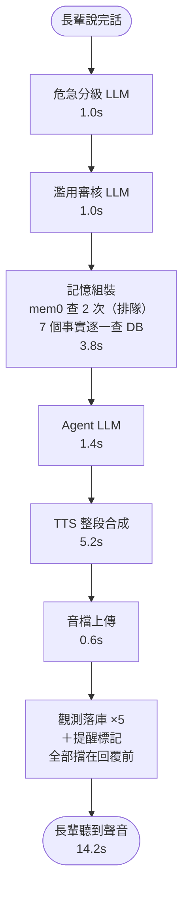
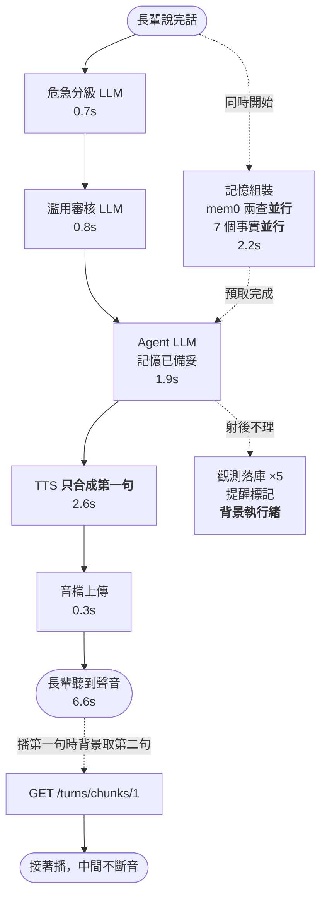

# KinSun 延遲優化報告（2026-07-26）

> 給隊友的一句話：**長輩從說完話到聽見金孫的第一個字，14.2 秒縮短到 6.6 秒（-54%）。**
> 決策順序（危急先落庫、先通報家屬，之後才輪到攔截）一個字都沒有改。

分支：`Leo`｜commit：`8e85379`、`7e5a6ca`、`e4a66f4`（＋三筆文檔同步）
量測工具：session scratchpad 之 `latency_probe.py`／`optimizations.py`／`analyze_opik.py`——**未固化入 repo**。

---

## 1. 起點：延遲從哪裡來

從正式庫的觀測表取真實生產資料（非實驗室數字）：**端到端 p50 = 16.8 秒、p95 = 36.1 秒**（`replies.round_trip_ms`，n=114）。

逐階段拆解後，最大的單一成因**不是任何運算**，而是網路往返在排隊：

- Supabase 每次查詢固定約 **0.21 秒**，與查詢複雜度無關；
- 而一輪對話要打 **15 次** → 約 4.5 秒，佔端到端四分之一以上。

把那 15 次逐條錄下來後，問題一目了然：

| 類別 | 次數 | 有人在等它嗎 |
| :--- | ---: | :--- |
| 觀測稽核寫入（`llm_calls`×3、`tts_calls`、`replies`） | 5 | **沒有**（事後查帳用） |
| 提醒回應標記（給每晚反思的訊號） | 1 | **沒有** |
| 事實提供者（稱呼／三種排程／守則／位置） | 6 | 有，但**彼此無依賴**卻在排隊 |
| 今日對話讀取＋本輪寫入 | 3 | 有 |

另外兩塊：mem0 每輪檢索**兩次且排隊**（各含 embedding API＋向量查詢＋LLM rerank，合計約 4.6 秒）；TTS **整段合成完才送出**（0.9 秒固定成本＋每字 0.10 秒，回覆 p50 39 字、p90 70 字）。

---

## 2. A/B 實測結果

同場景、同時段、各 n=5，走 App 通道。對照組以開關把當日全部改動轉回原狀，兩組相鄰執行以排除系統條件漂移。

| 階段 | 改動前 | 現在 | 差 |
| :--- | ---: | ---: | :--- |
| **端到端** | **14.22s** | **6.59s** | **-7.63s（-53.6%）** |
| 危急分級 LLM | 1.03s | 0.72s | 觀測落庫移出關鍵路徑 |
| 濫用審核 LLM | 1.00s | 0.76s | 同上 |
| 記憶組裝 | 3.81s | 2.22s | mem0 兩查並行＋事實並行 |
| Agent（含記憶） | 5.20s | 1.93s | 記憶預取與安全檢查重疊 |
| TTS | 5.15s | 2.56s | 分段串流：只合成第一句 |
| 音檔上傳 | 0.61s | 0.32s | |
| 前景 DB 往返 | 15 次 | 9 次 | 6 次移到背景 |

> 生產起點是 p50 16.8 秒（高於對照組的 14.2 秒），故真實使用者感受到的改善會比 7.6 秒更多一些。

---

## 3. 架構差異

### 改動前

### 現在

**三句話總結**：把「沒人在等的寫入」丟到背景、把「彼此無關的查詢」改成並行、把「整段語音」改成先送第一句。

---

## 4. 隊友需要知道的事

| 影響 | 說明 |
| :--- | :--- |
| **API 加了欄位** | `POST /api/v1/turns` 回應多 `chunk_count` 與 `reply_digest`。加法，舊前端忽略即維持原行為 |
| **新端點** | `GET /api/v1/turns/chunks/{index}`，長輩 token 認證，帶 `digest` query |
| **新錯誤碼** | `chunk_not_found`(404)、`chunk_superseded`(409)、`speech_unavailable`(502/503) |
| **App 要更新** | `app/src/app/elder/talk.tsx` 改為播放佇列；拉舊版 App 會只聽到前半句 |
| **LINE 完全沒動** | 分段只對 App 啟用（LINE 一輪只能回一則語音訊息，給它第一句等於吞掉後面的話） |
| **後台資料晚幾百毫秒** | 觀測落庫改背景寫，不再是「回完話立刻查得到 trace」 |
| **回覆變短** | prompt 字數上限 40→30 字，實測回覆字數中位 48→37 |
| **關閉順序是契約** | `background.shutdown()` 必須早於 `db.close()`，否則佇列裡的寫入撞上已關閉的連線池（已寫在 `app.py`） |
| **`dispatch()` 有回傳值了** | 改為回傳 `DeliveryOutcome | None`；加法，既有呼叫端忽略即可 |

### 新增的檔案

| 檔案 | 用途 |
| :--- | :--- |
| `src/kinsun/background.py` | 背景落庫。**預設同步**（未 `configure` 就地執行），只有 `app.build_app` 啟用；佇列上限 256，滿了丟棄並留 warning |
| `src/kinsun/speech/chunking.py` | 回覆切句。段落下限 8 字、段數上限 4，兩個數字都是推導來的（見下） |

---

## 5. 兩條「別再試一次」的彎路

留在這裡是為了讓下一個人不必重走。

### 分段「平行」合成行不通

理論上把回覆切句後平行合成、伺服器接回一個檔就好，App 完全不用改。實測（TTS 服務併發拉到 3）：

| 回覆 | 整段一次合成 | 分句平行合成 |
| :--- | ---: | ---: |
| 39 字 | 5.83s | 5.12s |
| 64 字 | 7.62s | **8.26s（更慢）** |

瓶頸是 **GPU**——三個 CosyVoice 推論在同一顆 GB10 上互搶，那 0.9 秒固定成本沒有被攤掉，反而付了三次。故唯一有效的路是真串流，App 端必須配合。（TTS 併發已還原為 1。）

### 「危急分級與審核並行」是多餘的

原本規劃讓兩次安全 LLM 並行（省 0.67 秒），但它與「記憶預取」搶同一個重疊窗口，而**記憶才是長邊**：

| 做法 | 這三階段耗時 | 省下 |
| :--- | ---: | ---: |
| 序列（原狀） | 0.74＋0.67＋2.89 = 4.30s | — |
| 只做分級∥審核 | 0.74＋2.89 = 3.63s | 0.67s |
| 只做記憶預取 | max(1.41, 2.89) = 2.89s | **1.41s** |
| 兩個都做 | max(0.74, 2.89) = 2.89s | 1.41s |

效益相同，於是選了**不必改動安全契約測試**的那個。`test_moderation_runs_after_family_notification` 一個字都沒動。

---

## 6. 切句規則的兩個數字

不是拍腦袋，是推導的：

- **段落下限 8 字**：合成 N 字約 `0.9 + 0.1N` 秒、N 字語音長約 `N / 4.6` 秒（實測 38 字→8.26 秒）。要讓「這段的播放時間蓋得住下段的合成時間」需 `N/4.6 ≥ 0.9 + 0.1N` → `N ≥ 7.7`。低於門檻的段落獨立送出，只會換來播放中間的空白。
- **段數上限 4**：每多一段就多一次「TTS 固定成本＋上傳往返」，而長輩只在乎第一句多快到。
- **逗號不切**：半句被唸成完整句會讓語氣塌掉。

---

## 7. 未完成與已知問題

### 尚未驗證

- **端到端串流沒有真的跑過一次**。單元測試 17 例全過（切句 8＋管線分段 4＋端點 5），但沒有一次「真的錄音進去、聽到分兩段播出來」的實機驗證。
- **回覆字數改動的品質驗證不完整**。evals 兩次跑都被 Gemini 429 限流（36／28 次），`no_system_leak`（0.50→1.00）與 `natural_care_reply`（0.60→0.96）的分數差異可由失敗筆數差距（5 vs 2、10 vs 4）解釋，**不採計為改善證據**。可確定的是確定性指標 `speakable` 與 `resisted_hijack` 皆維持 1.0000、無退步。

### 順帶發現、尚未修

| 問題 | 說明 |
| :--- | :--- |
| **未註冊工具導致退化輸出** | prompt 提到的工具若未註冊（如 `TAVILY_API_KEY` 未設時的 `web_search`），模型會吐出 `tool_code\n{...}` 的無限重複 JSON（實測單則 186,514 字），而 `agent._speakable()` 撈不到（它不以 `{` 開頭）。與本次改動**無關**（舊 prompt 一樣會發生），工具有註冊時正常。目前唯一護欄是 TTS 逾時 30 秒切斷 |
| **Supabase 連線池天花板是 15，不是 60** | 實際走 pooler 的 session mode，上限 15 個 client。`AGENTS.md` 註記的 60 是直連上限。目前 webhook（2 workers × 5）＋ scheduler ＋ rag_worker 已經佔滿，量測期間被拒絕連線兩次。再加 worker 或多跑一支 CLI 就會開始搶連線，搶不到時是阻塞等待，直接變成長輩那端的延遲 |
| **mem0 內部呼叫沒有逾時保護** | 本次修好的 `GEMINI_TIMEOUT_SECONDS` 管不到 mem0 自己的 embedding 與 rerank（走 mem0 的 config） |

### 已修但屬長尾（不影響 p50）

`GEMINI_TIMEOUT_SECONDS=30` 先前是**死設定**——`GeminiClient` 存了 `self._timeout` 卻從未傳給 SDK，等於 Gemini 呼叫沒有任何客戶端逾時。生產資料 `llm_calls` p95 11.5 秒、max 23.8 秒，量測期間撞過單輪 46 秒與 52 秒。對照組很清楚：ASR 與 TTS 的 latency 精準卡在設定值 15 秒與 30 秒，差別只在有沒有把值傳下去。

---

## 8. 下一步候選

| 項目 | 預估效益 | 備註 |
| :--- | :--- | :--- |
| 實機驗證分段串流 | — | 最該先做 |
| 修未註冊工具的退化輸出 | — | 穩定性，非延遲 |
| 更正 Supabase 連線池文件與配置 | — | 容量問題，會反映成延遲 |
| 把量測探針收進 `scripts/` | — | 目前在 scratchpad，重開機即消失；收進去才能每次改動後重跑檢查回退 |
| 短期記憶寫入改背景 | 約 -0.6s | **刻意未做**：`record_turn` 寫進 `turns`，下一輪的 `recent()` 要讀它，延遲寫入有競態風險。0.6 秒不值得，要做需搭配「下一輪讀取前先等待該長輩的待寫入完成」 |
