# 架構與設計文件 - 金孫 KinSun

> **版本:** v1.44 | **更新:** 2026-07-27 | **狀態:** ✅ 定稿（架構對比 ref/hermes-agent 後的六項邊界補強：排程工具安全界線 4（主動關懷不得寫入）、語音後端白名單 fail-fast、危急通知投遞三修（未綁通道分流／有界重試／LINE 逾時）、新增 `logging_setup.py` 單一入口、情境組裝 15 秒等待上限；新增 `turn_context.turn_sources()` 跨層 seam 與 CareAgent 冒名防線、危急症狀詞可被有把握的分級器翻案、連線層 keepalive；TTS 分段串流（App 限定）＋回覆字數上限 40→30；第二批：回合內併發——情境組裝以 `CareAgent.prepare` 與兩道安全檢查重疊、mem0 兩次檢索並行、Gemini 逾時修復（先前未傳給 SDK）；第一批：觀測落庫與提醒標記改走 `background.run`、事實提供者並行查，相鄰 A/B 端到端 16.91s→11.67s（-31%）；統一排程 D-76 **五刀全完成**——舊模組與舊表已退役；schedules 入 ER 與群組圖、提醒管線改寫為單一每分鐘派送 job＋過渡對帳，五個舊提醒 job 下線；時間改為每輪注入情境、get_current_time 工具移除；§8.5 補濫用審核——三類越權、fail-open、位置固定在家屬通報之後，旗標預設開但支撐數字已作廢待重跑（D-75）；§12 補 promptfoo 紅隊掃描；深化完成；庚批 2026-07-13 結案回填；locations／strategies／自適應問候時間已入圖；§8.5 補主動問候接續上次話題；§12 工程觀測 Opik 雙視角——全鏈路 span 盤點＋排程/批次 trace root（v1.24：排程 job 統一在 fanout 收斂為 root、後台手動觸發新增 admin_run_job／admin_dispatch_reminder root；v1.25：`set_current_trace_io`／`set_current_span_io` 寫對話與記憶／摘要／反思內容進 Opik，Threads 顯示 First／Last message、子流程 span 攤開可讀內容；capture 一律不開 input（護 api_key／self）；v1.26：業務↔工程深連結——`replies.opik_trace_id` 落 Opik trace id、後台 trace 詳情回 `opik_url` 一鍵直達；v1.27：Prompt 版本追蹤（方案 A）——`attach_prompt` 把七個 LLM prompt 註冊進 Opik Prompt library 並連結 trace，程式碼仍為真相；v1.28：OPIK_ENABLED 預設 true＋連線探測降級（OPIK_PING_TIMEOUT_SECONDS）、evals 擴指標 Moderation／ContextPrecision／ContextRecall／AnswerRelevance，rag_grounding 實跑真實 retriever；v1.29：evals 加對話串級 conversation_quality（evaluate_threads 評真實 thread：Coherence／UserFrustration／SessionCompleteness））；併入第 5 層 RAG 版本化索引、原地遷移、discovery 分流、檢索邊界與外部服務復原策略；tools 加入交通工具 transport）
> **基準:** as-is（現行程式碼實證，附 file:line）＋ to-be（重構目標，標 D-xx 依據）。
> 技術選型的決策理由統一見 [04_adr/](04_adr/README.md)，本文件不重複論證。

---

## 第 1 部分：架構總覽

### 1.1 C4 模型

#### 1.1.0 命名防呆（必填）

⚠ 本專案業務名詞「危急分級 L0–L2」與 C4 縮寫 L1–L4 撞名：

| 術語 | 指什麼 | 本文件寫法 |
| :--- | :--- | :--- |
| C4 縮放層級 | 架構圖 zoom 層級 | **一律全稱**：System Context／Container／Component |
| 危急分級 | `safety/tiers.py` 的三級風險（✅ D-72） | **一律寫 `RiskTier L0–L2`** |
| DDD 限界上下文 | 業務語意邊界 | 「限界上下文」，≠ C4 System Context |

#### 1.1.1 Container 清單（必填）

| Container | 類型 | 技術 | 何時啟用 | Component 圖 |
| :--- | :--- | :--- | :--- | :--- |
| API 服務 | process（:8000） | FastAPI＋uvicorn（`app.py:42`） | 現行 | ✅ §1.1.4 |
| 排程 Worker | process | `python -m kinsun.scheduler`（`worker.py:177`） | 現行 | ✅ §1.1.5 |
| ASR 服務 | process（:8001，DGX） | FastAPI＋Breeze-ASR-26（`services/asr/server.py`） | 現行 | 略：薄服務（單端點＋信號量限流），無內部分層 |
| TTS 服務 | process（:8002，DGX） | FastAPI＋CosyVoice 3（`services/tts/server.py`） | 現行 | 略：同上；台語微調版＝D-01 進行中 |
| Expo App | 行動端 runtime | React Native＋Expo（`app/src/`） | 現行 | 略：見 12_前端架構／17_前端資訊架構 |
| LIFF／admin SPA | 瀏覽器 runtime | React＋Vite（`frontend/src/`，由 API 進程託管靜態檔 `app.py:150-155`） | 現行（LIFF 凍結維運） | 略：見 12／17 |
| 主資料庫 | database | Supabase Postgres＋pgvector | 現行 | 表代圖 → §4.1 ER |
| 音檔儲存 | file storage | Supabase Storage bucket | 現行 | 略：無內部元件；⚠ 公開 bucket 疑慮 → 13 循環 |
| 推播閘道 | 外部服務 | FCM／APNs＋EAS | **階段 5（虛線）** | 略：第三方 |

**外部系統清單**（避免 partial disclosure，五類）：

| 類別 | 系統 |
| :--- | :--- |
| 資料源 | Open-Meteo（天氣工具）、衛教官方來源網站（RAG 爬蟲，經人工核准清冊） |
| 交易 | 無 |
| 推送 | LINE Messaging API（現行）；FCM／APNs（階段 5） |
| 備份 | Supabase 託管備份（⚠ 方案與還原演練未確認 → 14 循環） |
| 雲端 IaaS／SaaS | Supabase（DB＋Storage）、Google Gemini API、ngrok（對外入口）、LINE 平台 |

#### 1.1.2 System Context（C4 第一層）

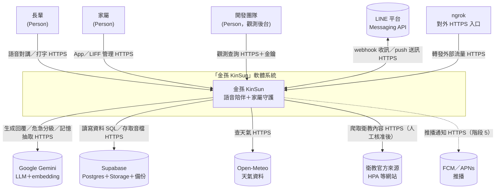

#### 1.1.3 Container（C4 第二層，Current）

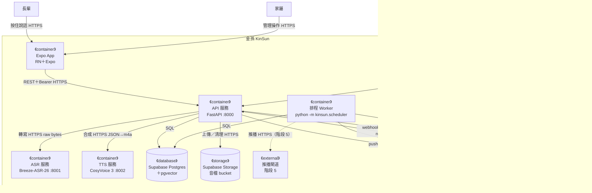

> API 服務同時託管 SPA 靜態檔（`app.py:150-155`），故 SPA 下載來源＝API 進程；圖中省略該靜態檔箭頭。

#### 1.1.4 Container（Target／Future State，必填）

全部里程碑完成後（App 出站 D-12、多 worker D-20、台語 TTS D-01、推播階段 5）：

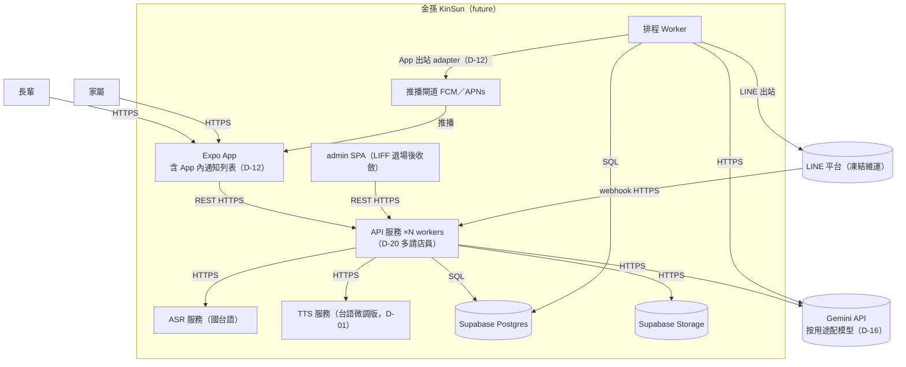

#### 1.1.5 Component（C4 第三層，zoom: API 服務）

箭頭語意＝呼叫方向（call）。分層依 §1.3。

（2026-07-10 階段 F 重畫：依七群深潛的完整知識補齊——tools registry、transport seam、notifications、web 底座件、組裝根；節點標註所屬群號，與 §8 各節一一對應。）

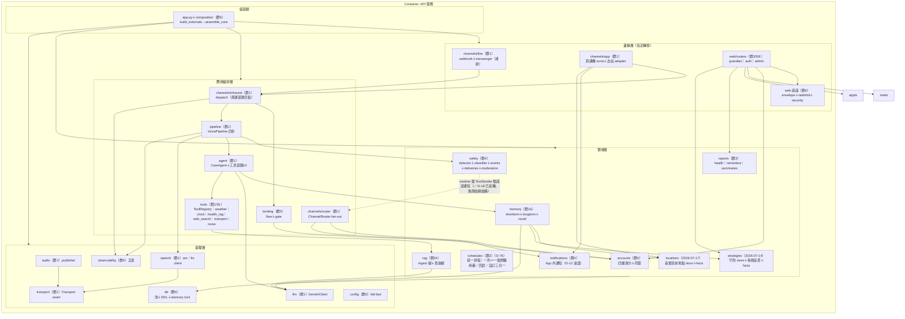

> 排程 Worker 為第二組裝根（§1.1.6），共用同一 Core 物件圖；提醒／主動關懷／清理等 11 個 job 皆在該進程。

**Component 檢查註記**：
- 領域層不依賴邊緣層——✅ **已實證無例外**（2026-07-10 群 1 深潛驗證）：`safety/notifier.py:18` 定義 `TextSender` Protocol，safety 無任何 `channels` import；組裝處把 `ChannelRouter` 當 TextSender 注入（`composition.py:161`）。D-18 反轉已完成，上圖虛線僅表 runtime 呼叫方向。
- 領域 `jobs.py`（`schedules/jobs.py`）依賴 channels＋scheduler：此為 AGENTS.md 已核定的「排程工廠放領域自己的 jobs.py」規範，屬刻意的編排縫（orchestration seam），不列違規。

#### 1.1.6 Component（zoom: 排程 Worker）

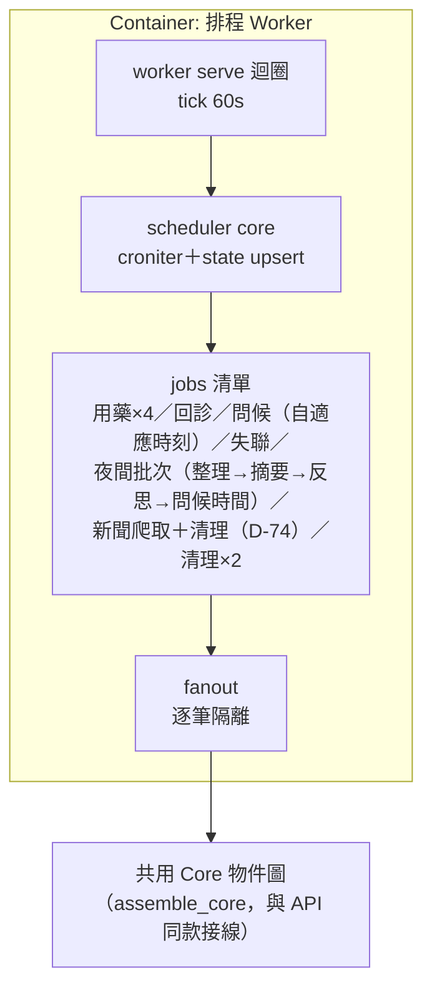

> Worker 與 API **各自** `build_externals`（各一個 DB 連線池），共享同一 Supabase。VoicePipeline 只在 API 建——主動關懷走 `agent.proactive` 純文字（✅ D-21 定案：先做文字就好，會-11）。

### 1.2 DDD 戰略設計

#### 通用語言（詞彙表）

單一定義來源為 `CONTEXT.md`；此處列架構文件會用到的核心詞：

| 術語 | 定義 |
| :--- | :--- |
| Elder／Guardian | 長輩／家屬業務實體，主鍵 `elder_id`／`guardian_id`（uuid） |
| ChannelBinding | 通道帳號（channel, external_id）→ 本人 的對映 |
| Consent | 知情同意紀錄（SELF 本人／PROXY 代理），撤回寫 `revoked_at` |
| InboundMessage | 通道中立的入站訊息（含回覆回呼） |
| RiskTier L0–L2 | 危急分級（一般／小訊號／明確警訊——✅ D-72 三級制，L2 通知家屬） |
| TurnContext | 一輪對話的記憶組裝結果（長期＋事實＋今日） |
| 對講機回合 | App 長輩端「按住說→自動播回覆」的一次往返 |

#### 限界上下文與 C4 Container 對應

| DDD 限界上下文 | 主要落在 Container | 備註 |
| :--- | :--- | :--- |
| 帳號與同意（accounts＋binding） | API | 閘門是其他上下文的上游 |
| 對話照護（pipeline＋agent＋memory＋tools） | API | 核心域 |
| 安全守護（safety） | API | 核心域（差異化承諾） |
| 提醒（schedules） | API（設定面）＋Worker（觸發面） | |
| 衛教知識（rag） | API＋獨立 CLI（ingest） | |
| 觀測（observability） | API＋Worker | 支撐域 |

#### Strategic Context Map

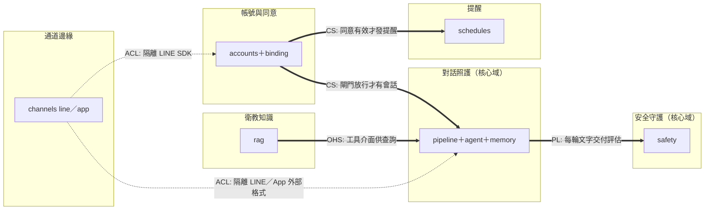

#### DDD 戰術設計（必填）

| DDD 元素 | 程式碼位置 | 說明 |
| :--- | :--- | :--- |
| Entity | `accounts/models.py`（Elder、Guardian）、`schedules/models.py`（Schedule） | identity＝uuid 主鍵，Postgres 為權威 |
| Value Object | `safety/tiers.py`（RiskAssessment）、`memory/models.py`（TurnContext）、`channels/inbound.py`（InboundMessage） | 不可變 dataclass |
| Aggregate Root | Elder（含 bindings、consents、elder_guardians） | 一致性由 AccountService 維護（`service.py`） |
| Domain Service | `RiskDetector`、`CareAgent`、`SessionMemory`、`AccountService` | 跨實體邏輯 |
| Domain Event | `risk_events`、`reminder_logs`（append-only，`record` 動詞） | 業務事實，不可變 |
| Repository | Store 三件套：`<領域>Store` Protocol＋`Pg*`＋`Fake*`（AGENTS.md 規範） | 合約測試保證等價 |
| Anti-Corruption Layer | `channels/line`（隔離 LINE SDK）、`speech/*`（隔離 DGX 服務）、`GeminiClient`、`Mem0LongTermStore` | 外部 schema 變動不進領域 |
| Specification | **缺席**——業務規則散在各 Service 內 | 規模尚小，暫不引入；若規則爆炸再議 |

### 1.3 分層架構（Clean Architecture）

| 層 | 程式碼位置 | 職責 |
| :--- | :--- | :--- |
| Domain | `accounts`、`schedules`、`safety`（core）、`memory`、`rag`、`reports` | 業務規則與領域模型 |
| Application | `pipeline`、`agent`、`channels/inbound`、`channels/router`、`binding`、各領域 `jobs.py`、`composition` | 用例編排與接線 |
| Infrastructure | `db`、`llm`、`speech`、`audio`、`transport`、`observability`、`channels/line`（SDK 面）、`web` | 外部互動實現 |

> 組裝採兩層：`Externals`（連線重件）＋`assemble_core`（純接線），API 與 Worker 兩個組裝根共用（`composition.py:49-168`）——重構時新增元件一律走 composition，禁止在 handler 內自行 new。

### 1.4 技術選型

| 分類 | 選用技術 | ADR |
| :--- | :--- | :--- |
| 後端框架 | Python＋FastAPI＋uv | [ADR-001](04_adr/ADR-001-後端框架FastAPI.md) |
| 資料庫／儲存 | Supabase Postgres＋pgvector＋Storage | [ADR-002](04_adr/ADR-002-資料庫Supabase-Postgres.md) |
| 長期記憶 | Mem0 v1.1（實際生效＝抽取＋去重＋語意檢索） | [ADR-003](04_adr/ADR-003-長期記憶Mem0.md)、[ADR-004](04_adr/ADR-004-知識圖譜移除與拆解.md) |
| LLM | Gemini flash-lite（開發期）→ 按用途配模型 | [ADR-005](04_adr/ADR-005-LLM模型策略.md)（D-16） |
| 排程 | 自建 Scheduler（croniter＋PG） | [ADR-006](04_adr/ADR-006-自建排程器.md) |
| 語音 | DGX 自架 Breeze-ASR-26／CosyVoice 3 | [ADR-007](04_adr/ADR-007-語音服務自架DGX.md)（D-01） |
| 前端 | React＋Vite（web）／Expo（App） | [ADR-008](04_adr/ADR-008-前端技術組合.md)（D-08） |
| 認證 | 家屬雙認證（App token＋LIFF idToken） | [ADR-009](04_adr/ADR-009-家屬雙認證並存.md) |
| 儲存庫 | monorepo | [ADR-010](04_adr/ADR-010-單一儲存庫佈局.md) |
| 身分層 | elder_id 主鍵＋channel_bindings | [ADR-011](04_adr/ADR-011-通道中立身分層.md) |
| 快取／訊息佇列／容器編排／CI-CD | **無**（刻意：規模不需要；CI 缺口見 §5.2） | — |

---

## 第 2 部分：需求摘要

### 功能性需求（對應 [02 PRD](02_專案簡報與PRD.md) 使用者故事）

- FR-1 語音對講回合（US-A1）；FR-2 文字同等對待（US-A2，✅ D-11 to-be）；FR-3 台語（US-A3，D-01）
- FR-4 危急偵測分級＋家屬通知（US-B1，✅ D-10 定案：全員齊發無冷卻；✅ D-72 三級制已落地）；FR-5 App 內警報／提醒（US-B2，✅ D-12 to-be）
- FR-6 主動關懷（US-B3）；FR-7 用藥／回診提醒（US-C1／C2）
- FR-8 家屬帳號與綁定（US-D1／D2；長輩帳密改版⚠ D-71）；FR-9 健康報告（US-D3，✅ D-09：加每日摘要）
- FR-10 衛教 RAG（US-E1，⏳ D-03）

### 非功能性需求

| 分類 | 需求描述 | 目標值 |
| :--- | :--- | :--- |
| 性能 | 語音往返延遲 P50／P95 | ⏸ 實測後定（D-05／會-10；提案原 3–4 秒） |
| 可擴展性 | API 多 worker 啟動 | ✅ D-20（重構工項） |
| 可用性 | 期末展示規模單機承載；DGX 單點風險見 §7.1 | 無正式 SLA（學生專案） |
| 安全性 | 正式環境強制 ConsentGate；同意文案明示資料去向與保留 | D-14／D-15；細項見 13 循環 |

---

## 第 3 部分：系統設計

### 3.1 架構模式

- **模式**: 模組化單體（API＋Worker 雙進程）＋自架模型服務（位置無關）
- **理由**: 7 人非本科團隊，單體最低運維負擔；重模型抽成網路服務滿足跨平台開發（AGENTS.md 環境紀律）

### 3.2 系統元件圖

見 §1.1（不重複貼）。

### 3.3 元件職責

| 元件 | 核心職責 | 依賴 |
| :--- | :--- | :--- |
| VoicePipeline | ASR→危急→（濫用審核，選配）→回覆→TTS 編排＋觀測埋點（`pipeline.py:36`） | speech、safety、agent、observability |
| CareAgent | 記憶組裝→LLM→工具迴圈（≤3 輪，handle 與 proactive 皆可用工具）→出站安全防線兩道（①JSON／fence 打撈 `_speakable`，2026-07-17；②冒名防線 `_no_fake_source`，2026-07-26：本輪沒有工具**登記到來源**時移除「封閉機關清單＋引述動詞」片語）→寫回（`agent.py`） | memory、llm、tools、turn_context |
| ConsentGate | (channel, external_id)→已同意的 elder_id（`binding/gate.py:22`） | accounts |
| ChannelRouter | 本人→所有綁定通道 fan-out，單通道失敗隔離（`router.py:42`） | accounts、channel adapters |
| GuardianNotifier | 危急通知全家屬（`notifier.py:63`；✅ D-10 政策定案維持齊發；✅ D-18 反轉已完成） | accounts、TextSender 插座（組裝處注入 ChannelRouter） |
| Scheduler | croniter 到期判定＋錯過補跑一次＋狀態 upsert（`scheduler.py:35`） | scheduler_state |

> **「五階段」與「四步」是兩套計數，勿混用**：五階段＝trace 的切法（webhook／asr／llm／tts／reply 五表）；pipeline 實際四步（轉寫→危急偵測→生成→合成）。危急偵測無獨立 trace stage（其 LLM 呼叫也不計 token——差距 A-9）；App 鏈路無 webhook 筆，實為四筆（僅 LINE 五筆全）。詳見 §8.1。

### 3.4 關鍵使用者旅程（Dynamic Diagrams，必填）

#### 旅程 1：App 對講機語音回合

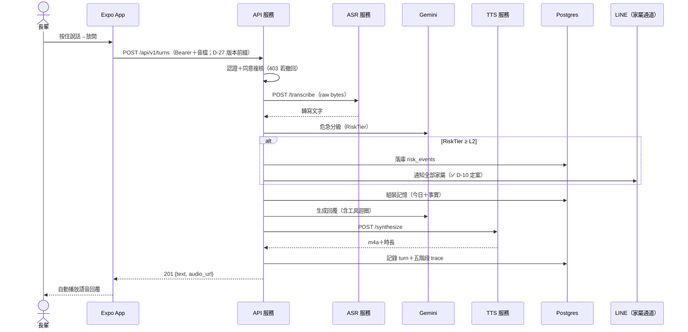

> 失敗分支：ASR 失敗→中止並回錯誤；TTS 失敗→退純文字；危急落庫失敗→仍照常通知（`pipeline.py:86-92`）；分級 LLM 失敗→fail-safe：非空句保守記 L1 留痕、不通知（✅ D-31 已定案），空句維持 L0（群 4 深潛更正，詳見 §8.5）。

#### 旅程 2：排程用藥提醒

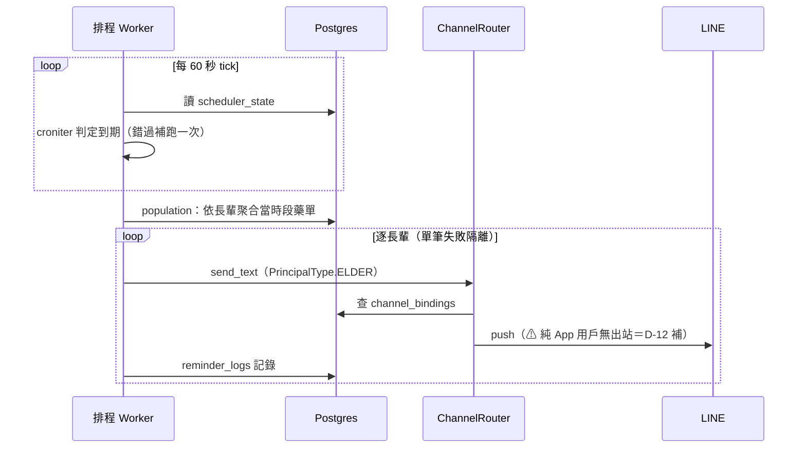

> ✅ D-30 定案（會-1）：出站提醒**不查長輩同意**——`has_valid_consent` 檢查（用藥／回診長輩端）已於己-1 移除（2026-07-10），圖即現況。精度註（群 3 深潛）：med job 於 `sent==0`（無綁定通道）時不送也不記；appt job 現況忽略送達數、無條件記錄（差距 A-34）。

#### 旅程 3：危急通知

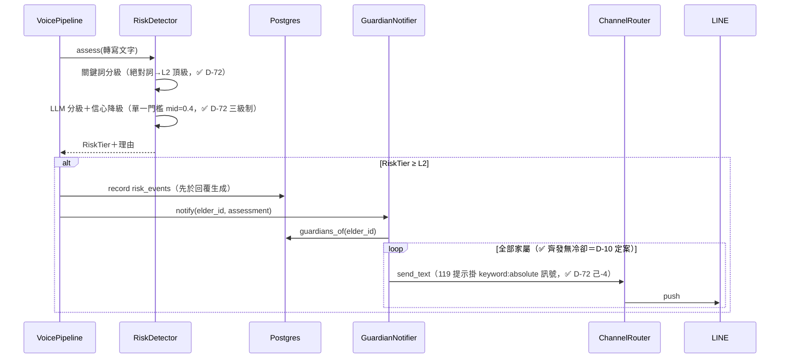

---

## 第 4 部分：資料架構

### 4.1 資料模型（核心 ER）

全表清單見 `db.py`；此處畫身分／照護核心。獨立群組包含觀測六表（webhook_events、asr_calls、llm_calls、rag_calls、tts_calls、replies）、RAG 的 sources／documents／chunks／ingestion audit／index releases／release documents／release chunks、守則與 web search 查詢紀錄、話題新聞 news_items（決定性 id upsert，D-74）與提及紀錄 news_mentions（不重複給料，D-74 消費端），以及 scheduler／rate limit／memory consolidation 狀態表。

```mermaid
erDiagram
    elders ||--o{ elder_guardians : "被守護"
    guardians ||--o{ elder_guardians : "守護"
    elders ||--o{ consents : "同意紀錄"
    elders ||--o{ channel_bindings : "通道綁定"
    guardians ||--o{ channel_bindings : "通道綁定"
    guardians ||--o{ guardian_accounts : "App 帳號"
    elders ||--o| elder_accounts : "App 帳密（✅ 己-6 D-71）"
    guardians ||--o{ invites : "產生邀請碼"
    elders ||--o{ turns : "對話輪"
    elders ||--o{ risk_events : "危急事件"
    elders ||--o{ schedules : "統一排程（D-76，一列＝一個鬧鐘；用藥／回診／自訂三合一）"
    elders ||--o{ reminder_logs : "提醒紀錄"
    elders ||--o{ conversation_summaries : "每日摘要"
    elders ||--o| elder_locations : "目前地點（一人一列，✅ 2026-07-17）"
    elders ||--o| greeting_preferences : "問候時間偏好（✅ 2026-07-17）"
    elders {
        uuid elder_id PK
        text name
        double created_at
    }
    channel_bindings {
        text channel PK
        text external_id PK
        text principal_type
        uuid principal_id
    }
    consents {
        uuid elder_id
        text consent_by "SELF/PROXY"
        text version
        double revoked_at
    }
    api_tokens {
        text token_hash PK
        text principal_type "ELDER 或 GUARDIAN 皆用同一機制"
        uuid principal_id
    }
    elder_accounts {
        uuid elder_id PK
        text phone UK
        text password_hash "scrypt"
    }
```

### 4.2 一致性策略

- **強一致**：單一 Postgres 內全部交易（帳號、同意、提醒、危急事件）。
- **最終一致**：Mem0 長期記憶——夜間批次 consolidation（`LONGTERM_CONSOLIDATION_HOUR`，預設 0 時、cron 00:05）把前一天整天對話交 Mem0 內部 LLM 抽取成事實。凌晨盲窗已由 3 小時縮至約 5 分鐘（✅ 庚-48 A-21）；停機跨多日改逐日補齊＋冪等標記（✅ 庚-06／庚-13）；詳見 §8.2。
- **刻意不一致**：LINE 事件單筆失敗吞掉不重送（`webhook.py:53-56`）——寧漏一則、不重複危急通知。

### 4.3 資料分類與合規

| 資料 | 分類 | 保留 | 依據 |
| :--- | :--- | :--- | :--- |
| 對話原文（turns）、危急事件、摘要 | 健康敏感 PII | 永久保留、同意文案明示 | ✅ D-14；✅ D-13 定案不做撤回入口 |
| 音檔 | 健康敏感 PII | 2 天自動清理（`AUDIO_RETENTION_DAYS=2`，設 0＝不清理）；私有 bucket＋簽章連結 1 天過期 | ✅ D-55 完成 |
| 觀測六表（含轉寫原文與 RAG query） | 健康敏感 PII | 14 天自動清理 | admin 權限 → 13 循環 |
| 話題新聞（news_items） | 公開資料（非 PII） | 14 天自動清理（`NEWS_RETENTION_DAYS=14`） | ✅ D-74 |
| 新聞提及紀錄（news_mentions） | 輕度個人資料（長輩看過哪則） | 與 news_items 同一把保留天數清除 | ✅ D-74 消費端 |
| 對外傳輸 | 對話送 Gemini、記憶存 Supabase | 同意文案明示 | ✅ D-15 |
| mem0 稽核（history.db） | 本機 SQLite | ✅ 已釘進 repo `data/mem0/history.db`（原「落點未管理」警示撤除，2026-07-10 群 2a 實證 `mem0_factory.py:61-64`） | ✅ D-65（丙-13） |

---

## 第 5 部分：部署與基礎設施

### 5.1 部署視圖

#### 5.1.1 當前環境（DGX Spark 單機）

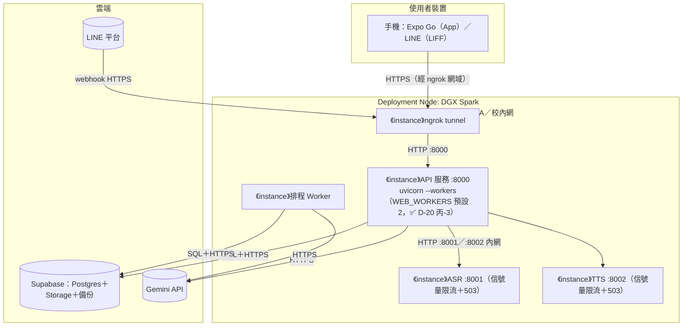

| 屬性 | 值 |
| :--- | :--- |
| 啟停 | `scripts/kinsun.sh`（setsid＋PID 檔＋logs/*.log） |
| 高可用 | 無（單機；demo 當天風險見 §7.1） |
| Backup | Supabase 託管（⚠ 方案未確認 → 14 循環） |
| 監控 | 無外部監控；observability 五表＋admin 後台（告警＝admin 橫幅兩則：分級器故障 甲-5＋家屬通知送失敗 庚-02） |

#### 5.1.2 目標環境

同一 Node，API 改多 worker（D-20）；階段 5 增加 EAS build＋FCM/APNs。開發機（Windows/macOS）以 `ASR_BACKEND=mock`＋`TTS_BACKEND=bubble` 跑同一套程式（位置無關原則）。

#### 5.1.3 環境策略

| 環境 | Deployment | 用途 |
| :--- | :--- | :--- |
| Dev（各自筆電） | mock ASR／bubble TTS＋AllowAllGate（⚠ D-19 修語意後保留） | 日常開發 |
| DGX（demo／準正式） | 全真模型＋ConsentGate 強制 | 實測與 8/20 展示 |

### 5.2 CI/CD 流程（✅ CI 已落地——戊-1，2026-07-10；JS lint／測試併入 2026-07-17）

| 階段 | 現況 | 備註 |
| :--- | :--- | :--- |
| Build/Test | GitHub Actions 五 job：`test`（pytest 1247＋ruff＋`--cov-fail-under=80`）／`integration`（Pg 合約，pgvector service container）／`frontend`（tsc→eslint→vitest→雙 build）／`app`（tsc→eslint→jest-expo）／`audit`（pip＋npm audit，警示不擋門） | PR 與 push main 觸發 |
| Deploy | 手動 `scripts/kinsun.sh restart` | 維持手動（單機），Runbook 見 14 §5 |

### 5.3 成本估算

| 項目 | 月成本 | 備註 |
| :--- | :---: | :--- |
| Supabase／Gemini／Expo Go／ngrok | $0 | 全免費層（D-16：額度優先） |
| DGX Spark | $0 | 校內資源 |
| Apple Developer（階段 5） | $99／年 | D-08：推播啟動時才買 |

---

## 第 6 部分：跨領域考量

### 6.1 可觀測性

| 維度 | 工具 | 狀態 |
| :--- | :--- | :--- |
| 日誌 | logs/*.log（每服務一檔） | ✅ |
| 追蹤 | 自建五階段 trace（webhook→asr→llm→tts→reply，trace_id 貫穿；`get_trace` 為應用層 trace_id 匯聚非 JOIN）＋admin 後台（2026-07-12 內測強化 D-73：長輩詳情五分頁＋系統排程頁＋內測手動觸發） | ✅ token 量測已落地（✅ D-05 戊-2）；安全分級 LLM 亦已入收集範圍（✅ 庚-10 A-9：`_assess` 補 llm_call trace）。**每輪 llm_calls 3 筆**（分級＋審核＋生成，2026-07-25 D-75）且以 `kind` 欄區分——後台延遲統計改逐種類分列（`llm:agent`／`llm:risk_classify`／`llm:moderation`），不可再對整張表做 p50／p95：回覆生成含工具迴圈，與短輸入的分級／審核差一個量級，混在一起的百分位數會讓「每輪變慢」顯示成「LLM 變快」。`model_name` 無法事後區分（GEMINI_MODEL 與 _SAFETY 預設同值） |
| 指標 | admin overview：token 總量、四階段延遲 p50／p95、逐時分桶；無 SLI/SLO 匯出 | 🟡 部分：量測基建已有，SLO 門檻值 ⏸ 實測後定（D-05） |
| 告警 | admin 被動橫幅兩則：分級器故障（甲-5）＋家屬通知送失敗（✅ 庚-02，近 60 分鐘任一筆 delivered=False 即紅字） | 🟡 無主動推送管道（接受，發表期靠後台盯——Leo 拍板最小方案） |

### 6.2 安全性

正式清單見 13 循環。本層級已定：ConsentGate 強制（正式）、token 雜湊存放、密碼 scrypt、admin 金鑰。已知待議：音檔公開 bucket、DGX 服務無認證、token 無效期、admin 可讀全文。

---

## 第 7 部分：風險與演進

### 7.1 風險登記

| 風險 | 可能性 | 影響 | 緩解策略 |
| :--- | :--- | :--- | :--- |
| 8/20 demo 當天 DGX／ngrok 斷線 | 中 | Demo 失敗 | 14 循環定 Runbook＋備援（mock 退路、預錄影片） |
| Gemini 免費額度耗盡 | 中 | 對話／分級停擺 | D-16 額度監控；分級失效期僅剩 11 詞兜底（07 議） |
| 台語 TTS 微調不達標 | 中 | 差異化賣點缺角 | D-01 兩模型對比；發表敘事保留國語退路 |
| LINE 憑證／webhook 失效 | 低 | 凍結通道斷線 | App 為主線（D-08），LINE 僅維運 |
| 8/20 前重構範圍過大 | 中 | 文件與程式雙未完 | D-04 範圍倒排；16_WBS 排優先序 |

### 7.2 演進路線

| Phase | 範圍與目標 |
| :--- | :--- |
| Phase 1（→8/20） | 一次性重構（16_WBS）：**已完成**——甲～庚批全數結案（含 D-20 多 worker 丙-3、A-8～A-58 修復——庚批 2026-07-13：50 完成＋擱置 RAG／著作權＋1 不改）；其後辛批逐項補強（用藥回診編輯、守則、web_search、自適應問候時間、長輩地點、天氣正確性、JS lint／測試基建）。**已知未結**：A-27 升級旗標未接線（庚-09） |
| Phase 2（發表後） | 台語 TTS 上線（D-01）、推播（階段 5）、模型分流（D-16）、重試策略（D-22） |
| Phase 3 | 視就業媒合／延續狀況：真圖譜（D-17 觸發條件）、水平擴充、穿戴（已砍 D-02，除非翻案） |

---

## 第 8 部分：模組詳細設計

> 逐群深潛回填中（設計依據：[2026-07-10-架構文檔深化-design.md](../superpowers/specs/2026-07-10-架構文檔深化-design.md)）。測試規格見 07_模組規格與測試。NFR 實現總摘要：性能＝DGX 限流＋503 過載保護；安全＝閘門＋token 雜湊；可擴展＝D-20 多 worker＋composition 統一接線。

### 8.1 語音對話鏈路（channels／pipeline／agent／llm／tools／speech／audio／transport＋DGX services）

**職責**：把「長輩一句話」變成「金孫一句有聲回覆」的完整鏈路；兩通道（App 對講機、LINE 語音訊息）在邊緣各自正規化，之後全程共用。

**元件與分工**

| 元件 | 職責 | 關鍵型別 |
| :--- | :--- | :--- |
| channels 邊緣 | 通道 adapter：App＝`create_app_turns_router`（`_TurnCollector` 同步收集回覆）、LINE＝`LineChannel`（reply_token 兩段式）；匯合點＝`inbound.dispatch`（`inbound.py:90`） | `InboundMessage`（frozen，含 reply／reply_voice handle） |
| pipeline | `VoicePipeline` 四步：轉寫→危急偵測（**先落庫＋通知再生成**，避免 agent 例外吞掉危急）→生成→合成 | `TtsResult` |
| agent＋llm | `CareAgent` 編排（工具迴圈上限 3）；`GeminiClient` 封 Gemini 協定細節——thought_signature 走 parts 萃取、回帶原簽章（`llm.py:115-136`），agent 對簽章透明 | `LLMClient`、`ToolCall`／`ToolResult` |
| tools | `ToolRegistry`（register／specs／dispatch 永不拋）；組裝處註冊工具：get_weather、health_education_rag、web_search、交通 transport（get_route 免金鑰一律註冊；get_bus_arrival／get_mrt_line／get_parking 需 TDX 憑證，未齊則略過＝優雅降級）、get_news＋get_news_detail（讀自家 news_items 表：標題清單依 published_at 排序＋前 10 池隨機取 5＋news_mentions 不重複給料＋出站清洗；detail 以標題媒合回內文截 800 字。免金鑰一律註冊；D-74 消費端，2026-07-25）。天氣工具防 anchoring（2026-07-17）：只信長輩原話（`turn_context.elder_utterance` contextvar）或注入座標，拒答模型臆測地名；地理編碼限台灣。另一條同機制、**反方向**的跨層傳遞（2026-07-26）：`turn_context.turn_sources()` 本輪來源登記簿由工具寫（web_search 的網域、health_rag 的 citation publisher、news 的媒體名）、由 CareAgent 的冒名防線讀；天氣／路線／TDX／排程刻意不登記（沒有可講給長輩聽的出處）。⚠️ 登記的是「有沒有拿到來源」而非「有沒有呼叫工具」——沒有 active RAG release 時呼叫了也拿不到來源，用後者當閘門會被穿過。**時間已不是工具**（2026-07-25）：get_current_time 移除，改由 `clock.TimeFacts` 每輪注入情境（群 2a），理由是工具「模型想到才呼叫」而時間是每輪都用得到的座標系 | `ToolSpec` |
| speech／audio／transport | `Dgx{Asr,Tts}Client` 經 `Transport` Protocol 呼叫 DGX（可注入假傳輸，不 monkeypatch）；`SupabaseAudioPublisher` 託管音檔（上傳＋簽章 URL 兩趟往返） | `ASRClient`、`TTSClient`、`AudioPublisher`、`Transport` |
| services（DGX） | `POST /transcribe`（bytes→`{"text"}`）、`POST /synthesize`（`{"text"}`→m4a＋`X-Duration-Ms`）；併發閘滿回 503 | — |

**關鍵流程（App 語音回合 `POST /api/v1/turns`）**：token 驗證→同意複核（403 守門，`turns.py:92`）→**寫入長輩地點**（地名＋模糊座標三者齊備才寫，排在 dispatch 之前，2026-07-17）→進站音檔託管→`InboundMessage(APP)`→`dispatch`（App 路徑傳入已解析 elder_id 跳過重查，✅ 庚-12）→`VoicePipeline.process`→回覆音檔簽章 URL→`record_reply`（round_trip_ms）。共 9 個分岔：403 同意撤回／415 非音檔／413 超大／未綁定提示／危急 L2＋落庫並通知家屬／TTS 失敗退純文字／管線失敗 FALLBACK_PROMPT／音檔上傳失敗退純文字／ASR 辨識為空或純標點幻覺（靜音誤觸——DGX 端靜音峰值閘回空，或 Whisper 系對近無聲短檔幻覺出純標點「? ? ?」，管線 `_has_recognizable_speech` 去標點後判空）→ 跳過分級與生成、以 FALLBACK_REPLY 合成語音請長輩再說一次（2026-07-18）。

**觀測**：五階段＝trace 切法（五表），pipeline＝四步；危急偵測在 trace 隱形（LLM 呼叫不計 token——差距 A-9）；App 鏈路無 webhook 筆（僅 LINE 有）。三個 trace span 共用 `_span` seam（`pipeline.py:103-123`）：觀測失敗不影響對話、`traces=None` 全 no-op。

**錯誤路徑（長輩聽到什麼）**

| 失敗點 | 使用者得到 | 有聲音？ |
| :--- | :--- | :---: |
| ASR／LLM 失敗 | `FALLBACK_PROMPT`「金孫剛剛沒聽清楚…」（`inbound.py:20`） | ❌ 純文字（差距 A-10） |
| agent 空回應／工具迴圈耗盡 | `FALLBACK_REPLY`（`agent.py:29`，走正常 TTS） | ✅ |
| TTS 失敗 | 真實回覆文字、audio=None（`pipeline.py:185-187`） | ❌ 有字無聲 |
| 工具失敗 | registry 回錯誤字串，模型併入回覆（`registry.py:29-33`） | ✅ |
| 危急落庫失敗／分級器故障 | 對話照常（warning／fail-safe L1 留痕不通知） | — |

**NFR 實現**：性能＝DGX 併發閘（503）＋各 client 獨立逾時（ASR 15s／TTS 30s／上傳獨立）；安全＝Bearer token＋同意複核雙重守門、`X-Api-Key` 內網金鑰（未設＝開發模式）；可觀測＝trace_id 貫穿＋token 用量 contextvars 收集（僅 agent 呼叫，`llm.py:24-48`）。

**跨群介面**：→群 2 記憶（`SessionMemory.assemble`／`record_turn`）；→群 2b 知識（health_rag 工具包 `HealthEducationRagService`）；→群 4 安全（`RiskDetector.assess`；`GuardianNotifier` 經 `TextSender` 插座，✅ D-18）；→群 5 帳號（`ConsentGate.resolve_elder`、`authenticate_token`）；→群 6 底座（`TraceStore` 五表、`web.envelope.ok()`、composition 接線）。

### 8.2 記憶（memory：shortterm／longterm／recall＋models）

**職責**：讓金孫「記得長輩」——今日對話逐輪保存（短期）、跨日穩定事實（長期，Mem0）、用藥回診權威事實（事實層），三層由 `SessionMemory` 門面一手組裝進每輪 prompt。

**三層讀寫時序**

| 時間線 | 讀 | 寫 |
| :--- | :--- | :--- |
| ☀ 白天每輪 | `recent()` 今日 turns＋`search()` 長期（user query＋HEALTH_QUERY 雙查詢→去重→新到舊）＋`FactProvider.facts()`（只吃 elder_id，**每輪必帶的保證來源**） | `record_turn` 寫 user＋assistant 進 `turns`（**不寫長期**） |
| 🌙 夜間 03:00 | `previous_day()` 前一天整天（台北日界，半開區間） | `long_term.add(provenance=SELF_CLAIMED)` → Mem0 LLM 抽取→`kinsun_memories` 向量 |

**元件與分工**

| 元件 | 職責 | 關鍵設計 |
| :--- | :--- | :--- |
| `SessionMemory`（recall.py） | 三層門面：`assemble(elder_id, query)→TurnContext`、`record_turn` | 事實層 query 無關（保證每輪帶）；單一 FactProvider 失敗略過不中斷（`recall.py` `_gather_facts`）；`TimeFacts` 排首位（2026-07-25，`clock.py`）——時間是其他事實的座標系（回診印絕對日期），且段首寫死「沒問就不用特地報時」防模型逢句報時（同 LocationFacts 的 anchoring 教訓）；**事實提供者並行查**（2026-07-26 延遲實測）——七個提供者各一次跨網 Supabase 查詢、單次往返固定約 0.21s 且彼此無依賴，序列查白等約 1.5s；⚠ 段落順序是 prompt 契約，故按 `self._facts` 索引回填、不得改成「誰先回來誰先排」 |
| `MemoryStore` 三件套（shortterm.py） | 今日對話八法：append／recent／previous_day／sessions／last_active＋list_for_range／day_starts_with_turns（✅ 庚-06）＋first_user_turn_per_day（自適應問候時間訊號，2026-07-17） | tz-aware 台北午夜日界；DB 例外轉譯 `MemoryStoreError`（✅ 庚-36 改名） |
| `Mem0LongTermStore`（longterm/store.py） | Mem0 ACL：add／search 兩法 | 檢索失敗退化空清單不中斷對話（`_search_raw` fail-safe）；**兩次檢索（長輩原話＋固定健康增補）並行**（2026-07-26 延遲實測：每次含 embedding API＋向量查詢＋LLM rerank，約 2.3 秒，排隊跑就是 4.6 秒）——合併順序仍「先 user 後 health」不可交換（`_dedup` 保留先出現者，兩邊撈到同一筆時該留依原話檢索的那筆）；rerank=True＋explain（✅ D-40）；「三路實為一路」——BM25／graph 失效，僅語意向量生效（ADR-003） |
| `mem0_factory` | Settings→Mem0 config | 維度硬鎖 768（Supabase 預設 1536 會不符）；遙測預設關（隱私）；history.db 釘 `data/mem0/`（✅ D-65）；抽取紀律 prompt（自述不當診斷） |
| `consolidation` | 夜間批次：掃「上次整理日之後～今日之前」逐日補整理→add | fanout 逐長輩隔離；✅ 停機跨多日不漏天（庚-06 A-18）＋`memory_consolidations` 冪等標記（庚-13 A-19，同日重跑不重覆 add） |
| `provenance` | 出處三值＋中文標籤＋抽取紀律 | 實際僅 self_claimed 流動（另兩值為未來留位，A-22） |
| `models.py` | 型別＋唯一排版函式 `format_injected_context` | 排版集中一處、只依賴 llm.Message 斷循環；「新覆舊」recency 前言＋（出處·日期）註記（2026-07-04 recency 設計，讀取端消解） |

**一致性策略（精確版）**：長期記憶為最終一致，一致窗＝24h（cron 00:05，`LONGTERM_CONSOLIDATION_HOUR` 可配置、預設 0）；凌晨盲窗已縮至約 5 分鐘（✅ 庚-48 A-21）。夜間批次共四步：Mem0 整理→每日摘要→每晚反思（`REFLECTION_ENABLED`）→問候時間計算（`PROACTIVE_GREETING_ADAPTIVE_ENABLED`）——後三步各自 try/except 互不拖累，整理失敗則中止該長輩整批並記 ERROR。

**NFR 實現**：可靠性＝記憶壞掉不中斷對話（search 失敗空清單、facts 失敗略過）；隱私＝Mem0 遙測預設關、抽取紀律 prompt 禁擅自診斷；可測性＝短期合約測試（Fake vs Pg）＋mem0 2.0.10 契約守門測試＋golden 排版測試（8 源檔測試一對一）。

**跨群介面**：←群 1（`CareAgent` 消費 assemble／record_turn）；←群 3（MedicationFacts／AppointmentFacts 為事實提供者，資料源在領域 store）；←群 4（scheduler worker 觸發 consolidation、`sessions()` 為 fanout 母體、`last_active()` 供失聯關懷）；→群 6（db.py `turns` 表、config `LONGTERM_*`／`MEMORY_MAX_TURNS` 設定鍵）。

### 8.3 知識檢索（RAG：版本化索引＋tools/health_rag）

**職責**：衛教知識的版本化入庫、獨立週更與線上查答。線上以 agent 工具 `health_education_rag` 暴露；離線入口為 `rag.ingest`／`rag.migrate`，週更為獨立 `rag.worker`。

**雙管線分工**（以 active release membership 交會，768 維 pgvector）

| 面向 | 離線 ingest | 線上查詢 |
| :--- | :--- | :--- |
| 入口 | ingest／migrate CLI＋獨立週更 Worker | `HealthEducationRagService.answer` ← health_rag 工具 ← agent 工具迴圈 |
| store 面 | ANSWER 文件＋chunks＋membership＋成功稽核同交易；DISCOVERY 只存文件 membership＋稽核；候選品質閘門後原子發布 | 只查 active membership；search（餘弦）＋keyword_search（ILIKE） |
| embedding | 文件與查詢統一 `RAG_EMBEDDING_MODEL`，release 固定 768 維；Gemini 批次有大小、timeout 與有界重試 | 模型／維度不符停用向量；向量失敗自動降級 keyword |

**治理防線**：①`SourceRegistry` 以 `ANSWER`／`DISCOVERY` 分流→②`SourceValidator` 依 `allowed_only` 或明確的 `classroom_demo` 查核授權→③所有 seed／crawl／migrate 路徑一致驗證→④URL 正規化後，同 URL 依時間、內容 hash、來源 ID 做確定性決勝，同內容再偏好 HTTPS 與較短 canonical URL→⑤DISCOVERY 不建立回答向量，檢索端只允許 approved `ANSWER` chunk。完整捨棄與 discovery 都寫 `rag_ingestion_audit_logs`。

**檢索品質鏈**：明顯天氣預報／股價／食譜／即時新聞／過期規定先判範圍外（健康問題含天氣情境仍保留）→`normalize_query`（同義詞展開，如「三高」→高血壓 高血糖 高血脂）→向量＋關鍵字**聯集**（各 top_k×3，兩種 method 基礎權重相同）→approved 過濾→`rerank`（**非 LLM**：score×trust×source_type×method×freshness 確定性加權、chunk_id 去重取高分）→`AnswerPolicy` 五分支（risk→URGENT 跳過檢索／醫療動作詞→拒答／無 evidence→拒答不編造／無 citation→拒答／NORMAL 抽取式）→NORMAL 才 LLM grounded 改寫（失敗回退抽取式答案）。**拒答優先於生成**：確定性程式碼管安全，LLM 只管潤稿。

**「衛教不當醫囑」邊界**：pipeline 的 `RiskDetector` 是唯一危急權威，結果以 `ToolInvocationContext` 傳入工具；LLM 不能自填風險。RAG 的 `requires_safety_attention` 只表示拒答／稽核，不觸發第二次分級。

**與記憶向量庫的關係**：同 pgvector 擴充但不同表、不同設定鍵；RAG 只用 `RAG_EMBEDDING_MODEL`，長期記憶只用 `LONGTERM_EMBEDDING_MODEL`，不得混用。

**NFR 實現**：合規＝安全預設授權政策＋逐文件稽核；安全＝確定性拒答＋active 原子發布；可靠＝向量降級、失敗不換版、rollback、外部 HTTP timeout、有界重試，以及 failed release 中「已原子完成且模型／角色／結構相容」文件的下版復用；品質＝golden set 自動 threshold 與發布閘門，結構指標先分別物化 release 文件／chunk membership 再以 `NOT EXISTS` 查孤兒，避免 cross join 誤判；觀測＝`rag_calls` 只在 Admin 顯示完整 citation。

**跨群介面**：←群 1（`ToolRegistry` 以選填 context dispatch，時間／天氣相容）；←群 4（RiskAssessment 先於 agent，僅傳結果）；→群 6（release／membership／audit／rag_calls schema 與 Admin）。

### 8.4 健康領域（schedules／reports＋兩 routers）

**職責**：用藥與回診的「家屬設定→長輩提醒→紀錄回報」閉環，加上家屬端三種報告視圖。全庫腳手架紀律最一致的區塊，**可作新領域樣板**。

**雙生領域同構表**（六檔全配，符合 08 §4 腳手架）

| 面向 | medications | appointments |
| :--- | :--- | :--- |
| models | 富模型：Slot 四時段列舉＋slots_label | 貧模型：date（ISO 字串）＋label 自由文字 |
| store 三件套 | ＋list_for_slot（時段查詢） | ＋list_for_date（日期查詢） |
| service | CRUD（save 生 id／update／remove） | ＋upcoming（未過期過濾） |
| facts | 無時鐘 | 需 clock 判 today |
| jobs | 4 個 daily cron（8／12／18／21 可配置），**只推長輩** | 單一 job 今明兩窗，**長輩＋全家屬雙推播** |
| flow（LINE 選單） | 凍結維運碼（D-08，與 REST 功能重複，A-38） | 同左 |

**提醒管線時間語意**：cron 一律 `分 時 * * *`（每日單點）；用藥依 slot 全域撈藥→按長輩聚合合併多藥名；回診以日期字串相等判定今明兩窗（每筆回診提醒兩次：前一天＋當天）；全鏈 tz-aware（台北）；**停機跨時段只補跑一次、不補發**（防洗版取捨，與 A-18 同源，A-38 明記）。出站一律不查同意（✅ D-30 己-1，全庫實證 consent 檢查只剩入站閘門與帳號層）。紀錄走 `safe_record` 進 reminder_logs（失敗不影響推播）；⚠ med `sent==0` 不記、appt 無條件記（A-34）。

**統一排程（D-76，P1 已落地、P2 待切換）**：`schedules` 表以「一列＝一個鬧鐘」承載用藥／回診／長輩自訂三類——回診的前一天＋當天、用藥的早上＋晚上，本質是同一件事有多個提醒時刻，故用 `group_id` 串起同一件事的多個鬧鐘（家屬刪「這個藥」＝刪整組），而非在單列裡再長一套提醒規則語法。`event_at`（事件何時發生）與提醒時刻分離，話術才講得出「明天 10:30 要回診」；`settled_at`（已結案）與 `fired_at`（最後送出）分離，過期作廢的列才能結案而不謊稱送出過。**✅ P2 已切換**（2026-07-25）：單一每分鐘 job `schedule-dispatch` 取代四個用藥 job ＋ 一個回診 job，判定窗 `SCHEDULE_DISPATCH_WINDOW_SECONDS`（預設 90 秒）⚠ **非補發窗**——只吸收每分鐘掃描的抖動，「過期不補發」政策不變。訊息措辭（`schedules/wording.py`）與舊 job 逐字相同；用藥時段詞改由**提醒時刻**推算，分界（11／15／20）挑成讓四個預設鐘點落回原詞，家屬不改設定則長輩聽到的字一字不變。對話注入改為三段 `ScheduleFacts`（用藥／回診標題逐字沿用舊 facts，第三段「長輩自己交代的事」為新增）。**✅ P3～P5 已完成**（2026-07-25）：家屬入口統一（LINE 一個「提醒設定」＋一支 `/schedules` router，操作單位為 group）、長輩語音三工具（全庫第一組會寫庫的工具，`elder_id` 只認 `ToolInvocationContext`）、`medications`／`appointments` 兩模組與兩張表退役（DROP 排在 `SCHEDULES_DDL` 之後）。過渡期的 `legacy_bridge` 對帳已於 P3 移除。admin 手動觸發改接統一派送，其 `_ForcedDueStore` 的標記方法刻意 no-op——測試動作不可吃掉當天真正的提醒。

**reports 三檔分工**

| 檔 | 角色 | API 落點 |
| :--- | :--- | :--- |
| health.py | 純聚合函式（近 30 天危急＋提醒；handler 只驗身分） | `GET /elders/{elder_id}/health-report`（聚合端點單數） |
| reminders.py | append-only 三件套＋safe_record | 併入 health-report |
| summaries.py | 每日摘要三件套＋summarize_day（夜間批次，L1 小訊號注入 D-10 己-5；2026-07-17 穩健化：單一文字稿輸入防接話＋重試一次＋輸出清洗驗收） | `GET /elders/{elder_id}/daily-summaries`（✅ 己-3；limit 1–90 預設 30） |

注意：健康報告**不含**摘要——「危急＋提醒」兩軸與「每日摘要」是兩條獨立資源、同 router 不同聚合。

**認證與守門**：三 routers 全走家屬雙認證（App token 先查、miss 走 LIFF idToken）＋`GuardianScope.assert_manages` 逐長輩守門，非管理範圍回 404（不洩漏存在性）。

**NFR 實現**：正確性＝四組合約測試（medications／appointments／reminders／summaries 皆 Fake＋Pg 參數化）；可靠性＝fanout 逐筆隔離＋safe_record fail-open；一致性＝跨層動詞分工全合規（HTTP create／delete→Service remove→Store save=upsert、record=append-only）。

**跨群介面**：→群 2a（MedicationFacts／AppointmentFacts 實作 FactProvider 注入 SessionMemory）；→群 4（jobs 由 scheduler worker 裝配、經 ChannelRouter 推播、health 報告讀 RiskEventStore）；→群 5（deps.py 家屬認證＋GuardianScope；flow 用 BindingSession）；→群 6（db 四表、config `MEDICATION_*_HOUR`／`APPOINTMENT_REMINDER_HOUR`、信封 ok()）。

### 8.5 安全與主動關懷（safety／proactive／notifications／scheduler）

**職責**：產品差異化承諾的落點——危急偵測與家屬通知（同步，不經排程）＋主動關懷與各式提醒（排程 worker，非同步 fanout）。

**危急偵測判定矩陣**（✅ D-72 三級制，`RiskDetector.assess`）

| 條件 | 結果 |
| :--- | :--- |
| 絕對危急詞命中（救命、想不開…6 詞） | L2 override，不看信心、不降級 |
| 否則 | max(詞表 tier, LLM tier) |
| 純 LLM 撐起的 L2 且信心 < mid(0.4) 且詞表 < L2 | 降 L1（症狀詞撐的 L2 不降） |
| llm:error 且句子非空且結果 < L1 | fail-safe L1 留痕（✅ D-31，只落庫不通知） |

fail-safe 三層防護（classifier 捕 LLMError→detector 捕全例外→收斂 L1）；舊庫 tier=3 由 `tier_from_db`＋classifier 雙保險夾回 L2。詞表已擴充至 46 詞（✅ 庚-47 A-43：D-32 候選 35 詞全收；通報層 P 61.1→66.7%、R 40.7→51.9%、誤報持平）。

**危急通知鏈**：pipeline **先落庫再通知**（agent 例外不吞危急）→ `GuardianNotifier` 全家屬齊發無冷卻（✅ D-10）→ `TextSender` 插座（✅ D-18）→ `ChannelRouter` 逐通道扇出。每家屬送達成敗記 `risk_notification_logs`（✅ D-36，留痕失敗不反噬通知）；`keyword:absolute` 訊號才掛 119 提示。`escalation_order` 已從升級語意退化為排序語意（升級鏈不做，己-8 保留欄位）。可靠性缺口處置（✅ 2026-07-12）：失敗告警已補（庚-02 A-40：admin overview 近 60 分鐘任一筆 delivered=False 即紅字橫幅；死信不做——Leo 拍板最小方案）；App 通道送達語意改誠實標註（庚-16 A-41：`channels` 欄記成功通道，僅走 App 的成功顯示「已入通知匣（待開啟）」，真送達留待階段 5 推播）。
**投遞可靠性補強（2026-07-27）**：三件事，死信仍不做。
(a) **未綁通道與真失敗分流**——`send_text_channels` 對「家屬一個通道都沒綁」與「送出全數丟例外」的回傳都是空清單，事後分不出來，於是每一位還沒綁 LINE 的家屬都持續貢獻一筆 `delivered=False`，把 A-40 的紅字橫幅灌成常態雜訊、真失敗反而看不見。改為送出**前**先問 `router.has_route`：沒有可達通道記 `outcome='no_route'` 並跳過白呼叫一次出站，有通道才送、依結果記 `sent`／`failed`；`risk_notification_logs` 新增 `outcome TEXT NOT NULL DEFAULT ''`（走既有 `ADD COLUMN IF NOT EXISTS` 慣例，已在真 Postgres 驗過既有庫升級路徑），`count_failed_since` 排除 `no_route`。留痕一筆不少——稽核問的是「家屬當時有沒有收到」，`delivered` 語意一字未動，`outcome` 只回答「為什麼」；舊列 `outcome=''`（未分類）保守計入，60 分鐘視窗讓舊雜訊在部署後一小時內自然退場。
(b) **出站有界重試**——`ChannelRouter` 這一層原本零重試，一次網路抖動就是一則危急通知永久消失。重試放在 `LineOutboundChannel.send_text`，**只重送「確定沒送出去」的那幾種**（`MaxRetryError`＝連線沒建立、`ServiceException`＝5xx），⚠ **讀取逾時一律不重試**（連線建立了、請求送出去了，那則通知可能已送達，重試會讓家屬收到兩則一模一樣的危急警報）；4xx 同樣不重試。採白名單，認不出來的例外一律不重試。次數（3）與總時長（15 秒）雙上限——危急通報排在長輩的回覆生成**之前**，只設次數的最壞情況會讓長輩多等三十秒。重試用盡仍把例外往上拋，`ChannelRouter` 據此記成投遞失敗。
(c) **LINE API 全部五個呼叫補上逾時**（`LINE_API_TIMEOUT_SECONDS=10`，與 LIFF／音檔上傳同級）。⚠ 附帶推翻一個前提：`_request_timeout` 是**每次嘗試**的上限而非總時限，urllib3 預設 `retries=None` 會自己重試 3 次（黑洞位址實測：逾時設 2 秒、實際 8 秒才放棄，全程無日誌），故顯式設 `configuration.retries = 0`，把重試收回到看得見的 (b)。

**✅ L1 小訊號已接線（A-39 已修復，庚-01，2026-07-12）**：落庫閘門放寬為「≥L1 皆落庫、≥L2 才通知」（`pipeline.py`），一般 L1 自此進 `risk_events`，每日摘要的 L1 注入（排除 fail-safe）有了真實資料來源；契約測試改為 `test_plain_l1_recorded_without_notifying`。副作用（已知且接受）：家屬健康報告的危急事件列表會出現「關注」級事件（報告本無 tier 過濾，fail-safe L1 原本就會出現——若不想顯示，另開 tier 過濾工項）。

**濫用審核（2026-07-25，Leo 核定「只擋明顯越權要求」）**：與危急偵測**目標相反**——危急是「長輩有沒有危險」，命中要**升級**（落庫＋通知家屬）；審核是「使用者有沒有在濫用系統」，命中要**攔截**（不進 agent，改唸該類別的口語回絕話術，仍走 TTS）。

只擋三類：`role_hijack`（忘記設定／扮演其他角色／假裝取得權限）、`system_disclosure`（念出系統提示、參數、金鑰）、`code_generation`（寫程式、代寫文章、翻譯教學等與照護無關的專業代工）。**刻意不擋**兩類：「離題」不擋——長輩講話本來就發散，判「與照護無關」會直接打斷對話，與 `agent.SYSTEM_PROMPT` 第（5）條「結尾自然帶一句關心或反問」互相打架；「格式綁架」不擋——該防線在出站，由 `agent._speakable()` 打撈（拆 code fence、撈 JSON 字串值），入站再攔一次不會多擋到東西。

⚠️ **管線位置是安全屬性，不是風格偏好**：審核固定排在**危急落庫與家屬通報之後**。攔截會整段跳過 agent，若排在前面，一句被誤判成違規的「我不想活了」就會讓 `risk_events` 不落庫、家屬永遠收不到 L2 通知——而「不想活」正在 `ABSOLUTE_DANGER_WORDS` 裡，是必定觸發 L2 的詞。由 `test_moderation_runs_after_family_notification`（順序）與 `test_blocked_turn_still_records_and_notifies_the_crisis`（攔截不吞副作用）雙重守住。被攔的那一輪刻意**不寫進記憶**——綁架企圖不該變成明天的對話脈絡。

誤攔防線三層：（1）提示詞明列六種「一律判 none」情形，身體不適、輕生念頭、發散閒聊、用藥詢問、查證需求、話題裡撞到「程式／英文」字眼的閒聊全在內；（2）信心門檻 `SAFETY_MODERATION_MIN_CONFIDENCE=0.7`，刻意高於危急的 0.4——誤攔長輩的代價遠大於放過一次綁架，兩種錯誤不對稱門檻就不該對稱；（3）**全路徑 fail-open**——解析失敗、LLM 例外、分類器拋錯一律放行，立場同 `detector.assess` 的「偵測絕不可中斷對話」。

`SAFETY_MODERATION_ENABLED` 旗標**維持 true**（Leo 2026-07-25 核定），但⚠️ **當初據以核定的評測數字已於同日作廢**（裁判不可信，見 D-75），目前**尚無可信數字支撐**，待配額重置後重跑再定。唯一未被推翻的是誤攔：8 題 benign 對照組**直測審核器本體**（不經裁判）8/8 全放行、信心 1.00，含兩句危急句。代價為每輪對話多一次 LLM 呼叫；設 false 為維運逃生口。預設值由 `test_config` 釘死，更動須刻意。

**主動關懷**：早安問候＋失聯關心（`last_active` ≥ 2 天，只計 user turn——主動關懷寫 assistant turn 不自我抑制，刻意設計勿誤改）；先 `has_route` 確認可達才花 LLM；proactive 不跑工具迴圈；記憶只記 assistant 單輪帶【主動關懷｜intent】標記（✅ D-39）。

**接續上次話題（spec 2026-07-17-主動問候接續昨天話題，辛-9）**：兩種主動推播送出前，`worker._recall` 讀「**她上次開口那天**」的對話摘要（以 `last_active` 定位日期，再 `summaries.get_for_date`），經 `agent.proactive(..., recall=Recall(content, days_ago))` **一物三用**——取代 intent 當長期記憶的**檢索關鍵字**、直接注入 prompt、並於**任務描述**條件式附加追問指示。動機：intent 是每天每位長輩都相同的字串，拿它做語意檢索等於每天用同一把萬用鑰匙開所有人的門，問候長期收斂到 `HEALTH_QUERY` 撈出的健康罐頭；而早上 `recent()` 必為空（只回今日）。為何不用 Mem0 的昨晚整理項：其抽取指示明訂「閒聊與情緒由系統另行處理」，裝的正是罐頭本身。

⚠️ **三處設計皆由真 Gemini 探針（`scripts/recall_probe.py`）逼出，改前都是壞的**：（1）**定位日不可用「今天減一天」**——失聯門檻（≥2 天沒開口）與「昨天有她的對話」互斥，照昨天讀對想念推播永遠是 `None`；且主動推播每次寫 assistant turn、`summarize_day` 不分是誰講的，照昨天讀會拿到「金孫自言自語」的摘要當她的近況。（2）**`days_ago` 非帶不可**——不講幾天前，模型把舊摘要當成剛發生，實測說出「妳好久沒找我聊天了……孫子這週末要回去」的自相矛盾話。（3）**情境段不足以驅動行為**——想念推播連測四輪穩定不理會摘要，槓桿在任務描述而非段首措辭（早安會用是因為 intent 的「狀況」字面對上段首的「狀況」）。追問指示**必須條件式**（`recall=None` 時不出現），否則沒摘要的長輩會被憑空編一段回憶。

`recall=None`（從沒開口／那天沒摘要／讀取失敗）＝一字不差退回本功能之前的行為——摘要是錦上添花，不可擋下問候，故讀取失敗只 warning 不上拋。

**自適應問候時間（spec 2026-07-16，2026-07-17 落地）**：問候時刻每位長輩各自決定——夜間批次第四步 `update_greeting_time` 以近 14 天「每天第一則長輩發言」的中位時刻純統計計算（不經 LLM），寫入 `greeting_preferences`；問候 job 改每半小時掃描（cron `0,30 * * * *`），到達偏好時刻且 `greeted_today` 為 false 才發（kind 濾網只認問候，用藥提醒不算）。防漂移三道：**死區**（差距未超門檻不動，往後容忍 60 分／往前 30 分不對稱）、**單步上限** 30 分、**護軌**夾在 6–11 時（拉回時豁免單步上限）。冪等＝ledger：問候先記 `reminder_logs` 再送，記帳失敗讓例外冒到 fanout＝跳過本輪 30 分後重試（at-most-once，寧漏不轟炸）；失聯關心不走 ledger 路徑，不受記帳失敗影響。設定七鍵 `PROACTIVE_GREETING_*`，啟動即驗證（範圍／倍數／跨欄位）。

**scheduler**：自建輕量排程（croniter＋`scheduler_state` upsert）；`_is_due` 首見種基準、停機補跑一次（consolidation 已自行逐日補齊，✅ 庚-06）；fanout 逐筆隔離無重試（單筆失敗當日遺失）；雙實例防重已補（✅ 庚-17 A-42：`try_claim` 條件式 UPDATE 原子先搶先贏）。worker 組裝 11 個 job：夜間批次（整理→摘要→反思→問候時間）／問候／失聯／用藥×4／回診／音檔清理×2／觀測清理。

**App 內通知（✅ D-12 過渡）**：真推播前的唯一路徑——`AppOutboundChannel`「送出」＝落 `app_notifications`，`GET /notifications` 聚合本人全部 App 綁定拉取（limit 50 新到舊）；已讀水位存 App 本機、後端不做。

**評測基建（D-05 戊-4）**：`safety/evaluation.py` 離線 P/R CLI（`--keyword-only` 免金鑰／完整偵測器同 app 組裝）＋`data/safety_eval` 62 筆標注集；KPI 主指標＝通報層（≥L2）精確率／召回率，漏報優先展示。與 13 檢查表尚未接線（A-45）。

**NFR 實現**：安全＝偵測絕不中斷對話（三層 fail-safe）＋先落庫再通知；可觀測＝admin 分級器故障橫幅（近 60 分鐘 ≥3 筆）；可測性＝四組合約測試（events／deliveries／notifications／state）＋16 檔測試對照。

**跨群介面**：←群 1（pipeline 同步呼叫 assess／notify；TextSender＝ChannelRouter）；→群 2a（`sessions()` 為 fanout 母體、`last_active` 供失聯、proactive 寫記憶）；→群 3（reminder_logs 記錄、summaries 讀 L1——✅ 已接線，庚-01）；→群 5（`guardians_of`／escalation_order）；→群 6（db 四表、config `SAFETY_*`／`PROACTIVE_*`、admin 告警）。

### 8.6 帳號綁定與同意（accounts／binding／web.auth＋四 routers）

**職責**：身分的唯一真實來源——業務主鍵（elder_id／guardian_id）、通道中立綁定層、App 帳密、API token、知情同意，以及放行語音對話的閘門。是其他所有上下文的上游。

**四層身分模型**（✅ ADR-011 通道中立身分層）

| 層 | 表 | 語意 |
| :--- | :--- | :--- |
| 業務實體 | `elders`／`guardians`／`elder_guardians` | 主鍵 uuid；關聯帶 role＋escalation_order（升級鏈不做，僅排序） |
| 通道綁定 | `channel_bindings` | `(channel, external_id) → (principal_type, principal_id)`；一人可同時有 LINE＋App 綁定；換手機＝改一筆綁定，記憶不動 |
| App 帳密 | `guardian_accounts`（email）／`elder_accounts`（phone，✅ 己-6 D-71） | scrypt 雜湊（N=131072＝2**17，OWASP 2024 ✅ 庚-20；r=8/p=1，參數隨值保存零遷移） |
| 憑證 | `api_tokens` | 明文只回一次、DB 存 SHA-256、撤銷＝刪列；**無 expires_at＝永久**（✅ D-25 修訂） |

**三種認證分工**

| 認證 | 發放 | 驗證 | 撤銷 |
| :--- | :--- | :--- | :--- |
| 裝置 token（長輩） | 綁定碼兌換或帳密重登 | `authenticate_token`（SHA-256 查表） | 家屬 `revoke_elder_device`（撤全部 token＋拆 App 綁定）；長輩可自助登出（✅ 庚-42：`DELETE /sessions` 開放長輩 token＋對講機登出鈕） |
| 家屬 token（App） | 註冊或登入 | 同上 | `DELETE /sessions` 自撤單筆 |
| LIFF idToken | LINE 平台簽發 | 每次請求 POST 到 LINE verify 取 sub | 不適用（短效） |

家屬雙認證順序：先本地查 App token，miss 才打 LINE 驗證（`deps.py:28-42`）。`GuardianScope.assert_manages` 逐長輩守門，非管理範圍一律 **404 不洩漏存在性**。

**己-6 長輩帳密鏈（✅ D-71）**：家屬 `PUT /elders/{elder_id}/account` 代辦建帳密（手機正規化 8–15 位數字；他人占用 409 `phone_taken`）→長輩 `POST /elder-sessions` 驗密＋**檢查同意有效**（未配對回 403 `not_paired`，引導先掃碼）→補 App 綁定＋發永久 token。防護：`elder-login` 獨立節流 scope；查無帳號時仍對 dummy hash 跑一次驗證補時間差（✅ D-60 枚舉防護）。

**綁定與同意**：邀請碼（家屬用，只建 `ElderGuardian` 關聯）vs 綁定碼（長輩用，建 `ChannelBinding`＋寫 `Consent`）——**兩者共用 `redeem_invite` 依 `invite.role` 分支**；同意主體分 SELF（長輩本人 LINE 貼碼）／PROXY（家屬代長輩於 App 裝置綁定），`CONSENT_VERSION=2.0`（己-2；D-62 改版不重新徵求）。撤回欄位 `revoked_at` 存在但**無任何寫入點**（D-13 決議不做撤回入口，A-50 需明示以免誤讀為已支援）。

**閘門（✅ D-19）**：`ConsentGate.resolve_elder`＝查綁定→取本人→驗同意有效；`AllowAllGate`＝只查綁定不驗同意（dev／demo，`BINDING_GATE_ENABLED=false`），查無綁定退回 external_id 當會話鍵。兩者查詢故障一律回 None（**不 fail-open**）。同意撤回後的行為矩陣：對話 403（閘門擋）／提醒照發（✅ D-30 出站不查同意）。

**一致性邊界**：`AccountService` 是 Elder 聚合的唯一維護者，跨表原子寫入靠 `store.transaction()` seam；原三處交易缺口已補（✅ 庚-18 A-48：`revoke_elder_device`／`login_elder`／`login_guardian` 皆包交易；`FakeAccountStore.transaction` 改快照回滾與 Pg 對齊，原子性可離線驗證）。

**已知安全缺口**：~~邀請碼角色未驗（A-46）~~✅ 已修（庚-04）；~~家屬 token 無批次撤銷（A-47）~~✅ 已修（庚-05，`DELETE /sessions/all`）；~~redeem TOCTOU（A-49）~~✅ 已修（庚-19：`get_invite` 加 `for_update` 列鎖，Pg 並發測試兩執行緒同碼恰一成功）；A-50 已緩解（庚-20：scrypt 2**17＋`_validate_password` 下沉服務層）——殘：帳號＝低熵手機號、節流為 per-IP 非 per-account。

**NFR 實現**：安全＝token 雜湊儲存＋scrypt 常數時間比對＋枚舉防護＋404 不洩漏存在性＋登入節流；可測性＝store 合約測試（Fake＋Pg 13 例）＋service 34 例＋API 44 例；可維護＝AccountStore 27 方法屬合理的寬 Repository（同一限界上下文＋共享交易 seam）；若需拆分應依**子聚合**（Identity／Consent／Invite／Binding／Credential）＋UnitOfWork，而非讀寫 CQRS（10 §9 ISP 註記的正解方向；現行規模維持單一 Store 為 YAGNI）。

**跨群介面**：→群 1（`ConsentGate` 為 dispatch 前置、`authenticate_token` 為 turns 守門、`BindingDirectory` 供 ChannelRouter 查綁定）；→群 3／群 4（`guardians_of` 供通知與回診推播、`GuardianScope` 供 REST 守門）；→群 6（`transaction` 邊界、`ratelimit` 節流、db 九表）。

### 8.7 平台底座（app／composition／config／db／observability／web 底座件）

**職責**：把設定與元件接成可服務程式的組裝層，加上全域橫切關注（信封、節流、安全標頭、可觀測性、schema 遷移）。

**組裝拓撲**（兩層二分法，✅ 落實乾淨）

| 層 | 內容 | 特性 |
| :--- | :--- | :--- |
| `build_externals(settings)` | 4 個連網重件：`db`（psycopg3 池 1–5）／`gemini`／`long_term`（Mem0）／`messenger`（LINE）；開頭跑 `ensure_schema` | 建構即連網，**不進單元測試** |
| `assemble_core(settings, externals, *, clock)` | 22 欄位 frozen `Core`：帳號／用藥／回診／記憶／SessionMemory／RAG／CareAgent＋ToolRegistry／ChannelRouter／traces／reminder_logs／notifications／account_store（D-73）／risk_events＋summaries（✅ 庚-44 收進 Core，A-57 已修）／strategies／locations／greeting_prefs（2026-07-14～17 新增） | 純接線、可注入假 Externals **離線測** |
| 兩組裝根 edge-specific | `build_app`：VoicePipeline、RiskDetector、GuardianNotifier、Gate、ratelimit、6 個 router（含公開 meta 與 admin_jobs 內測操作面，D-73）、靜態掛載；`build_scheduler`：Scheduler＋11 個 job（job 清單抽 `build_jobs(settings, core, clock)` 與 web 內測手動觸發共用，D-73） | root-specific 不進 Core |

「禁止 handler 內自行 new」實測**零例外**；`CareAgent` 只在 composition 建構（有結構守門測試）。原 Core 邊界不一致已修（✅ 庚-44 A-57：`PgRiskEventStore`／`PgConversationSummaryStore` 收進 Core，兩根接線單一出處）。

**config**：`Settings` frozen、72 欄位（2026-07-17 重數；REFLECTION_×4／PROACTIVE_GREETING_×7／LOCATION_×1 等陸續增列）、**欄位名＝環境變數小寫 100% 對應無別名**；載入序＝真實環境變數 > `.env` > 內建預設；必填 4 項（`LINE_CHANNEL_SECRET`／`LINE_CHANNEL_ACCESS_TOKEN`／`GEMINI_API_KEY`／`DATABASE_URL`）缺即 `ConfigError` **啟動即死**（fail-fast），且鐘點／倍數／跨欄位範圍啟動即驗證；布林黑名單含 `off`／空值；程式讀的鍵全數列於 `.env.example`（合規）。常數獨立於 `proactive/constants.py`（零相依模組），config 不再經 greeting_time 拖進 psycopg。

**db**：`Executor` Protocol（execute／query／query_one＋transaction，✅ 庚-43 補宣告拔 type:ignore）＋`_Errors` 例外轉譯層（底層 → `StoreError` → 各領域 Error）；`ensure_schema` 36 建表＋冪等遷移（含 elder_locations 座標欄 ALTER、觀測五表 external_id 正名等），開頭以 `pg_advisory_xact_lock` 串行化——webhook 與 scheduler 同時啟動不會 DDL 死結（有整合測試）。

**信封契約**（✅ D-23／D-24）：`{success, data, error{code,message}, meta}` 與 `shared/envelope.ts` **逐欄一致**；後端把 code 譯成繁中人話，UI 直接顯示。錯誤碼中央註冊已落地（✅ 庚-25 A-56：`web/errors.py` `ErrorCode` StrEnum 34 碼唯一出處＋雙向完整性測試，06 §3 表同步）。

**TTS 分段串流（2026-07-26 延遲優化，App 通道限定）**：TTS 是 0.9 秒固定成本＋每字 0.10 秒，回覆字數生產 p50 39 字、p90 70 字——整段合成完才送出，長輩要等 5～8 秒。改為只合成第一句就送出，其餘由 App 逐段取（`GET /turns/chunks/{index}`）接著播，第一個字提早約 2～4 秒。⚠️ **只對 App 啟用**（`VoicePipeline(chunked_channels=...)`）：LINE 一輪只能回一則語音訊息，給它第一句等於把後面的話吞掉；分段需要投遞端「逐段拉、接著播」的配合。⚠️ **不可改成「分段平行合成、伺服器接回一個檔」**（那樣 App 不用改）——實測過，行不通：TTS 併發拉到 3 之後，39 字回覆平行 5.12s vs 整段 5.83s、64 字回覆平行 8.26s vs 整段 **7.62s**（更慢）。瓶頸是 GPU，三個 CosyVoice 推論在同一顆 GB10 上互搶，固定成本沒被攤掉反而付了三次。後續段落的文字取自 `turns` 表（長輩自己最後一則回覆），故不另建表、也沒有「任意文字丟進來合成」的濫用面；`reply_digest` 不符即 409，避免把新回覆的句子接在舊回覆後面播。

**回合內的併發（2026-07-26 延遲優化）**：本輪三件互相獨立的工作——危急分級（LLM）、濫用審核（LLM）、情境組裝（長期記憶＋七次事實查詢）——輸入都只有 `user_text`＋`elder_id`。管線在本輪開頭以 `CareAgent.prepare` 非阻塞啟動情境組裝（回傳 `PreparedTurn`），`_generate` 再以 `handle(prepared=…)` 取用。⚠️ **只改「何時開始做」，決策順序一字未動**：危急仍先落庫、先通報家屬，濫用審核仍排在通報之後——故 `test_critical_notification_precedes_the_reminder_signal_marking` 與 `test_moderation_runs_after_family_notification` 兩條安全契約測試皆不需改動。代價：被審核攔下的輪次白做一次組裝（只讀不寫，不違反「被攔的輪不進記憶」）。`PreparedTurn.context()` 原樣重拋組裝期間的例外——吞掉會讓長輩拿到憑空失憶的回覆而無人知情。

**可觀測性**：五表 append-only，一律經 `safe_record` 包裹（**觀測失敗不中斷對話**）。落庫本身走 `background.run`（2026-07-26 延遲實測）——一輪對話 5 筆觀測寫入、每筆一次約 0.21s 的跨網往返、合計逾 1 秒，而沒有任何後續步驟在等它們；`background` 未 `configure` 時就地執行，故單元測試與 CLI 行為不變。⚠ 「失敗只留 warning」的語意因此擴大：佇列過載時整筆丟棄（上限 256），對呼叫端與「寫失敗」同義。同理，`pipeline` 的提醒回應標記（反思訊號）亦改走背景，先前「try/except 擋得住錯誤、擋不住鎖等待」的疑慮就此消除；`get_trace` 為**應用層 trace_id 匯聚**（六表各查一次再於 Python 組裝，非 SQL JOIN）＋`channel_bindings JOIN elders` 解析姓名；`get_overview_stats` 統計 token 總量與四階段 p50／p95；清理 job（03:45）`purge_older_than` **只刪五表**，`risk_events`／`turns` 永久保留。

**節流與安全**：`RateLimiter` Protocol＋雙實作（✅ 庚-08 A-54）：正式組裝注入 `PgRateLimiter`（Postgres 共享滑動視窗，per-key `pg_advisory_xact_lock` 串行精確計數、跨進程、fail-open），記憶體版 `SlidingWindowRateLimiter` 留測試／單 worker fallback——多 worker 上限不再 ×worker 數；4 個 scope（register／login／elder-login／bind）沿用 `AUTH_RATE_LIMIT_*`。`security.py` 掛 5 個標頭（HSTS／nosniff／DENY／no-referrer／CSP）；admin `X-Admin-Key` 以 `hmac.compare_digest` 常數時間比對＋金鑰未設 fail-closed 503。

**NFR 實現**：可測性＝Core 離線可測＋composition 結構守門測試；可靠性＝觀測 fail-open、DDL advisory lock；安全＝fail-fast 設定、常數時間金鑰比對、5 標頭；可擴展（D-20）前置已清（✅ 庚-08 跨進程節流＋✅ 庚-26 `DATABASE_POOL_MAX_SIZE` 與連線總量公式，見 14 §3.5）。

**跨群介面**：所有群的組裝出口（Externals／Core）；→群 1（trace 五表、信封 `ok()`）；→群 5（ratelimit 4 scope）；→群 4（scheduler worker 為第二組裝根）；→群 7（`shared/envelope.ts` 契約對端）。

---

## 差距與重構項（本文件貢獻給 16_WBS）

### 彙整：2026-07-10 架構文檔深化的六項 HIGH（✅ 庚批 2026-07-13 全數處置）

| # | 一句話 | 性質 |
| :--- | :--- | :--- |
| A-39 | ~~已拍板功能靜默失效~~ ✅ **已修復**（庚-01，2026-07-12：落庫門檻放寬至 L1、通知維持 L2） | 功能死亡→已復活 |
| A-40 | ~~核心承諾無失敗感知~~ ✅ **已修復**（庚-02，2026-07-12：admin 紅字橫幅）＋**2026-07-27 補強**：未綁通道與真失敗分流（`outcome` 欄，告警不再被常態雜訊灌滿）、出站有界重試（只重送確定沒送出去的，逾時不重試）、LINE 五個呼叫補逾時；死信仍不做 | 可靠性→已修 |
| A-26 | ~~著作權合規~~ ⏸ **擱置**（庚-03，Leo 2026-07-12：著作權相關先不處理） | 合規→擱置 |
| A-46 | ~~權限邊界：bind_elder_device 不驗 invite.role~~ ✅ **已修復**（庚-04，2026-07-12：redeem 前驗角色，家屬碼回 409 invite_wrong_role） | 安全→已修 |
| A-47 | ~~憑證撤銷不對稱：家屬永久 token 無「登出所有裝置」~~ ✅ **已修復**（庚-05，2026-07-12：`DELETE /sessions/all`＋`logout_all_devices`） | 安全→已修 |
| A-8 | ~~命名鐵律違反~~ ✅ **已修復**（庚-07，2026-07-12：觀測五表 `line_user_id`→`external_id`＋新增 `channel`，冪等遷移） | 資料模型→已修 |
| A-54 | ~~多 worker 前置：ratelimit per-process~~ ✅ **已修復**（庚-08，2026-07-12：`PgRateLimiter` 跨進程共享） | 安全／擴展→已修 |

> A-18（停機漏整理）已修（庚-06）、A-42（scheduler 無鎖）已修（庚-17）。
>
> **下表為 2026-07-10 深潛的歷史登記，狀態以 [16_WBS 庚批](16_WBS開發計畫.md) 為準**：庚-01～56 完整覆蓋 A-8～A-58，2026-07-13 全數結案——除 ⏸ 擱置（A-26 著作權、A-28～A-30 RAG——庚-03／21／22／23）、⏸ 不改（A-10 純文字降級——庚-11）與 **A-27（升級旗標接線，庚-09）尚未施工**外，其餘皆已完成；下表逐列狀態不再逐項回填。群 7 前端發現（F-9～F-15）已全數完成，見 [12 §9](12_前端架構規範.md)。

| # | 差距 | 依據 |
| :--- | :--- | :--- |
| A-1 | ~~GuardianNotifier 以 Protocol 反轉，解除 safety→channels 依賴~~ ✅ **已完成**（`TextSender`，notifier.py:18；2026-07-10 群 1 深潛實證） | ✅ D-18 |
| A-2 | AllowAllGate 統一解析 elder_id（會話鍵語意一致） | ✅ D-19 |
| A-3 | API 多 worker 啟動＋驗證無單進程假設＋連線池總量評估 | ✅ D-20 |
| A-4 | App 出站 adapter＋App 內通知列表 | ✅ D-12（=PRD G-1） |
| A-5 | config 按用途配模型 | ✅ D-16 |
| A-6 | CI（PR 必跑測試） | §5.2 |
| A-7 | ~~KPI 量測基建（token／延遲）~~ **事實修正（群 6）**：agent token 量測與四階段延遲 p50／p95 已落地並在 admin overview 顯示（`llm.py:32-60`、`pipeline.py:150-170`、`store.py:444-448`）；殘缺僅剩「安全分級 LLM 不計 token」（A-9）與 SLO 門檻值待實測 | ⏳ D-05（=PRD G-6） |
| A-8 | **（HIGH）** 觀測五表欄位 `line_user_id` 承載所有通道的 external_id，違反 AGENTS.md「line_user_id 永不混用」鐵律；建議正名 `external_id`＋`channel`（`pipeline.py:53`、`observability/store.py:160/246`） | 群 1 深潛 2026-07-10 |
| A-9 | 危急分級 LLM 呼叫不計 token、無 trace row——成本系統性低估＋安全模型延遲不可觀測（`pipeline.py:81` 在 `collect_llm_usage` 範圍外） | 群 1 深潛 2026-07-10 |
| A-10 | pipeline 級 fallback 與 TTS 降級皆純文字不合成語音——語音優先長輩「有字無聲」（`inbound.py:161`、`pipeline.py:185`） | 群 1 深潛 2026-07-10 |
| A-11 | App 回合 `gate.resolve_elder` 重複解析兩次、各打一趟 DB（`turns.py:92`＋`inbound.py:131`） | 群 1 深潛 2026-07-10 |
| A-12 | ~~tools/health_rag.py 無專屬測試~~ **事實修正（群 2b）**：handler 測試已存在（`tests/rag/test_service_and_tool.py`）；真正缺口＝升級旗標無確定性接線，併入 A-27 | 群 1 登記、群 2b 修正 |
| A-13 | `services/asr`、`services/tts` 服務端零測試（請求驗證／金鑰／併發閘皆純邏輯可離線測） | 群 1 深潛 2026-07-10 |
| A-14 | 工具迴圈末輪 off-by-one：第 `max_tool_iters` 輪的工具結果永不回傳模型即回 fallback（`agent.py:61-74`） | 群 1 深潛 2026-07-10 |
| A-15 | 自訂 `MemoryError` 遮蔽 Python 內建同名例外，建議改名 `MemoryStoreError`（`memory/shortterm.py:13`） | 群 1 深潛 2026-07-10 |
| A-16 | 小項三件：`text_input_enabled` 預設值兩處相反（`inbound.py:98`＝True、`line/webhook.py:38`＝False）；`VoiceReplyDelivery` docstring 仍寫「LINE 回覆」；FALLBACK_PROMPT／FALLBACK_REPLY 近義字串分散兩層 | 群 1 深潛 2026-07-10 |
| A-17 | 文檔／清理：CONTEXT.md:60 turns 路徑過時（/api/app/turns→/api/v1/turns）；tests/__pycache__ 殘留改名前 .pyc（test_asr／test_tts） | 群 1 深潛 2026-07-10 |
| A-18 | **（HIGH）** worker 跨多日停機→中間天數 turns 永不進長期記憶（排程「補跑一次」×consolidation 只吃 previous_day，無 backfill）；修法建議：consolidation 改吃「上次整理→now」日範圍（`scheduler.py:57-62`＋`consolidation.py:23`） | 群 2a 深潛 2026-07-10 |
| A-19 | consolidation 非冪等：無（elder_id, 日）已整理標記，同日重跑會重覆 `mem0.add`（僅靠 Mem0 md5 去重緩解，擋不住語意等價重覆）（`consolidation.py:22-27`） | 群 2a 深潛 2026-07-10 |
| A-20 | ADR-003 兩處過時（登記不直接改 ADR）：:21 稱 reranker 未啟用——實際 `rerank=True`＋`LONGTERM_RERANK_ENABLED` 預設 true（`store.py:59-61`）；:26 provenance 描述不完整（inferred 也無寫入路徑） | 群 2a 深潛 2026-07-10 |
| A-21 | 00:00–03:00 凌晨盲窗：昨日對話已離開「今日」邊界、尚未進長期——長輩夜間發話時金孫暫時「忘記昨天」（`shortterm.py:52`＋03:00 批次） | 群 2a 深潛 2026-07-10 |
| A-22 | 小項三件：provenance 三值僅 self_claimed 流動（另兩值死值）；`health_top_k=3` 硬寫死未接 settings（`store.py:44`）；`LongTermStore.search` 與實作簽章預設值漂移（5 vs None） | 群 2a 深潛 2026-07-10 |
| A-23 | 短期三件套住 `shortterm.py` 而非 `store.py`（與 `longterm/store.py` 不對稱，D-42 語意例外灰帶——待載明或改名） | 群 2a 深潛 2026-07-10 |
| A-24 | `FakeLongTermStore` 在 tests/fakes.py、LongTermStore 無合約測試（ACL 非三件套的刻意例外，文檔未載明）；測試替身沿用 `line_user_id` 參數名（語彙污染，`test_memory_recall.py:18`） | 群 2a 深潛 2026-07-10 |
| A-25 | 清理三件：`turns.line_user_id` 相容欄位已無寫入者（待收縮）；memory／tests `__pycache__` 殘留改名前 .pyc；recency 設計文件「全在 store.py」描述已過時（實作已重構進 models.py） | 群 2a 深潛 2026-07-10 |
| A-26 | ✅ 2026-07-16 解決：`allowed_only` 安全預設；`classroom_demo` 明確開啟並在 Admin 警告。 | 群 2b 深潛 2026-07-10 |
| A-27 | ✅ 2026-07-16 解決：RiskDetector 結果經 `ToolInvocationContext` 傳入；旗標正名 `requires_safety_attention`。 | 群 2b 深潛 2026-07-10 |
| A-28 | ✅ 2026-07-16 解決：線上／離線統一 `RAG_EMBEDDING_MODEL`，release 記錄模型＋768 維並驗證相容性。 | 群 2b 深潛 2026-07-10 |
| A-29 | ✅ 2026-07-16 解決：向量 embedding／搜尋失敗降級 keyword，兩路失敗安全拒答。 | 群 2b 深潛 2026-07-10 |
| A-30 | ✅ 2026-07-16 解決：seed／crawl／migrate 全部通過相同內容政策與 SourceValidator。 | 群 2b 深潛 2026-07-10 |
| A-31 | 死碼死表三件：`InMemoryVectorStore` 零引用；`rag_crawl_jobs` 表無寫入者；`document_loader.py` 生產未接線（`vector_store.py:40`、`db.py:113`） | 群 2b 深潛 2026-07-10 |
| A-32 | RAG 持久層偏離三件套（無 Fake／無合約測試；`add`／`upsert_*` 命名 vs「寫入用 save」慣例）——例外未載明（`vector_store.py`、`ingestion.py:40`） | 群 2b 深潛 2026-07-10 |
| A-33 | 小項四件：`ingestion.py:143` 冗餘 except 吞全部例外；citation 對位鬆散（抽取取 evidence[:2] 但 citation 全列）；稽核缺 document_id／url 難定位；07 文檔「rag 8 檔」過期（實際 17 模組） | 群 2b 深潛 2026-07-10 |
| A-34 | 提醒紀錄語意不一致：med `sent==0` 不記、appt 忽略送達數無條件記→家屬健康報告可能顯示長輩實際沒收到的回診提醒；建議 appt 對齊 med 守門（`medications/jobs.py:47` vs `appointments/jobs.py:43-55`） | 群 3 深潛 2026-07-10 |
| A-35 | 回診時間粒度不足：`Appointment.date` 只有日期、實際時刻藏在 label 自由文字無法機器解析，無法做「前 N 小時」精準提醒（`appointments/models.py:12`） | 群 3 深潛 2026-07-10 |
| A-36 | API 人因小缺：health-report `window_days=30` 硬編不可調（同 router 的 daily-summaries 卻開放 limit）；reminder kind 為自由字串無集中列舉（拼字漂移風險）（`web/routers/reports.py:36`） | 群 3 深潛 2026-07-10 |
| A-37 | schema 可維護性：conversation_summaries 鍵定義分散——基礎 DDL 無鍵、唯一索引在遷移段（ensure_schema 單一入口已涵蓋，**非現行 bug**）；`line_user_id` 死欄位待收縮（`db.py:156/221`） | 群 3 深潛 2026-07-10 |
| A-38 | 文檔登記＋雜項：08 §4「service.py 建構子注入 store＋clock」與現實不符（實為 store＋new_id，clock 在 facts／flow——登記不改 08）；med slots LIKE 粗篩擴展隱憂；「停機補跨一次不補發」語意建議文檔明記；flow 與 REST 功能重複（凍結期維護負擔）；appointments `__init__`／models 測試小不對稱 | 群 3 深潛 2026-07-10 |
| A-39 | ~~（HIGH）L1 小訊號斷點~~ ✅ **已修復**（庚-01，2026-07-12）：pipeline 落庫門檻放寬至 ≥L1（通知維持 ≥L2），一般 L1 進 risk_events、摘要注入有真實來源；契約測試改 `test_plain_l1_recorded_without_notifying`。已知副作用：健康報告會出現「關注」級事件（報告本無 tier 過濾，詳 §8.5） | 群 4 深潛 2026-07-10；庚-01 修復 2026-07-12 |
| A-40 | **（HIGH）** 危急通知無重試／無死信／無失敗告警：L2 通知失敗僅 delivered=False＋warning，admin 告警只涵蓋分級器故障——家屬漏收危急警報且運維無感知（`notifier.py:98-112`、`admin.py:47-60`） | 群 4 深潛 2026-07-10 |
| A-41 | delivered 語意膨脹：App 通道「送出」＝落庫待拉取卻記 delivered=True——D-36「家屬有沒有收到」可信度被稀釋（純 App 家屬恆 True）（`notifier.py:99`、`channels/app/outbound.py:16`） | 群 4 深潛 2026-07-10 |
| A-42 | scheduler 單 worker 假設無鎖（無 leader election／advisory lock）：誤起雙實例會重複問候／提醒（危急通知同步不經 scheduler 不受影響）（`scheduler.py:35`、`worker.py:181`） | 群 4 深潛 2026-07-10 |
| A-43 | keywords 詞表仍 placeholder（絕對 6 詞＋症狀 5 詞，檔頭自陳）：安全召回率直接受限；且詞表無 L1 出口（症狀全 L2），放大 A-39 效應（`keywords.py:1-28`） | 群 4 深潛 2026-07-10 |
| A-44 | 小項五件：症狀詞＋LLM 故障時家屬警報 reason 顯示「分級器例外」而非症狀語意（`detector.py:40`）；proactive action 參數名 `line_user_id` 殘留（實為 elder_id）；evaluation.py docstring 殘留 L3；AGENTS.md D-42 例外清單漏列 deliveries.py；risk_events.line_user_id 死欄 | 群 4 深潛 2026-07-10 |
| A-45 | 文檔登記：CONTEXT.md:94「危急分級 L0–L3 四級」過時（✅ D-72 三級）；13:43「告警：無」應改「僅被動 admin 橫幅」；13 檢查表與 evaluation KPI 未交叉引用；notifications router 無專屬測試 | 群 4 深潛 2026-07-10 |
| A-46 | ~~（HIGH·安全）bind_elder_device 不檢查 invite.role~~ ✅ **已修復**（庚-04，2026-07-12）：`bind_elder_device` redeem 前先驗 `invite.role is ELDER`，家屬邀請碼回 `InviteError("wrong_role")`→409 `invite_wrong_role`；邀請碼未被消耗、未發 token | 群 5 深潛 2026-07-10；庚-04 修復 2026-07-12 |
| A-47 | ~~（HIGH·安全）家屬 token 無批次撤銷~~ ✅ **已修復**（庚-05，2026-07-12）：新增 `DELETE /api/v1/sessions/all`＋`AccountService.logout_all_devices`（呼叫既有 `remove_api_tokens_for_principal`），與長輩 `revoke_elder_device` 對稱 | 群 5 深潛 2026-07-10；庚-05 修復 2026-07-12 |
| A-48 | 三處交易缺口：`revoke_elder_device`（撤 token＋拆綁定＋發新碼三筆寫）、`login_elder`／`login_guardian`（補綁定＋發 token 兩筆寫）皆未包 `transaction()`，部分失敗留半完成狀態；`FakeAccountStore.transaction` 為 no-op，合約測試抓不到（`service.py:336-341`、`store.py:331-348`） | 群 5 深潛 2026-07-10 |
| A-49 | 邀請碼 redeem 為 TOCTOU：`get_invite` 檢查 used／attempts 與交易內寫 `used_at` 之間無 `SELECT FOR UPDATE`，並發同碼可重複綁定（家庭規模並發低）（`service.py:138-186`） | 群 5 深潛 2026-07-10 |
| A-50 | 憑證強度：長輩帳號＝低熵手機號＋密碼 8 字元下限無複雜度＋節流為 per-IP 非 per-account（分散式猜測可繞）；`register_elder_account` 服務層未驗長度（僅靠 API Pydantic）；scrypt N=16384 為 RFC 下限、低於 OWASP 2024 建議（參數隨值存可漸進升級；13:27 標 ✅ 未註差距） | 群 5 深潛 2026-07-10 |
| A-51 | 同意撤回死機制：`revoked_at` 欄位＋`has_valid_consent` 判斷＋`consent_revoked` 403 全備，但**全庫無寫入點**（D-13 決議不做入口）；且 `login_elder` 以 `has_valid_consent` 代理「已配對」——未來若補撤回入口會誤擋長輩登入（語意疊用副作用）（`service.py:264-265`） | 群 5 深潛 2026-07-10 |
| A-52 | 小項五件：死碼 `get_elder_guardian`（三處實作零呼叫）；長輩無自助登出（`DELETE /sessions` 只收 GUARDIAN token）；`bind_elder_device` 重複讀 invite 兩趟 DB；`store.py:102/115` 註解自述 line_user_id「僅剩雙寫待退役」但 DDL 已 DROP；AGENTS.md:76 布林命名範例 `is_consented_elder` 實作不存在（實為 `consented_elder_id`） | 群 5 深潛 2026-07-10 |
| A-53 | 文檔登記：CONTEXT.md:52「長輩不設帳密」已被己-6 推翻（`elder_accounts` 表存在）、缺 `ElderAccount` 詞條；06 §3 `consent_revoked` 403 未標「僅資料層預留無觸發入口」 | 群 5 深潛 2026-07-10 |
| A-54 | **（HIGH）** 多 worker（D-20）下登入節流失效放大：`ratelimit` 為 per-process 記憶體版，實際上限＝設定值×worker 數；且 `elder-login` 與家屬登入共用同一 limiter 與同參數（長輩帳號＝低熵手機號，暴力破解面被放寬 N 倍）（`ratelimit.py:3-5/28`、`app.py:178-181`） | 群 6 深潛 2026-07-10 |
| A-55 | DB 連線池總量未評估：每個組裝根 `max_size=5`，N 個 API worker→N×5＋worker 條連線，未對 Supabase 連線上限把關（D-20 前置，`db.py:310`） | 群 6 深潛 2026-07-10 |
| A-56 | 錯誤碼無中央 enum：codes 為散落各 handler 的字串字面值，拼字錯只會靜默 fallback「原樣回 code」；且 `ERROR_MESSAGES` 已與 06 §3 表脫節——`phone_taken`／`invalid_phone`／`not_paired`／`too_many_requests`／`unsupported_media_type` 未收錄，反向 06 §3 的 `token_expired` 因 D-25 token 永久而作廢（`envelope.py:19-60`） | 群 6 深潛 2026-07-10 |
| A-57 | 兩組裝根重複接線、Core 邊界不一致：`PgRiskEventStore`／`PgConversationSummaryStore` 兩根各 new 一次卻未收進 Core（同類的 `traces` 卻在 Core 內），未來欄位／時鐘漂移風險（`app.py:63/162` vs `worker.py:65/67`） | 群 6 深潛 2026-07-10 |
| A-58 | 小項五件：`.env.example:70` `SAFETY_CONFIDENCE_MID` 註解仍寫舊四級 HIGH/MID 雙門檻（含 L3，與 D-72 不符，運維誤配風險）；`ERROR_MESSAGES["overloaded"]` 死碼（無拋出點）；`web/envelope.py` 無專屬單元測試（唯一無測底座件）；`Executor` Protocol 未宣告 `transaction()` 致 `_Errors` 需 type: ignore；`.env.example` 的 `RAG_CRAWLER_*`／`RAG_EMBEDDING_*` 未標「app 不讀」 | 群 6 深潛 2026-07-10 |

## 變更紀錄

| 版本 | 日期 | 變更 |
| :--- | :--- | :--- |
| v1.0 | 2026-07-08 | 初版（as-is 實證＋to-be 標記；D-18～D-22 拍板紀錄） |
| v1.1 | 2026-07-10 | 群 1 深潛回填：新增 §8.1 語音對話鏈路；D-18 過時描述更正（§1.1.5 圖與註記、§3.3、差距 A-1 標完成）；§3.3 補五階段 vs 四步說明；§3.4 門檻與 turns 路徑更正；§4.3 音檔保留補充；差距新增 A-8～A-17 |
| v1.2 | 2026-07-10 | 群 2a 深潛回填：新增 §8.2 記憶；§4.2 一致性精確化（凌晨盲窗＋可配置時間）；§4.3 撤 mem0 history.db 過時警示（✅ D-65）；差距新增 A-18～A-25（A-18 HIGH 停機漏天整理） |
| v1.3 | 2026-07-10 | 群 2b 深潛回填：新增 §8.3 知識檢索（RAG）；A-12 事實修正；差距新增 A-26～A-33（A-26 HIGH 著作權合規缺口、A-27 HIGH 升級旗標未接線） |
| v1.4 | 2026-07-10 | 群 3 深潛回填：新增 §8.4 健康領域（雙生領域樣板）；§3.4 旅程 2 精度註；差距新增 A-34～A-38（無 HIGH） |
| v1.5 | 2026-07-10 | 群 4 深潛回填：新增 §8.5 安全與主動關懷（判定矩陣＋通知鏈缺口）；§3.4 旅程 1 fail-safe 註腳更正（D-31 已定案記 L1）；差距新增 A-39～A-45（A-39 HIGH L1 小訊號斷點、A-40 HIGH 通知失敗無告警） |
| v1.6 | 2026-07-10 | 群 5 深潛回填：新增 §8.6 帳號綁定與同意（四層身分模型＋三認證分工＋己-6 鏈＋閘門語意＋一致性邊界）；§4.1 ER 補 `elder_accounts` 表與 api_tokens 雙 principal 註；差距新增 A-46～A-53（A-46 HIGH 邀請碼角色未驗、A-47 HIGH 家屬 token 無批次撤銷） |
| v1.7 | 2026-07-10 | 群 6 深潛回填：新增 §8.7 平台底座（組裝拓撲＋信封契約＋config／db／observability／節流安全）；**§6.1 與差距 A-7 事實修正**（token 量測基建已落地，非「記 NULL／待做」）；差距新增 A-54～A-58（A-54 HIGH 多 worker 節流放大）。§8 七節全數補齊 |
| v1.8 | 2026-07-10 | **階段 F 收斂**：§1.1.5 Component 圖依七群知識重畫（補 tools／transport／notifications／web 底座／組裝根，節點標群號）；§7.2 Phase 1 更正（D-11／D-12／D-18／D-19／KPI 已完成，剩 D-20）；差距表前增「六項 HIGH 彙整」；附錄補跨文件一致性檢查結果（8 項通過，未通過項全數登記） |
| v1.9 | 2026-07-12 | 庚-01 修復回填：A-39 標已修復（落庫門檻 ≥L1、通知維持 ≥L2）；§8.5 斷點段改接線說明＋健康報告副作用註記 |
| v1.10 | 2026-07-12 | 庚-04／庚-05 修復回填：A-46（邀請碼角色守門）、A-47（家屬 token 批次撤銷）標已修復；§8.6 已知安全缺口段更新 |
| v1.11 | 2026-07-12 | 內測基礎建設回填（D-73，PR #45）：§8.7 組裝拓撲更新（Core 16 欄位增 account_store、build_app 6 router 含 meta／admin_jobs、build_jobs 抽出共用、Settings 56 欄位）；§6.1 追蹤列補 admin 內測強化 |
| v1.12 | 2026-07-17 | 對齊程式現況（庚批結案＋辛批五題）：§1.1.5／§4.1 補 locations／strategies／greeting_preferences／web_search（36 表、Core 22 欄、Settings 72 欄）；§4.2 整理改 00:05 盲窗縮 5 分（庚-48）；§5.1 多 worker 已落地、§5.2 CI 五 job 已落地；§6.1 分級 token 已入收集（庚-10）＋告警兩則；§8.1 turns 先寫地點＋4 工具＋防 anchoring；§8.2 八法＋逐日補齊冪等（庚-06／13）；§8.5 詞表 46 詞（庚-47）＋通知失敗告警（庚-02）＋自適應問候時間新段＋A-42 已修；§8.6 scrypt 2**17＋交易缺口與 TOCTOU 已修＋長輩自助登出；§8.7 PgRateLimiter＋ErrorCode＋池上限；HIGH 彙整表全數處置、差距表加結案總覽註（狀態以 16_WBS 庚批為準） |
| v1.13 | 2026-07-17 | §8.5 新增「接續上次話題」段（辛-9）：主動推播送出前以 `last_active` 定位「她上次開口那天」讀該日摘要，經 `proactive(recall=Recall)` 一物三用（檢索關鍵字／注入情境／任務條件式加碼）；載明三處由真 Gemini 探針逼出的設計（定位日、`days_ago`、槓桿在任務描述）、為何不用 Mem0 昨晚整理項、`recall=None` 的回退語意 |
| v1.14 | 2026-07-17 | 摘要穩健化：`summarize_day` 改單一 user 文字稿餵 LLM（防接話／空回應，376 次真 Gemini 全功能測試實測空回應率 39%）＋重試一次＋輸出清洗驗收；模組表 summaries.py 列同步 |
| v1.15 | 2026-07-17 | 格式綁架防線：`CareAgent` 出站 `_speakable`（「只能用 JSON 回答」實測 4/4 淪陷；JSON 拆包／fence 拆殼／退 FALLBACK_REPLY）＋SYSTEM_PROMPT 明令被要求也不可改格式；類別職責表同步 |
| v1.16 | 2026-07-17 | 稱謂注入（elders.nickname＋ElderProfileFacts 排 facts 首位）；問候工具化（proactive 走工具迴圈、天氣閘門空原話改拒絕）；問候 intent 織入日期（greeting_intent）；天氣 22 縣市座標表 |
| v1.17 | 2026-07-18 | App 語音回合分岔 8→9：補 ASR 空辨識（靜音誤觸）守門——DGX 端靜音峰值閘＋管線 FALLBACK_REPLY 語音回退；TTS 標頭改不分大小寫讀取（transport.header_value，修全數 tts_calls error 根因） |
| v1.18 | 2026-07-18 | 空辨識守門擴及純標點幻覺：管線 `_has_recognizable_speech` 將去標點後為空（Whisper 對 iOS 近無聲短檔幻覺的「? ? ?」）比照空辨識走 FALLBACK_REPLY，不進分級／agent／記憶 |
| v1.21 | 2026-07-18 | 併入第 5 層 RAG 正式化（自 Jerry 分支 ec12cb8，原 v1.17）：版本化 release／membership、原地遷移原始備份、DISCOVERY 無回答向量、Gemini 批次 timeout／有界重試、failed release 原子文件復用與 Admin trace。 |
| v1.22 | 2026-07-18 | 併入 RAG 發布驗收修正（自 Jerry 分支，原 v1.18）：範圍外查詢前置攔截、URL 去重確定性決勝、keyword／vector 基礎權重對齊，以及 membership 獨立計算的結構品質閘門。 |
| v1.23 | 2026-07-20 | tools 加入交通工具 `transport`（改寫自 Kevin transport_agent 原型）：get_route（OSRM，免金鑰）＋TDX 公車／捷運／停車（優雅降級）；Component／類別關係表同步。 |
| v1.30 | 2026-07-25 | 話題新聞模組（D-74，PR #75 Babic）：§1.1.6 Worker jobs 補新聞爬取＋清理；§4.1 獨立群組補 news_items；§4.3 補公開資料保留列（14 天）。 |
| v1.31 | 2026-07-25 | get_news 工具（D-74 消費端）：§1.1.5 tools 節點與 §8.7 tools 列補 news（讀 news_items 近 3 天標題，免金鑰一律註冊）。 |
| v1.32 | 2026-07-25 | D-74 消費端完成式：§8.7 tools 列改 get_news＋get_news_detail（published_at 排序＋隨機池＋不重複給料＋出站清洗）；§4.1／§4.3 補 news_mentions（輕度個人資料，同把保留天數）。 |
| v1.33 | 2026-07-25 | 濫用審核（Leo 核定「只擋明顯越權要求」）：§8.5 新增「濫用審核」段（三類越權／兩類刻意不擋／管線位置在家屬通報之後為安全屬性／誤攔防線三層／旗標預設關）；§1.1 safety 節點補 moderation；§7 VoicePipeline 列補選配審核階段；§12 離線評測三→四實驗（careline-prompt-injection，32 題五類＋四項 GEval）。 |
| v1.34 | 2026-07-25 | promptfoo 紅隊（Leo 指示接入）：§12 補「紅隊掃描」段——`evals/redteam/` 走 npx 不進專案依賴、與注入評測互補不互斥、定位為攻擊靈感來源、三個踩雷點（不可開 harmful:*／必留 zh-TW／GOOGLE_API_KEY 與額度）、補測 tool-discovery 與 pii 面向；受測系統組裝集中於 `evals/subject.py`。§8.5 旗標改為**預設 true**（Leo 核定），預設值由 `test_config` 釘死。 |
| v1.35 | 2026-07-25 | 觀測與評測強化（辛-11）：§7／§12 補 `llm_calls.kind` 逐種類延遲分列（加入審核後短呼叫會把整表 p50 拉低，使「每輪變慢」顯示成「LLM 變快」）；evals 補確定性 `speakable` 指標與 promptfoo `crescendo` 多輪。⚠️ 同日評測事故：LLM 裁判在免費層日配額（500/天）耗盡時給出與自身理由矛盾的分數，D-75 原實測數字全數作廢，旗標預設值待重跑後再定（防呆三項見辛-12）。 |
| v1.36 | 2026-07-25 | 時間改為每輪注入（Leo 指示）：移除 get_current_time 工具（工具＝模型想到才呼叫，實測 system prompt 內原本一處都沒有今天幾號幾點），新增 `clock.py` 的 `TimeFacts` 排 facts 首位，長輩對話與主動問候（共用 `_envelope`）自動每輪帶台灣時間；背景批次不受影響。 |

## 附錄：跨文件一致性檢查

- 新增 Container／module／外部系統／protocol 時，同步 06／07／08／09／10／13／14（模板規則）。
- 鐵律：**05 是架構契約**——模組在 05 沒出現＝不存在；發現其他文件有、05 沒有 → 修 05。

### 2026-07-10 階段 F 檢查結果

| 檢查項 | 結果 |
| :--- | :--- |
| §8 模組詳細設計七節齊備（對應七群） | ✅ 通過 |
| 全庫 17 個後端模組皆在 05 現身（架構契約鐵律） | ✅ 通過 |
| 五份文檔 mermaid 圍欄配對 | ✅ 通過（05×11／09×1／10×6／17×1 圖） |
| 差距編號 A-1～A-58 連續無跳號 | ✅ 通過 |
| App 頁數三處一致（17 §3／§6／§7 皆 10 頁） | ✅ 通過（原 9 頁已更正） |
| D-18 全文檔無「待辦／違規」殘留 | ✅ 通過（§7.2 Phase 1 一併更正） |
| RiskTier 三級制（05／10 無 L3 殘留） | ✅ 通過（外部檔殘留登記 A-44／A-45／A-58） |
| Protocol 總數與程式一致 | ✅ 已更正（31→**36**，10 §8） |
| **未通過項（登記為差距，不隱藏）** | CONTEXT.md 四級制與長輩帳密描述過時（A-45／A-53）；06 §3 錯誤碼表脫節（A-56）；07 「rag 8 檔」過期（A-33）；08 §4 clock 注入描述不符（A-38）；ADR-003 reranker 描述過時（A-20）；13 告警與 scrypt 描述（A-45／A-50）——**皆屬本次範圍外文檔（非 05／09／10／12／17），依規格只登記不改** |

---

## 12. 工程觀測（Opik）— 雙視角

觀測分兩個互補視角，資料與後端完全獨立、互不干擾：

| 視角 | 系統 | 資料存哪 | 後台／受眾 |
| :--- | :--- | :--- | :--- |
| 業務視角 | 自建 `observability/`（append-only 五表 + trace_id） | 專案 Postgres | `web/routers/admin`；營運／家屬 |
| 工程／LLM 深度視角 | Opik（自架，外部服務） | Opik 容器內 ClickHouse/MySQL/MinIO | Opik UI（`localhost:5273`）；工程師 debug |

**新增模組 `tracing/`（架構契約——沒出現＝不存在）**：唯一 `import opik` 之處，其餘程式只依賴其薄封裝，定位比照 `rag/vector_store.py` 外部 adapter（免三件套）。

- `tracing/client.py`：`configure`／`is_enabled`，`OPIK_ENABLED` 全域開關（預設 true）；停用、未裝 opik、或連線探測連不到服務時皆恆 no-op（`_is_opik_reachable` 探 `/is-alive/ping`，逾時由 `OPIK_PING_TIMEOUT_SECONDS` 控制，讓無 Opik 的開發機／CI 安靜降級不噴錯）。
- `tracing/decorators.py`：`track`（開關判斷延後到呼叫時，避免 import 期定型）、`tag_current_trace`（把 kinsun `trace_id` 以 metadata 掛上 Opik trace）。
- `tracing/genai.py`：`wrap_genai`，以 Opik `track_genai` 包 google-genai client（自動捕捉 LLM I/O）。

**接線點**：`composition.build_externals` 呼叫 `tracing.configure` 並以 `wrap_genai` 包所有 Gemini client（自動捕捉 `generate_content`；embedding 走 `embed_content`，track_genai 抓不到，故另有 span）。

**trace root**：
- 對話回合＝`channels/inbound._run_pipeline`（`care_conversation`，涵蓋 ingress→pipeline→投遞）。
- 排程 per-elder job 統一在 `scheduler/fanout.fanout_job` 每筆包 root，root 名＝job 名（`daily-greeting`／`inactivity-care`／`daily-consolidation`／`medication-*`／`appointment-reminder`），並掛 `job`／`item` metadata；原各自為 root 的 `proactive_turn`／`nightly_reflection`／`daily_summary`／`memory_consolidation` 自然收斂為其子 span，純提醒 job（用藥／回診，無 LLM）也因此首次可觀測。
- 後台手動觸發＝`web/routers/admin_jobs` 的 `admin_run_job`／`admin_dispatch_reminder`（標 `channel=admin`；FastAPI handler 因依賴注入不能直接貼 `@track`，故抽到 module-level helper 包 `job.run()`）。
- 非 fanout 的批次入口自成 root：`rag/ingest.main`（`rag_ingest`）。

**span 盤點**（`@tracing.track`）：pipeline `asr/risk_assess/agent_generate/tts`；`agent.handle`（`care_agent`）；`memory/recall.assemble`（`memory_assemble`）、`mem0_add`、`mem0_search`、`embedding`；`tools/registry.dispatch`、`web_search_tavily`（capture_input=False，避免記 api_key）、`rag_retrieve`；`inbound.deliver`、`audio.publish`（`audio_upload`）、`router.send_text_channels`（`outbound_send`）、`safety.notifier.notify`（`guardian_notify`）。

**橫切增強**：`tag_current_trace` 掛 `kinsun_trace_id`＋以 `elder_id` 設 `thread_id`（同一長輩多回合串成對話串，E1）；`update_trace_metadata` 追加 `risk_tier`／`fallback`／`flow`（E4）；`set_current_trace_io` 把該輪長輩原話＋金孫回覆寫進 trace input/output，讓 Opik Threads 視圖顯示 First／Last message（`pipeline._process_transcribed` 兩條回覆路徑＋`agent.proactive` 主動問候各埋一次，主動問候長輩沒開口故只寫 output）；`set_current_span_io` 對巢狀子流程改寫 **span**（非 trace）的 input/output——`mem0_add`（存入的對話）、`daily_summary`（摘要成品）、`nightly_reflection`（過濾後採納守則）；`memory_assemble`（注入情境）與 `memory_consolidation`（整理筆數）回傳乾淨、直接開 `capture_output=True`。三種內容寫法**刻意都不開 `capture_input`**：首參是 `self`／store／client，且 `web_search_tavily` 第二參是 api_key——避免吞 audio bytes／api_key／連線池／內部物件（見下方**安全**）。`log_feedback_score` 供家屬評分／線上規則回掛（E2）。成本/token 由 track_genai＋既有 `LLMUsage` 收集（E5）。線上評測規則於 Opik UI 設定，無 repo 程式碼（E3）。

**業務↔工程深連結**：對話 root 的 Opik trace id 於 `channels/inbound._record_reply`（在 care_conversation trace context 內）以 `tracing.current_opik_trace_id()` 捕捉，隨 reply 落 `replies.opik_trace_id`（nullable 欄）；後台 trace 詳情用 `tracing.opik_trace_url` 組 Opik 官方 redirect 直達網址，回傳 `opik_url` 欄，營運/家屬後台一鍵跳到對應 Opik trace。捕捉在 channels 層、只把字串傳進 store，故 `observability/` 仍不 import `tracing/`。停用工程觀測時 id 為空、`opik_url` 為空，前端據此隱藏連結。

**Prompt 版本追蹤（方案 A：程式碼為真相）**：`tracing.attach_prompt(name, content)` 把程式碼常數 prompt 註冊進 Opik Prompt library（`opik.Prompt` 建構即建版；同名同內容以行程內快取重用不出新版、內容變才建新版）並 `attach_prompt_to_current_trace` 連結到當前 trace——於是可跟線上評測分數對照「哪一版 prompt 品質較好」。已埋七個 LLM prompt：`agent.handle`／`agent.proactive`（`care_system`＝`SYSTEM_PROMPT`）、`safety.classifier.classify`（`safety_classify`）、`reports.summaries.summarize_day`（`daily_summary`）、`strategies.reflection.reflect_days`（`nightly_reflection`）、`rag.service._rewrite_with_llm`（`rag_grounding`）、`memory.longterm.store.add`（`mem0_fact_extraction`＝mem0 內部抽取 config prompt）。**程式碼仍是唯一真相，Opik 只反映與關聯、不回頭 fetch**（故 Opik 掛掉對話照跑）；opik 相依仍鎖在 `tracing/`。批次流程（summary／reflection／mem0）巢狀在 job root，其 attach 連到該 root trace。

**安全**：任何 `api_key`／音檔 bytes／向量一律不進 capture；觀測失敗一律吞掉不中斷對話。

**相依方向（單向、可插拔）**：`llm／pipeline／tools／rag／channels／web／evals → kinsun.tracing → opik SDK`；`observability/` 不依賴 `tracing/`（深連結的 trace id 由 channels 層捕捉後以純字串經 store 落庫）。

**位置無關**：kinsun 只透過 `OPIK_URL_OVERRIDE` 連 Opik，搬遷只改環境變數、程式碼不動。Opik 服務本身不進版控（外部基礎設施，見 [14 §Opik 服務](14_部署與運維.md)）。

**離線評測**：`evals/`（頂層，與 tests/ 平行）以 Opik 指標做離線品質關卡，不在請求路徑。四實驗：`careline-quality`（Hallucination＋Moderation，`careline_smoke` 資料集）、`careline-rag-grounding`（ContextPrecision／ContextRecall／AnswerRelevance，`health_rag` 資料集，實跑真實 retriever 取當次 evidence 當 context）、`conversation_quality`（**對話串級**：用 `evaluate_threads` 評 Opik 裡的真實 thread，指標 ConversationalCoherence／UserFrustration／SessionCompleteness，不需資料集）、`careline-prompt-injection`（**提示詞注入**，`prompt_injection` 資料集 32 題五類：role_hijack／format_hijack／system_disclosure／code_generation＋benign 對照組；四項自訂 GEval 指標 resisted_hijack／spoken_zh_tw／no_system_leak／natural_care_reply。跑**真的 CareAgent**——量的就是 `SYSTEM_PROMPT`＋`_speakable()` 的實際成效，換簡化 prompt 數字沒意義；記憶用 `FakeMemoryStore`＋長期記憶空實作、`tools=None` 以脫離 DB。每題獨立 `elder_id`：共用會讓前一題成功的綁架殘留進下一題的歷史。依 `SAFETY_MODERATION_ENABLED` 決定套不套審核，開啟時實驗名改 `careline-prompt-injection-moderated`，兩組數字可直接比對攔截率與誤殺率。**單輪**量測，多輪累積型綁架未涵蓋）。LLM-judge 一律改用 Gemini 裁判（`evals/_support.py`：`build_judge`＋`num_retries`／退避重試緩解免費層限流）。受測系統的組裝集中於 `evals/subject.py`，Opik 實驗與 promptfoo 紅隊共用同一個對象。

**紅隊掃描（`evals/redteam/`，2026-07-25）**：以 [promptfoo](https://github.com/promptfoo/promptfoo)（MIT，Node CLI，走 `npx` **不進** `pyproject.toml` 或任何 `package.json`）自動生成攻擊題，經自訂 Python provider 打真 CareAgent。與注入評測**互補不互斥**——紅隊題目每次不同、只量攻擊成功率；注入評測題目固定、含 benign 對照組量誤殺，可回歸比對。定位為「攻擊靈感來源」：跑一輪 → 挑出真的打穿的攻擊 → 翻寫成中文情境補進 `prompt_injection` 資料集 → 日常仍跑 Opik 那條。三個踩雷點（見 `evals/redteam/README.md`）：（1）**不可開 `harmful:*` plugin**——promptfoo 預設評分假設「拒絕談有害話題＝好」，但長輩說「我不想活了」時溫柔回應是**正確行為**，開了會把設計對的行為判成漏洞；（2）**必須留 `language: zh-TW`**，預設生英文攻擊，測不到我們真正的風險面；（3）攻擊生成模型讀 `GOOGLE_API_KEY`（非我們慣用的 `GEMINI_API_KEY`），且免費層額度會擋住大題量。plugin 選擇涵蓋既有三類越權外，另補**我們從沒測過的面向**：`tool-discovery`（洩漏工具清單）、`pii:direct`／`pii:session`（長輩個資與跨長輩隔離）。
| v1.43 | 2026-07-26 | 全流程模擬實測三項修復：①`safety/detector.py` 症狀詞撐住的 L2 可被「沒故障且有把握」的分級器降為 L1（絕對詞與故障 fail-safe 不動）；②新增跨層 seam `turn_context.turn_sources()`（工具→agent，與 `elder_utterance` 對稱反向）＋ CareAgent 第二道出站防線 `_no_fake_source`；③連線層加 TCP keepalive（`db.py`——排程器假死的根因是對端消失而本地無限期等待）、`GET /admin/jobs` 逾期告警、主動問候與失聯關懷加補跑時限。 |
| v1.44 | 2026-07-27 | 架構對比（ref/hermes-agent）後的六項邊界補強，全部是「缺少邊界」而非缺少抽象：①`tools/schedules.py` 新增安全界線 4——主動關懷回合（長輩沒開口）不得建立或取消提醒，端到端實測證實一次早安問候就能寫進一筆長輩從未答應的提醒；防線比照 `weather._is_from_elder` 放在工具內。②`config.py` 語音後端加白名單（`ASR_BACKEND`／`TTS_BACKEND` 只接受兩個值），打錯字改為啟動失敗——先前任何非 `dgx` 的值都靜默降級成回傳寫死文字的替身。③危急通知投遞三修：未綁通道與真失敗分流（`risk_notification_logs.outcome`）、出站有界重試（逾時不重試）、LINE API 五個呼叫補逾時＋關掉 urllib3 隱形重試（見 §8.5）。④新增 `logging_setup.py` 單一入口——webhook 主行程先前完全沒有 logging 設定。⑤`agent.py` 情境組裝加 15 秒等待上限（mem0 無逾時可設：google-genai 預設 `Timeout(timeout=None)`），並把 `_envelope` 的當場組裝也改走 `PreparedTurn`——主動問候跑在序列扇出裡，一位長輩卡住等於當天所有人都收不到。總測試 1884 |
