# 架構與設計文件 - 金孫 KinSun

> **版本:** v1.4 | **更新:** 2026-07-10 | **狀態:** ✅ 定稿（會議決議已回填；§8 模組詳細設計隨架構文檔深化逐群補齊中）
> **基準:** as-is（現行程式碼實證，附 file:line）＋ to-be（重構目標，標 D-xx 依據）。
> 技術選型的決策理由統一見 [04_adr/](04_adr/README.md)，本文件不重複論證。

---

## 第 1 部分：架構總覽

### 1.1 C4 模型

#### 1.1.0 命名防呆（必填）

⚠ 本專案業務名詞「危急分級 L0–L2」與 C4 縮寫 L1–L4 撞名：

| 術語 | 指什麼 | 本文件寫法 |
| :--- | :--- | :--- |
| C4 縮放層級 | 架構圖 zoom 層級 | **一律全稱**：System Context／Container／Component |
| 危急分級 | `safety/tiers.py` 的三級風險（✅ D-72） | **一律寫 `RiskTier L0–L2`** |
| DDD 限界上下文 | 業務語意邊界 | 「限界上下文」，≠ C4 System Context |

#### 1.1.1 Container 清單（必填）

| Container | 類型 | 技術 | 何時啟用 | Component 圖 |
| :--- | :--- | :--- | :--- | :--- |
| API 服務 | process（:8000） | FastAPI＋uvicorn（`app.py:42`） | 現行 | ✅ §1.1.4 |
| 排程 Worker | process | `python -m kinsun.scheduler`（`worker.py:177`） | 現行 | ✅ §1.1.5 |
| ASR 服務 | process（:8001，DGX） | FastAPI＋Breeze-ASR-26（`services/asr/server.py`） | 現行 | 略：薄服務（單端點＋信號量限流），無內部分層 |
| TTS 服務 | process（:8002，DGX） | FastAPI＋CosyVoice 3（`services/tts/server.py`） | 現行 | 略：同上；台語微調版＝D-01 進行中 |
| Expo App | 行動端 runtime | React Native＋Expo（`app/src/`） | 現行 | 略：見 12_前端架構／17_前端資訊架構 |
| LIFF／admin SPA | 瀏覽器 runtime | React＋Vite（`frontend/src/`，由 API 進程託管靜態檔 `app.py:150-155`） | 現行（LIFF 凍結維運） | 略：見 12／17 |
| 主資料庫 | database | Supabase Postgres＋pgvector | 現行 | 表代圖 → §4.1 ER |
| 音檔儲存 | file storage | Supabase Storage bucket | 現行 | 略：無內部元件；⚠ 公開 bucket 疑慮 → 13 循環 |
| 推播閘道 | 外部服務 | FCM／APNs＋EAS | **階段 5（虛線）** | 略：第三方 |

**外部系統清單**（避免 partial disclosure，五類）：

| 類別 | 系統 |
| :--- | :--- |
| 資料源 | Open-Meteo（天氣工具）、衛教官方來源網站（RAG 爬蟲，經人工核准清冊） |
| 交易 | 無 |
| 推送 | LINE Messaging API（現行）；FCM／APNs（階段 5） |
| 備份 | Supabase 託管備份（⚠ 方案與還原演練未確認 → 14 循環） |
| 雲端 IaaS／SaaS | Supabase（DB＋Storage）、Google Gemini API、ngrok（對外入口）、LINE 平台 |

#### 1.1.2 System Context（C4 第一層）

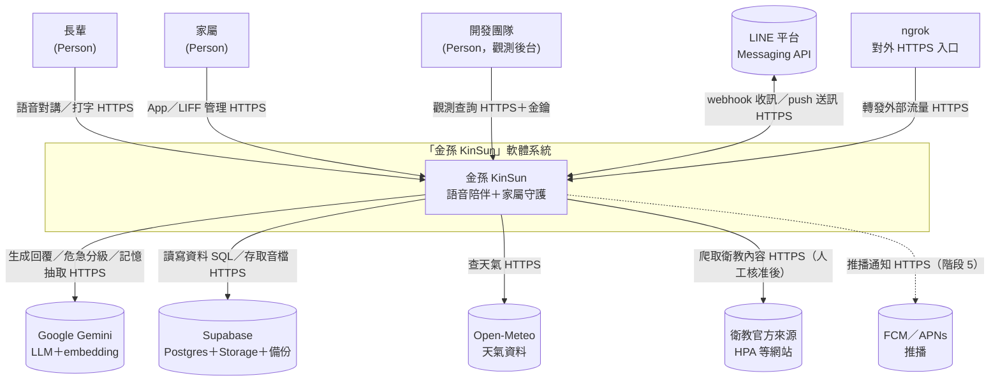

#### 1.1.3 Container（C4 第二層，Current）

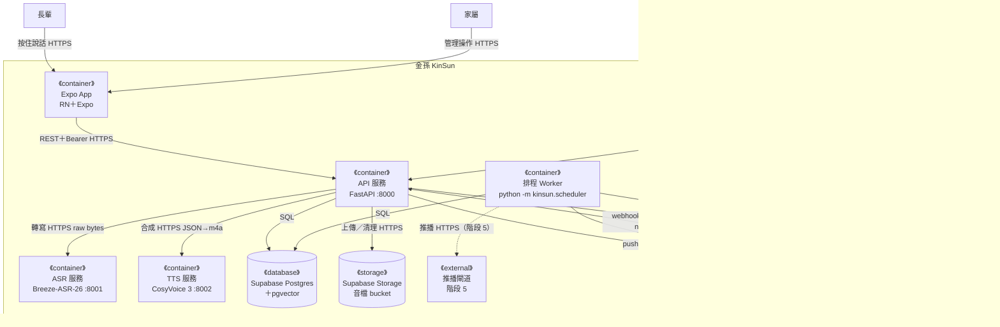

> API 服務同時託管 SPA 靜態檔（`app.py:150-155`），故 SPA 下載來源＝API 進程；圖中省略該靜態檔箭頭。

#### 1.1.4 Container（Target／Future State，必填）

全部里程碑完成後（App 出站 D-12、多 worker D-20、台語 TTS D-01、推播階段 5）：

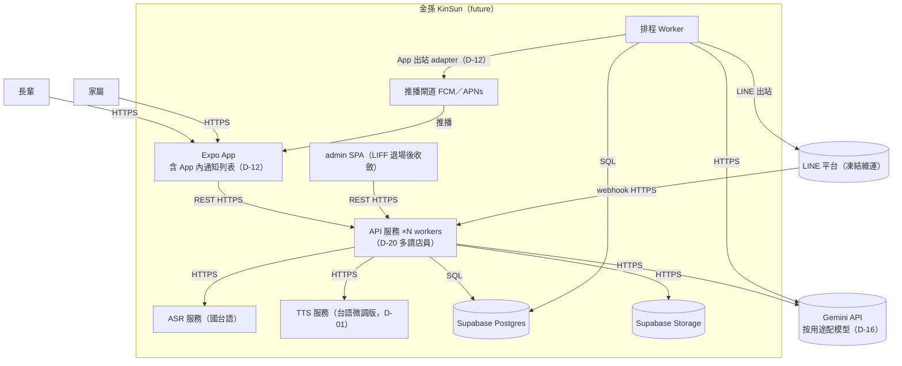

#### 1.1.5 Component（C4 第三層，zoom: API 服務）

箭頭語意＝呼叫方向（call）。分層依 §1.3。

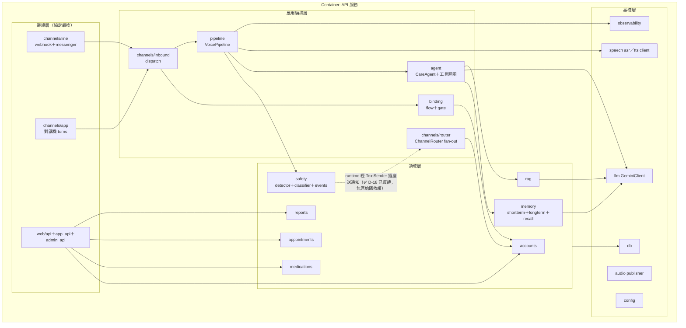

**Component 檢查註記**：
- 領域層不依賴邊緣層——✅ **已實證無例外**（2026-07-10 群 1 深潛驗證）：`safety/notifier.py:18` 定義 `TextSender` Protocol，safety 無任何 `channels` import；組裝處把 `ChannelRouter` 當 TextSender 注入（`composition.py:161`）。D-18 反轉已完成，上圖虛線僅表 runtime 呼叫方向。
- 領域 `jobs.py`（medications／appointments）依賴 channels＋scheduler：此為 AGENTS.md 已核定的「排程工廠放領域自己的 jobs.py」規範，屬刻意的編排縫（orchestration seam），不列違規。

#### 1.1.6 Component（zoom: 排程 Worker）

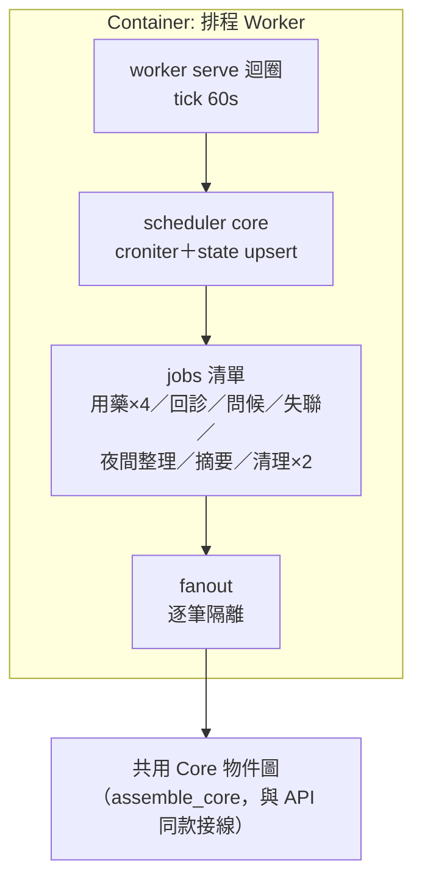

> Worker 與 API **各自** `build_externals`（各一個 DB 連線池），共享同一 Supabase。VoicePipeline 只在 API 建——主動關懷走 `agent.proactive` 純文字（✅ D-21 定案：先做文字就好，會-11）。

### 1.2 DDD 戰略設計

#### 通用語言（詞彙表）

單一定義來源為 `CONTEXT.md`；此處列架構文件會用到的核心詞：

| 術語 | 定義 |
| :--- | :--- |
| Elder／Guardian | 長輩／家屬業務實體，主鍵 `elder_id`／`guardian_id`（uuid） |
| ChannelBinding | 通道帳號（channel, external_id）→ 本人 的對映 |
| Consent | 知情同意紀錄（SELF 本人／PROXY 代理），撤回寫 `revoked_at` |
| InboundMessage | 通道中立的入站訊息（含回覆回呼） |
| RiskTier L0–L2 | 危急分級（一般／小訊號／明確警訊——✅ D-72 三級制，L2 通知家屬） |
| TurnContext | 一輪對話的記憶組裝結果（長期＋事實＋今日） |
| 對講機回合 | App 長輩端「按住說→自動播回覆」的一次往返 |

#### 限界上下文與 C4 Container 對應

| DDD 限界上下文 | 主要落在 Container | 備註 |
| :--- | :--- | :--- |
| 帳號與同意（accounts＋binding） | API | 閘門是其他上下文的上游 |
| 對話照護（pipeline＋agent＋memory＋tools） | API | 核心域 |
| 安全守護（safety） | API | 核心域（差異化承諾） |
| 提醒（medications＋appointments） | API（設定面）＋Worker（觸發面） | |
| 衛教知識（rag） | API＋獨立 CLI（ingest） | |
| 觀測（observability） | API＋Worker | 支撐域 |

#### Strategic Context Map

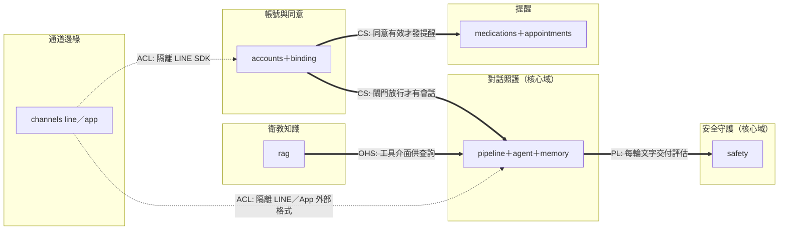

#### DDD 戰術設計（必填）

| DDD 元素 | 程式碼位置 | 說明 |
| :--- | :--- | :--- |
| Entity | `accounts/models.py`（Elder、Guardian）、`medications/models.py`、`appointments/models.py` | identity＝uuid 主鍵，Postgres 為權威 |
| Value Object | `safety/tiers.py`（RiskAssessment）、`memory/models.py`（TurnContext）、`channels/inbound.py`（InboundMessage） | 不可變 dataclass |
| Aggregate Root | Elder（含 bindings、consents、elder_guardians） | 一致性由 AccountService 維護（`service.py`） |
| Domain Service | `RiskDetector`、`CareAgent`、`SessionMemory`、`AccountService` | 跨實體邏輯 |
| Domain Event | `risk_events`、`reminder_logs`（append-only，`record` 動詞） | 業務事實，不可變 |
| Repository | Store 三件套：`<領域>Store` Protocol＋`Pg*`＋`Fake*`（AGENTS.md 規範） | 合約測試保證等價 |
| Anti-Corruption Layer | `channels/line`（隔離 LINE SDK）、`speech/*`（隔離 DGX 服務）、`GeminiClient`、`Mem0LongTermStore` | 外部 schema 變動不進領域 |
| Specification | **缺席**——業務規則散在各 Service 內 | 規模尚小，暫不引入；若規則爆炸再議 |

### 1.3 分層架構（Clean Architecture）

| 層 | 程式碼位置 | 職責 |
| :--- | :--- | :--- |
| Domain | `accounts`、`medications`、`appointments`、`safety`（core）、`memory`、`rag`、`reports` | 業務規則與領域模型 |
| Application | `pipeline`、`agent`、`channels/inbound`、`channels/router`、`binding`、各領域 `jobs.py`、`composition` | 用例編排與接線 |
| Infrastructure | `db`、`llm`、`speech`、`audio`、`transport`、`observability`、`channels/line`（SDK 面）、`web` | 外部互動實現 |

> 組裝採兩層：`Externals`（連線重件）＋`assemble_core`（純接線），API 與 Worker 兩個組裝根共用（`composition.py:49-168`）——重構時新增元件一律走 composition，禁止在 handler 內自行 new。

### 1.4 技術選型

| 分類 | 選用技術 | ADR |
| :--- | :--- | :--- |
| 後端框架 | Python＋FastAPI＋uv | [ADR-001](04_adr/ADR-001-後端框架FastAPI.md) |
| 資料庫／儲存 | Supabase Postgres＋pgvector＋Storage | [ADR-002](04_adr/ADR-002-資料庫Supabase-Postgres.md) |
| 長期記憶 | Mem0 v1.1（實際生效＝抽取＋去重＋語意檢索） | [ADR-003](04_adr/ADR-003-長期記憶Mem0.md)、[ADR-004](04_adr/ADR-004-知識圖譜移除與拆解.md) |
| LLM | Gemini flash-lite（開發期）→ 按用途配模型 | [ADR-005](04_adr/ADR-005-LLM模型策略.md)（D-16） |
| 排程 | 自建 Scheduler（croniter＋PG） | [ADR-006](04_adr/ADR-006-自建排程器.md) |
| 語音 | DGX 自架 Breeze-ASR-26／CosyVoice 3 | [ADR-007](04_adr/ADR-007-語音服務自架DGX.md)（D-01） |
| 前端 | React＋Vite（web）／Expo（App） | [ADR-008](04_adr/ADR-008-前端技術組合.md)（D-08） |
| 認證 | 家屬雙認證（App token＋LIFF idToken） | [ADR-009](04_adr/ADR-009-家屬雙認證並存.md) |
| 儲存庫 | monorepo | [ADR-010](04_adr/ADR-010-單一儲存庫佈局.md) |
| 身分層 | elder_id 主鍵＋channel_bindings | [ADR-011](04_adr/ADR-011-通道中立身分層.md) |
| 快取／訊息佇列／容器編排／CI-CD | **無**（刻意：規模不需要；CI 缺口見 §5.2） | — |

---

## 第 2 部分：需求摘要

### 功能性需求（對應 [02 PRD](02_專案簡報與PRD.md) 使用者故事）

- FR-1 語音對講回合（US-A1）；FR-2 文字同等對待（US-A2，✅ D-11 to-be）；FR-3 台語（US-A3，D-01）
- FR-4 危急偵測分級＋家屬通知（US-B1，✅ D-10 定案：全員齊發無冷卻；✅ D-72 三級制已落地）；FR-5 App 內警報／提醒（US-B2，✅ D-12 to-be）
- FR-6 主動關懷（US-B3）；FR-7 用藥／回診提醒（US-C1／C2）
- FR-8 家屬帳號與綁定（US-D1／D2；長輩帳密改版⚠ D-71）；FR-9 健康報告（US-D3，✅ D-09：加每日摘要）
- FR-10 衛教 RAG（US-E1，⏳ D-03）

### 非功能性需求

| 分類 | 需求描述 | 目標值 |
| :--- | :--- | :--- |
| 性能 | 語音往返延遲 P50／P95 | ⏸ 實測後定（D-05／會-10；提案原 3–4 秒） |
| 可擴展性 | API 多 worker 啟動 | ✅ D-20（重構工項） |
| 可用性 | 期末展示規模單機承載；DGX 單點風險見 §7.1 | 無正式 SLA（學生專案） |
| 安全性 | 正式環境強制 ConsentGate；同意文案明示資料去向與保留 | D-14／D-15；細項見 13 循環 |

---

## 第 3 部分：系統設計

### 3.1 架構模式

- **模式**: 模組化單體（API＋Worker 雙進程）＋自架模型服務（位置無關）
- **理由**: 7 人非本科團隊，單體最低運維負擔；重模型抽成網路服務滿足跨平台開發（AGENTS.md 環境紀律）

### 3.2 系統元件圖

見 §1.1（不重複貼）。

### 3.3 元件職責

| 元件 | 核心職責 | 依賴 |
| :--- | :--- | :--- |
| VoicePipeline | ASR→危急→回覆→TTS 四階段編排＋觀測埋點（`pipeline.py:47`） | speech、safety、agent、observability |
| CareAgent | 記憶組裝→LLM→工具迴圈（≤3 輪）→寫回（`agent.py:50`） | memory、llm、tools |
| ConsentGate | (channel, external_id)→已同意的 elder_id（`binding/gate.py:22`） | accounts |
| ChannelRouter | 本人→所有綁定通道 fan-out，單通道失敗隔離（`router.py:42`） | accounts、channel adapters |
| GuardianNotifier | 危急通知全家屬（`notifier.py:63`；✅ D-10 政策定案維持齊發；✅ D-18 反轉已完成） | accounts、TextSender 插座（組裝處注入 ChannelRouter） |
| Scheduler | croniter 到期判定＋錯過補跑一次＋狀態 upsert（`scheduler.py:35`） | scheduler_state |

> **「五階段」與「四步」是兩套計數，勿混用**：五階段＝trace 的切法（webhook／asr／llm／tts／reply 五表）；pipeline 實際四步（轉寫→危急偵測→生成→合成）。危急偵測無獨立 trace stage（其 LLM 呼叫也不計 token——差距 A-9）；App 鏈路無 webhook 筆，實為四筆（僅 LINE 五筆全）。詳見 §8.1。

### 3.4 關鍵使用者旅程（Dynamic Diagrams，必填）

#### 旅程 1：App 對講機語音回合

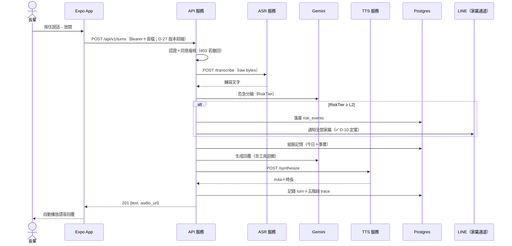

> 失敗分支：ASR 失敗→中止並回錯誤；TTS 失敗→退純文字；危急落庫失敗→仍照常通知（`pipeline.py:85-88`）；分級 LLM 失敗→RiskTier L0（⚠ fail-safe 方向 07 循環議）。

#### 旅程 2：排程用藥提醒

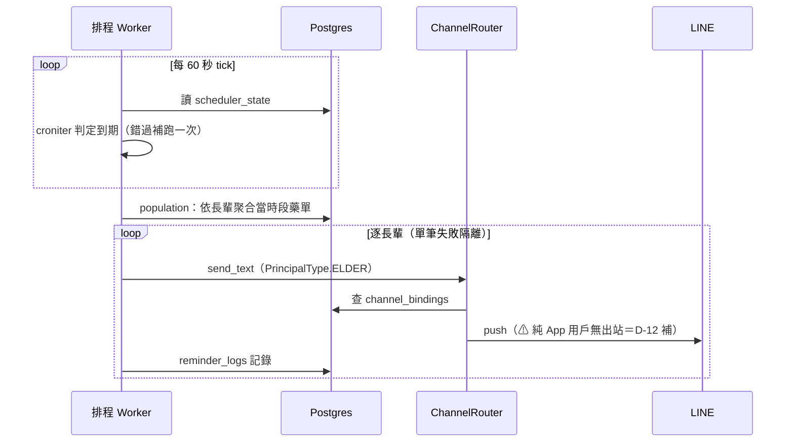

> ✅ D-30 定案（會-1）：出站提醒**不查長輩同意**——`has_valid_consent` 檢查（用藥／回診長輩端）已於己-1 移除（2026-07-10），圖即現況。精度註（群 3 深潛）：med job 於 `sent==0`（無綁定通道）時不送也不記；appt job 現況忽略送達數、無條件記錄（差距 A-34）。

#### 旅程 3：危急通知

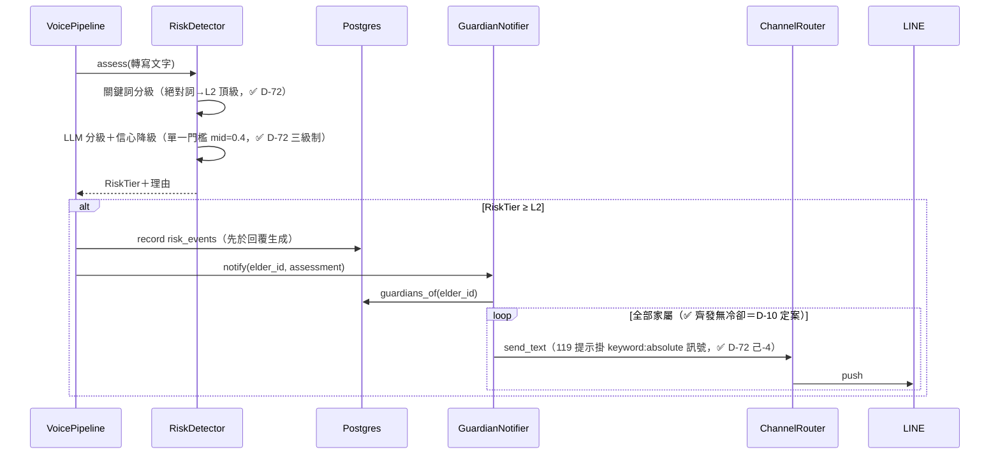

---

## 第 4 部分：資料架構

### 4.1 資料模型（核心 ER）

22 表全清單見 `db.py`；此處畫身分／照護核心，觀測五表（webhook_events、asr_calls、llm_calls、tts_calls、replies）與 RAG 五表（rag_sources／documents／chunks／crawl_jobs／ingestion_audit_logs）為獨立群組，文字帶過。

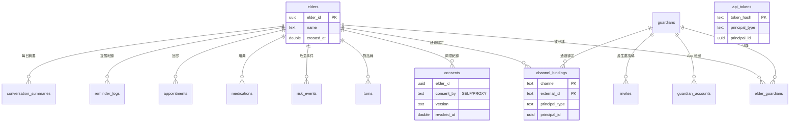

### 4.2 一致性策略

- **強一致**：單一 Postgres 內全部交易（帳號、同意、提醒、危急事件）。
- **最終一致**：Mem0 長期記憶——夜間批次 consolidation（`LONGTERM_CONSOLIDATION_HOUR`，預設 03:00）把前一天整天對話交 Mem0 內部 LLM 抽取成事實。「白天檢索到昨天以前」僅 03:00 後成立：00:00–03:00 有凌晨盲窗——昨日對話已離開「今日」邊界、尚未進長期（差距 A-21）；詳見 §8.2。
- **刻意不一致**：LINE 事件單筆失敗吞掉不重送（`webhook.py:53-56`）——寧漏一則、不重複危急通知。

### 4.3 資料分類與合規

| 資料 | 分類 | 保留 | 依據 |
| :--- | :--- | :--- | :--- |
| 對話原文（turns）、危急事件、摘要 | 健康敏感 PII | 永久保留、同意文案明示 | ✅ D-14；✅ D-13 定案不做撤回入口 |
| 音檔 | 健康敏感 PII | 2 天自動清理（`AUDIO_RETENTION_DAYS=2`，設 0＝不清理）；私有 bucket＋簽章連結 1 天過期 | ✅ D-55 完成 |
| 觀測五表（含轉寫原文） | 健康敏感 PII | 14 天自動清理 | admin 權限 → 13 循環 |
| 對外傳輸 | 對話送 Gemini、記憶存 Supabase | 同意文案明示 | ✅ D-15 |
| mem0 稽核（history.db） | 本機 SQLite | ✅ 已釘進 repo `data/mem0/history.db`（原「落點未管理」警示撤除，2026-07-10 群 2a 實證 `mem0_factory.py:61-64`） | ✅ D-65（丙-13） |

---

## 第 5 部分：部署與基礎設施

### 5.1 部署視圖

#### 5.1.1 當前環境（DGX Spark 單機）

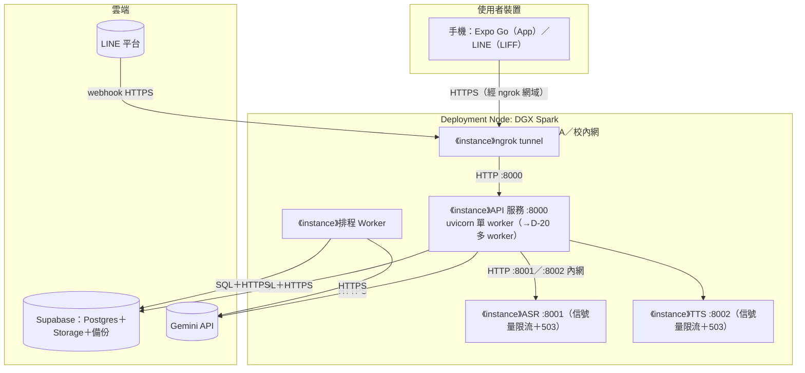

| 屬性 | 值 |
| :--- | :--- |
| 啟停 | `scripts/kinsun.sh`（setsid＋PID 檔＋logs/*.log） |
| 高可用 | 無（單機；demo 當天風險見 §7.1） |
| Backup | Supabase 託管（⚠ 方案未確認 → 14 循環） |
| 監控 | 無外部監控；observability 五表＋admin 後台（無告警 → 差距） |

#### 5.1.2 目標環境

同一 Node，API 改多 worker（D-20）；階段 5 增加 EAS build＋FCM/APNs。開發機（Windows/macOS）以 `ASR_BACKEND=mock`＋`TTS_BACKEND=bubble` 跑同一套程式（位置無關原則）。

#### 5.1.3 環境策略

| 環境 | Deployment | 用途 |
| :--- | :--- | :--- |
| Dev（各自筆電） | mock ASR／bubble TTS＋AllowAllGate（⚠ D-19 修語意後保留） | 日常開發 |
| DGX（demo／準正式） | 全真模型＋ConsentGate 強制 | 實測與 8/20 展示 |

### 5.2 CI/CD 流程（as-is：無 CI）

| 階段 | 現況 | to-be（餵 16_WBS） |
| :--- | :--- | :--- |
| Build/Test | 本機 `uv run pytest`（344 passed）＋`tsc`／`expo-doctor` 手動 | GitHub Actions：PR 必跑 pytest＋前端型檢 |
| Deploy | 手動 `scripts/kinsun.sh restart` | 維持手動（單機），寫成 Runbook（14 循環） |

### 5.3 成本估算

| 項目 | 月成本 | 備註 |
| :--- | :---: | :--- |
| Supabase／Gemini／Expo Go／ngrok | $0 | 全免費層（D-16：額度優先） |
| DGX Spark | $0 | 校內資源 |
| Apple Developer（階段 5） | $99／年 | D-08：推播啟動時才買 |

---

## 第 6 部分：跨領域考量

### 6.1 可觀測性

| 維度 | 工具 | 狀態 |
| :--- | :--- | :--- |
| 日誌 | logs/*.log（每服務一檔） | ✅ |
| 追蹤 | 自建五階段 trace（webhook→asr→llm→tts→reply，trace_id 貫穿）＋admin 後台 | ✅；token 欄位記 NULL（G-6） |
| 指標 | 無 SLI/SLO 匯出 | ❌ 差距：D-05 KPI 量測基建 |
| 告警 | 無（LLM 故障靜默→僅 log） | ❌ 差距：fail-safe 可見性 07 循環議 |

### 6.2 安全性

正式清單見 13 循環。本層級已定：ConsentGate 強制（正式）、token 雜湊存放、密碼 scrypt、admin 金鑰。已知待議：音檔公開 bucket、DGX 服務無認證、token 無效期、admin 可讀全文。

---

## 第 7 部分：風險與演進

### 7.1 風險登記

| 風險 | 可能性 | 影響 | 緩解策略 |
| :--- | :--- | :--- | :--- |
| 8/20 demo 當天 DGX／ngrok 斷線 | 中 | Demo 失敗 | 14 循環定 Runbook＋備援（mock 退路、預錄影片） |
| Gemini 免費額度耗盡 | 中 | 對話／分級停擺 | D-16 額度監控；分級失效期僅剩 11 詞兜底（07 議） |
| 台語 TTS 微調不達標 | 中 | 差異化賣點缺角 | D-01 兩模型對比；發表敘事保留國語退路 |
| LINE 憑證／webhook 失效 | 低 | 凍結通道斷線 | App 為主線（D-08），LINE 僅維運 |
| 8/20 前重構範圍過大 | 中 | 文件與程式雙未完 | D-04 範圍倒排；16_WBS 排優先序 |

### 7.2 演進路線

| Phase | 範圍與目標 |
| :--- | :--- |
| Phase 1（→8/20） | 一次性重構（16_WBS）：P0 缺口（D-11 文字管線、D-12 App 出站）＋分層修正（D-18、D-19）＋多 worker（D-20）＋KPI 量測基建＋會議決議回填項 |
| Phase 2（發表後） | 台語 TTS 上線（D-01）、推播（階段 5）、模型分流（D-16）、重試策略（D-22） |
| Phase 3 | 視就業媒合／延續狀況：真圖譜（D-17 觸發條件）、水平擴充、穿戴（已砍 D-02，除非翻案） |

---

## 第 8 部分：模組詳細設計

> 逐群深潛回填中（設計依據：[2026-07-10-架構文檔深化-design.md](../superpowers/specs/2026-07-10-架構文檔深化-design.md)）。測試規格見 07_模組規格與測試。NFR 實現總摘要：性能＝DGX 限流＋503 過載保護；安全＝閘門＋token 雜湊；可擴展＝D-20 多 worker＋composition 統一接線。

### 8.1 語音對話鏈路（channels／pipeline／agent／llm／tools／speech／audio／transport＋DGX services）

**職責**：把「長輩一句話」變成「金孫一句有聲回覆」的完整鏈路；兩通道（App 對講機、LINE 語音訊息）在邊緣各自正規化，之後全程共用。

**元件與分工**

| 元件 | 職責 | 關鍵型別 |
| :--- | :--- | :--- |
| channels 邊緣 | 通道 adapter：App＝`create_app_turns_router`（`_TurnCollector` 同步收集回覆）、LINE＝`LineChannel`（reply_token 兩段式）；匯合點＝`inbound.dispatch`（`inbound.py:90`） | `InboundMessage`（frozen，含 reply／reply_voice handle） |
| pipeline | `VoicePipeline` 四步：轉寫→危急偵測（**先落庫＋通知再生成**，避免 agent 例外吞掉危急）→生成→合成 | `TtsResult` |
| agent＋llm | `CareAgent` 編排（工具迴圈上限 3）；`GeminiClient` 封 Gemini 協定細節——thought_signature 走 parts 萃取、回帶原簽章（`llm.py:115-136`），agent 對簽章透明 | `LLMClient`、`ToolCall`／`ToolResult` |
| tools | `ToolRegistry`（register／specs／dispatch 永不拋）；組裝處註冊 3 工具：get_weather、get_current_time、health_education_rag（`composition.py:97-105`） | `ToolSpec` |
| speech／audio／transport | `Dgx{Asr,Tts}Client` 經 `Transport` Protocol 呼叫 DGX（可注入假傳輸，不 monkeypatch）；`SupabaseAudioPublisher` 託管音檔（上傳＋簽章 URL 兩趟往返） | `ASRClient`、`TTSClient`、`AudioPublisher`、`Transport` |
| services（DGX） | `POST /transcribe`（bytes→`{"text"}`）、`POST /synthesize`（`{"text"}`→m4a＋`X-Duration-Ms`）；併發閘滿回 503 | — |

**關鍵流程（App 語音回合 `POST /api/v1/turns`）**：token 驗證→同意複核（403 守門，`turns.py:92`）→進站音檔託管→`InboundMessage(APP)`→`dispatch`（閘門二次解析取 elder_id）→`VoicePipeline.process`→回覆音檔簽章 URL→`record_reply`（round_trip_ms）。共 8 個分岔：403 同意撤回／415 非音檔／413 超大／未綁定提示／危急 L2＋落庫並通知家屬／TTS 失敗退純文字／管線失敗 FALLBACK_PROMPT／音檔上傳失敗退純文字。

**觀測**：五階段＝trace 切法（五表），pipeline＝四步；危急偵測在 trace 隱形（LLM 呼叫不計 token——差距 A-9）；App 鏈路無 webhook 筆（僅 LINE 有）。三個 trace span 共用 `_span` seam（`pipeline.py:103-123`）：觀測失敗不影響對話、`traces=None` 全 no-op。

**錯誤路徑（長輩聽到什麼）**

| 失敗點 | 使用者得到 | 有聲音？ |
| :--- | :--- | :---: |
| ASR／LLM 失敗 | `FALLBACK_PROMPT`「金孫剛剛沒聽清楚…」（`inbound.py:20`） | ❌ 純文字（差距 A-10） |
| agent 空回應／工具迴圈耗盡 | `FALLBACK_REPLY`（`agent.py:29`，走正常 TTS） | ✅ |
| TTS 失敗 | 真實回覆文字、audio=None（`pipeline.py:185-187`） | ❌ 有字無聲 |
| 工具失敗 | registry 回錯誤字串，模型併入回覆（`registry.py:29-33`） | ✅ |
| 危急落庫失敗／分級器故障 | 對話照常（warning／fail-safe L1 留痕不通知） | — |

**NFR 實現**：性能＝DGX 併發閘（503）＋各 client 獨立逾時（ASR 15s／TTS 30s／上傳獨立）；安全＝Bearer token＋同意複核雙重守門、`X-Api-Key` 內網金鑰（未設＝開發模式）；可觀測＝trace_id 貫穿＋token 用量 contextvars 收集（僅 agent 呼叫，`llm.py:24-48`）。

**跨群介面**：→群 2 記憶（`SessionMemory.assemble`／`record_turn`）；→群 2b 知識（health_rag 工具包 `HealthEducationRagService`）；→群 4 安全（`RiskDetector.assess`；`GuardianNotifier` 經 `TextSender` 插座，✅ D-18）；→群 5 帳號（`ConsentGate.resolve_elder`、`authenticate_token`）；→群 6 底座（`TraceStore` 五表、`web.envelope.ok()`、composition 接線）。

### 8.2 記憶（memory：shortterm／longterm／recall＋models）

**職責**：讓金孫「記得長輩」——今日對話逐輪保存（短期）、跨日穩定事實（長期，Mem0）、用藥回診權威事實（事實層），三層由 `SessionMemory` 門面一手組裝進每輪 prompt。

**三層讀寫時序**

| 時間線 | 讀 | 寫 |
| :--- | :--- | :--- |
| ☀ 白天每輪 | `recent()` 今日 turns＋`search()` 長期（user query＋HEALTH_QUERY 雙查詢→去重→新到舊）＋`FactProvider.facts()`（只吃 elder_id，**每輪必帶的保證來源**） | `record_turn` 寫 user＋assistant 進 `turns`（**不寫長期**） |
| 🌙 夜間 03:00 | `previous_day()` 前一天整天（台北日界，半開區間） | `long_term.add(provenance=SELF_CLAIMED)` → Mem0 LLM 抽取→`kinsun_memories` 向量 |

**元件與分工**

| 元件 | 職責 | 關鍵設計 |
| :--- | :--- | :--- |
| `SessionMemory`（recall.py） | 三層門面：`assemble(elder_id, query)→TurnContext`、`record_turn` | 事實層 query 無關（保證每輪帶）；單一 FactProvider 失敗略過不中斷（`recall.py:52-56`） |
| `MemoryStore` 三件套（shortterm.py） | 今日對話五法：append／recent／previous_day／sessions／last_active | tz-aware 台北午夜日界；DB 例外轉譯 `MemoryError`（改名待辦 A-15） |
| `Mem0LongTermStore`（longterm/store.py） | Mem0 ACL：add／search 兩法 | 檢索失敗退化空清單不中斷對話（`store.py:62-64`）；rerank=True＋explain（✅ D-40）；「三路實為一路」——BM25／graph 失效，僅語意向量生效（ADR-003） |
| `mem0_factory` | Settings→Mem0 config | 維度硬鎖 768（Supabase 預設 1536 會不符）；遙測預設關（隱私）；history.db 釘 `data/mem0/`（✅ D-65）；抽取紀律 prompt（自述不當診斷） |
| `consolidation` | 夜間批次：previous_day→add | fanout 逐長輩隔離；**無冪等標記（A-19）、停機多日會漏天（A-18 HIGH）** |
| `provenance` | 出處三值＋中文標籤＋抽取紀律 | 實際僅 self_claimed 流動（另兩值為未來留位，A-22） |
| `models.py` | 型別＋唯一排版函式 `format_injected_context` | 排版集中一處、只依賴 llm.Message 斷循環；「新覆舊」recency 前言＋（出處·日期）註記（2026-07-04 recency 設計，讀取端消解） |

**一致性策略（精確版）**：長期記憶為最終一致，一致窗＝24h（03:00 批次，`LONGTERM_CONSOLIDATION_HOUR` 可配置）；00:00–03:00 存在凌晨盲窗——昨日對話已離開「今日」邊界、尚未進長期（A-21）。

**NFR 實現**：可靠性＝記憶壞掉不中斷對話（search 失敗空清單、facts 失敗略過）；隱私＝Mem0 遙測預設關、抽取紀律 prompt 禁擅自診斷；可測性＝短期合約測試（Fake vs Pg）＋mem0 2.0.10 契約守門測試＋golden 排版測試（8 源檔測試一對一）。

**跨群介面**：←群 1（`CareAgent` 消費 assemble／record_turn）；←群 3（MedicationFacts／AppointmentFacts 為事實提供者，資料源在領域 store）；←群 4（scheduler worker 觸發 consolidation、`sessions()` 為 fanout 母體、`last_active()` 供失聯關懷）；→群 6（db.py `turns` 表、config `LONGTERM_*`／`MEMORY_MAX_TURNS` 設定鍵）。

### 8.3 知識檢索（RAG：rag/ 17 模組＋tools/health_rag）

**職責**：衛教知識的「離線入庫」與「線上查答」雙管線；全後端最大模組（約 2,400 行）。無 REST 端點——線上僅以 agent 工具 `health_education_rag` 暴露，離線為獨立 CLI `python -m kinsun.rag.ingest`。

**雙管線分工**（唯一交會表＝`rag_chunks`，768 維 pgvector）

| 面向 | 離線 ingest | 線上查詢 |
| :--- | :--- | :--- |
| 入口 | ingest CLI（✅ D-70：`RAG_CRAWLER_*`／`RAG_EMBEDDING_*` 直讀不經 config；自行組裝不走 composition） | `HealthEducationRagService.answer` ← health_rag 工具 ← agent 工具迴圈 |
| store 面 | upsert_source／upsert_document／add／log_ingestion | search（餘弦）／keyword_search（ILIKE） |
| embedding | `embed_document`（RETRIEVAL_DOCUMENT，帶 5 次退避重試） | `embed_query`（QUESTION_ANSWERING，**無重試**——A-29） |

**三道核准防線＋已知缺口**：①`SourceRegistry` 人工核准清冊（來源帶 approved_for_rag／copyright／trust）→②`SourceValidator` 入庫前把關（查核准／狀態／可信度／allowlist，**不查 copyright_status——A-26 HIGH**；seed 路徑整個略過 validator——A-30）→③檢索端 `_is_allowed_chunk` 再過濾。稽核：`rag_ingestion_audit_logs` 逐文件成敗留痕。

**檢索品質鏈**：`normalize_query`（同義詞展開，如「三高」→高血壓 高血糖 高血脂）→向量＋關鍵字**聯集**（各 top_k×3）→approved 過濾→`rerank`（**非 LLM**：score×trust×source_type×method×freshness 確定性加權、chunk_id 去重取高分）→`AnswerPolicy` 五分支（risk→URGENT 跳過檢索／醫療動作詞→拒答／無 evidence→拒答不編造／無 citation→拒答／NORMAL 抽取式）→NORMAL 才 LLM grounded 改寫（失敗回退抽取式答案）。**拒答優先於生成**：確定性程式碼管安全，LLM 只管潤稿。

**「衛教不當醫囑」四層防線與一個斷點**：AnswerPolicy 確定性閘門＋grounding prompt＋agent system prompt＋approved 過濾；**斷點＝`should_escalate_to_risk_engine` 為 advisory 旗標**——唯一消費者是 agent prompt 文字，無確定性程式碼觸發 RiskDetector（A-27 HIGH）。緩解：pipeline 的真風險引擎在 agent 之前對逐字稿獨立評估（§8.1），急症仍會被 safety 抓到。

**與記憶向量庫的關係**：同 pgvector 擴充、同 `gemini-embedding-001`＠768 維；`rag_chunks`（全域衛教語料）與 `kinsun_memories`（每長輩事實）不同表、互不干擾。設定鍵不統一：線上借用 `LONGTERM_EMBEDDING_MODEL`、離線用 `EMBEDDING_MODEL`（A-28）。

**NFR 實現**：合規＝來源治理清冊＋逐文件稽核（缺口見 A-26／A-30）；安全＝確定性拒答閘門優先於 LLM；成本＝ingest 端 429 退避＋延遲節流（`RAG_EMBEDDING_DELAY_SECONDS` 等）；可測性＝tests/rag/ 覆蓋 13 檔（keyword_index／ingest CLI 無測）。

**跨群介面**：←群 1（`ToolRegistry` 註冊 `HEALTH_RAG_SPEC`，工具失敗不中斷對話）；←群 4（安全升級目前僅 advisory——A-27）；→群 6（db 五表 `rag_*`、`RAG_TOP_K` 經 config；D-70 鍵除外）。

### 8.4 健康領域（medications／appointments／reports＋三 routers）

**職責**：用藥與回診的「家屬設定→長輩提醒→紀錄回報」閉環，加上家屬端三種報告視圖。全庫腳手架紀律最一致的區塊，**可作新領域樣板**。

**雙生領域同構表**（六檔全配，符合 08 §4 腳手架）

| 面向 | medications | appointments |
| :--- | :--- | :--- |
| models | 富模型：Slot 四時段列舉＋slots_label | 貧模型：date（ISO 字串）＋label 自由文字 |
| store 三件套 | ＋list_for_slot（時段查詢） | ＋list_for_date（日期查詢） |
| service | CRUD（save 生 id／update／remove） | ＋upcoming（未過期過濾） |
| facts | 無時鐘 | 需 clock 判 today |
| jobs | 4 個 daily cron（8／12／18／21 可配置），**只推長輩** | 單一 job 今明兩窗，**長輩＋全家屬雙推播** |
| flow（LINE 選單） | 凍結維運碼（D-08，與 REST 功能重複，A-38） | 同左 |

**提醒管線時間語意**：cron 一律 `分 時 * * *`（每日單點）；用藥依 slot 全域撈藥→按長輩聚合合併多藥名；回診以日期字串相等判定今明兩窗（每筆回診提醒兩次：前一天＋當天）；全鏈 tz-aware（台北）；**停機跨時段只補跑一次、不補發**（防洗版取捨，與 A-18 同源，A-38 明記）。出站一律不查同意（✅ D-30 己-1，全庫實證 consent 檢查只剩入站閘門與帳號層）。紀錄走 `safe_record` 進 reminder_logs（失敗不影響推播）；⚠ med `sent==0` 不記、appt 無條件記（A-34）。

**reports 三檔分工**

| 檔 | 角色 | API 落點 |
| :--- | :--- | :--- |
| health.py | 純聚合函式（近 30 天危急＋提醒；handler 只驗身分） | `GET /elders/{elder_id}/health-report`（聚合端點單數） |
| reminders.py | append-only 三件套＋safe_record | 併入 health-report |
| summaries.py | 每日摘要三件套＋summarize_day（夜間批次，L1 小訊號注入 D-10 己-5） | `GET /elders/{elder_id}/daily-summaries`（✅ 己-3；limit 1–90 預設 30） |

注意：健康報告**不含**摘要——「危急＋提醒」兩軸與「每日摘要」是兩條獨立資源、同 router 不同聚合。

**認證與守門**：三 routers 全走家屬雙認證（App token 先查、miss 走 LIFF idToken）＋`GuardianScope.assert_manages` 逐長輩守門，非管理範圍回 404（不洩漏存在性）。

**NFR 實現**：正確性＝四組合約測試（medications／appointments／reminders／summaries 皆 Fake＋Pg 參數化）；可靠性＝fanout 逐筆隔離＋safe_record fail-open；一致性＝跨層動詞分工全合規（HTTP create／delete→Service remove→Store save=upsert、record=append-only）。

**跨群介面**：→群 2a（MedicationFacts／AppointmentFacts 實作 FactProvider 注入 SessionMemory）；→群 4（jobs 由 scheduler worker 裝配、經 ChannelRouter 推播、health 報告讀 RiskEventStore）；→群 5（deps.py 家屬認證＋GuardianScope；flow 用 BindingSession）；→群 6（db 四表、config `MEDICATION_*_HOUR`／`APPOINTMENT_REMINDER_HOUR`、信封 ok()）。

---

## 差距與重構項（本文件貢獻給 16_WBS）

| # | 差距 | 依據 |
| :--- | :--- | :--- |
| A-1 | ~~GuardianNotifier 以 Protocol 反轉，解除 safety→channels 依賴~~ ✅ **已完成**（`TextSender`，notifier.py:18；2026-07-10 群 1 深潛實證） | ✅ D-18 |
| A-2 | AllowAllGate 統一解析 elder_id（會話鍵語意一致） | ✅ D-19 |
| A-3 | API 多 worker 啟動＋驗證無單進程假設＋連線池總量評估 | ✅ D-20 |
| A-4 | App 出站 adapter＋App 內通知列表 | ✅ D-12（=PRD G-1） |
| A-5 | config 按用途配模型 | ✅ D-16 |
| A-6 | CI（PR 必跑測試） | §5.2 |
| A-7 | KPI 量測基建（token／延遲） | ⏳ D-05（=PRD G-6） |
| A-8 | **（HIGH）** 觀測五表欄位 `line_user_id` 承載所有通道的 external_id，違反 AGENTS.md「line_user_id 永不混用」鐵律；建議正名 `external_id`＋`channel`（`pipeline.py:53`、`observability/store.py:160/246`） | 群 1 深潛 2026-07-10 |
| A-9 | 危急分級 LLM 呼叫不計 token、無 trace row——成本系統性低估＋安全模型延遲不可觀測（`pipeline.py:81` 在 `collect_llm_usage` 範圍外） | 群 1 深潛 2026-07-10 |
| A-10 | pipeline 級 fallback 與 TTS 降級皆純文字不合成語音——語音優先長輩「有字無聲」（`inbound.py:161`、`pipeline.py:185`） | 群 1 深潛 2026-07-10 |
| A-11 | App 回合 `gate.resolve_elder` 重複解析兩次、各打一趟 DB（`turns.py:92`＋`inbound.py:131`） | 群 1 深潛 2026-07-10 |
| A-12 | ~~tools/health_rag.py 無專屬測試~~ **事實修正（群 2b）**：handler 測試已存在（`tests/rag/test_service_and_tool.py`）；真正缺口＝升級旗標無確定性接線，併入 A-27 | 群 1 登記、群 2b 修正 |
| A-13 | `services/asr`、`services/tts` 服務端零測試（請求驗證／金鑰／併發閘皆純邏輯可離線測） | 群 1 深潛 2026-07-10 |
| A-14 | 工具迴圈末輪 off-by-one：第 `max_tool_iters` 輪的工具結果永不回傳模型即回 fallback（`agent.py:61-74`） | 群 1 深潛 2026-07-10 |
| A-15 | 自訂 `MemoryError` 遮蔽 Python 內建同名例外，建議改名 `MemoryStoreError`（`memory/shortterm.py:13`） | 群 1 深潛 2026-07-10 |
| A-16 | 小項三件：`text_input_enabled` 預設值兩處相反（`inbound.py:98`＝True、`line/webhook.py:38`＝False）；`VoiceReplyDelivery` docstring 仍寫「LINE 回覆」；FALLBACK_PROMPT／FALLBACK_REPLY 近義字串分散兩層 | 群 1 深潛 2026-07-10 |
| A-17 | 文檔／清理：CONTEXT.md:60 turns 路徑過時（/api/app/turns→/api/v1/turns）；tests/__pycache__ 殘留改名前 .pyc（test_asr／test_tts） | 群 1 深潛 2026-07-10 |
| A-18 | **（HIGH）** worker 跨多日停機→中間天數 turns 永不進長期記憶（排程「補跑一次」×consolidation 只吃 previous_day，無 backfill）；修法建議：consolidation 改吃「上次整理→now」日範圍（`scheduler.py:57-62`＋`consolidation.py:23`） | 群 2a 深潛 2026-07-10 |
| A-19 | consolidation 非冪等：無（elder_id, 日）已整理標記，同日重跑會重覆 `mem0.add`（僅靠 Mem0 md5 去重緩解，擋不住語意等價重覆）（`consolidation.py:22-27`） | 群 2a 深潛 2026-07-10 |
| A-20 | ADR-003 兩處過時（登記不直接改 ADR）：:21 稱 reranker 未啟用——實際 `rerank=True`＋`LONGTERM_RERANK_ENABLED` 預設 true（`store.py:59-61`）；:26 provenance 描述不完整（inferred 也無寫入路徑） | 群 2a 深潛 2026-07-10 |
| A-21 | 00:00–03:00 凌晨盲窗：昨日對話已離開「今日」邊界、尚未進長期——長輩夜間發話時金孫暫時「忘記昨天」（`shortterm.py:52`＋03:00 批次） | 群 2a 深潛 2026-07-10 |
| A-22 | 小項三件：provenance 三值僅 self_claimed 流動（另兩值死值）；`health_top_k=3` 硬寫死未接 settings（`store.py:44`）；`LongTermStore.search` 與實作簽章預設值漂移（5 vs None） | 群 2a 深潛 2026-07-10 |
| A-23 | 短期三件套住 `shortterm.py` 而非 `store.py`（與 `longterm/store.py` 不對稱，D-42 語意例外灰帶——待載明或改名） | 群 2a 深潛 2026-07-10 |
| A-24 | `FakeLongTermStore` 在 tests/fakes.py、LongTermStore 無合約測試（ACL 非三件套的刻意例外，文檔未載明）；測試替身沿用 `line_user_id` 參數名（語彙污染，`test_memory_recall.py:18`） | 群 2a 深潛 2026-07-10 |
| A-25 | 清理三件：`turns.line_user_id` 相容欄位已無寫入者（待收縮）；memory／tests `__pycache__` 殘留改名前 .pyc；recency 設計文件「全在 store.py」描述已過時（實作已重構進 models.py） | 群 2a 深潛 2026-07-10 |
| A-26 | **（HIGH·合規）** SourceValidator 不查 `copyright_status`；`ntuh_epaper`／`cgmh` 為 DISALLOWED（notes 明寫「未取得再利用授權前不可 ingestion」「未經授權禁止轉載」）卻 `approved_for_rag=True`→在預設 ingest 名單內，爬取即入庫。修法：validator 補查 copyright 或撤兩來源核准（`source_validator.py:18-35`、`source_registry.py:305-330`） | 群 2b 深潛 2026-07-10 |
| A-27 | **（HIGH）** `should_escalate_to_risk_engine` 為死旗標：唯一消費者是 agent prompt 文字（`agent.py:18`），無確定性程式碼觸發 RiskDetector；`has_risk_signal` 由 LLM 自報未接上游 RiskAssessment。緩解：pipeline 真風險引擎在 agent 之前跑。修法：接線或明文降級為 advisory | 群 2b 深潛 2026-07-10 |
| A-28 | 雙 embedding 鍵不一致（線上 `LONGTERM_EMBEDDING_MODEL` vs 離線 `EMBEDDING_MODEL`）——只改其一→查詢與文件向量空間錯配；且 `EMBEDDING_MODEL` 未列 .env.example（違反 AGENTS.md 鐵律）（`composition.py:142` vs `ingest.py:32`） | 群 2b 深潛 2026-07-10 |
| A-29 | 檢索端無優雅降級：`embed_query` 失敗直接拋（keyword 路可獨立卻不退化）、線上 embedder 無重試（ingest 端 5 次）——與 Mem0 檢索 fail-open 哲學不一致（`retriever.py:41-49`） | 群 2b 深潛 2026-07-10 |
| A-30 | seed ingest 路徑完全略過 SourceValidator（`--source` 指定未核准來源時 seed 內容直接入庫，僅查詢端兜底）（`ingest.py:63-77`） | 群 2b 深潛 2026-07-10 |
| A-31 | 死碼死表三件：`InMemoryVectorStore` 零引用；`rag_crawl_jobs` 表無寫入者；`document_loader.py` 生產未接線（`vector_store.py:40`、`db.py:113`） | 群 2b 深潛 2026-07-10 |
| A-32 | RAG 持久層偏離三件套（無 Fake／無合約測試；`add`／`upsert_*` 命名 vs「寫入用 save」慣例）——例外未載明（`vector_store.py`、`ingestion.py:40`） | 群 2b 深潛 2026-07-10 |
| A-33 | 小項四件：`ingestion.py:143` 冗餘 except 吞全部例外；citation 對位鬆散（抽取取 evidence[:2] 但 citation 全列）；稽核缺 document_id／url 難定位；07 文檔「rag 8 檔」過期（實際 17 模組） | 群 2b 深潛 2026-07-10 |
| A-34 | 提醒紀錄語意不一致：med `sent==0` 不記、appt 忽略送達數無條件記→家屬健康報告可能顯示長輩實際沒收到的回診提醒；建議 appt 對齊 med 守門（`medications/jobs.py:47` vs `appointments/jobs.py:43-55`） | 群 3 深潛 2026-07-10 |
| A-35 | 回診時間粒度不足：`Appointment.date` 只有日期、實際時刻藏在 label 自由文字無法機器解析，無法做「前 N 小時」精準提醒（`appointments/models.py:12`） | 群 3 深潛 2026-07-10 |
| A-36 | API 人因小缺：health-report `window_days=30` 硬編不可調（同 router 的 daily-summaries 卻開放 limit）；reminder kind 為自由字串無集中列舉（拼字漂移風險）（`web/routers/reports.py:36`） | 群 3 深潛 2026-07-10 |
| A-37 | schema 可維護性：conversation_summaries 鍵定義分散——基礎 DDL 無鍵、唯一索引在遷移段（ensure_schema 單一入口已涵蓋，**非現行 bug**）；`line_user_id` 死欄位待收縮（`db.py:156/221`） | 群 3 深潛 2026-07-10 |
| A-38 | 文檔登記＋雜項：08 §4「service.py 建構子注入 store＋clock」與現實不符（實為 store＋new_id，clock 在 facts／flow——登記不改 08）；med slots LIKE 粗篩擴展隱憂；「停機補跨一次不補發」語意建議文檔明記；flow 與 REST 功能重複（凍結期維護負擔）；appointments `__init__`／models 測試小不對稱 | 群 3 深潛 2026-07-10 |

## 變更紀錄

| 版本 | 日期 | 變更 |
| :--- | :--- | :--- |
| v1.0 | 2026-07-08 | 初版（as-is 實證＋to-be 標記；D-18～D-22 拍板紀錄） |
| v1.1 | 2026-07-10 | 群 1 深潛回填：新增 §8.1 語音對話鏈路；D-18 過時描述更正（§1.1.5 圖與註記、§3.3、差距 A-1 標完成）；§3.3 補五階段 vs 四步說明；§3.4 門檻與 turns 路徑更正；§4.3 音檔保留補充；差距新增 A-8～A-17 |
| v1.2 | 2026-07-10 | 群 2a 深潛回填：新增 §8.2 記憶；§4.2 一致性精確化（凌晨盲窗＋可配置時間）；§4.3 撤 mem0 history.db 過時警示（✅ D-65）；差距新增 A-18～A-25（A-18 HIGH 停機漏天整理） |
| v1.3 | 2026-07-10 | 群 2b 深潛回填：新增 §8.3 知識檢索（RAG）；A-12 事實修正；差距新增 A-26～A-33（A-26 HIGH 著作權合規缺口、A-27 HIGH 升級旗標未接線） |
| v1.4 | 2026-07-10 | 群 3 深潛回填：新增 §8.4 健康領域（雙生領域樣板）；§3.4 旅程 2 精度註；差距新增 A-34～A-38（無 HIGH） |

## 附錄：跨文件一致性檢查

- 新增 Container／module／外部系統／protocol 時，同步 06／07／08／09／10／13／14（模板規則）。
- 鐵律：**05 是架構契約**——模組在 05 沒出現＝不存在；發現其他文件有、05 沒有 → 修 05。
