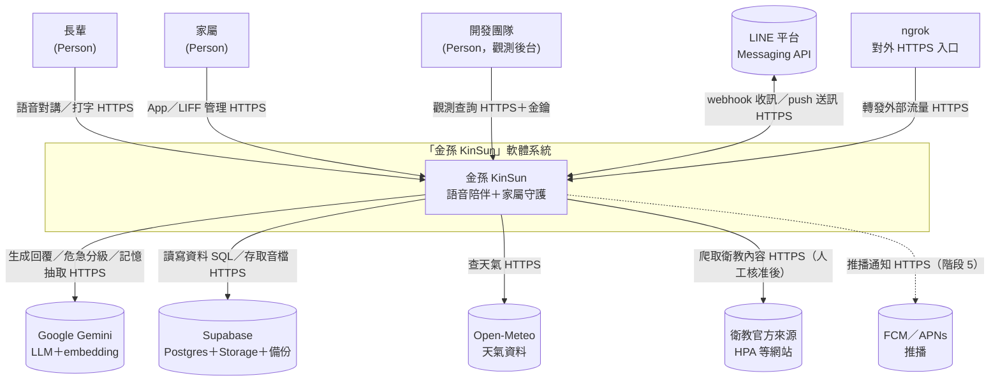
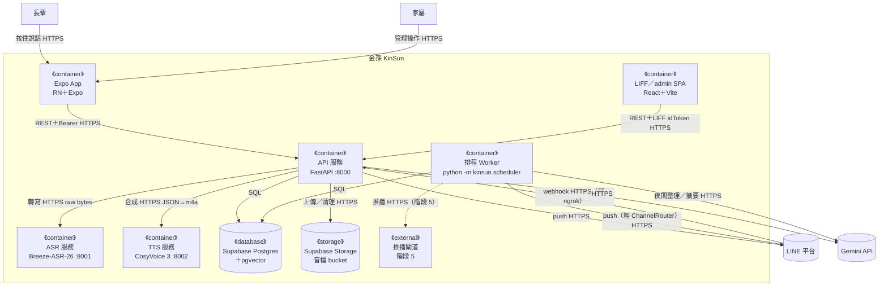
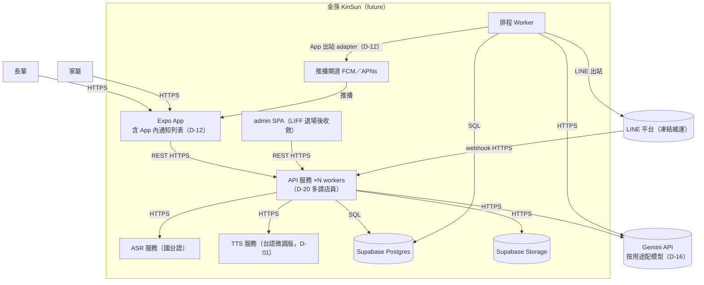
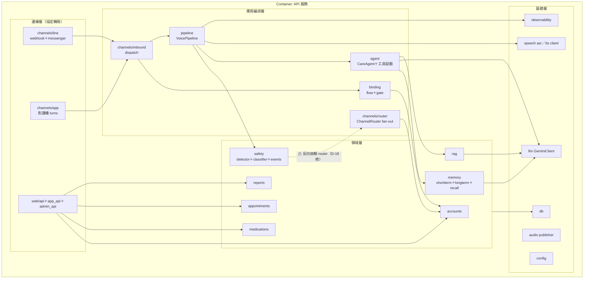
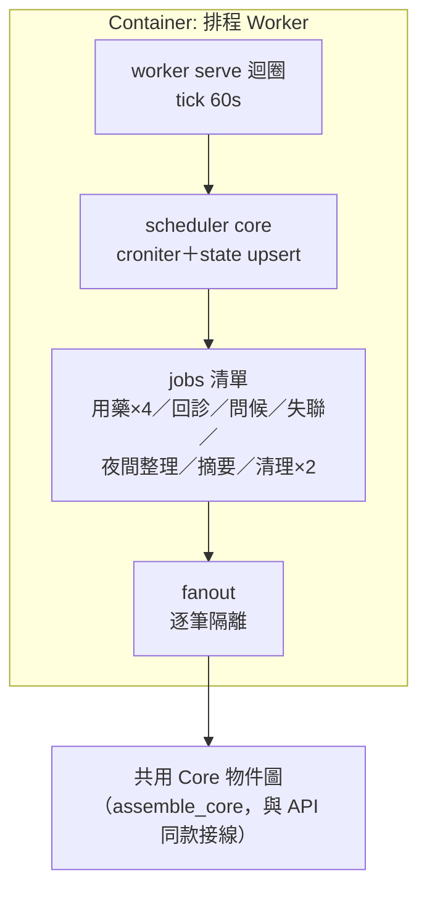
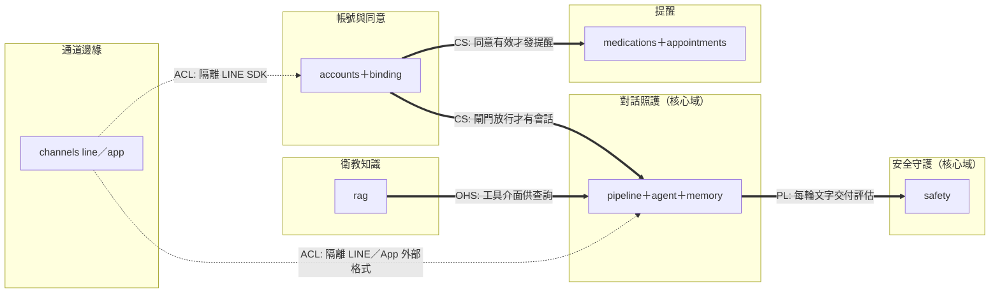
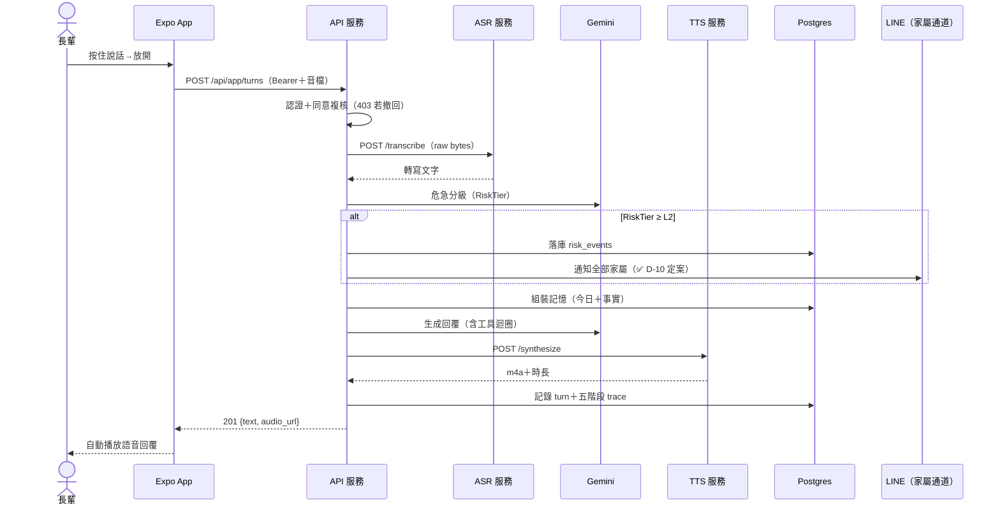
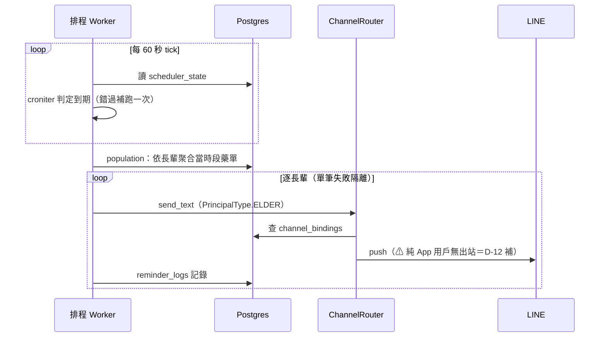
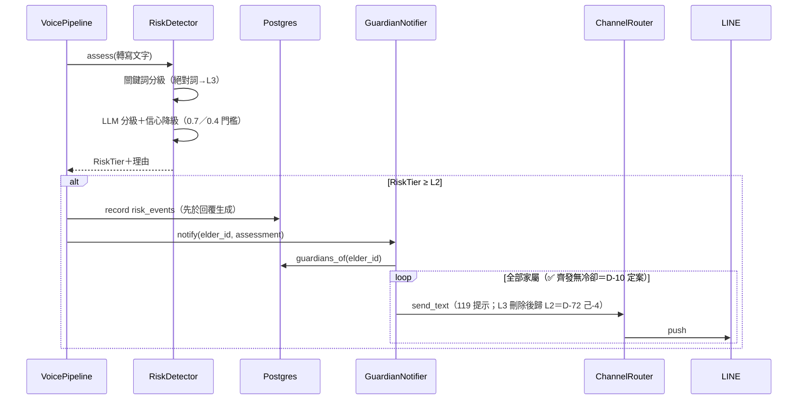
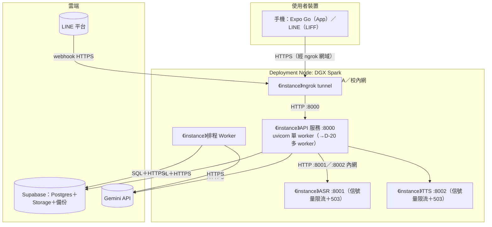

# 架構與設計文件 - 金孫 KinSun

> **版本:** v1.0 | **更新:** 2026-07-08 | **狀態:** 待議中（D-21 帶會議；⚠ 標記連結 [00_決策清單](00_決策清單.md)）
> **基準:** as-is（現行程式碼實證，附 file:line）＋ to-be（重構目標，標 D-xx 依據）。
> 技術選型的決策理由統一見 [04_adr/](04_adr/README.md)，本文件不重複論證。

---

## 第 1 部分：架構總覽

### 1.1 C4 模型

#### 1.1.0 命名防呆（必填）

⚠ 本專案業務名詞「危急分級 L0–L3」與 C4 縮寫 L1–L4 撞名：

| 術語 | 指什麼 | 本文件寫法 |
| :--- | :--- | :--- |
| C4 縮放層級 | 架構圖 zoom 層級 | **一律全稱**：System Context／Container／Component |
| 危急分級 | `safety/tiers.py:9` 的四級風險 | **一律寫 `RiskTier L0–L3`** |
| DDD 限界上下文 | 業務語意邊界 | 「限界上下文」，≠ C4 System Context |

#### 1.1.1 Container 清單（必填）

| Container | 類型 | 技術 | 何時啟用 | Component 圖 |
| :--- | :--- | :--- | :--- | :--- |
| API 服務 | process（:8000） | FastAPI＋uvicorn（`app.py:42`） | 現行 | ✅ §1.1.4 |
| 排程 Worker | process | `python -m kinsun.scheduler`（`worker.py:177`） | 現行 | ✅ §1.1.5 |
| ASR 服務 | process（:8001，DGX） | FastAPI＋Breeze-ASR-26（`services/asr/server.py`） | 現行 | 略：薄服務（單端點＋信號量限流），無內部分層 |
| TTS 服務 | process（:8002，DGX） | FastAPI＋CosyVoice 3（`services/tts/server.py`） | 現行 | 略：同上；台語微調版＝D-01 進行中 |
| Expo App | 行動端 runtime | React Native＋Expo（`app/src/`） | 現行 | 略：見 12_前端架構／17_前端資訊架構 |
| LIFF／admin SPA | 瀏覽器 runtime | React＋Vite（`frontend/src/`，由 API 進程託管靜態檔 `app.py:150-155`） | 現行（LIFF 凍結維運） | 略：見 12／17 |
| 主資料庫 | database | Supabase Postgres＋pgvector | 現行 | 表代圖 → §4.1 ER |
| 音檔儲存 | file storage | Supabase Storage bucket | 現行 | 略：無內部元件；⚠ 公開 bucket 疑慮 → 13 循環 |
| 推播閘道 | 外部服務 | FCM／APNs＋EAS | **階段 5（虛線）** | 略：第三方 |

**外部系統清單**（避免 partial disclosure，五類）：

| 類別 | 系統 |
| :--- | :--- |
| 資料源 | Open-Meteo（天氣工具）、衛教官方來源網站（RAG 爬蟲，經人工核准清冊） |
| 交易 | 無 |
| 推送 | LINE Messaging API（現行）；FCM／APNs（階段 5） |
| 備份 | Supabase 託管備份（⚠ 方案與還原演練未確認 → 14 循環） |
| 雲端 IaaS／SaaS | Supabase（DB＋Storage）、Google Gemini API、ngrok（對外入口）、LINE 平台 |

#### 1.1.2 System Context（C4 第一層）

#### 1.1.3 Container（C4 第二層，Current）

> API 服務同時託管 SPA 靜態檔（`app.py:150-155`），故 SPA 下載來源＝API 進程；圖中省略該靜態檔箭頭。

#### 1.1.4 Container（Target／Future State，必填）

全部里程碑完成後（App 出站 D-12、多 worker D-20、台語 TTS D-01、推播階段 5）：

#### 1.1.5 Component（C4 第三層，zoom: API 服務）

箭頭語意＝呼叫方向（call）。分層依 §1.3。

**Component 檢查註記**：
- 領域層不依賴邊緣層——**唯一例外** `safety/notifier.py:9` import ChannelRouter（as-is），to-be 依 D-18 以 Protocol 反轉。
- 領域 `jobs.py`（medications／appointments）依賴 channels＋scheduler：此為 AGENTS.md 已核定的「排程工廠放領域自己的 jobs.py」規範，屬刻意的編排縫（orchestration seam），不列違規。

#### 1.1.6 Component（zoom: 排程 Worker）

> Worker 與 API **各自** `build_externals`（各一個 DB 連線池），共享同一 Supabase。VoicePipeline 只在 API 建——主動關懷走 `agent.proactive` 純文字（✅ D-21 定案：先做文字就好，會-11）。

### 1.2 DDD 戰略設計

#### 通用語言（詞彙表）

單一定義來源為 `CONTEXT.md`；此處列架構文件會用到的核心詞：

| 術語 | 定義 |
| :--- | :--- |
| Elder／Guardian | 長輩／家屬業務實體，主鍵 `elder_id`／`guardian_id`（uuid） |
| ChannelBinding | 通道帳號（channel, external_id）→ 本人 的對映 |
| Consent | 知情同意紀錄（SELF 本人／PROXY 代理），撤回寫 `revoked_at` |
| InboundMessage | 通道中立的入站訊息（含回覆回呼） |
| RiskTier L0–L3 | 危急分級（一般／關注／警示／緊急） |
| TurnContext | 一輪對話的記憶組裝結果（長期＋事實＋今日） |
| 對講機回合 | App 長輩端「按住說→自動播回覆」的一次往返 |

#### 限界上下文與 C4 Container 對應

| DDD 限界上下文 | 主要落在 Container | 備註 |
| :--- | :--- | :--- |
| 帳號與同意（accounts＋binding） | API | 閘門是其他上下文的上游 |
| 對話照護（pipeline＋agent＋memory＋tools） | API | 核心域 |
| 安全守護（safety） | API | 核心域（差異化承諾） |
| 提醒（medications＋appointments） | API（設定面）＋Worker（觸發面） | |
| 衛教知識（rag） | API＋獨立 CLI（ingest） | |
| 觀測（observability） | API＋Worker | 支撐域 |

#### Strategic Context Map

#### DDD 戰術設計（必填）

| DDD 元素 | 程式碼位置 | 說明 |
| :--- | :--- | :--- |
| Entity | `accounts/models.py`（Elder、Guardian）、`medications/models.py`、`appointments/models.py` | identity＝uuid 主鍵，Postgres 為權威 |
| Value Object | `safety/tiers.py`（RiskAssessment）、`memory/models.py`（TurnContext）、`channels/inbound.py`（InboundMessage） | 不可變 dataclass |
| Aggregate Root | Elder（含 bindings、consents、elder_guardians） | 一致性由 AccountService 維護（`service.py`） |
| Domain Service | `RiskDetector`、`CareAgent`、`SessionMemory`、`AccountService` | 跨實體邏輯 |
| Domain Event | `risk_events`、`reminder_logs`（append-only，`record` 動詞） | 業務事實，不可變 |
| Repository | Store 三件套：`<領域>Store` Protocol＋`Pg*`＋`Fake*`（AGENTS.md 規範） | 合約測試保證等價 |
| Anti-Corruption Layer | `channels/line`（隔離 LINE SDK）、`speech/*`（隔離 DGX 服務）、`GeminiClient`、`Mem0LongTermStore` | 外部 schema 變動不進領域 |
| Specification | **缺席**——業務規則散在各 Service 內 | 規模尚小，暫不引入；若規則爆炸再議 |

### 1.3 分層架構（Clean Architecture）

| 層 | 程式碼位置 | 職責 |
| :--- | :--- | :--- |
| Domain | `accounts`、`medications`、`appointments`、`safety`（core）、`memory`、`rag`、`reports` | 業務規則與領域模型 |
| Application | `pipeline`、`agent`、`channels/inbound`、`channels/router`、`binding`、各領域 `jobs.py`、`composition` | 用例編排與接線 |
| Infrastructure | `db`、`llm`、`speech`、`audio`、`transport`、`observability`、`channels/line`（SDK 面）、`web` | 外部互動實現 |

> 組裝採兩層：`Externals`（連線重件）＋`assemble_core`（純接線），API 與 Worker 兩個組裝根共用（`composition.py:49-168`）——重構時新增元件一律走 composition，禁止在 handler 內自行 new。

### 1.4 技術選型

| 分類 | 選用技術 | ADR |
| :--- | :--- | :--- |
| 後端框架 | Python＋FastAPI＋uv | [ADR-001](04_adr/ADR-001-後端框架FastAPI.md) |
| 資料庫／儲存 | Supabase Postgres＋pgvector＋Storage | [ADR-002](04_adr/ADR-002-資料庫Supabase-Postgres.md) |
| 長期記憶 | Mem0 v1.1（實際生效＝抽取＋去重＋語意檢索） | [ADR-003](04_adr/ADR-003-長期記憶Mem0.md)、[ADR-004](04_adr/ADR-004-知識圖譜移除與拆解.md) |
| LLM | Gemini flash-lite（開發期）→ 按用途配模型 | [ADR-005](04_adr/ADR-005-LLM模型策略.md)（D-16） |
| 排程 | 自建 Scheduler（croniter＋PG） | [ADR-006](04_adr/ADR-006-自建排程器.md) |
| 語音 | DGX 自架 Breeze-ASR-26／CosyVoice 3 | [ADR-007](04_adr/ADR-007-語音服務自架DGX.md)（D-01） |
| 前端 | React＋Vite（web）／Expo（App） | [ADR-008](04_adr/ADR-008-前端技術組合.md)（D-08） |
| 認證 | 家屬雙認證（App token＋LIFF idToken） | [ADR-009](04_adr/ADR-009-家屬雙認證並存.md) |
| 儲存庫 | monorepo | [ADR-010](04_adr/ADR-010-單一儲存庫佈局.md) |
| 身分層 | elder_id 主鍵＋channel_bindings | [ADR-011](04_adr/ADR-011-通道中立身分層.md) |
| 快取／訊息佇列／容器編排／CI-CD | **無**（刻意：規模不需要；CI 缺口見 §5.2） | — |

---

## 第 2 部分：需求摘要

### 功能性需求（對應 [02 PRD](02_專案簡報與PRD.md) 使用者故事）

- FR-1 語音對講回合（US-A1）；FR-2 文字同等對待（US-A2，✅ D-11 to-be）；FR-3 台語（US-A3，D-01）
- FR-4 危急偵測分級＋家屬通知（US-B1，✅ D-10 定案：全員齊發無冷卻；分級改三級刪 L3＝D-72 己-4）；FR-5 App 內警報／提醒（US-B2，✅ D-12 to-be）
- FR-6 主動關懷（US-B3）；FR-7 用藥／回診提醒（US-C1／C2）
- FR-8 家屬帳號與綁定（US-D1／D2；長輩帳密改版⚠ D-71）；FR-9 健康報告（US-D3，✅ D-09：加每日摘要）
- FR-10 衛教 RAG（US-E1，⏳ D-03）

### 非功能性需求

| 分類 | 需求描述 | 目標值 |
| :--- | :--- | :--- |
| 性能 | 語音往返延遲 P50／P95 | ⏸ 實測後定（D-05／會-10；提案原 3–4 秒） |
| 可擴展性 | API 多 worker 啟動 | ✅ D-20（重構工項） |
| 可用性 | 期末展示規模單機承載；DGX 單點風險見 §7.1 | 無正式 SLA（學生專案） |
| 安全性 | 正式環境強制 ConsentGate；同意文案明示資料去向與保留 | D-14／D-15；細項見 13 循環 |

---

## 第 3 部分：系統設計

### 3.1 架構模式

- **模式**: 模組化單體（API＋Worker 雙進程）＋自架模型服務（位置無關）
- **理由**: 7 人非本科團隊，單體最低運維負擔；重模型抽成網路服務滿足跨平台開發（AGENTS.md 環境紀律）

### 3.2 系統元件圖

見 §1.1（不重複貼）。

### 3.3 元件職責

| 元件 | 核心職責 | 依賴 |
| :--- | :--- | :--- |
| VoicePipeline | ASR→危急→回覆→TTS 四階段編排＋觀測埋點（`pipeline.py:47`） | speech、safety、agent、observability |
| CareAgent | 記憶組裝→LLM→工具迴圈（≤3 輪）→寫回（`agent.py:50`） | memory、llm、tools |
| ConsentGate | (channel, external_id)→已同意的 elder_id（`binding/gate.py:22`） | accounts |
| ChannelRouter | 本人→所有綁定通道 fan-out，單通道失敗隔離（`router.py:42`） | accounts、channel adapters |
| GuardianNotifier | 危急通知全家屬（`notifier.py:55`；✅ D-10 政策定案維持齊發、依賴反轉 D-18） | accounts、router |
| Scheduler | croniter 到期判定＋錯過補跑一次＋狀態 upsert（`scheduler.py:35`） | scheduler_state |

### 3.4 關鍵使用者旅程（Dynamic Diagrams，必填）

#### 旅程 1：App 對講機語音回合

> 失敗分支：ASR 失敗→中止並回錯誤；TTS 失敗→退純文字；危急落庫失敗→仍照常通知（`pipeline.py:85-88`）；分級 LLM 失敗→RiskTier L0（⚠ fail-safe 方向 07 循環議）。

#### 旅程 2：排程用藥提醒

> ✅ D-30 定案（會-1）：出站提醒**不查長輩同意**——as-is 的 `has_valid_consent` 檢查（用藥／回診長輩端）於己-1 移除，圖為 to-be。

#### 旅程 3：危急通知

---

## 第 4 部分：資料架構

### 4.1 資料模型（核心 ER）

22 表全清單見 `db.py`；此處畫身分／照護核心，觀測五表（webhook_events、asr_calls、llm_calls、tts_calls、replies）與 RAG 五表（rag_sources／documents／chunks／crawl_jobs／ingestion_audit_logs）為獨立群組，文字帶過。

### 4.2 一致性策略

- **強一致**：單一 Postgres 內全部交易（帳號、同意、提醒、危急事件）。
- **最終一致**：Mem0 長期記憶——夜間 3:00 整批 consolidation（前一天對話→事實），白天檢索到的是「昨天以前」的長期記憶＋當日短期記憶。
- **刻意不一致**：LINE 事件單筆失敗吞掉不重送（`webhook.py:53-56`）——寧漏一則、不重複危急通知。

### 4.3 資料分類與合規

| 資料 | 分類 | 保留 | 依據 |
| :--- | :--- | :--- | :--- |
| 對話原文（turns）、危急事件、摘要 | 健康敏感 PII | 永久保留、同意文案明示 | ✅ D-14；✅ D-13 定案不做撤回入口 |
| 音檔 | 健康敏感 PII | 2 天自動清理 | ⚠ 公開 bucket → 13 循環 |
| 觀測五表（含轉寫原文） | 健康敏感 PII | 14 天自動清理 | admin 權限 → 13 循環 |
| 對外傳輸 | 對話送 Gemini、記憶存 Supabase | 同意文案明示 | ✅ D-15 |
| mem0 稽核（history.db） | 本機 SQLite | ⚠ 落點未管理 → 14 循環 | 查證報告 2026-07-08 |

---

## 第 5 部分：部署與基礎設施

### 5.1 部署視圖

#### 5.1.1 當前環境（DGX Spark 單機）

| 屬性 | 值 |
| :--- | :--- |
| 啟停 | `scripts/kinsun.sh`（setsid＋PID 檔＋logs/*.log） |
| 高可用 | 無（單機；demo 當天風險見 §7.1） |
| Backup | Supabase 託管（⚠ 方案未確認 → 14 循環） |
| 監控 | 無外部監控；observability 五表＋admin 後台（無告警 → 差距） |

#### 5.1.2 目標環境

同一 Node，API 改多 worker（D-20）；階段 5 增加 EAS build＋FCM/APNs。開發機（Windows/macOS）以 `ASR_BACKEND=mock`＋`TTS_BACKEND=bubble` 跑同一套程式（位置無關原則）。

#### 5.1.3 環境策略

| 環境 | Deployment | 用途 |
| :--- | :--- | :--- |
| Dev（各自筆電） | mock ASR／bubble TTS＋AllowAllGate（⚠ D-19 修語意後保留） | 日常開發 |
| DGX（demo／準正式） | 全真模型＋ConsentGate 強制 | 實測與 8/20 展示 |

### 5.2 CI/CD 流程（as-is：無 CI）

| 階段 | 現況 | to-be（餵 16_WBS） |
| :--- | :--- | :--- |
| Build/Test | 本機 `uv run pytest`（344 passed）＋`tsc`／`expo-doctor` 手動 | GitHub Actions：PR 必跑 pytest＋前端型檢 |
| Deploy | 手動 `scripts/kinsun.sh restart` | 維持手動（單機），寫成 Runbook（14 循環） |

### 5.3 成本估算

| 項目 | 月成本 | 備註 |
| :--- | :---: | :--- |
| Supabase／Gemini／Expo Go／ngrok | $0 | 全免費層（D-16：額度優先） |
| DGX Spark | $0 | 校內資源 |
| Apple Developer（階段 5） | $99／年 | D-08：推播啟動時才買 |

---

## 第 6 部分：跨領域考量

### 6.1 可觀測性

| 維度 | 工具 | 狀態 |
| :--- | :--- | :--- |
| 日誌 | logs/*.log（每服務一檔） | ✅ |
| 追蹤 | 自建五階段 trace（webhook→asr→llm→tts→reply，trace_id 貫穿）＋admin 後台 | ✅；token 欄位記 NULL（G-6） |
| 指標 | 無 SLI/SLO 匯出 | ❌ 差距：D-05 KPI 量測基建 |
| 告警 | 無（LLM 故障靜默→僅 log） | ❌ 差距：fail-safe 可見性 07 循環議 |

### 6.2 安全性

正式清單見 13 循環。本層級已定：ConsentGate 強制（正式）、token 雜湊存放、密碼 scrypt、admin 金鑰。已知待議：音檔公開 bucket、DGX 服務無認證、token 無效期、admin 可讀全文。

---

## 第 7 部分：風險與演進

### 7.1 風險登記

| 風險 | 可能性 | 影響 | 緩解策略 |
| :--- | :--- | :--- | :--- |
| 8/20 demo 當天 DGX／ngrok 斷線 | 中 | Demo 失敗 | 14 循環定 Runbook＋備援（mock 退路、預錄影片） |
| Gemini 免費額度耗盡 | 中 | 對話／分級停擺 | D-16 額度監控；分級失效期僅剩 11 詞兜底（07 議） |
| 台語 TTS 微調不達標 | 中 | 差異化賣點缺角 | D-01 兩模型對比；發表敘事保留國語退路 |
| LINE 憑證／webhook 失效 | 低 | 凍結通道斷線 | App 為主線（D-08），LINE 僅維運 |
| 8/20 前重構範圍過大 | 中 | 文件與程式雙未完 | D-04 範圍倒排；16_WBS 排優先序 |

### 7.2 演進路線

| Phase | 範圍與目標 |
| :--- | :--- |
| Phase 1（→8/20） | 一次性重構（16_WBS）：P0 缺口（D-11 文字管線、D-12 App 出站）＋分層修正（D-18、D-19）＋多 worker（D-20）＋KPI 量測基建＋會議決議回填項 |
| Phase 2（發表後） | 台語 TTS 上線（D-01）、推播（階段 5）、模型分流（D-16）、重試策略（D-22） |
| Phase 3 | 視就業媒合／延續狀況：真圖譜（D-17 觸發條件）、水平擴充、穿戴（已砍 D-02，除非翻案） |

---

## 第 8 部分：模組詳細設計

詳見 07_模組規格與測試（撰寫中）。NFR 實現摘要：性能＝DGX 限流＋503 過載保護；安全＝閘門＋token 雜湊；可擴展＝D-20 多 worker＋composition 統一接線。

---

## 差距與重構項（本文件貢獻給 16_WBS）

| # | 差距 | 依據 |
| :--- | :--- | :--- |
| A-1 | GuardianNotifier 以 Protocol 反轉，解除 safety→channels 依賴 | ✅ D-18 |
| A-2 | AllowAllGate 統一解析 elder_id（會話鍵語意一致） | ✅ D-19 |
| A-3 | API 多 worker 啟動＋驗證無單進程假設＋連線池總量評估 | ✅ D-20 |
| A-4 | App 出站 adapter＋App 內通知列表 | ✅ D-12（=PRD G-1） |
| A-5 | config 按用途配模型 | ✅ D-16 |
| A-6 | CI（PR 必跑測試） | §5.2 |
| A-7 | KPI 量測基建（token／延遲） | ⏳ D-05（=PRD G-6） |

## 變更紀錄

| 版本 | 日期 | 變更 |
| :--- | :--- | :--- |
| v1.0 | 2026-07-08 | 初版（as-is 實證＋to-be 標記；D-18～D-22 拍板紀錄） |

## 附錄：跨文件一致性檢查

- 新增 Container／module／外部系統／protocol 時，同步 06／07／08／09／10／13／14（模板規則）。
- 鐵律：**05 是架構契約**——模組在 05 沒出現＝不存在；發現其他文件有、05 沒有 → 修 05。
