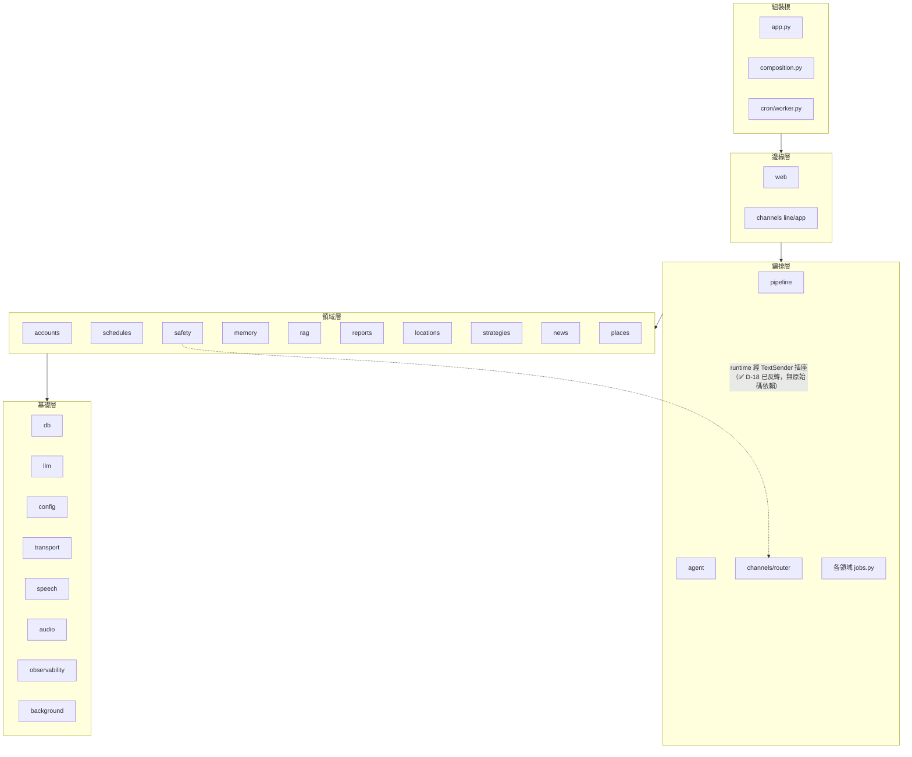

# 模組依賴關係分析 - 金孫 KinSun

> **版本:** v1.16 | **更新:** 2026-07-31 | **狀態:** ✅ 定稿（**網頁版前端 P3 對講機容量閘門接線**（Task 2，2026-07-31）：§5 更正 `channels/app/admission.py` 的依賴邊——由「尚未被任何模組 import」改為**三條新邊**：`turns.py`／`ws.py`（同層，各自 import `TurnAdmission`／`AdmissionTimeout`）與組裝根 `app.py`（建立共用實例並注入兩條路徑）；另新增一條**同層邊** `turns.py → ws.py`（`from kinsun.channels.app.ws import _BUSY_REPLY, _DEFAULT_TURN_CONCURRENCY`，兩條路徑共用同一句婉拒文案與同一個備援併發上限，避免各寫一份而措辭分岔）——這是 `channels/app/` 子套件內第一條 `turns.py`／`ws.py` 互相依賴的邊，方向仍在同一層，不影響 DAG 結論；**網頁版前端 P3 對講機容量閘門**（Task 1，2026-07-31，複審裁決）：§5 補 `channels/app/admission.py`——比照 `inbound_audio.py` 同樣零 kinsun import；網頁版前端 P1 地基（任務 12）：§6 前端依賴清單新增 `web/`——依賴 `shared/`（`kinsun-shared` alias，與 `frontend/` 同手法），未新增第三方套件；延遲優化四刀（2026-07-30）：`agent` 成為 `background` 的第四個消費者（`record_turn` 背景化），層級位置不變、無新循環；新增 `safety/combined_classifier.py`（只走既有 `LLMClient` seam，safety 不新增對外依賴）與 `channels/app/inbound_audio.py`（**零 kinsun import**，純鴨子型別參數）；Protocol 數以 AST 全庫重掃更正 48→**50**（原數同時多算 2 個已退役、少算 3 個現存，見變更紀錄）；邊緣層補 `channels/app/ws.py`（對講機長連線，非同步工具調用 spec 2026-07-28）；新增附近地點搜尋（spec 2026-07-27）：領域層補 `places`〔僅依賴 `db`，與 `locations` 同層不互依〕；Protocol 47→48／合約 19→20 組（新增 `PlaceStore`）；`scheduler/`→`cron/` 更名；新增 `cron/registry.py`（只依賴 config，供 web 與 RAG Worker 廉價讀取排程宣告）；隨程式現況滾動更新）
> v1.9（2026-07-26）：基礎層新增 `background`（背景落庫），零領域依賴、不新增循環。
> 依 2026-07-08 全庫 import 掃描實證；分層定義見 [05 §1.3](05_架構與設計.md)。
> v1.5（2026-07-20）：三項自建輪子改用成熟 OSS——傳輸層 urllib→httpx、RAG 重試手刻→tenacity、設定 dataclass→pydantic-settings；httpx 由 dev 升為 runtime 直接依賴，新增 tenacity／pydantic-settings。

---

## 1. 依賴原則與落實

| 原則 | 本專案落實 |
| :--- | :--- |
| 依賴倒置（DIP） | **50 個** Protocol＋三件套（Pg／Fake，20 組合約測試）；Service 依賴介面不依賴實作。⚠️ 50 為 2026-07-30 以 AST 掃全庫 `class X(Protocol)` 的實數（逐名清單見 [10 §8](10_類別關係.md)）；本批新增 `CombinedSafetyClassifier` 一個（**不增加合約測試組數**——LLM 分類器 seam，無 Pg／Fake 對） |
| 無循環依賴（ADP） | ✅ **實證無檔案級循環**（見 §4） |
| 穩定依賴（SDP） | 高扇入的 `db`／`llm`／`config`／`transport` 零領域依賴，方向正確 |

## 2. 分層依賴圖

## 3. 扇入／扇出統計（import 邊掃描）

| 高扇入（被依賴）Top 5 | 高扇出（依賴他人）Top 5 |
| :--- | :--- |
| db（11）、accounts（8）、llm（7）、memory（6）、reports／observability／config／channels（各 5） | composition（13）、cron worker（11）、app.py（11）、web（7）、schedules（8） |

高扇出者全是**組裝根**（本來就該認識所有人）；高扇入者全是**基礎層**（穩定、零領域依賴）——方向健康。

`background`（2026-07-26 新增）落在基礎層且零領域依賴（只用 stdlib），被 `observability.store`、`pipeline`、`app.py`、**`agent`**（2026-07-30 起，`record_turn` 背景化）四者依賴，方向與 `db`／`llm` 一致，不新增循環——`agent` 在編排層、`background` 在基礎層，這條新邊仍是往下指。扇入 3→4。

## 4. 循環依賴：無

module 粒度看似有三對雙向（schedules／observability／proactive ↔ cron），實為 **cron-core 與 cron-worker 混看的假象**：

- cron 核心（`scheduler.py`／`fanout.py`／`state.py`）只依賴 `db`，**不 import 任何領域**；
- `registry.py` 只依賴 `config`（要讀鐘點設定），同樣不 import 任何領域——排程宣告是純資料，這是它能被 web 程序廉價讀取的前提；
- 領域 `jobs.py` 只 import cron 核心（`Job`／`fanout_job`／`SCHEDULE_DISPATCH_CRON`）；
- 反向邊全部來自 `worker.py`（排程進程的組裝根）import 各領域 jobs——組裝根依賴所有人是正常的。

分開看即為乾淨 DAG。文件約定：**討論依賴時 cron-core 與 worker 分開計**。

2026-07-12 起（D-73）新增一條組裝根之間的邊：`app.py → cron/worker.build_jobs`——內測手動觸發與排程 worker 共用同一份 job 清單。方向單一（web 組裝根 → 排程組裝根的純組裝函式），不引入循環；worker 扇入自 0 變 1，DAG 結論不變。

2026-07-27 另加兩條指向 `cron/registry` 的邊：`app.py`（後台排程健康檢查讀全系統宣告）與 `rag/worker.py`（取自己那支 job 的名稱與 cron）。registry 不 import 任何領域，故兩條邊都只是往下指，DAG 結論不變。

## 5. 關鍵依賴路徑（App 語音回合）

`channels/app/ws.py`（邊緣，2026-07-28 新增的對講機長連線）與 `channels/app/turns.py`（邊緣，降級路徑）→ `channels/inbound.dispatch`（編排）→ `binding/gate.ConsentGate`（領域）→ `pipeline.VoicePipeline`（編排）→ `safety.RiskDetector`＋`agent.CareAgent`（領域）→ `memory.SessionMemory`（領域）→ `llm.GeminiClient`／`speech`／`db`（基礎）。全程依賴方向單向向下；notifier 反向依賴已解除（✅ D-18，`TextSender` Protocol）。

補充（2026-07-10 群 1 深潛實證）：閘門實際被呼叫**兩次**——`turns.py:92` 在進 dispatch 前先於邊緣層解析一次做 403 守門，`inbound.py:131` 於 dispatch 內再解析一次取 elder_id（✅ A-11 已修，庚-12：dispatch 加可選 elder_id，App 路徑跳過重查）。上行線性描述為主幹示意。

補充（2026-07-17 長輩地點）：`turns.py` 於 dispatch **之前**先寫 `elder_locations`（地名＋模糊座標三者齊備才寫）；agent 端經 `SessionMemory` 的 `LocationFacts`（FactProvider）注入，依賴方向不變（locations 僅依賴 db）。

補充（2026-07-27 附近地點搜尋）：`places` 僅依賴 `db`（與 `locations` 同層、彼此不互依）；`tools/places.py` 的 handler 依賴 `places` 與 `locations` 兩者（座標讀取），這條邊只在編排層之下的 `tools`，不逆向指回領域層，DAG 結論不變。地名 → 座標的 `resolve_place` 借道 `tools/transport.geocode`，形成 `tools/places → tools/transport` 一條同層邊（工具互相依賴，非領域依賴基礎層外的新方向）。

補充（2026-07-30 延遲優化四刀，兩個新檔皆**不新增任何對外依賴方向**）：

- `safety/combined_classifier.py` 只 import `tracing`、`llm`（既有的 `LLMClient` seam）與同套件的 `classifier`／`moderation`／`tiers`——**safety 不新增對外依賴**，與 v1.8 那筆 `AbuseClassifier` 的結論完全相同（合併分類器只是把兩次 `LLMClient.generate` 併成一次，seam 沒變）。
- `channels/app/inbound_audio.py` **一個 kinsun 模組都沒有 import**（只用 stdlib 的 `contextvars`／`logging`／`threading`／`time`）：`inbound_audio`（`AudioPublisher`）與 `traces`（`TraceStore`）都是**呼叫端傳進來的鴨子型別參數**，故它對 `audio` 與 `observability` 只有執行期關係、沒有原始碼邊。⚠️ 這是刻意的——它跑在 `dispatch` 之前的背景執行緒裡，越少 import 越不會把新的啟動期耦合帶進入站路徑；型別靠 `turns.py`／`ws.py` 的組裝點保證，代價是這一檔的參數沒有型別標註。
- `channels/app/admission.py`（P3 Task 1，2026-07-31）比照上一筆 `inbound_audio.py` 的形狀：**同樣一個 kinsun 模組都沒有 import**（只用 stdlib 的 `itertools`／`threading`／`collections`／`contextlib`）。`TurnAdmission` 是純記憶體內的容量閘門，不依賴任何領域或基礎層模組。

  **接線後的依賴邊**（P3 Task 2，2026-07-31）：`channels/app/turns.py` 與 `channels/app/ws.py`（皆邊緣層）各自 `from kinsun.channels.app.admission import AdmissionTimeout, TurnAdmission`；組裝根 `app.py` 額外 import 以建立**共用的單一實例**並分別注入兩個路由器工廠（各自建一個的話，兩條路徑可以互相繞過對方的容量上限，閘門形同虛設）。三條邊皆往下指或組裝根依賴邊緣層，方向正常。

  另新增一條 `channels/app/` 子套件內部的**同層邊**：`turns.py → ws.py`（`from kinsun.channels.app.ws import _BUSY_REPLY, _DEFAULT_TURN_CONCURRENCY`）——兩條對講機路徑對長輩說的婉拒文案、以及未注入 `TurnAdmission` 時的備援併發上限，刻意共用同一個出處而非各寫一份，避免措辭日後分岔。這是 `turns.py`／`ws.py` 兩檔之間**第一次**出現互相依賴的邊；`ws.py` 不 import `turns.py`，故不構成循環，且兩者同屬邊緣層，不影響 DAG 結論。
- `agent → background`：見 §3 的說明（編排層 → 基礎層，往下指）。`pipeline` 讀 `PreparedTurn.record_handle` 走的是既有的 `pipeline → agent` 邊，不新增方向。

## 6. 外部依賴清單

### 後端（pyproject.toml）

| 依賴 | 用途 | 風險 |
| :--- | :--- | :--- |
| fastapi＋uvicorn | Web 框架＋ASGI | 低 |
| psycopg[binary,pool] | Postgres 驅動＋池 | 低 |
| google-genai | Gemini SDK | 中（API 演進快；thought_signature 等行為已封裝於 llm.py） |
| httpx | 對外 HTTP client（傳輸層 `transport.py`＝`HttpxTransport`；亦為 mem0／opik 傳遞相依） | 低（純 Python，跨平台；持久連線池） |
| pydantic-settings | 設定載入（`config.py`：欄位宣告＋型別強制＋凍結＋自訂 env 注入來源） | 低（pydantic 已隨 fastapi 存在） |
| tenacity | 有界重試／指數退避（RAG embedding＋crawler `_fetch`） | 低（純 Python，跨平台） |
| mem0ai（2.0.10） | 長期記憶 | 中（版本行為差異大——graph 移除、檢索三路實為一路；升版需重跑查證，見 ADR-003） |
| line-bot-sdk v3 | LINE 通道（凍結） | 低（隨 LINE 退場移除） |
| vecs | mem0 Supabase provider 的傳遞相依（衛教 RAG 為自寫 pgvector SQL，**不用 vecs**——2026-07-10 群 2b 實證全庫零 import） | 低 |
| croniter | cron 解析 | 低 |
| tzdata | 時區 | 低 |

dev：pytest、ruff、pre-commit。

### 前端

- `app/`：expo ~54（2026-07-12 自 57 降級，配合實機 Expo Go）、expo-router 6.0、expo-audio（對講機）、expo-secure-store（token）、expo-location（模糊定位）、react-native 0.81.5、react 19.1、datetimepicker 8.4.4；dev：jest-expo、eslint-config-expo、@testing-library/react-native。
- `frontend/`：@line/liff 2.25、react 19.2.8、react-router 8.3（2026-07-25 audit 修復升級：react-router 7.x 全系列有 high 通報、8.3.0 要求 React ≥ 19.2.7，故 React 18.3→19 一併升；import 自 `react-router-dom` 改 `react-router`）、vite 6；dev：vitest 4（jsdom）、ESLint 9（typescript-eslint＋react-hooks 7）、@testing-library/react；overrides：minimatch ^10.0.3＋postcss ^8.5.23（漏洞修補，避免被迫升 eslint 10）。
- `web/`（P1 地基，2026-07-30）：react 19.2.8、react-router 8.3、vite 8、Tailwind CSS v4（`@tailwindcss/vite`）；dev：vitest 4（jsdom）、ESLint 9、@testing-library/react。**依賴 `shared/`**（`kinsun-shared` 為 `vite.config.ts` 的 resolve alias，指向 `../shared`，與 `frontend/` 同一套手法）：目前用到 `client.ts`（`createApiClient`）與 `envelope.ts`（`ApiError`）；未新增第三方套件——`qrcode`／`zxing-wasm`（QR 掃碼）留待 P2／P3 長輩／家屬畫面落地時才加。
- npm overrides 補漏（2026-07-25，PR #78）：`app/` 亦加 minimatch ^10.0.3＋postcss ^8.5.23 兩個 overrides 清 npm audit 高危（不動 expo／react-native 版本）。

### 新增依賴紀律（AGENTS.md）

新增前確認 **linux/aarch64 有 wheel**（DGX 是部署目標）；除非有充分理由不加第三方套件；lock 檔（uv.lock／package-lock.json）必須入庫。

## 7. 依賴風險管理

| 風險 | 策略 |
| :--- | :--- |
| mem0ai 升版行為漂移 | 釘版＋升版前重跑功能查證（2026-07-08 查證報告為基線） |
| 外部 SDK（LINE／Gemini）schema 變動 | 已以 ACL 封裝（`channels/line`、`llm.py`）；領域層零直接依賴 |
| safety→channels 反向依賴 | ✅ **已解除**（D-18；2026-07-10 實證 notifier 無 channels import，`TextSender` 插座＝notifier.py:18） |

## 變更紀錄

| 版本 | 日期 | 變更 |
| :--- | :--- | :--- |
| v1.0 | 2026-07-08 | 初版：實證無循環；扇入扇出統計；外部依賴風險表 |
| v1.1 | 2026-07-10 | 群 1 深潛更正：D-18 已反轉（§2 圖＋§7 風險表）；§5 補閘門邊緣先行守門與二次解析事實 |
| v1.2 | 2026-07-10 | 群 2b 深潛更正：§6 vecs 描述更正（mem0 傳遞相依，RAG 自寫 pgvector SQL 不用 vecs） |
| v1.3 | 2026-07-12 | 內測基礎建設（D-73）：§4 補 `app.py → worker.build_jobs` 新邊（單向、無循環） |
| v1.4 | 2026-07-17 | 對齊程式現況：Protocol 31→42（合約 17 組）；§2 領域層補 locations／strategies；§5 補 turns 先寫地點與 LocationFacts 注入、A-11 標已修（庚-12）；§6 前端依賴對齊 Expo 54 降級與 JS 測試／lint dev 依賴 |
| v1.6 | 2026-07-25 | 話題新聞（D-74）：§2 領域層補 news、§1 Protocol 44／合約 18 組；§6 前端依賴對齊 audit 修復（frontend React 19.2.8＋react-router 8.3、frontend／app overrides minimatch＋postcss，PR #78） |
| v1.7 | 2026-07-25 | D-74 消費端：§1 Protocol 45／合約 19 組（NewsMentionStore） |
| v1.8 | 2026-07-25 | 濫用審核：§1 Protocol 45→47（重掃實數，含新增 `AbuseClassifier`）；審核走 `LLMClient` seam，safety 不新增對外依賴。 |
| v1.11 | 2026-07-27 | 新增附近地點搜尋（spec 2026-07-27）：§2 領域層補 `places`；§5 補一段依賴補充（`places` 僅依賴 `db`；`tools/places.py` 依賴 `places`＋`locations`，並經 `tools/transport.geocode` 形成 tools 內部同層邊）；§1 Protocol 47→48／合約 19→20 組（新增 `PlaceStore`）。 |
| v1.14 | 2026-07-31 | 網頁版前端 P1 地基（任務 12，spec 2026-07-30-web-demo-design）：§6 前端依賴清單新增 `web/`（react-router 8／vite 8／Tailwind v4；依賴 `shared/` 的 `client.ts`／`envelope.ts`，`kinsun-shared` alias 與 `frontend/` 同手法，非新增第三方套件）。 |
| v1.13 | 2026-07-30 | 延遲優化四刀的依賴面。動機：四刀都是「把等待搬離關鍵路徑」，最容易順帶弄壞的就是依賴方向（背景化＝多一個消費者、合併呼叫＝可能多一個外部 seam），故逐項查證後記錄結論——**三處都沒有新方向**。①`agent` 成為 `background` 的第四個消費者（B2，`record_turn` 背景化）：編排層 → 基礎層，往下指，扇入 3→4，DAG 結論不變。②`safety/combined_classifier.py` 只走既有 `LLMClient` seam，safety 不新增對外依賴（比照 v1.8 的 `AbuseClassifier`）。③`channels/app/inbound_audio.py` **零 kinsun import**，對 `audio`／`observability` 只有執行期的鴨子型別關係、無原始碼邊。⚠️ **Protocol 數以 AST 全庫重掃更正 48→50**（口徑＝`class X(Protocol)` 的實數）：原本的 48 同時犯了兩個方向的錯——多算 2 個**已退役**的（`MedicationStore`／`AppointmentStore`，D-76 隨模組移除卻留在 10 §8 名單裡），少算 3 個**現存**的（`ScheduleStore`／`PushTokenStore`／`LocationStoreLike`），兩邊部分相消才長得像只差幾個；加上本批新增的 `CombinedSafetyClassifier` 即為 50。逐名清單同步修好於 10 §8（該節標題自 v1.24 起掛著「45 vs 47 待下次全庫重掃核實」的註記，本次就是那次重掃）。合約測試維持 20 組（新 Protocol 無 Pg／Fake 對）。 |
| v1.15 | 2026-07-31 | **網頁版前端 P3 對講機容量閘門**（Task 1，複審裁決要求補上）：§5 補一段 `channels/app/admission.py`——比照 v1.13 的 `inbound_audio.py`：同樣零 kinsun import（只用 stdlib `itertools`／`threading`／`collections`／`contextlib`），且**尚未被任何模組 import**（純新增，`turns.py`／`ws.py` 接線與環境變數屬 Task 2），此刻與全庫其他模組完全沒有依賴邊。05（架構契約）與 10（類別關係）不補：`TurnAdmission` 非 Protocol、無架構層級的新 Container，複審已核對 `05`／`10` 兩份文件皆未收錄性質相近的 `inbound_audio`／`_Sender`／`_InFlight`／`AckAudioCache`，判斷一致。 |
| v1.16 | 2026-07-31 | **網頁版前端 P3 對講機容量閘門接線**（Task 2）：§5 更正 v1.15 的「尚未被任何模組 import」——`turns.py`／`ws.py`（邊緣層）各自 import `TurnAdmission`／`AdmissionTimeout`，組裝根 `app.py` 建立共用單一實例並分別注入兩個路由器工廠，三條邊皆方向正常。另新增 `turns.py → ws.py` 一條 `channels/app/` 子套件內部的同層邊（`_BUSY_REPLY`／`_DEFAULT_TURN_CONCURRENCY` 共用），為兩檔之間第一次出現互相依賴；`ws.py` 不回頭 import `turns.py`，不構成循環，DAG 結論不變。 |
