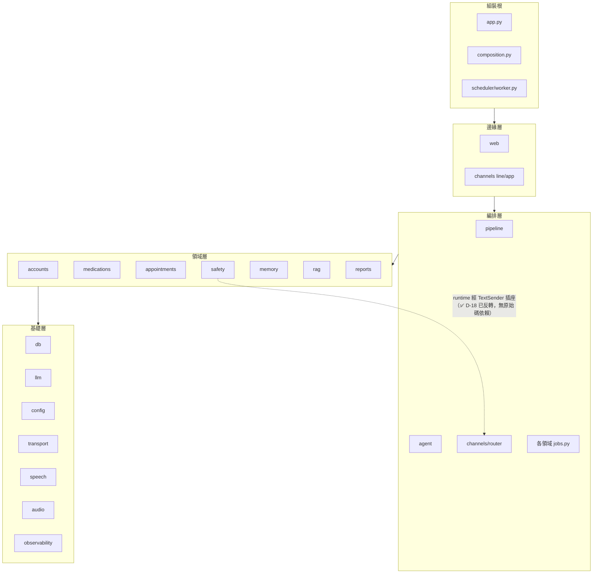

# 模組依賴關係分析 - 金孫 KinSun

> **版本:** v1.2 | **更新:** 2026-07-10 | **狀態:** ✅ 定稿（群 1／2b 深潛更正回填）
> 依 2026-07-08 全庫 import 掃描實證；分層定義見 [05 §1.3](05_架構與設計.md)。

---

## 1. 依賴原則與落實

| 原則 | 本專案落實 |
| :--- | :--- |
| 依賴倒置（DIP） | 31 個 Protocol＋三件套（Pg／Fake）；Service 依賴介面不依賴實作 |
| 無循環依賴（ADP） | ✅ **實證無檔案級循環**（見 §4） |
| 穩定依賴（SDP） | 高扇入的 `db`／`llm`／`config`／`transport` 零領域依賴，方向正確 |

## 2. 分層依賴圖

## 3. 扇入／扇出統計（import 邊掃描）

| 高扇入（被依賴）Top 5 | 高扇出（依賴他人）Top 5 |
| :--- | :--- |
| db（11）、accounts（8）、llm（7）、memory（6）、reports／observability／config／channels（各 5） | composition（13）、scheduler worker（11）、app.py（11）、web（7）、medications／appointments（各 7） |

高扇出者全是**組裝根**（本來就該認識所有人）；高扇入者全是**基礎層**（穩定、零領域依賴）——方向健康。

## 4. 循環依賴：無

module 粒度看似有四對雙向（medications／appointments／observability／proactive ↔ scheduler），實為 **scheduler-core 與 scheduler-worker 混看的假象**：

- scheduler 核心（`scheduler.py`／`fanout.py`／`state.py`）只依賴 `db`，**不 import 任何領域**；
- 領域 `jobs.py` 只 import scheduler 核心（`Job`／`fanout_job`）；
- 反向邊全部來自 `worker.py`（排程進程的組裝根）import 各領域 jobs——組裝根依賴所有人是正常的。

分開看即為乾淨 DAG。文件約定：**討論依賴時 scheduler-core 與 worker 分開計**。

## 5. 關鍵依賴路徑（App 語音回合）

`channels/app/turns.py`（邊緣）→ `channels/inbound.dispatch`（編排）→ `binding/gate.ConsentGate`（領域）→ `pipeline.VoicePipeline`（編排）→ `safety.RiskDetector`＋`agent.CareAgent`（領域）→ `memory.SessionMemory`（領域）→ `llm.GeminiClient`／`speech`／`db`（基礎）。全程依賴方向單向向下；notifier 反向依賴已解除（✅ D-18，`TextSender` Protocol）。

補充（2026-07-10 群 1 深潛實證）：閘門實際被呼叫**兩次**——`turns.py:92` 在進 dispatch 前先於邊緣層解析一次做 403 守門，`inbound.py:131` 於 dispatch 內再解析一次取 elder_id（重複解析已登記 05 差距 A-11）。上行線性描述為主幹示意。

## 6. 外部依賴清單

### 後端（pyproject.toml）

| 依賴 | 用途 | 風險 |
| :--- | :--- | :--- |
| fastapi＋uvicorn | Web 框架＋ASGI | 低 |
| psycopg[binary,pool] | Postgres 驅動＋池 | 低 |
| google-genai | Gemini SDK | 中（API 演進快；thought_signature 等行為已封裝於 llm.py） |
| mem0ai（2.0.10） | 長期記憶 | 中（版本行為差異大——graph 移除、檢索三路實為一路；升版需重跑查證，見 ADR-003） |
| line-bot-sdk v3 | LINE 通道（凍結） | 低（隨 LINE 退場移除） |
| vecs | mem0 Supabase provider 的傳遞相依（衛教 RAG 為自寫 pgvector SQL，**不用 vecs**——2026-07-10 群 2b 實證全庫零 import） | 低 |
| croniter | cron 解析 | 低 |
| tzdata | 時區 | 低 |

dev：pytest、ruff、httpx、pre-commit。

### 前端

- `app/`：expo ~57、expo-router、expo-audio（對講機）、expo-secure-store（token）、react-native 0.86、reanimated 4.5。
- `frontend/`：@line/liff 2.25、react 18.3、react-router-dom 7、vite 6。

### 新增依賴紀律（AGENTS.md）

新增前確認 **linux/aarch64 有 wheel**（DGX 是部署目標）；除非有充分理由不加第三方套件；lock 檔（uv.lock／package-lock.json）必須入庫。

## 7. 依賴風險管理

| 風險 | 策略 |
| :--- | :--- |
| mem0ai 升版行為漂移 | 釘版＋升版前重跑功能查證（2026-07-08 查證報告為基線） |
| 外部 SDK（LINE／Gemini）schema 變動 | 已以 ACL 封裝（`channels/line`、`llm.py`）；領域層零直接依賴 |
| safety→channels 反向依賴 | ✅ **已解除**（D-18；2026-07-10 實證 notifier 無 channels import，`TextSender` 插座＝notifier.py:18） |

## 變更紀錄

| 版本 | 日期 | 變更 |
| :--- | :--- | :--- |
| v1.0 | 2026-07-08 | 初版：實證無循環；扇入扇出統計；外部依賴風險表 |
| v1.1 | 2026-07-10 | 群 1 深潛更正：D-18 已反轉（§2 圖＋§7 風險表）；§5 補閘門邊緣先行守門與二次解析事實 |
| v1.2 | 2026-07-10 | 群 2b 深潛更正：§6 vecs 描述更正（mem0 傳遞相依，RAG 自寫 pgvector SQL 不用 vecs） |
