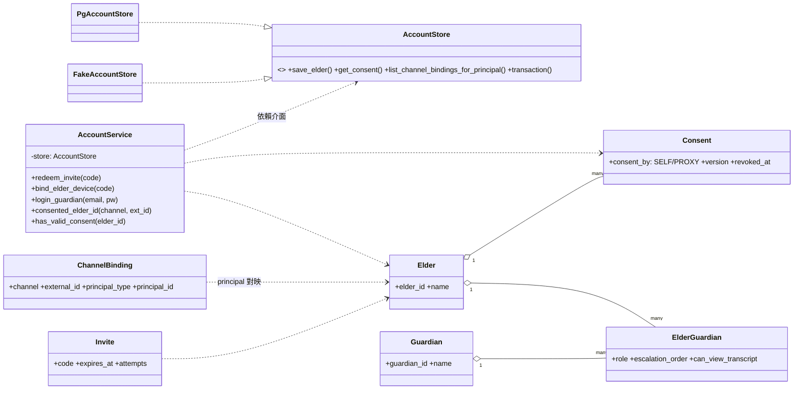
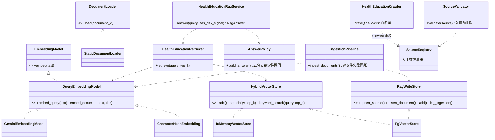

# 類別關係文件 - 金孫 KinSun

> **版本:** v1.3 | **更新:** 2026-07-10 | **狀態:** ✅ 定稿（隨架構文檔深化逐群補圖中）
> 依 2026-07-08 全庫類別掃描（約 280 個類別、31 個 Protocol）；核心類別圖逐群補齊，全 Protocol 清單見 §6。

---

## 1. 核心類別圖：帳號與同意

## 2. 核心類別圖：語音管線與安全守護

（2026-07-10 群 1 深潛重畫：補 ToolRegistry／Transport seam／TextSender 反轉／Mock-Dgx 雙實作；RiskDetector 門檻更正為單一 `mid=0.4`，✅ D-72。）

```mermaid
classDiagram
    direction TB
    class VoicePipeline {
        -asr: ASRClient
        -agent: CareAgent
        -tts: TTSClient
        -detector: RiskDetector
        -notifier: Notifier
        +process(audio, elder_id) TtsResult
        +process_text(text, elder_id) TtsResult
    }
    class CareAgent { -llm: LLMClient -session: SessionMemory -tools: ToolRegistry -max_tool_iters=3 +handle() +proactive() }
    class ToolRegistry { +register(spec, handler) +specs() +dispatch(name, args) }
    class RiskDetector { -classifier: RiskClassifier -mid=0.4 +assess(text) }
    class RiskClassifier { <<Protocol>> +classify(text) }
    class LlmRiskClassifier
    class Notifier { <<Protocol>> +notify(elder_id, assessment) }
    class GuardianNotifier { -directory: GuardianDirectory -router: TextSender }
    class TextSender { <<Protocol>> +send_text(principal_type, principal_id, text) }
    class ChannelRouter
    class RiskAssessment { +tier: RiskTier +confidence +signals }
    class LLMClient { <<Protocol>> +generate() +generate_tool_turn() }
    class GeminiClient
    class ASRClient { <<Protocol>> +transcribe(audio) }
    class MockAsrClient
    class DgxAsrClient
    class TTSClient { <<Protocol>> +synthesize(text) TtsResult }
    class TextBubbleTts
    class DgxTtsClient
    class Transport { <<Protocol>> +request(method, url) Response }
    class UrllibTransport

    VoicePipeline *-- CareAgent
    VoicePipeline *-- RiskDetector
    VoicePipeline ..> ASRClient
    VoicePipeline ..> TTSClient
    VoicePipeline ..> Notifier
    CareAgent ..> LLMClient
    CareAgent ..> ToolRegistry
    RiskDetector ..> RiskClassifier
    RiskDetector ..> RiskAssessment : 產生
    LlmRiskClassifier ..|> RiskClassifier
    LlmRiskClassifier ..> LLMClient
    GuardianNotifier ..|> Notifier
    GuardianNotifier ..> TextSender : ✅ D-18 插座
    ChannelRouter ..|> TextSender : 組裝處注入
    GeminiClient ..|> LLMClient
    MockAsrClient ..|> ASRClient
    DgxAsrClient ..|> ASRClient
    TextBubbleTts ..|> TTSClient
    DgxTtsClient ..|> TTSClient
    DgxAsrClient ..> Transport
    DgxTtsClient ..> Transport
    UrllibTransport ..|> Transport
```

> ✅ D-18 已完成（2026-07-10 實證）：`GuardianNotifier` 依賴 `TextSender` Protocol（`notifier.py:18`），safety 無任何 channels import；`ChannelRouter` 由組裝處注入（`composition.py:161`）。thought_signature 等 Gemini 協定細節全部封裝於 `GeminiClient`（`llm.py:115-136`），CareAgent 對簽章透明。

## 3. 核心類別圖：記憶與通道

（2026-07-10 群 2a 深潛重畫：欄位正名 `_short_term/_long_term/_facts`、`MemoryStore` 補齊五法、`TurnContext`／`InjectedContext` 結構化、通道側補 `AppOutboundChannel`。）

```mermaid
classDiagram
    direction LR
    class SessionMemory {
        -_short_term: MemoryStore
        -_long_term: LongTermStore
        -_facts: List~FactProvider~
        +assemble(elder_id, query) TurnContext
        +record_turn(elder_id, *messages)
    }
    class MemoryStore { <<Protocol>> +append() +recent() +previous_day() +sessions() +last_active() }
    class PgMemoryStore
    class FakeMemoryStore
    class LongTermStore { <<Protocol>> +add(provenance) +search(query, top_k) }
    class Mem0LongTermStore { -_memory: mem0 +add() +search() }
    class FactProvider { <<Protocol>> +facts(elder_id) FactSection? }
    class MedicationFacts
    class AppointmentFacts
    class TurnContext { +injected: InjectedContext +history +system_suffix() }
    class InjectedContext { +memories: List~MemoryItem~ +sections: List~FactSection~ }
    class MemoryItem { +text +provenance +date }
    class FactSection { +title +items }
    class ChannelRouter { -directory: BindingDirectory -channels: Map +send_text() +has_route() }
    class OutboundChannel { <<Protocol>> +send_text(external_id, text) }
    class LineOutboundChannel
    class AppOutboundChannel
    class InboundMessage { +channel +external_id +kind +reply() +reply_voice() }

    PgMemoryStore ..|> MemoryStore
    FakeMemoryStore ..|> MemoryStore
    Mem0LongTermStore ..|> LongTermStore
    MedicationFacts ..|> FactProvider
    AppointmentFacts ..|> FactProvider
    SessionMemory ..> MemoryStore
    SessionMemory ..> LongTermStore
    SessionMemory ..> FactProvider
    SessionMemory ..> TurnContext : 產生
    TurnContext *-- InjectedContext
    InjectedContext *-- MemoryItem
    InjectedContext *-- FactSection
    Mem0LongTermStore ..> MemoryItem : 產生
    LineOutboundChannel ..|> OutboundChannel
    AppOutboundChannel ..|> OutboundChannel
    ChannelRouter ..> OutboundChannel
```

> `Mem0LongTermStore`＝ACL＋專案自寫邏輯（user query＋HEALTH_QUERY 雙查詢合併、去重、新到舊排序、失效退化空清單）；排版統一在 `models.py:format_injected_context`（「新覆舊」recency 前言＋出處·日期註記）。

## 4. 核心類別圖：RAG 檢索鏈

（2026-07-10 群 2b 深潛新增。五 Protocol＋實作＋雙管線服務鏈；`DocumentLoader` 為 production 未用抽象（05 差距 A-31）。）

> 線上工具接點：`build_health_rag_handler` 包 `HealthEducationRagService`（tools/health_rag.py），經 ToolRegistry 供 CareAgent 呼叫；rerank／citation 為純函式（reranker.py／citation.py），不入類別圖。

## 5. 設計模式

| 模式 | 應用 | 目的 |
| :--- | :--- | :--- |
| Repository（三件套） | 全部持久層：Protocol＋Pg＋Fake 同檔 | 業務不碰 SQL；Fake 支撐離線測試；合約測試保等價 |
| 依賴注入（建構子、多 keyword-only） | 所有 Service／Pipeline／Agent | 組裝集中三個根；可測性 |
| Facade | `SessionMemory`（三層記憶單一門面）、`VoicePipeline` | 呼叫端不知內部協作者 |
| Adapter／ACL | `channels/line`（LINE SDK）、`GeminiClient`、`Mem0LongTermStore`、`speech/*` | 外部 schema 變動不進領域 |
| Strategy | `ConsentGate` vs `AllowAllGate`；`MockAsrClient` vs `DgxAsrClient` | 環境切換不改呼叫端 |
| Factory | `build_asr_client`／`build_tts_client`／`build_*_job`／`build_audio_publisher` | 依設定選實作 |
| Registry | `ToolRegistry`（register／specs／dispatch，dispatch 永不拋，`tools/registry.py:13`） | 工具增減不改 agent；工具故障不中斷對話 |
| Null Object | `_NullBinding`（`channels/app/turns.py:30`，handle 恆回 None） | App 通道無綁定流程，dispatch 介面不分岔 |
| Collector | `_TurnCollector`（`channels/app/turns.py:37`，收 reply 轉同步 JSON） | 讓 App 一次 HTTP 往返重用「回呼式」共用 dispatch |
| Protocol 注入 seam | `Transport`（`transport.py:30`）注入各 HTTP client | 測試注入 FakeTransport，不 monkeypatch urllib |
| Pipeline | `IngestionPipeline`（rag/ingestion.py）：文件→chunk→embedding→store，逐文件失敗隔離＋稽核留痕 | 單篇失敗不中斷整批 |
| Policy 閘門 | `SourceValidator`（入庫前）、`AnswerPolicy`（回答前五分支） | 確定性程式碼管安全，優先於 LLM 生成 |

## 6. Protocol 總表（31 個）

| Protocol（位置） | 實作 |
| :--- | :--- |
| AccountStore／MedicationStore／AppointmentStore／BindingSessionStore／MemoryStore／TraceStore／RiskEventStore／ReminderLogStore／ConversationSummaryStore／ScheduleStateStore | 各自 Pg＋Fake 三件套（10 組，皆有合約測試） |
| LongTermStore（memory/longterm/store.py） | Mem0LongTermStore（ACL 非三件套：Fake 在 tests/fakes.py、無合約測試——刻意例外，載明於 05 差距 A-24） |
| FactProvider（memory/recall.py） | MedicationFacts、AppointmentFacts |
| RiskClassifier／Notifier／GuardianDirectory（safety/） | LlmRiskClassifier；LogNotifier、GuardianNotifier；AccountService（duck） |
| OutboundChannel／BindingDirectory／LineMessenger（channels/） | LineOutboundChannel＋Fake；AccountStore（duck）；LineApiMessenger |
| LLMClient（llm.py） | GeminiClient |
| ASRClient／TTSClient（speech/） | Mock＋Dgx 各二 |
| Transport（transport.py） | UrllibTransport、FakeTransport |
| Executor（db.py） | psycopg cursor（duck） |
| LiffVerifier（web/auth.py） | LineIdTokenVerifier |
| AudioPublisher（audio/publisher.py） | SupabaseAudioPublisher |
| Profiles（binding/flow.py）／ElderResolver（binding/gate.py） | AccountService（duck）；ConsentGate、AllowAllGate |
| EmbeddingModel／QueryEmbeddingModel／DocumentLoader／RagWriteStore／HybridVectorStore（rag/） | GeminiEmbeddingModel、CharacterHashEmbedding（測試）；StaticDocumentLoader（**production 未用**，A-31）；PgVectorStore、InMemoryVectorStore（**零引用死碼**，A-31）。註：RAG 持久層非三件套、無合約測試（刻意例外，A-32 載明） |

## 7. SOLID 檢核

- [x] S 單一職責：模組總表（07 §1）每模組一句話職責成立
- [x] O 開放封閉：新通道＝新增 adapter＋bindings 列，不改領域
- [x] L 里氏替換：合約測試強制 Fake／Pg 等價（10 組）
- [x] I 介面隔離：Protocol 平均 2–5 個方法；AccountStore 28 方法偏大（重構時可依讀寫拆分，非本輪範圍）
- [x] D 依賴反轉：31 Protocol；GuardianNotifier→ChannelRouter 已反轉（✅ D-18 完成，`TextSender` 插座＝notifier.py:18，2026-07-10 實證），無已知例外

## 變更紀錄

| 版本 | 日期 | 變更 |
| :--- | :--- | :--- |
| v1.0 | 2026-07-08 | 初版：三群核心類別圖＋31 Protocol 總表＋SOLID 檢核 |
| v1.1 | 2026-07-10 | 群 1 深潛：§2 類別圖重畫（ToolRegistry／Transport seam／TextSender／Mock-Dgx 雙實作；門檻更正 mid=0.4）；§4 補 Registry／Null Object／Collector／Transport seam 四模式；§6 D-18 檢核更新 |
| v1.2 | 2026-07-10 | 群 2a 深潛：§3 類別圖重畫（欄位正名、MemoryStore 五法、TurnContext／InjectedContext 結構化、AppOutboundChannel）；§5 LongTermStore 補 ACL 例外註記 |
| v1.3 | 2026-07-10 | 群 2b 深潛：新增 §4 RAG 檢索鏈類別圖（後續章節順延改號 §5～§7）；設計模式補 Pipeline／Policy 閘門；Protocol 總表 RAG 列補實作與例外註記 |
