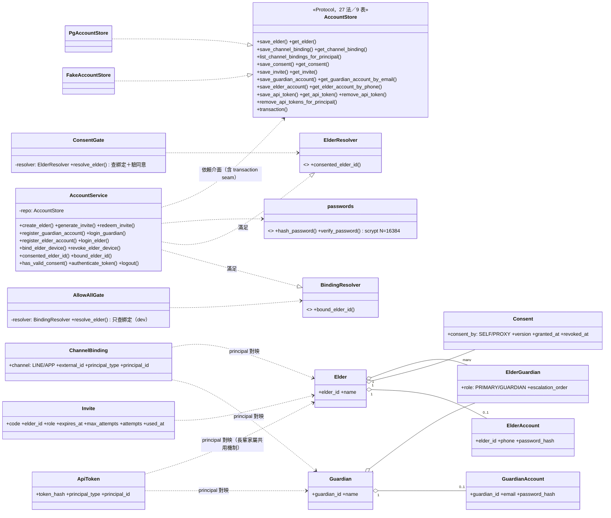
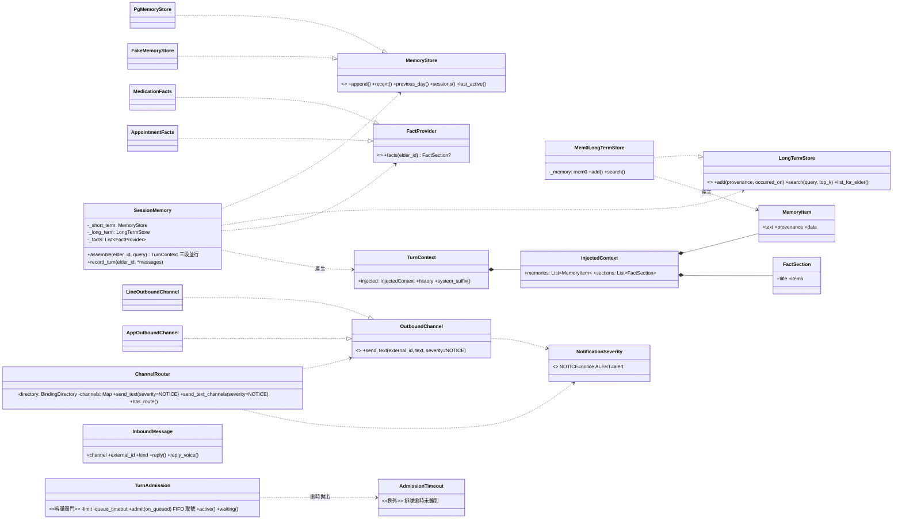
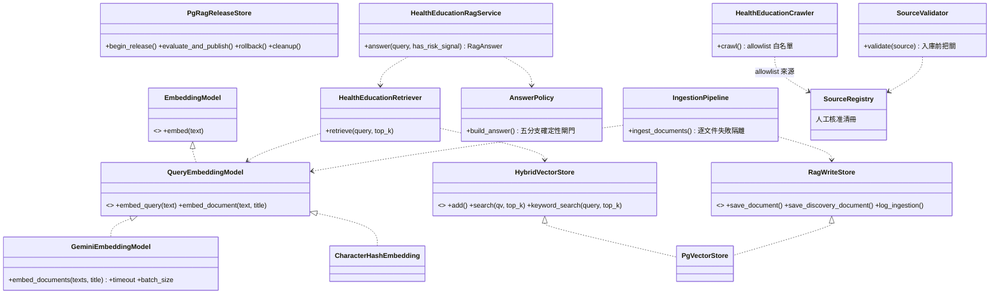
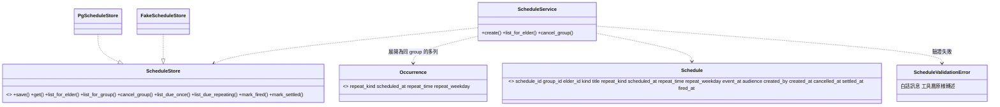

# 類別關係文件 - 金孫 KinSun

> **版本:** v1.30 | **更新:** 2026-08-08 | **狀態:** ✅ 定稿（**長輩客製化聲音複製 voice_profiles 併入 main**（2026-08-08，PR #104 整合）：群 1 補 `VoiceProfileStore`（`Pg`／`Fake`）與 `VoiceReference`；`VoicePipeline` 補選配聚合 `voice_profiles` 與 `sign_voice_url`（兩者必須成對注入，建構子會擋下只給其一）與公開方法 `resolve_voice(elder_id)`；`SupabaseAudioPublisher` 補 `signed_url_for(path)`；`TTSClient.synthesize` 加選配 `voice` 參數；§8 Protocol 總表新增 `VoiceProfileStore`（50→**51**）；**危急分級加脈絡參數**（2026-08-01）：§2 `RiskClassifier`／`CombinedSafetyClassifier`／`RiskDetector.assess` 三處簽章加具預設值的具名參數 `recent`，`VoicePipeline` 新增選配聚合 `recent_utterances`；**`OutboundChannel` 加 `severity`**（2026-08-01 Leo 裁決）：出站群類別圖新增 `NotificationSeverity`（StrEnum，notice／alert）；`OutboundChannel.send_text` 與 `ChannelRouter.send_text`／`send_text_channels` 皆新增具預設值（`NOTICE`）的具名參數——預設不可改成 `ALERT`，否則每一則用藥提醒都會變成紅色警報。`LineOutboundChannel` 明文忽略它（LINE push message 是純文字，給不了樣式），`AppOutboundChannel` 落進 `app_notifications.severity`；**統一排程段落補 `AppointmentReminders`／`build_appointment_reminders`**（D-79，2026-08-01）：回診兩顆鬧鐘的唯一推算處，REST 入口據此忽略 client 的 `occurrences`；**網頁版前端 P3 對講機容量閘門**（Task 1 遺留、Task 2 審查補回，2026-07-31）：§3 補 `TurnAdmission`／`AdmissionTimeout` 兩類別（非 Protocol，`admit()` 逾時拋出後者）——前一輪判斷它與 `_InFlight`／`_Sender`／`AckAudioCache` 同級不入圖，複審後改判：它是兩條對講機路徑共用的單一物件，貼近「跨路徑共用狀態」而非純粹單路徑實作細節，故補入；延遲優化四刀（2026-07-30）：§2 補 `CombinedSafetyClassifier`／`LlmCombinedSafetyClassifier`／`CombinedSafetyResult` 三類別與 `VoicePipeline` 的選配聚合，`RiskDetector.combine_with_llm`／`AbuseModerator.apply_threshold` 兩個共用決策方法入圖；§3 `SessionMemory.assemble` 標註三段並行；**§8 Protocol 總表以 AST 全庫重掃修正 48→50 並補齊逐名清單**（原名單多列 2 個已退役、漏列 3 個現存，另漏 `AbuseClassifier`），v1.24 掛著的「45 vs 47 待重掃」註記自此結案；新增附近地點搜尋（spec 2026-07-27）：Protocol 總表新增 `PlaceStore`（47→48）；cron 群補 `JobSpec`（排程宣告）與 `Job` 的 background／max_lateness_seconds 兩欄；延遲優化第二批：群 2 補 `PreparedTurn`（情境預取 handle，非 Protocol）與 `CareAgent.prepare`；第一批：FactProvider 改並行呼叫但順序仍按注入索引；`background.py` 不新增 Protocol；統一排程 D-76 五刀全完成、舊模組類別移除——Schedule／Store／Service＋dispatch job／ScheduleFacts／legacy_bridge；FactProvider 六段、`TimeFacts` 排首位；濫用審核入群 4 類別圖，旗標預設開）
> 依 2026-08-08 AST 全庫重掃（**51 個 Protocol**，口徑＝`class X(Protocol)` 的實數）；核心類別圖逐群補齊，全 Protocol 清單見 §8。

---

## 1. 核心類別圖：帳號與同意

（2026-07-10 群 5 深潛重畫：移除幽靈欄位 `can_view_transcript`（DDL 已 DROP，己-8）；補憑證層三類別（GuardianAccount／ElderAccount／ApiToken）與己-6 方法（`login_elder`／`register_elder_account`／`revoke_elder_device`）；補兩個 Gate 與其窄 Protocol。）

> `Consent.revoked_at` 與 `consent_revoked` 403 路徑全備但**無生產寫入點**（D-13 不做撤回入口，05 差距 A-51）。`AccountStore` 為刻意的寬 Repository（同一限界上下文＋共享交易 seam），拆分軸線應為子聚合而非讀寫（見 §9）。

## 2. 核心類別圖：語音管線與安全守護

（2026-07-10 群 1 深潛重畫：補 ToolRegistry／Transport seam／TextSender 反轉／Mock-Dgx 雙實作；RiskDetector 門檻更正為單一 `mid=0.4`，✅ D-72。）

```mermaid
classDiagram
    direction TB
    class VoicePipeline {
        -asr: ASRClient
        -agent: CareAgent
        -tts: TTSClient
        -detector: RiskDetector
        -notifier: Notifier
        -moderator: AbuseModerator|None
        -combined_classifier: CombinedSafetyClassifier|None
        -recent_utterances: (elder_id)->list[str]|None
        -voice_profiles: VoiceProfileStore|None
        -sign_voice_url: (path)->url|None
        +process(audio, elder_id) TtsResult
        +process_text(text, elder_id) TtsResult
        +resolve_voice(elder_id) VoiceReference|None
    }
    class CareAgent { -llm: LLMClient -session: SessionMemory -tools: ToolRegistry -max_tool_iters=3 +prepare() PreparedTurn +handle(prepared) +proactive(recall) }
    class PreparedTurn { <<背景組裝中的本輪情境>> -thread: Thread +context() 例外原樣重拋 }
    class ToolRegistry { +register(spec, handler) +specs() +dispatch(name, args) }
    class RiskDetector { -classifier: RiskClassifier -mid=0.4 +assess(text, recent) +combine_with_llm(text, llm) }
    class RiskClassifier { <<Protocol>> +classify(text, recent) }
    class LlmRiskClassifier
    class AbuseModerator { -classifier: AbuseClassifier -min_confidence=0.7 +moderate(text) +apply_threshold(result) }
    class AbuseClassifier { <<Protocol>> +classify(text) }
    class LlmAbuseClassifier
    class ModerationResult { +category: AbuseCategory +confidence +signals +is_blocked }
    class CombinedSafetyClassifier { <<Protocol>> +classify(text, recent) CombinedSafetyResult }
    class LlmCombinedSafetyClassifier { -llm: LLMClient +classify(text, recent) 一次呼叫取兩份原始判斷 }
    class CombinedSafetyResult { <<frozen>> +risk: RiskAssessment +moderation: ModerationResult 皆未套用地板與門檻 }
    class Notifier { <<Protocol>> +notify(elder_id, assessment) }
    class GuardianNotifier { -directory: GuardianDirectory -router: TextSender }
    class TextSender { <<Protocol>> +send_text(principal_type, principal_id, text) }
    class ChannelRouter
    class RiskAssessment { +tier: RiskTier +confidence +signals }
    class LLMClient { <<Protocol>> +generate() +generate_tool_turn() }
    class GeminiClient
    class ASRClient { <<Protocol>> +transcribe(audio) }
    class MockAsrClient
    class DgxAsrClient
    class TTSClient { <<Protocol>> +synthesize(text, voice) TtsResult }
    class TextBubbleTts
    class DgxTtsClient
    class VoiceReference { +elder_id +prompt_audio_url +prompt_text }
    class VoiceProfileStore { <<Protocol>> +save(profile) +get_active(elder_id) +revoke(elder_id) }
    class PgVoiceProfileStore
    class FakeVoiceProfileStore
    class Transport { <<Protocol>> +request(method, url) Response }
    class HttpxTransport

    VoicePipeline *-- CareAgent
    CareAgent ..> PreparedTurn : prepare 產生（非阻塞）
    VoicePipeline *-- RiskDetector
    VoicePipeline ..> ASRClient
    VoicePipeline ..> TTSClient
    VoicePipeline ..> Notifier
    CareAgent ..> LLMClient
    CareAgent ..> ToolRegistry
    RiskDetector ..> RiskClassifier
    RiskDetector ..> RiskAssessment : 產生
    LlmRiskClassifier ..|> RiskClassifier
    LlmRiskClassifier ..> LLMClient
    VoicePipeline o-- AbuseModerator : 選配（旗標關＝None）
    VoicePipeline o-- VoiceProfileStore : 選配（未設＝全域預設聲音）
    VoicePipeline ..> VoiceReference : 依 elder_id 組給 TTSClient
    PgVoiceProfileStore ..|> VoiceProfileStore
    FakeVoiceProfileStore ..|> VoiceProfileStore
    AbuseModerator ..> AbuseClassifier
    AbuseModerator ..> ModerationResult : 產生
    LlmAbuseClassifier ..|> AbuseClassifier
    LlmAbuseClassifier ..> LLMClient
    VoicePipeline o-- CombinedSafetyClassifier : 選配（旗標關＝None）
    LlmCombinedSafetyClassifier ..|> CombinedSafetyClassifier
    LlmCombinedSafetyClassifier ..> LLMClient
    CombinedSafetyClassifier ..> CombinedSafetyResult : 產生
    CombinedSafetyResult ..> RiskAssessment : 交回 RiskDetector.combine_with_llm
    CombinedSafetyResult ..> ModerationResult : 交回 AbuseModerator.apply_threshold
    GuardianNotifier ..|> Notifier
    GuardianNotifier ..> TextSender : ✅ D-18 插座
    ChannelRouter ..|> TextSender : 組裝處注入
    GeminiClient ..|> LLMClient
    MockAsrClient ..|> ASRClient
    DgxAsrClient ..|> ASRClient
    TextBubbleTts ..|> TTSClient
    DgxTtsClient ..|> TTSClient
    DgxAsrClient ..> Transport
    DgxTtsClient ..> Transport
    HttpxTransport ..|> Transport
```

> ✅ D-18 已完成（2026-07-10 實證）：`GuardianNotifier` 依賴 `TextSender` Protocol（`notifier.py:19`），safety 無任何 channels import；`ChannelRouter` 由組裝處注入（`composition.py:420`）。thought_signature 等 Gemini 協定細節全部封裝於 `GeminiClient`（`llm.py:182-199`／`298-308`），CareAgent 對簽章透明。
>
> ⚠️ **兩個「選配」的聚合不是各自獨立的**（2026-07-30 延遲優化 C2）：`combined_classifier` 只在與 `moderator` **同時**設定時才會被使用——合併省下的正是審核那次呼叫，沒有審核就沒有第二次可省，故 `app.py` 對「開了合併卻關掉審核」這個半開狀態留一行 warning 而非靜默失效。⚠️ 圖上刻意**不畫** `LlmCombinedSafetyClassifier → RiskDetector`／`AbuseModerator` 的邊：合併分類器只負責「一次呼叫取回兩份**原始**判斷」，關鍵詞地板與信心門檻仍由 `RiskDetector.combine_with_llm`／`AbuseModerator.apply_threshold` 套用，而呼叫這兩個方法的是 `VoicePipeline._assess_and_moderate`（編排層），不是分類器自己——這道界線就是「分開呼叫與合併呼叫兩條路徑永遠共用同一份決策規則」的實作保證。

## 3. 核心類別圖：記憶與通道

（2026-07-10 群 2a 深潛重畫：欄位正名 `_short_term/_long_term/_facts`、`MemoryStore` 補齊五法、`TurnContext`／`InjectedContext` 結構化、通道側補 `AppOutboundChannel`。）

> `Mem0LongTermStore`＝ACL＋專案自寫邏輯（user query＋HEALTH_QUERY 雙查詢合併、去重、新到舊排序、失效退化空清單）；排版統一在 `models.py:format_injected_context`（「新覆舊」recency 前言＋出處·日期註記）。
>
> **`TurnAdmission`／`AdmissionTimeout`**（`channels/app/admission.py`，P3 對講機容量閘門，Task 1 新增、2026-07-31 補入本圖——前一輪判斷它與 `_InFlight`／`_Sender`／`AckAudioCache` 等 App 邊緣層實作細節同級、不需入圖，複審後改判仍應收錄：它是**兩條對講機路徑共用的單一物件**，比 `ChannelRouter`／`InboundMessage` 這類已入圖的邊緣層協作物件更貼近「跨路徑共用狀態」而非純粹的單路徑實作細節）：不依賴圖上任何其他類別（`turns.py`／`ws.py` 各自把 `dispatch(...)` 呼叫包進 `admit()`，`InboundMessage` 的建構在閘門**之後**才發生，兩者無直接關聯），`admit()` 逾時拋出 `AdmissionTimeout`，呼叫端接住並回一句人話（WS 送 `error` 訊框、POST 轉譯 HTTP 503）。與 `_InFlight`（單連線併發上限）並存而非取代，見 07 §1 `channels` 列。
>
> ⚠️ **`assemble` 自 2026-07-30（延遲優化 A2）起三段並行**：`_short_term.recent`／`_long_term.search`／`_gather_facts` 同時發動（三者彼此無依賴，串行等於白等最慢那段以外的全部時間；mem0 檢索實測就是最慢路）。**協作關係與合成順序一字未動**——事實段仍按注入索引回填、記憶合併仍「先 user 後 health」，故本圖的關聯線不變，只有時序變了。並行帶來兩個必須寫在類別旁邊的約束：①每一路事實有 5 秒上限（逾時視同該段缺席），否則上層放棄等待後的孤兒執行緒會繼續佔正式環境僅 3 條的 psycopg 連線；②`_gather_facts` 的 6 路 DB 查詢現在與 `recent` 同時搶連線，峰值需求 6→7。`record_turn` 的呼叫端（`CareAgent`）自同日起改走背景寫入，但 `SessionMemory` 這一側的介面與語意不變（見 07 §1 `agent.py` 列）。

## 4. 核心類別圖：RAG 檢索鏈

（2026-07-10 群 2b 深潛新增；2026-07-17 更新——`DocumentLoader`／`StaticDocumentLoader`／`InMemoryVectorStore` 已退役刪除（✅ 庚-34），餘四 Protocol＋雙管線服務鏈。）

> 線上工具接點：`build_health_rag_handler` 包 `HealthEducationRagService`（tools/health_rag.py），經 ToolRegistry 供 CareAgent 呼叫；rerank／citation 為純函式（reranker.py／citation.py），不入類別圖。

## 5. 核心類別圖：健康領域

（2026-07-10 群 3 深潛新增。雙生領域六檔同構——可作新領域樣板；GuardianScope 屬群 5 帳號守門，此處僅示消費關係。）

```mermaid
classDiagram
    direction TB
    class MedicationStore { <<Protocol>> +save() +list_for_elder() +list_for_slot() +remove() }
    class PgMedicationStore
    class FakeMedicationStore
    class MedicationService { +save() +list_for_elder() +update() +remove() }
    class MedicationFacts { +facts(elder_id) FactSection? }
    class AppointmentStore { <<Protocol>> +save() +list_for_elder() +list_for_date() +remove() }
    class PgAppointmentStore
    class FakeAppointmentStore
    class AppointmentService { +save() +upcoming(today) +update() +remove() }
    class AppointmentFacts { +facts(elder_id) FactSection? }
    class FactProvider { <<Protocol>> +facts(elder_id) FactSection? }
    class ReminderLogStore { <<Protocol>> +record() +list_for_elder() }
    class ConversationSummaryStore { <<Protocol>> +save() +get_for_date() +list_for_elder() }
    class build_health_report { 近30天危急＋提醒純聚合 }
    class build_medication_slot_job { 4個daily cron 只推長輩 }
    class build_appointment_reminder_job { 今明兩窗 長輩＋家屬 }

    PgMedicationStore ..|> MedicationStore
    FakeMedicationStore ..|> MedicationStore
    PgAppointmentStore ..|> AppointmentStore
    FakeAppointmentStore ..|> AppointmentStore
    MedicationService ..> MedicationStore
    AppointmentService ..> AppointmentStore
    MedicationFacts ..|> FactProvider
    AppointmentFacts ..|> FactProvider
    MedicationFacts ..> MedicationService
    AppointmentFacts ..> AppointmentService
    build_medication_slot_job ..> MedicationStore : list_for_slot
    build_appointment_reminder_job ..> AppointmentStore : list_for_date
    build_medication_slot_job ..> ReminderLogStore : safe_record
    build_appointment_reminder_job ..> ReminderLogStore : safe_record
    build_health_report ..> ReminderLogStore
    build_health_report ..> RiskEventStore
    class RiskEventStore { <<Protocol，群4>> +record() +list_for_elder() }
```

**統一排程（D-76 P1，2026-07-25）**——`schedules/` 將於 P2 取代上圖的 `Medication*` 與 `Appointment*` 兩組；P1 僅建立資料層，尚無呼叫端：

> 一列＝一個鬧鐘，`group_id` 串同一件事。Store 刻意不判斷「過期」（需判定窗、屬派送邏輯），這道界線讓合約測試能對 Fake 與 Pg 用同一份斷言。驗證全數收斂在 Service：建立排程有三個入口（App／LINE／語音工具），規則散落必然從最少人看的那處開始漂移。

**P2～P5 追加**（2026-07-25）：`build_schedule_dispatch_job`（每分鐘掃描，取代四個用藥 job ＋ 一個回診 job；用藥按「長輩＋時段小時」聚合、`audience=elder_and_guardian` 時家屬同送）、`ScheduleFacts`（實作 `FactProvider`，一個 kind 一個實例，組裝根註冊三次）、`wording.py`（純函式措辭，時段詞由提醒時刻推算）、`ScheduleMenu`（`flow.py`，LINE 單一入口）、`timeparse.py`（三個入口共用的日期時刻解析；D-79 2026-08-01 起另含 `build_appointment_reminders` 與其回傳的 frozen `AppointmentReminders{occurrences, is_day_before_skipped}`——回診「前一天＋當天」兩顆鬧鐘的唯一推算處，REST 入口據此忽略 client 送來的 `occurrences`）、`tools/schedules.py` 三支工具（`elder_id` 只認 `ToolInvocationContext`）。`MedicationFacts`／`AppointmentFacts` 與其整個模組已於 P5 移除；過渡期的 `legacy_bridge` 已於 P3 移除。

> routers 消費：schedules router → ScheduleService（操作單位為 group）；reports router → build_health_report＋ConversationSummaryStore（daily-summaries，✅ 己-3）；三者皆經家屬雙認證＋GuardianScope 404 守門。FactProvider 注入點見 §3（SessionMemory）。

## 6. 核心類別圖：排程與主動關懷

（2026-07-10 群 4 深潛新增。安全守護類別已在 §2 重畫，此處補排程核心＋通知留痕＋App 內通知；GuardianNotifier 三插座全 Protocol 化。）

```mermaid
classDiagram
    direction TB
    class Scheduler { +run_due() -_is_due() 首見種基準＋補跑一次 }
    class Job { <<frozen>> +name +cron +run +background +max_lateness_seconds }
    class JobSpec { <<frozen>> +name +cron +owner +background +max_lateness_seconds }
    class ScheduleStateStore { <<Protocol>> +get_last_run() +set_last_run() }
    class PgScheduleStateStore
    class FakeScheduleStateStore
    class fanout_job { 每日單點 cron＋逐筆隔離無重試 }

    class GuardianNotifier { +notify() 全家屬齊發無冷卻 }
    class GuardianDirectory { <<Protocol>> +guardians_of(elder_id) }
    class TextSender { <<Protocol>> +send_text(ptype, pid, text) int }
    class DeliveryLog { <<Protocol>> +record(...delivered) }
    class RiskNotificationLogStore { <<Protocol>> +record() +list_for_elder() }
    class ChannelRouter

    class AppOutboundChannel { +send_text()＝落庫 }
    class AppNotificationStore { <<Protocol>> +record() +list_for_external_ids() }

    class build_greeting_job { 每半小時掃描 各長輩偏好時刻 greeted_today 冪等 }
    class build_inactivity_job { 失聯 last_active≥2天 只計 user turn }
    class GreetingPreferenceStore { <<Protocol>> +save() +get_for_elder() +list_all() }
    class CareAgent { +proactive(elder_id, intent) 不跑工具迴圈 }

    Scheduler ..> Job
    Scheduler ..> ScheduleStateStore
    JobSpec ..> Job : build_jobs 依宣告綁執行體
    PgScheduleStateStore ..|> ScheduleStateStore
    FakeScheduleStateStore ..|> ScheduleStateStore
    fanout_job ..> Job : 產生
    build_greeting_job ..> fanout_job
    build_inactivity_job ..> fanout_job
    build_greeting_job ..> GreetingPreferenceStore : 偏好時刻（無偏好退回預設 8 時）
    build_greeting_job ..> CareAgent : _push_to_elder
    build_inactivity_job ..> CareAgent : _push_to_elder
    GuardianNotifier ..> GuardianDirectory
    GuardianNotifier ..> TextSender : ✅ D-18 插座
    GuardianNotifier ..> DeliveryLog : ✅ D-36 送達留痕
    ChannelRouter ..|> TextSender
    RiskNotificationLogStore <.. DeliveryLog : Pg 實作滿足
    ChannelRouter ..> AppOutboundChannel
    AppOutboundChannel ..> AppNotificationStore : D-12 過渡落庫
```

> worker 組裝 13 個 job（整理／問候／失聯／用藥×4／回診／音檔清理×2／觀測清理／新聞爬取＋新聞清理，D-74）；整理 job 的夜間批次為四步（Mem0 整理→每日摘要→每晚反思→問候時間計算，後三步各自 try/except 互不拖累）；A-42 已解（✅ 庚-17：`try_claim` 條件式 UPDATE 原子搶占）。危急偵測（RiskDetector 融合矩陣）見 §2 與 05 §8.5。

## 7. 設計模式

| 模式 | 應用 | 目的 |
| :--- | :--- | :--- |
| Repository（三件套） | 全部持久層：Protocol＋Pg＋Fake 同檔 | 業務不碰 SQL；Fake 支撐離線測試；合約測試保等價 |
| 依賴注入（建構子、多 keyword-only） | 所有 Service／Pipeline／Agent | 組裝集中三個根；可測性 |
| Facade | `SessionMemory`（三層記憶單一門面）、`VoicePipeline` | 呼叫端不知內部協作者 |
| Adapter／ACL | `channels/line`（LINE SDK）、`GeminiClient`、`Mem0LongTermStore`、`speech/*` | 外部 schema 變動不進領域 |
| Strategy | `ConsentGate` vs `AllowAllGate`；`MockAsrClient` vs `DgxAsrClient` | 環境切換不改呼叫端 |
| Factory | `build_asr_client`／`build_tts_client`／`build_*_job`／`build_audio_publisher` | 依設定選實作 |
| Registry | `ToolRegistry`（register／specs／dispatch，dispatch 永不拋，`tools/registry.py:29`） | 工具增減不改 agent；工具故障不中斷對話 |
| Null Object | `_NullBinding`（`channels/app/turns.py:39`，handle 恆回 None） | App 通道無綁定流程，dispatch 介面不分岔 |
| Collector | `_TurnCollector`（`channels/app/turns.py:46`，收 reply 轉同步 JSON） | 讓 App 一次 HTTP 往返重用「回呼式」共用 dispatch |
| Protocol 注入 seam | `Transport`（`transport.py`）注入各 HTTP client | 測試注入 FakeTransport（或給 `HttpxTransport` 注入 `httpx.MockTransport`），不動真網路 |
| Pipeline | `IngestionPipeline`（rag/ingestion.py）：文件→chunk→embedding→store，逐文件失敗隔離＋稽核留痕 | 單篇失敗不中斷整批 |
| Policy 閘門 | `SourceValidator`（入庫前）、`AnswerPolicy`（回答前五分支） | 確定性程式碼管安全，優先於 LLM 生成 |

## 8. Protocol 總表（**51 個**，2026-08-08 AST 全庫重掃）

> ✅ **v1.24 掛著的「45 vs 47 待下次全庫重掃核實」到此結案**：以 `class X(Protocol)` 為口徑掃 `src/kinsun/` 得 **51 個**，逐名與下表一一對應。原本的 48 同時犯了兩個方向的錯，兩邊部分相消才長得像只差幾個——
> - **多列 2 個已退役**：`MedicationStore`／`AppointmentStore`（D-76 P5 隨模組與資料表一併移除，名單沒跟著撤）；
> - **漏列 3 個現存**：`ScheduleStore`（D-76 的替代者，只出現在 §5 的圖裡沒進總表）、`PushTokenStore`（`notifications/push_tokens.py`）、`LocationStoreLike`（`tools/news.py`）；
> - **漏列 1 個**：`AbuseClassifier`（2026-07-25 濫用審核落地時只更新了總數 45→47 與 §2 的圖，忘了把名字加進本表）；
> - 本批**新增 1 個**：`CombinedSafetyClassifier`；2026-08-08 併入 voice_profiles 再**新增 1 個**：`VoiceProfileStore`。
>
> 46（原 48 扣掉 2 個退役）＋3＋1＋1＝**51**。⚠️ 下次要動這個數字前，請重跑同一支 AST 掃描而不是手數——這個數字已經連續三版被手數弄錯。

| Protocol（位置） | 實作 |
| :--- | :--- |
| AccountStore／BindingSessionStore／MemoryStore／TraceStore／RiskEventStore／RiskNotificationLogStore／AppNotificationStore／PushTokenStore／ReminderLogStore／ConversationSummaryStore／ScheduleStore／ScheduleStateStore／ConsolidationLogStore／StrategyStore／WebSearchLookupStore／LocationStore／GreetingPreferenceStore／NewsStore／NewsMentionStore／PlaceStore／VoiceProfileStore | 各自 Pg＋Fake 三件套（**21 組，一組一支合約測試檔，數量與檔案清單一致**；ScheduleStore＝D-76 統一排程，取代已退役的 MedicationStore／AppointmentStore；PushTokenStore 住 notifications/push_tokens.py；NewsStore＝D-74、NewsMentionStore＝D-74 消費端，住 news/mentions.py——D-42 語意命名例外；PlaceStore＝附近地點搜尋 spec 2026-07-27，住 places/store.py；VoiceProfileStore＝長輩客製化聲音複製，住 voice_profiles/store.py，PK＝elder_id，尚未在 00_決策清單拍板） |
| FactProvider（memory/recall.py） | TimeFacts（台灣時間，首位，`clock.py`）、ElderProfileFacts（稱謂）、ScheduleFacts×3（用藥／回診／自訂，D-76）、StrategyFacts、LocationFacts（末位）。⚠ 自 2026-07-26 起由 `_gather_facts` **並行**呼叫（各一次跨網查詢、彼此無依賴），但段落順序仍按注入索引回填——順序是 prompt 契約，非實作細節。⚠️ 自 2026-07-30（A2）起每一路另有 5 秒上限：**逾時視同該段缺席**（`facts` 本來就允許回 None），故實作者不需要、也不應該自行加逾時或重試 |
| RiskClassifier／AbuseClassifier／CombinedSafetyClassifier／Notifier／GuardianDirectory／TextSender／DeliveryLog（safety/） | LlmRiskClassifier；LlmAbuseClassifier（2026-07-25 濫用審核，⚠️ 當時漏列於本表）；LlmCombinedSafetyClassifier（2026-07-30 延遲優化 C2，分級＋審核一次呼叫，`SAFETY_COMBINED_CLASSIFIER_ENABLED` 預設 false）；LogNotifier、GuardianNotifier；AccountService（duck）；ChannelRouter（✅ D-18 插座）；PgRiskNotificationLogStore（✅ D-36 送達留痕）。三個 classifier 皆非三件套、無合約測試——它們的替身是測試內的假分類器，等價性由各自的行為測試（降級方向、門檻、解析容錯）擔保 |
| OutboundChannel／BindingDirectory／LineMessenger（channels/） | LineOutboundChannel＋Fake；AccountStore（duck）；LineApiMessenger |
| LLMClient（llm.py） | GeminiClient |
| ASRClient／TTSClient（speech/） | Mock＋Dgx 各二（`TTSClient.synthesize` 加選配 `voice` 參數＝長輩客製化聲音，2026-07-30） |
| VoiceProfileStore（voice_profiles/store.py） | PgVoiceProfileStore＋FakeVoiceProfileStore（三件套，合約測試；長輩客製化聲音複製，2026-07-30） |
| Transport（transport.py） | HttpxTransport、FakeTransport |
| Executor（db.py） | `Database`（池版，自動 commit）、`_ConnExecutor`（單交易連線）、`_Errors`（例外轉譯層）——非 psycopg cursor 直接充當（2026-07-10 群 6 更正）。註：Protocol 未宣告 `transaction()`，`_Errors` 需 type: ignore（05 差距 A-58） |
| LiffVerifier（web/auth.py） | LineIdTokenVerifier |
| AudioPublisher（audio/publisher.py） | SupabaseAudioPublisher |
| Profiles（binding/flow.py）／ElderResolver／BindingResolver（binding/gate.py） | AccountService（duck，同時滿足兩 Resolver）；消費者＝ConsentGate、AllowAllGate |
| EmbeddingModel／QueryEmbeddingModel／RagWriteStore／HybridVectorStore（rag/） | GeminiEmbeddingModel、CharacterHashEmbedding（測試）；PgVectorStore。註：RAG 持久層非三件套、無合約測試（刻意例外，A-32 載明）；DocumentLoader／InMemoryVectorStore 已退役刪除（✅ 庚-34） |
| RateLimiter（web/ratelimit.py） | PgRateLimiter（Postgres 滑動視窗，跨進程共享，正式組裝）、SlidingWindowRateLimiter（記憶體版，測試／單 worker fallback）（✅ 庚-08） |
| Reflector（strategies/reflection.py） | GeminiClient（duck，每晚反思與摘要共用 GEMINI_MODEL_SUMMARY） |
| NewsFetcher（news/fetchers/protocol.py） | MohwNewsFetcher（衛福部爬蟲，免金鑰）、NewsApiFetcher（newsapi.org，需金鑰）——新增新聞來源＝新增一個 fetcher 實作，不動 store／jobs（D-74） |
| LocationStoreLike（tools/news.py） | `LocationStore`（結構相容）——刻意的**窄視圖**：新聞在地化加權只需要 `get_for_elder` 一個方法，宣告完整的 `LocationStore` 會讓工具層依賴一個它九成用不到的介面。列在此處是為了讓總數與 AST 掃描結果一致（2026-07-30 補列），非新增 seam |

## 9. SOLID 檢核

- [x] S 單一職責：模組總表（07 §1）每模組一句話職責成立
- [x] O 開放封閉：新通道＝新增 adapter＋bindings 列，不改領域
- [x] L 里氏替換：合約測試強制 Fake／Pg 等價（**20 組**，2026-07-30 依 `tests/test_*_store_contract.py` 檔案清單重數；⚠️ 原記 19 組與同節 §8 的「20 組」自相矛盾）
- [x] I 介面隔離：Protocol 平均 2–5 個方法；AccountStore 27 方法偏大，但屬**合理的寬 Repository**（同一限界上下文＋共享 `transaction()` seam 使 Elder 聚合跨表寫入原子完成）。若拆分，軸線應為**子聚合**（Identity／Consent／Invite／Binding／Credential）＋UnitOfWork，而非讀寫 CQRS（2026-07-10 群 5 深潛評估；現行規模維持單一 Store 為 YAGNI）
- [x] D 依賴反轉：**50 Protocol**（2026-07-30 AST 重掃，見 §8）；GuardianNotifier→ChannelRouter 已反轉（✅ D-18 完成，`TextSender` 插座＝notifier.py:19，2026-07-10 實證），無已知例外

## 變更紀錄

| 版本 | 日期 | 變更 |
| :--- | :--- | :--- |
| v1.28 | 2026-08-01 | **`OutboundChannel` 加 `severity`**（Leo 裁決）：出站群類別圖新增 `NotificationSeverity`（StrEnum）與兩條關聯；`OutboundChannel`／`ChannelRouter` 的方法簽章補上具預設值的具名參數 |
| v1.27 | 2026-08-01 | 統一排程「P2～P5 追加」段落補 `timeparse.py` 的新職責（D-79）：`build_appointment_reminders` 與其回傳的 frozen `AppointmentReminders`——回診「前一天＋當天」兩顆鬧鐘自此只有這一份推算，REST 與 LINE 共用，REST 據此忽略 client 送來的 `occurrences` |
| v1.0 | 2026-07-08 | 初版：三群核心類別圖＋31 Protocol 總表＋SOLID 檢核 |
| v1.1 | 2026-07-10 | 群 1 深潛：§2 類別圖重畫（ToolRegistry／Transport seam／TextSender／Mock-Dgx 雙實作；門檻更正 mid=0.4）；§4 補 Registry／Null Object／Collector／Transport seam 四模式；§6 D-18 檢核更新 |
| v1.2 | 2026-07-10 | 群 2a 深潛：§3 類別圖重畫（欄位正名、MemoryStore 五法、TurnContext／InjectedContext 結構化、AppOutboundChannel）；§5 LongTermStore 補 ACL 例外註記 |
| v1.3 | 2026-07-10 | 群 2b 深潛：新增 §4 RAG 檢索鏈類別圖（後續章節順延改號 §5～§7）；設計模式補 Pipeline／Policy 閘門；Protocol 總表 RAG 列補實作與例外註記 |
| v1.4 | 2026-07-10 | 群 3 深潛：新增 §5 健康領域類別圖（雙生領域樣板；後續章節順延 §6～§8） |
| v1.5 | 2026-07-10 | 群 4 深潛：新增 §6 排程與主動關懷類別圖（GuardianNotifier 三插座＋D-12 落庫鏈；後續章節順延 §7～§9） |
| v1.6 | 2026-07-10 | 群 5 深潛：§1 帳號類別圖重畫（移除幽靈欄位 can_view_transcript；補憑證層三類別＋己-6 方法＋兩 Gate 與窄 Protocol） |
| v1.7 | 2026-07-10 | 群 6 深潛：§8 Protocol 總表 Executor 實作列更正（Database／_ConnExecutor／_Errors，非 psycopg cursor duck） |
| v1.8 | 2026-07-10 | 階段 F 收斂：Protocol 總數重掃更正 31→**36**（分布 30 檔）；§9 SOLID DIP 同步 |
| v1.9 | 2026-07-17 | 對齊程式現況：Protocol 36→**42**（新增 LocationStore／GreetingPreferenceStore／StrategyStore／Reflector／WebSearchLookupStore／RateLimiter／ConsolidationLogStore；DocumentLoader 退役）；§4 RAG 圖移除已刪類別；§6 問候 job 改自適應偏好時刻＋夜間批次四步＋A-42 已解；§8 三件套 10→17 組 |
| v1.10 | 2026-07-17 | 辛-9：`ConversationSummaryStore` 補 `get_for_date()`（主動推播讀「她上次開口那天」的摘要用）；`LongTermStore.add` 補 `occurred_on`（對話日，修記憶日期晚一天）；`CareAgent.proactive` 補 `recall` |
| v1.11 | 2026-07-17 | 稱謂注入：FactProvider 實作清單補齊為五段（ElderProfileFacts 首位、StrategyFacts／LocationFacts 入列）；`Elder` 補 `nickname` |
| v1.12 | 2026-07-18 | RAG 類別圖補 `PgRagReleaseStore`、`save_discovery_document` 與 Gemini 批次 timeout；failed release 僅復用原子完成且模型／角色／結構相容文件。 |
| v1.14 | 2026-07-25 | 話題新聞（D-74，PR #75 Babic）：§6 worker job 數 11→13（新聞爬取＋清理）；§8 Protocol 42→44（NewsStore 入三件套 18 組＋NewsFetcher 列）；§9 SOLID 數字同步。 |
| v1.15 | 2026-07-25 | D-74 消費端：§8 Protocol 44→45（NewsMentionStore 入三件套 19 組，住 news/mentions.py＝D-42 語意命名例外）；§9 SOLID 數字同步。 |
| v1.16 | 2026-07-25 | 濫用審核：群 4 類別圖補 `AbuseModerator`／`AbuseClassifier`／`LlmAbuseClassifier`／`ModerationResult`，`VoicePipeline` 補 `moderator` 選配聚合（旗標關＝None）；Protocol 45→47（重掃實數）。 |
| v1.17 | 2026-07-25 | 時間改為每輪注入：FactProvider 實作清單五→六，`TimeFacts`（`clock.py`）入列並排首位（時間是其他事實的座標系）；Protocol 總數不變（TimeFacts 實作既有的 FactProvider，不新增 Protocol）。 |
| v1.18 | 2026-07-26 | 延遲優化：FactProvider 列補「並行呼叫但順序按注入索引回填」（順序是 prompt 契約），順帶把該列殘留的 MedicationFacts／AppointmentFacts 更正為 ScheduleFacts×3（D-76 已退役）。新增的 `background.py` **不新增 Protocol**（模組級函式＋內部 `_Writer` 工作佇列，無替身需求），Protocol 總數維持 47。 |
| v1.22 | 2026-07-26 | 延遲優化第二批：群 2 類別圖補 `PreparedTurn`（背景組裝中的本輪情境，`context()` 原樣重拋例外）與 `CareAgent.prepare()`／`handle(prepared)`。`PreparedTurn` 是具體類別、**不是 Protocol**（無替身需求，測試直接用真物件搭配慢速 session 替身），Protocol 總數維持 47。 |
| v1.24 | 2026-07-27 | 新增附近地點搜尋（spec 2026-07-27）：§8 Protocol 總表新增 `PlaceStore`（47→48，20 組合約測試，住 `places/store.py`）；§9 SOLID D 依賴反轉數字同步。⚠️ 發現 §8 標題先前記載「45 個」與本表 v1.16／v1.18／v1.22 反覆確認的「47」互相矛盾（非本次改動所致），已於 §8 標題註記待查、未擅自論斷孰是。 |
| v1.26 | 2026-07-31 | **網頁版前端 P3 對講機容量閘門**（Task 1 遺留、Task 2 審查補回）：§3 補 `TurnAdmission`（-limit／-queue_timeout／+admit(on_queued)／+active()／+waiting()）與 `AdmissionTimeout`（例外，`admit()` 逾時拋出）兩類別，圖後補一段說明：不依賴圖上任何其他類別（`turns.py`／`ws.py` 各自把 `dispatch(...)` 包進 `admit()`，`InboundMessage` 建構在閘門之後才發生），與 `_InFlight`（單連線併發上限）並存而非取代。前一輪（09 v1.15）判斷它與 `_InFlight`／`_Sender`／`AckAudioCache` 同級不需入圖；審查覆核後改判：它是兩條對講機路徑**共用的單一物件**，比純粹單路徑實作細節更貼近「跨路徑共用狀態」，故補入本圖。 |
| v1.25 | 2026-07-30 | 延遲優化四刀的類別面，並**結清 Protocol 總數這筆爛帳**。①§2 補三個類別（`CombinedSafetyClassifier` Protocol／`LlmCombinedSafetyClassifier`／`CombinedSafetyResult`）與 `VoicePipeline o-- CombinedSafetyClassifier`（選配，旗標關＝None）；`RiskDetector` 補 `combine_with_llm(text, llm)`、`AbuseModerator` 補 `apply_threshold(result)`——這兩個方法是「分開呼叫／合併呼叫兩條路徑共用同一份決策規則」的實作保證，故必須上圖；圖後另載明**刻意不畫**分類器指向 detector／moderator 的邊（套用地板與門檻的是編排層的 `_assess_and_moderate`，不是分類器自己）與「兩個選配不獨立」（合併只在審核也開時才生效，半開狀態由 `app.py` 留 warning）。②§3 `SessionMemory.assemble` 標註三段並行，圖後補「關聯線不變、只有時序變了」＋兩個新約束（每路事實 5 秒上限、psycopg 峰值需求 6→7）；`FactProvider` 列同步載明逾時視同缺席、實作者不應自行加逾時。⚠️ ③**§8 Protocol 總表以 AST（`class X(Protocol)`）全庫重掃定為 50 個**，v1.24 掛的「45 vs 47 待重掃」註記結案。為什麼會錯這麼久：這個數字一直是手數的，而三件套那一列同時承擔「名單」與「合約測試組數」兩個用途，退役與新增各改一半——名單多列 2 個已退役（`MedicationStore`／`AppointmentStore`，D-76 P5 已隨模組刪除）、漏列 3 個現存（`ScheduleStore`／`PushTokenStore`／`LocationStoreLike`），safety 那列另漏 `AbuseClassifier`（2026-07-25 只改了總數與圖），兩個方向部分相消，所以每次手數都「看起來差不多對」。本版把逐名清單補成與掃描結果一一對應，並在 §8 註明下次改數字前重跑掃描而不是手數。④§9 SOLID 同步：D 依賴反轉 48→50、L 合約測試 19→**20** 組（原記 19 與同文件 §8 的「20 組」自相矛盾，依 `tests/test_*_store_contract.py` 檔案清單重數）。⑤§2 與 §7 的 file:line 錨點實測重定（`notifier.py` 18→19、`composition.py` 161→420、`llm.py` 115-136→182-199／298-308、`tools/registry.py` 13→29、`turns.py` 30→39 與 37→46）——六個全部已隨程式演進失效。 |
| v1.30 | 2026-08-08 | **長輩客製化聲音複製 voice_profiles 併入 main**（PR #104 整合）：群 1 類別圖補 `VoiceProfileStore`（`Pg`／`Fake`）與 `VoiceReference`；`VoicePipeline` 補兩個選配聚合 `voice_profiles` 與 `sign_voice_url`（**必須成對注入**，只給其一時建構子直接 `ValueError`——放它過去的話 `resolve_voice` 只會回 None，症狀是「設定檔明明存在、聲音卻沒換」且全程無錯誤訊息）與公開方法 `resolve_voice(elder_id)`；`SupabaseAudioPublisher` 補 `signed_url_for(path)`（不上傳、只簽既有物件，含行程內效期快取）；`TTSClient.synthesize` 加選配 `voice` 參數（三個實作與所有測試替身同步）；§8 Protocol 總表新增 `VoiceProfileStore`（50→**51**，合約測試 20→**21** 組，皆為 AST 與 `ls` 實測數）。⚠️ `resolve_voice` 公開的理由在整合時換了對象：原本是給 `turns.py::get_turn_chunk`（REST 續拉端點）用，該端點已於 2026-08-01 隨續段語音 WS 直送移除，現由 `ws.py::_push_continuation_chunks` 呼叫。本功能尚未在 00_決策清單拍板 |
