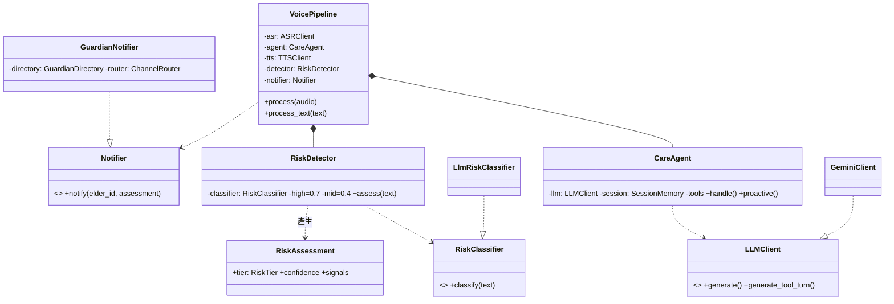
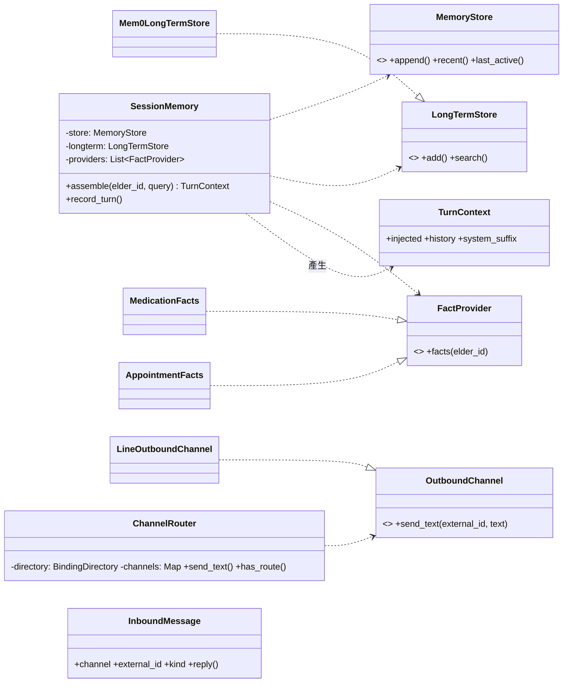

# 類別關係文件 - 金孫 KinSun

> **版本:** v1.0 | **更新:** 2026-07-08 | **狀態:** ✅ 定稿
> 依 2026-07-08 全庫類別掃描（約 280 個類別、31 個 Protocol）；只畫核心三群，全 Protocol 清單見 §5。

---

## 1. 核心類別圖：帳號與同意

## 2. 核心類別圖：語音管線與安全守護

> ⚠ `GuardianNotifier` 直接依賴 `ChannelRouter` 具象類——✅ D-18 重構為 Protocol（插座設計）。

## 3. 核心類別圖：記憶與通道

## 4. 設計模式

| 模式 | 應用 | 目的 |
| :--- | :--- | :--- |
| Repository（三件套） | 全部持久層：Protocol＋Pg＋Fake 同檔 | 業務不碰 SQL；Fake 支撐離線測試；合約測試保等價 |
| 依賴注入（建構子、多 keyword-only） | 所有 Service／Pipeline／Agent | 組裝集中三個根；可測性 |
| Facade | `SessionMemory`（三層記憶單一門面）、`VoicePipeline` | 呼叫端不知內部協作者 |
| Adapter／ACL | `channels/line`（LINE SDK）、`GeminiClient`、`Mem0LongTermStore`、`speech/*` | 外部 schema 變動不進領域 |
| Strategy | `ConsentGate` vs `AllowAllGate`；`MockAsrClient` vs `DgxAsrClient` | 環境切換不改呼叫端 |
| Factory | `build_asr_client`／`build_tts_client`／`build_*_job`／`build_audio_publisher` | 依設定選實作 |

## 5. Protocol 總表（31 個）

| Protocol（位置） | 實作 |
| :--- | :--- |
| AccountStore／MedicationStore／AppointmentStore／BindingSessionStore／MemoryStore／TraceStore／RiskEventStore／ReminderLogStore／ConversationSummaryStore／ScheduleStateStore | 各自 Pg＋Fake 三件套（10 組，皆有合約測試） |
| LongTermStore（memory/longterm/store.py） | Mem0LongTermStore |
| FactProvider（memory/recall.py） | MedicationFacts、AppointmentFacts |
| RiskClassifier／Notifier／GuardianDirectory（safety/） | LlmRiskClassifier；LogNotifier、GuardianNotifier；AccountService（duck） |
| OutboundChannel／BindingDirectory／LineMessenger（channels/） | LineOutboundChannel＋Fake；AccountStore（duck）；LineApiMessenger |
| LLMClient（llm.py） | GeminiClient |
| ASRClient／TTSClient（speech/） | Mock＋Dgx 各二 |
| Transport（transport.py） | UrllibTransport、FakeTransport |
| Executor（db.py） | psycopg cursor（duck） |
| LiffVerifier（web/auth.py） | LineIdTokenVerifier |
| AudioPublisher（audio/publisher.py） | SupabaseAudioPublisher |
| Profiles（binding/flow.py）／ElderResolver（binding/gate.py） | AccountService（duck）；ConsentGate、AllowAllGate |
| EmbeddingModel／QueryEmbeddingModel／DocumentLoader／RagWriteStore／HybridVectorStore（rag/） | GeminiEmbeddingModel；載入器；PgVectorStore、InMemoryVectorStore |

## 6. SOLID 檢核

- [x] S 單一職責：模組總表（07 §1）每模組一句話職責成立
- [x] O 開放封閉：新通道＝新增 adapter＋bindings 列，不改領域
- [x] L 里氏替換：合約測試強制 Fake／Pg 等價（10 組）
- [x] I 介面隔離：Protocol 平均 2–5 個方法；AccountStore 28 方法偏大（重構時可依讀寫拆分，非本輪範圍）
- [x] D 依賴反轉：31 Protocol；唯一例外 GuardianNotifier→ChannelRouter（✅ D-18 修）

## 變更紀錄

| 版本 | 日期 | 變更 |
| :--- | :--- | :--- |
| v1.0 | 2026-07-08 | 初版：三群核心類別圖＋31 Protocol 總表＋SOLID 檢核 |
