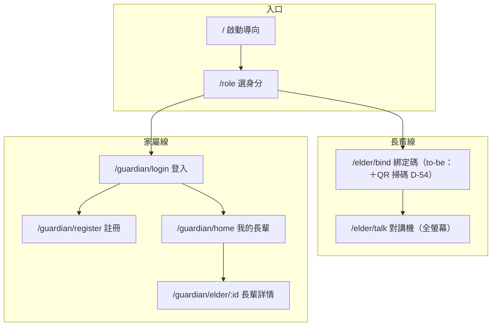

# 前端資訊架構規範 - 金孫 KinSun

> **版本:** v1.0 | **更新:** 2026-07-08 | **狀態:** ✅ 定稿（家屬可見範圍 ⚠ D-09 會議後可能增頁）
> **MECE 邊界**：本檔只談使用者／內容視角；技術選型見 [12_前端架構規範](12_前端架構規範.md)。

---

## 1. 目的與範圍

三端（App／LIFF／admin）的頁面、旅程、導航與 URL 的單一真實來源。

## 2. 設計原則

**核心價值主張：**「長輩按一顆鍵就能說話，家屬打開就看得到狀況。」

| 原則 | 落實 |
| :--- | :--- |
| 簡化 | 長輩端只有一顆按住說話鍵；設定全部由家屬代辦（目標用戶定位 ⚠ D-06 會議） |
| 認知負荷 | 每頁一個主要目標；長輩端錯誤一律講人話（「金孫沒聽清楚，再說一次好嗎？」），不用彈窗 |
| 一致性 | 用語字典三端共用（⏳ D-46，終值會議）；同動作同位置 |
| 架構模式 | App＝角色分流後各自層級化；admin＝中心輻射（總覽→鑽取） |
| 漸進揭露 | 長輩端零設定；家屬進階功能（邀請共同家屬）在詳情頁內 |

## 3. 資訊架構總覽

**頁面總計**：App 8 頁（上圖）＋LIFF 4 頁（清單／用藥／回診／健康報告）＋admin 5 頁（總覽／訊息流／長輩／時間軸／鏈路詳情）。

## 4. 核心使用者旅程

### 旅程 A：長輩開口說話（產品核心）

`家屬產綁定碼` → `/elder/bind 輸入（to-be 掃 QR）` → `/elder/talk` 按住說→放開→自動播回覆。心理狀態：不想學操作——所以**綁定後永不再需要任何操作**。

### 旅程 B：家屬掌握狀況

`/guardian/login` → `/guardian/home 長輩列表` → `/guardian/elder/:id`（健康報告＋用藥＋回診＋邀請碼）。to-be：home 加未讀警報 badge、詳情頁掛「新事件」提示（D-12 App 內通知落點）；家屬可見內容範圍 ⚠ D-09 會議後定。

### 旅程 C：維運排查（admin）

`總覽（異常統計）` → `訊息流（找到問題輪，取 trace_id）` → `鏈路詳情（五階段定位卡點）`；或 `長輩清單` → `單日時間軸` → `鏈路詳情`。導航深度 3 層，符合上限。

## 5. 導航結構

- **App**：單 Stack（無 Tabs）；長輩線進 `/elder/talk` 後不再有導航（全螢幕沉浸）；家屬 home `headerBackVisible:false` 為家屬線根。
- **LIFF**：頂部「← 返回長輩清單」樹狀返回。
- **admin**：NavLink 三項（總覽／訊息流／長輩）＋鑽取深頁靠列內連結。

## 6. 頁面規格（關鍵頁）

### /elder/talk 對講機（長輩端唯一主頁）

| 項目 | 內容 |
| :--- | :--- |
| 職責 | 按住說話→自動播回覆；顯示金孫狀態（idle/listening/thinking/speaking 表情） |
| 主要 CTA | 「按住說話」大鍵（paddingVertical 48、fontHuge） |
| 資料需求 | POST /turns（信封化後同步改） |
| 錯誤狀態 | 一律 replyText 人話；403 綁定失效→清 session＋引導重綁 |
| to-be | 錄音觸覺＋音效回饋（D-48）；虛擬形象替換 AvatarPlaceholder 內部（D-08 預留） |

### /guardian/home 我的長輩

| 項目 | 內容 |
| :--- | :--- |
| 職責 | 長輩列表＋新增長輩（產綁定碼） |
| 主要 CTA | 新增長輩 |
| to-be | 綁定碼複製鈕＋QR 顯示（D-54）；未讀警報 badge（D-12） |
| 空狀態 | 「還沒有長輩——新增第一位」引導 |

### /guardian/elder/:id 長輩詳情

| 項目 | 內容 |
| :--- | :--- |
| 職責 | 健康報告（近 30 天危急＋提醒）＋用藥／回診（唯讀）＋家屬邀請碼 |
| to-be | App 端用藥／回診編輯補齊（現引導去 LINE 設定）；內容範圍隨 ⚠ D-09；新事件提示（D-12） |

（其餘頁面規格從略——職責單一且已在 §3 圖示。）

## 7. URL 結構與路由表

命名：小寫、資源語意；App 為原生路由（expo-router 檔案路由），URL 概念僅 web 端適用。

| 路由 | 端 | 認證 | 角色 |
| :--- | :--- | :--- | :--- |
| `/`、`/role` | App | 否 | 任意 |
| `/elder/bind` | App | 否（憑綁定碼） | 長輩 |
| `/elder/talk` | App | 裝置 token | 長輩 |
| `/guardian/login`、`/register` | App | 否 | 家屬 |
| `/guardian/home`、`/guardian/elder/:id` | App | 家屬 token | 家屬 |
| `/liff/*`（4 頁） | web | LIFF idToken | 家屬（凍結，App 定稿後跟進 D-53） |
| `/admin/*`（5 頁） | web | X-Admin-Key | 內部 |

## 8. 跨頁資料模型

| 來源 → 目標 | 載體 | 內容 | 理由 |
| :--- | :--- | :--- | :--- |
| 登入／綁定 → 各頁 | SecureStore session（to-be AuthProvider，D-45） | role＋token＋display_name | 敏感、跨頁不變 |
| home → 詳情 | 路由參數 `:elderId` | elder_id | 可回溯 |
| 綁定碼 | 畫面顯示＋複製＋QR（D-54） | 一次性代碼 | 不落 URL（機密） |

## 9. IA 檢查清單

- [x] 每頁單一職責＋一個主 CTA
- [x] 導航深度 ≤3
- [x] 空狀態有下一步引導（home 已做；其餘補於重構）
- [ ] 家屬可見範圍頁面調整——⚠ D-09 會議後回填
- [x] 錯誤狀態人話化（長輩端）；web 端隨 D-46 字典統一

## 變更紀錄

| 版本 | 日期 | 變更 |
| :--- | :--- | :--- |
| v1.0 | 2026-07-08 | 初版：三端 IA＋三旅程＋關鍵頁規格 |
