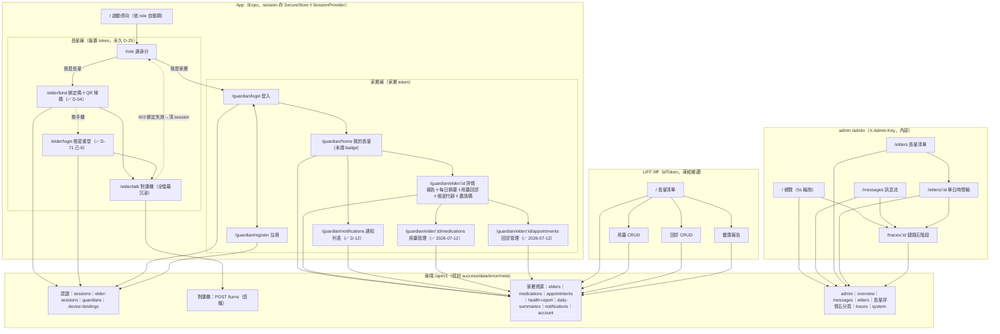

# 前端資訊架構規範 - 金孫 KinSun

> **版本:** v1.7 | **更新:** 2026-07-17 | **狀態:** ✅ 定稿（App 12 頁；對講機附位置線索）
> **MECE 邊界**：本檔只談使用者／內容視角；技術選型見 [12_前端架構規範](12_前端架構規範.md)。

---

## 1. 目的與範圍

三端（App／LIFF／admin）的頁面、旅程、導航與 URL 的單一真實來源。

## 2. 設計原則

**核心價值主張：**「長輩按一顆鍵就能說話，家屬打開就看得到狀況。」

| 原則 | 落實 |
| :--- | :--- |
| 簡化 | 長輩端只有一顆按住說話鍵；設定全部由家屬代辦（D-06 ⏸ 擱置；✅ D-71：帳號也由家屬代辦、長輩機只登入一次即永久記住——零學習成本原則不變） |
| 認知負荷 | 每頁一個主要目標；長輩端錯誤一律講人話（「金孫沒聽清楚，再說一次好嗎？」），不用彈窗 |
| 一致性 | 用語字典三端共用（⏳ D-46，終值會議）；同動作同位置 |
| 架構模式 | App＝角色分流後各自層級化；admin＝中心輻射（總覽→鑽取） |
| 漸進揭露 | 長輩端零設定；家屬進階功能（邀請共同家屬）在詳情頁內 |

## 3. 資訊架構總覽

（2026-07-10 階段 F 重畫：依實際頁面樹補齊 App 第 10 頁與 403 回退邊，並納入 LIFF／admin 兩端與後端 API 接點——本圖為三端全景的單一真實來源。）

**頁面總計**：App **12 頁**＋LIFF 4 頁（清單／用藥／回診／健康報告）＋admin **6 頁**（總覽／訊息流／長輩／長輩詳情／鏈路詳情／系統）。（2026-07-10 群 7 深潛更正：原記 9 頁，遺漏 `/guardian/notifications`；§3 全景圖於階段 F 重畫時補入。2026-07-12 內測基礎建設 D-73：新增「系統」排程頁；長輩詳情由單頁時間軸改**五分頁**——時間軸／提醒設定／記憶與摘要／帳號與綁定／危急通知。2026-07-12 App 用藥回診編輯：詳情頁下增「用藥管理」「回診管理」兩子頁，App 10→12 頁。）

## 4. 核心使用者旅程

### 旅程 A：長輩開口說話（產品核心）

`家屬產綁定碼` → `/elder/bind 掃 QR 或輸入` → `/elder/talk` 按住說→放開→自動播回覆。心理狀態：不想學操作——所以**綁定後永不再需要任何操作**；換手機／登出後由家人陪同走 `/elder/login` 帳密重登一次（帳密由家屬代辦，✅ D-71 己-6）。

### 旅程 B：家屬掌握狀況

`/guardian/login` → `/guardian/home 長輩列表` → `/guardian/elder/:id`（健康報告＋用藥＋回診＋邀請碼）。to-be：home 加未讀警報 badge、詳情頁掛「新事件」提示（D-12 App 內通知落點）；✅ D-09 已定：家屬可見＝警報＋提醒＋**每日摘要**（詳情頁增摘要區塊或子頁，己-3），逐字對話不開放。

### 旅程 C：維運排查（admin）

`總覽（異常統計）` → `訊息流（找到問題輪，取 trace_id）` → `鏈路詳情（五階段定位卡點）`；或 `長輩清單` → `單日時間軸` → `鏈路詳情`。導航深度 3 層，符合上限。

## 5. 導航結構

- **App**：單 Stack（無 Tabs）；長輩線進 `/elder/talk` 後不再有導航（全螢幕沉浸）；家屬 home `headerBackVisible:false` 為家屬線根。內測模式（D-73）另有「切換身分」元件（`RoleSwitcher`）掛 `/elder/talk` 頂部與 `/guardian/home` 頁尾——非獨立頁面，僅伺服器 `INTERNAL_TESTING_ENABLED` 下發時顯示。
- **LIFF**：頂部「← 返回長輩清單」樹狀返回。
- **admin**：NavLink 四項（總覽／訊息流／長輩／系統，D-73 增系統頁）＋鑽取深頁靠列內連結。

## 6. 頁面規格（關鍵頁）

### /elder/talk 對講機（長輩端唯一主頁）

| 項目 | 內容 |
| :--- | :--- |
| 職責 | 按住說話→自動播回覆；顯示金孫狀態（idle/listening/thinking/speaking 表情） |
| 主要 CTA | 「按住說話」大鍵（paddingVertical 48、fontHuge） |
| 資料需求 | POST /turns（信封已落地）；送出時附位置 query（地名＋模糊座標，2026-07-17）——錄音一開始即發動定位（不 await、不阻擋錄音），送出時才等它；取不到就不帶，對話照常 |
| 錯誤狀態 | 一律 replyText 人話；403 綁定失效→清 session＋引導重綁 |
| to-be | 虛擬形象替換 AvatarPlaceholder 內部（D-08 預留）；錄音觸覺＋音效回饋已落地（✅ D-48 丁-2） |

### /guardian/home 我的長輩

| 項目 | 內容 |
| :--- | :--- |
| 職責 | 長輩列表＋新增長輩（產綁定碼） |
| 主要 CTA | 新增長輩 |
| to-be | 無——綁定碼複製鈕＋QR 顯示（✅ D-54 丁-3）與未讀警報 badge（✅ D-12 甲-6）皆已落地 |
| 空狀態 | 「還沒有長輩——新增第一位」引導 |

### /guardian/elder/:id 長輩詳情

| 項目 | 內容 |
| :--- | :--- |
| 職責 | 健康報告（近 30 天危急＋提醒）＋**每日摘要**（✅ D-09 己-3 已落地）＋用藥／回診（清單＋管理子頁入口，✅ 2026-07-12 App 版編輯落地）＋家屬邀請碼＋**長輩帳密代辦**（✅ D-71 己-6） |
| 資料需求 | `GET /health-report`、`GET /daily-summaries`、用藥／回診清單查詢、`POST /guardian-invites`、`PUT /account`；`useFocusEffect` 返回重載（管理子頁編輯後即反映） |
| to-be | 詳情頁「新事件」badge（D-12 通知頁已有，詳情頁未做） |

### /guardian/elder/:id/medications 用藥管理 ＆ /appointments 回診管理（✅ 2026-07-12 App 版編輯）

| 項目 | 內容 |
| :--- | :--- |
| 職責 | 用藥／回診的新增／編輯／刪除（同頁清單＋表單，行為比照 LIFF）；刪除掛系統確認框 |
| 入口 | 詳情頁「管理用藥」「管理回診」按鈕 |
| 資料需求 | 既有 `/elders/:id/medications`、`/appointments` 的 POST／PUT／DELETE（家屬 token，後端零改動） |
| 輸入 | 用藥＝藥名＋時段多選 chips（早上／中午／晚上／睡前）；回診＝系統日期選擇器（`@react-native-community/datetimepicker`，最早今天）＋內容欄 |
| 錯誤狀態 | 前端擋空值（送出鈕停用）；後端 400（`invalid_slot`／`date_in_past` 等）以信封繁中訊息顯示 |
| 空狀態 | 「還沒有用藥／回診，從下方新增第一筆。」 |

### /guardian/notifications 通知列表（✅ D-12 已落地；2026-07-10 補入 IA）

| 項目 | 內容 |
| :--- | :--- |
| 職責 | 家屬端 App 內通知列表——危急警報／提醒／主動關懷皆落於此；開啟即以最新一筆更新已讀水位 |
| 入口 | `/guardian/home` 的未讀 badge |
| 資料需求 | `GET /api/v1/notifications`（家屬 token；聚合本人全部 App 綁定，limit 50、新到舊） |
| 已讀機制 | 水位存 App 端 SecureStore，**後端不做已讀狀態** |
| 空狀態 | 「目前沒有新通知」 |

### /elder/bind 綁定（✅ D-54 QR 掃碼已落地）

| 項目 | 內容 |
| :--- | :--- |
| 職責 | 掃 QR（`expo-camera` CameraView）或手動輸入綁定碼→換裝置 token→直達對講機 |
| 錯誤狀態 | 邀請碼過期／已用／次數上限一律人話；提供「用帳密登入」次要入口（→ `/elder/login`） |

（LIFF 4 頁與 admin 6 頁規格從略——職責單一且已在 §3 圖示；admin 導航深度 3 已驗證。）

## 7. URL 結構與路由表

命名：小寫、資源語意；App 為原生路由（expo-router 檔案路由），URL 概念僅 web 端適用。

| 路由 | 端 | 認證 | 角色 |
| :--- | :--- | :--- | :--- |
| `/`、`/role` | App | 否 | 任意 |
| `/elder/bind` | App | 否（憑綁定碼） | 長輩 |
| `/elder/login` | App | 否（憑帳密，✅ D-71） | 長輩 |
| `/elder/talk` | App | 裝置 token | 長輩 |
| `/guardian/login`、`/register` | App | 否 | 家屬 |
| `/guardian/home`、`/guardian/elder/:id` | App | 家屬 token | 家屬 |
| `/guardian/elder/:id/medications`、`/appointments` | App | 家屬 token | 家屬（✅ 2026-07-12 App 版用藥回診編輯） |
| `/guardian/notifications` | App | 家屬 token | 家屬（✅ D-12；2026-07-10 補入，原表遺漏） |
| `/liff/*`（4 頁） | web | LIFF idToken | 家屬（凍結，App 定稿後跟進 D-53） |
| `/admin/*`（6 頁） | web | X-Admin-Key | 內部 |

## 8. 跨頁資料模型

| 來源 → 目標 | 載體 | 內容 | 理由 |
| :--- | :--- | :--- | :--- |
| 登入／綁定 → 各頁 | SecureStore `kinsun_session`＋`SessionProvider` Context（✅ D-45 已落地；文檔原稱 AuthProvider，實體名為 `SessionProvider`） | role＋token＋display_name（對應後端資源鍵 `name`） | 敏感、跨頁不變 |
| home → 詳情 | 路由參數 `:elderId` | elder_id | 可回溯 |
| 綁定碼 | 畫面顯示＋複製＋QR（✅ D-54 已落地） | 一次性代碼 | 不落 URL（機密） |
| 通知已讀水位 | SecureStore `kinsun_notifications_seen_at` | epoch 秒 | 後端不做已讀狀態 |

> **契約**：三端 JSON 一律 snake_case 直讀不轉換（`shared/types.ts`）；信封 `{success,data,error,meta}` 與後端逐欄一致。`POST /elders` payload 已三端統一 `{name}`（✅ 庚-29，F-9 結案）。

## 9. IA 檢查清單

- [x] 每頁單一職責＋一個主 CTA
- [x] 導航深度 ≤3（App 單 Stack；admin 鑽取 3 層已驗證）
- [x] 空狀態有下一步引導（home／notifications 已做）
- [x] 家屬可見範圍頁面調整——✅ D-09（每日摘要）己-3 已落地於詳情頁
- [x] 錯誤狀態人話化（長輩端；`elder/talk` 403→清 session 導回 `/role` 重綁已實證）
- [x] 頁面清單與程式一致（2026-07-10 群 7 深潛：App 實為 **10 頁**，補入 `/guardian/notifications`；2026-07-12 增用藥／回診管理兩子頁為 **12 頁**）
- [x] web 端錯誤用語統一——字串常數三端集中（✅ 庚-31）＋admin tier 改 `adminTierLabel`（✅ 庚-27）；字典終值仍 ⏳（會-9 擱置，F-7）

## 變更紀錄

| 版本 | 日期 | 變更 |
| :--- | :--- | :--- |
| v1.0 | 2026-07-08 | 初版：三端 IA＋三旅程＋關鍵頁規格 |
| v1.1 | 2026-07-09 | 會議決議回填：D-09 家屬可見加每日摘要、D-06 擱置；標註 D-71 長輩帳密對長輩線的影響 |
| v1.2 | 2026-07-09 | D-71 細節定案：家屬代辦帳密＋長輩登入一次永久記住＋邀請碼/QR 保留配對 |
| v1.3 | 2026-07-10 | 群 7 深潛回填：頁面總計更正為 App 10 頁；§6 補 `/guardian/notifications`、`/elder/bind` 規格與詳情頁己-3／己-6 落地；§7 路由表補第 10 頁；§8 跨頁資料模型補 SessionProvider 現況＋已讀水位＋契約註；§9 檢查清單更新 |
| v1.4 | 2026-07-10 | **階段 F 收斂**：§3 資訊架構總覽圖重畫——三端全景（App 10 頁含 403 回退邊＋LIFF 4 頁＋admin 5 頁）＋後端 `/api/v1` 四類接點，取代原本只畫 App 的簡圖 |
| v1.5 | 2026-07-12 | 內測基礎建設（D-73，PR #45）：admin 更正為 6 頁（新增系統排程頁；長輩詳情改五分頁）；§5 導航補 admin 第四項 NavLink 與 App 內測 RoleSwitcher（非頁面）；§3 圖 ADM 節點同步 |
| v1.6 | 2026-07-12 | App 用藥回診編輯落地（spec：superpowers/specs/2026-07-12-app用藥回診編輯-design.md）：App 10→**12 頁**（詳情頁下增用藥管理／回診管理兩子頁）；§3 圖補 HM／HA 節點；§6 詳情頁職責更新（唯讀→管理入口＋focus 重載）並新增兩子頁規格；§7 路由表補一列 |
| v1.7 | 2026-07-17 | 對齊現況：對講機規格補位置附帶（不阻擋錄音、取不到就不帶）；D-48／D-54／D-12 已落地項自 to-be 移除；F-9／F-10 結案回填（庚-29／庚-27） |
