# 前端資訊架構規範 - 金孫 KinSun

> **版本:** v1.35 | **更新:** 2026-08-05 | **狀態:** ✅ 定稿（**金孫人設（D-81，2026-08-05）**：家屬可替每位長輩挑一種說話語氣（活潑的孫女／穩重的孫子），並拿掉造成罐頭感的「結尾必反問」規則。提示詞結構改為「人設語氣＋稱呼 → 規則段 → 情境」，性格與規則自此分家；長輩檔案那一次讀取從事實提供者清單搬到 CareAgent（七路→六路，碰 DB 六路→五路），全輪資料庫讀取次數不變。新增 `personas.py`、`accounts/profile.py`，刪除 `accounts/facts.py`；`elders` 加 `persona` 欄（既有庫 ALTER 升級）；新增 `PUT /elders/{elder_id}/persona`；**補播單位補正**：§6 對講機列「最多留兩則」改為「最多留兩輪」（06／07／12 早已同步，本檔為最後一處）；**續段 WS 直送最終審查修復**（2026-08-01）：`is_last` 三處過度宣稱改為誠實描述（全鏈路無客戶端消費，前端回到待機由播放佇列排空驅動，終止訊框保留供未來客戶端）；續段餵的文字更正為 `DeliveryOutcome.reply_text`（真回覆）而非投遞層顯示字串；在途清單改在續段迴圈之前解除；終止訊框的空 `text` 前端已補守門；**續段語音 WS 直送文件同步收尾**（2026-08-01，Task 8）：新增 §10「人工驗收清單：續段語音 WS 直送」六項（段間無空白跨三瀏覽器、插嘴後整輪從頭補播、連續插嘴三輪只留最近兩輪且無音檔洩漏、併發兩題各自有答案、字幕搶跑風險、多輪交錯錯序風險——後兩項如實標記「尚未實測、僅理論推導」）；§6 對講機列更正「多段回覆逐段取 `GET /turns/chunks/{index}?digest=`」的過期描述，改為後端主動推 `chunk` frame、前端被動接收；**補播的審查修正＋解鎖殘餘風險補述**（2026-08-01）：§6 對講機列補兩件補播必須守住的事（續段只接自己那一輪的、新一輪的字不可以在舊答案還在播時搶走字幕，兩者都是本輪引入、同日修掉的退步）；音訊解鎖那句補上**但書**——長輩第一個動作就是按麥克風時兩者仍在同一個手勢裡，這張摘要表原本漏了這個殘餘風險（審查 Minor 2）。詳細見 12 §4／07 §7；**插嘴後前一題的答案改為補播**（✅ 專案裁決 2026-08-01，推翻 2026-07-31 的「一律丟棄」）：§6 對講機列改寫——收音期間仍然一律不放音，但那幾則不丟掉、等他講完送出之後補播（舊答案先播、最多兩則）；「上一個問題就先跳過了」那句文案已移除。詳細見 12 §4／07 §7；**iOS 音訊解鎖提早**（✅ 專案裁決 2026-08-01，選項 B）：§6 對講機列補一條——解鎖移到「這顆播放器誕生之後的第一個觸碰」，不再與開錄共用同一個手勢（那正是本檔 §6「音訊工作階段」列記載的 2026-07-18 故障形狀）；麥克風鍵保留補漏呼叫。⚠️ 不可能更早（配對畫面按鈕按下時播放器還不存在）、金孫講話中的觸碰不解鎖。詳細見 12 §4／07 §7；**P4 全分支審查修正**（2026-08-01）：§6 長輩端補兩條——①通知橫幅「只播切回來之後新發生的」共有四條歸零路徑，其中「分頁由背景切回前景」原本缺席（切回來會連播最壞 70 秒），且「該欄轉可見」那條只在窄螢幕成立、展示當天的寬螢幕並排永遠不觸發；②家屬送碼過來時要把配對畫面上的被動登出紅字收掉，否則綠字／新碼／紅字三句同框自相矛盾。路由表與框內畫面數不變。詳細見 07 §7.3／12 §4；**P4 Task 6：跨瀏覽器驗收與文件收尾（2026-08-01，P1～P4 最後一項）**：`web/` 兩條路由（`/demo`、`/demo/stage`）與十個框內畫面（家屬六＋長輩四）至此**全數定稿**，本輪覆核內容與程式現況一致，無需改動；窄螢幕頁籤切換等真機觀感項目未經人工驗證，見 12 §9 F-18／task-6-report.md 人工驗收清單；**P4 Task 4 全分支審查修正**（2026-08-01，0 Critical，4 Important＋5 Minor）：§6 對講機「被動登出」段補記第三條 401 出口（通知輪詢）原本會搶在既有兩條出口前面靜默登出長輩、漏顯示說明，已改走同一支 `loseSession`。詳細見 07 §7／12 §4。web 全套測試 501→**503**；**網頁版前端 P4 Task 4：兩欄接上通知**（2026-08-01，整個 P4 的效果匯合點）：§6「對講機」「提醒」兩列的鈴鐺未讀數由「固定 0，待 P4」更正為「已接上真正的輪詢結果」；「首頁」列補通知入口新增未讀徽章（家屬端首次有此 UI）；`elderVisible` 段補記對稱的 `guardianVisible` 已補上（家屬欄同一類坑第五次）。兩欄頂端會不定期滑進通知橫幅／危急警報（`stage/StagePage.tsx` 的 `notificationSlot`）。危急警報升級（`severity: "alert"`）未接線——後端 `app_notifications` 無分類欄位可辨別，待裁決。詳細見 05 §1.1.1／07 §7／12 §4。web 全套測試 488→**501**；**網頁版前端 P4 Task 3：跨欄連動**（2026-07-31）：§6「首頁」「長輩詳情」兩列補「送到長輩的手機」（P4 Task 3 接上發送端）；§6「配對」列由「家屬欄產生的碼可經 `prefilledCode` 直接帶入（P4 跨欄連動接線，本 Task 未接）」改寫為「已接線」，並記載發送端接上後才現形的 P3 缺陷（`BindScreen` 綁定碼欄需補 render 期間比對＋調整，掛載當下已存在的畫面才能同步收到後續才送來的碼）。詳細見 05 §1.1.1／07 §7／12 §4。web 全套測試 473→**487**；**網頁版前端 P3 全分支審查修正**（2026-07-31）：§6「web/ 長輩端畫面」段末新增三條——返回鍵改為以路由名查標籤表（「回去講話」／「回去輸入號碼」，接上 Task 9 就寫好卻沒人接的死鍵）、**被動登出（401）也要走回配對畫面而且要在配對畫面上說明**（家屬換綁定碼時後端先撤 token 再拆綁定，403 幾乎到不了，原本長輩會永久卡死）、長輩欄可見性改以 `matchMedia` 斷點為準；§6 對講機「權限」列補記 `web/` 在 2026-07-18 那條規則上重演一次（取位權限對話框在錄音進行中彈出）與恢復取位時的硬約束；**網頁版前端 P3 Task 9：長輩提醒列表與收尾**（2026-07-31）：§3 `WebElder` 子圖、§6「web/ 長輩端畫面」表提醒列、§1 頁面總計、末段落佔位敘述四處由「⏳ 待 Task 9」改為「✅ 已完成」，長輩欄四畫面（配對／帳密重登／對講機／提醒）自此全數落地；修正 brief 的「錯誤取代空狀態」缺陷——`catch` 內原本同時 `setItems([])`＋`setError(...)`，會讓「載入失敗」與「現在沒有要提醒您的事」同框出現，改為 `hasError` 獨立布林旗標；補齊已讀水位取最新一則（`Math.max`，不假設 API 回傳順序）與寫入失敗不拖累已載入清單兩項既有於 `guardian/NotificationsScreen.tsx` 修過的不變量；新增 10 條測試（含一條 `ElderApp` 路由整合測試，補上「鈴鐺按下去真的走得到、返回真的回得去」這道先前無人測過的接縫），web 全套測試 397→**407**；**P3 Task 8 裁決回應**：§6 對講機列更正——收音期間抵達的回覆一律丟棄、不補播（✅ 裁決），但不靜默丟棄，字幕告訴長輩上一個問題跳過了；**P3 Task 8 審查修正**：§6「web/ 長輩端畫面」表的對講機列補三條審查修正後的不變量——收音期間抵達的回覆先收下來、錄完補播；打斷播放後下一句立刻播得出來；登出確認講明還沒設過帳密要請家人重新給號碼。成因與修法見 07 §7 v1.76／12 §4 v1.24；**網頁版前端 P3 Task 8：對講機**（2026-07-31）：§1 範圍敘述更正——長輩框內四畫面只剩提醒待 Task 9；§3 全景圖 `WebElder` 子圖的 `elder/talk` 由「⏳ 佔位」改為實作節點；§6「web/ 長輩端畫面」表的對講機列由「⏳ 待 Task 8」改寫為完整規格（雙手勢、鈴鐺與登出二次確認、WS 長連線與 POST 降級、分段續拉、四種表情的可及名稱、麥克風權限進畫面就問、切到背景要停止錄音與長連線、兩條「永遠停在在想」的保險；未讀數固定 0 待 P4）；§7 附註與頁面總計同步。詳細模組規格、brief 缺陷修正與偏離點見 07 §7 v1.75／12 §4 v1.23；**網頁版前端 P3 Task 7：長輩配對與帳密重登畫面**（2026-07-31）：§1 範圍敘述更正——長輩框內四畫面中配對與帳密重登已落地；§3 全景圖 `WebElder` 子圖由單一佔位節點改畫為 `elder/bind`／`elder/login`（實作）＋`elder/talk`／`elder/notifications`（⏳ 佔位，待 Task 8／9）四節點，並補 `WEB & WEL --> AUTH` 邊；§6 新增「web/ 長輩端畫面」規格表（配對／帳密重登／對講機／提醒）；§7 附註更正（長輩欄配對與帳密重登不再是佔位）；頁面總計補「`web/` 長輩欄 4 頁」細分（2 頁已完成／2 頁佔位）。**P2 全分支審查修正**：§6 web 家屬端六畫面表三列改寫——「首頁」補**空狀態只在真的沒有長輩時才顯示**（載入中／載入失敗各有各的話；後端抖一下時誤報空狀態會讓家屬建出刪不掉的重複長輩，後端無 `DELETE /elders`）與登出入口；「長輩詳情」補**重新產生長輩綁定碼**（`DELETE /device-bindings`，綁定碼在家屬端唯一的重取路徑——碼不在 `GET /elders` 的回應裡，而 P3 有三句錯誤訊息叫長輩「請家人重新產生一組」）＋代辦帳密成功與失敗兩種樣式；「行程管理」補標題帶長輩稱呼、載入失敗不停在「載入中…」、編輯提示改中性樣式；框內導覽段補 `elderName` 隨路由帶入，並新增「登入狀態守衛」一段；**協調者裁決追加兩項**：首頁補「建立成功後重打列表」（錯誤旗標不可蓋掉剛建好的那位）、長輩詳情的「重新產生長輩綁定碼」補二次確認列（破壞性大於刪除排程，而後者早就有確認）；**Task 7 審查修正**：§3／§6／§7／頁面總計四處更正 2026-07-25 D-76 統一排程後遺留 6 天的漂移——App「用藥管理」「回診管理」兩頁已合併為單一「行程管理」`schedules.tsx`，App 頁數更正為 12 頁（非 13 頁）；**同一漂移在 LIFF 端一併修正**：§3 圖 `LM`／`LA`（「用藥 CRUD」「回診 CRUD」）合併為單一 `LS` 節點，頁面總計與 §7 路由表的 LIFF 頁數由 4→**3**（`frontend/src/pages/MedicationsPage.tsx`／`AppointmentsPage.tsx` 已隨同一 commit `2d5612b` 刪除，由 `SchedulesPage.tsx` 取代）；§6 web 家屬端六畫面表「行程管理」對照路由更正為 `guardian/elder/:id/schedules`；「首頁」列複製失敗措辭更正為與 `InviteCard.tsx` 實作一致（失敗時按鈕維持原字樣、不另外提示）；**網頁版前端 P2 家屬端完成**（2026-07-31）：§3 全景圖新增 `web/` 家屬欄六畫面框內導覽子圖；§6 新增 web 家屬端六畫面規格（註冊／登入／首頁／長輩詳情／行程管理／通知列表）；§7 路由表附註更新（家屬框內畫面已補齊、長輩端仍待 P3）；**§7 路由表補兩則附註**（P1 全分支審查 I1／I2／I4）：`/demo/stage` 的伺服器端回退、以及舞台與運營狀態 hook 為何掛在路由之上；**網頁版前端 P1 地基**（任務 12，spec 2026-07-30-web-demo-design）：§1／§7 補 `web/` 的兩條路由（`/demo`、`/demo/stage`）；App 13 頁＋admin 7 頁；**新增 /elder/notifications 長輩提醒頁＋對講機鈴鐺未讀 badge**（X-01：提醒落庫後長輩讀不到，D-12 施工紀錄的已知缺口收斂）；對講機改走 WS 長連線＋雙手勢＋D-74 話題新聞頁）
> **MECE 邊界**：本檔只談使用者／內容視角；技術選型見 [12_前端架構規範](12_前端架構規範.md)。

---

## 1. 目的與範圍

三端（App／LIFF／admin）的頁面、旅程、導航與 URL 的單一真實來源；`web/`（2026-07-30 新增，App／LIFF 凍結後唯一演進的前端）的路由另見 §7。家屬框內六畫面已於 P2（2026-07-31）落地並補入本文件（§3／§6）；長輩框內四畫面中，配對與帳密重登（P3 Task 7）與**對講機**（P3 Task 8）已於 2026-07-31 落地並補入本文件，僅剩提醒待 Task 9 落地。

## 2. 設計原則

**核心價值主張：**「長輩按一顆鍵就能說話，家屬打開就看得到狀況。」

| 原則 | 落實 |
| :--- | :--- |
| 簡化 | 長輩端只有一顆說話鍵（按住說話或短按切換皆可）；設定全部由家屬代辦（D-06 ⏸ 擱置；✅ D-71：帳號也由家屬代辦、長輩機只登入一次即永久記住——零學習成本原則不變） |
| 認知負荷 | 每頁一個主要目標；長輩端錯誤一律講人話（「金孫沒聽清楚，再說一次好嗎？」），不用彈窗 |
| 一致性 | 用語字典三端共用（⏳ D-46，終值會議）；同動作同位置 |
| 架構模式 | App＝角色分流後各自層級化；admin＝中心輻射（總覽→鑽取） |
| 漸進揭露 | 長輩端零設定；家屬進階功能（邀請共同家屬）在詳情頁內 |

## 3. 資訊架構總覽

（2026-07-10 階段 F 重畫：依實際頁面樹補齊 App 第 10 頁與 403 回退邊，並納入 LIFF／admin 兩端與後端 API 接點——本圖為三端全景的單一真實來源。）

```mermaid
graph TB
    subgraph AppEnd["App（Expo，session 存 SecureStore＋SessionProvider）"]
        A["/ 啟動導向（依 role 自動跳）"] --> B["/role 選身分"]
        subgraph ElderLine["長輩線（裝置 token，永久 D-25）"]
            B -->|我是長輩| C["/elder/bind 綁定碼＋QR 掃碼（✅ D-54）"]
            C --> D["/elder/talk 對講機（全螢幕沉浸＋提醒鈴鐺未讀 badge）"]
            C -.->|換手機| L["/elder/login 帳密重登（✅ D-71 己-6）"]
            L --> D
            D --> DN["/elder/notifications 金孫的提醒（X-01，2026-07-29）"]
            DN --> D
            D -.->|403 綁定失效→清 session| B
        end
        subgraph GuardianLine["家屬線（家屬 token）"]
            B -->|我是家屬| E["/guardian/login 登入"]
            E <--> F["/guardian/register 註冊"]
            E --> G["/guardian/home 我的長輩（未讀 badge）"]
            G --> H["/guardian/elder/:id 詳情<br/>報告＋每日摘要＋行程摘要＋帳密代辦＋邀請碼<br/>（金孫個性僅 web/ 有，App 已凍結）"]
            H --> HS["/guardian/elder/:id/schedules 行程管理（用藥／回診／自訂統一單頁，✅ D-76，2026-07-25 取代原用藥／回診兩頁）"]
            G --> N["/guardian/notifications 通知列表（✅ D-12）"]
        end
    end

    subgraph LiffEnd["LIFF /liff（idToken，凍結維運）"]
        LE["/ 長輩清單"] --> LS["行程管理（用藥／回診／自訂統一單頁，✅ D-76，2026-07-25 取代原用藥／回診兩頁）"] & LH["健康報告"]
    end

    subgraph AdminEnd["admin /admin（X-Admin-Key，內部）"]
        AO["/ 總覽（5s 輪詢）"] & AM["/messages 訊息流"] --> AT["/traces/:id 鏈路五階段"]
        AE["/elders 長輩清單"] --> ATL["/elders/:id 單日時間軸"] --> AT
        AN["/news 話題新聞（D-74）"]
    end

    subgraph WebEnd["web `/demo/stage`（雙欄手機外框，session 存 localStorage＋雙工廠）"]
        subgraph WebGuardian["家屬欄（右欄，✅ P2 完成，2026-07-31）"]
            WGL["guardian/login 登入"] <--> WGR["guardian/register 註冊"]
            WGL --> WGH["guardian/home 我的長輩（新增長輩＋通知入口）"]
            WGH --> WGE["guardian/elder 長輩詳情<br/>報告＋摘要＋行程摘要＋金孫個性＋帳密代辦＋邀請碼"]
            WGE --> WGS["guardian/schedules 行程管理"]
            WGH --> WGN["guardian/notifications 通知列表"]
        end
        subgraph WebElder["長輩欄（左欄，✅ 四畫面皆已完成：配對／登入 P3 Task 7、對講機 P3 Task 8、提醒 P3 Task 9）"]
            WEB["elder/bind 配對（掃 QR 或輸入號碼）"] -.->|用過金孫？帳密登入| WEL["elder/login 帳密重登（✅ D-71 己-6）"]
            WEL --> WET
            WEB --> WET["elder/talk 對講機（WS 長連線＋雙手勢＋鈴鐺未讀 badge）"]
            WET --> WEN["elder/notifications 金孫的提醒（✅ P3 Task 9）"]
            WEN --> WET
        end
    end

    subgraph API["後端 /api/v1（信封 success/data/error/meta）"]
        AUTH["認證：sessions｜elder-sessions｜guardians｜device-bindings"]
        TURN["對講機：POST /turns（音檔）"]
        REST["家屬資源：elders｜schedules｜health-report｜daily-summaries｜notifications｜account"]
        ADM["admin：overview｜messages｜elders｜長輩詳情五分頁｜traces｜news｜system"]
    end

    C & L & E & F --> AUTH
    D --> TURN
    G & H & N & HS --> REST
    LE & LS & LH --> REST
    AO & AM & AE & ATL & AT & AN --> ADM
    WGL & WGR --> AUTH
    WGH & WGE & WGS & WGN --> REST
    WEB & WEL --> AUTH
```

**頁面總計**：App **12 頁**＋LIFF **3 頁**（清單／行程管理／健康報告——2026-07-25 D-76 統一排程後，原「用藥」「回診」兩頁合併為「行程管理」單頁，`frontend/src/pages/MedicationsPage.tsx`／`AppointmentsPage.tsx` 已刪除，commit `2d5612b`）＋admin **7 頁**（總覽／訊息流／長輩／長輩詳情／鏈路詳情／話題新聞／系統——2026-07-25 D-74 增話題新聞頁）＋`web/` 家屬欄 **6 頁**（註冊／登入／首頁／長輩詳情／行程管理／通知列表，✅ P2 完成，2026-07-31）＋`web/` 長輩欄 **4 頁**（配對／帳密重登 P3 Task 7、對講機 P3 Task 8、提醒 P3 Task 9，皆 2026-07-31 完成，四畫面已全數落地）。（2026-07-10 群 7 深潛更正：原記 9 頁，遺漏 `/guardian/notifications`；§3 全景圖於階段 F 重畫時補入。2026-07-12 內測基礎建設 D-73：新增「系統」排程頁；長輩詳情由單頁時間軸改**五分頁**——時間軸／提醒設定／記憶與摘要／帳號與綁定／危急通知。2026-07-12 App 用藥回診編輯：詳情頁下增「用藥管理」「回診管理」兩子頁，App 10→12 頁。2026-07-25 D-76 統一排程：上述兩子頁合併為單一「行程管理」頁（`schedules.tsx` 取代 `medications.tsx`／`appointments.tsx`，commit `2d5612b`），App 12→**11** 頁。2026-07-29 X-01：新增 `/elder/notifications` 長輩提醒頁，App 11→**12** 頁。**2026-07-31 更正**：本行與 §3／§6／§7 三處先前未同步 2026-07-25 的合併，仍寫著已刪除的「用藥管理」「回診管理」兩頁、算成 13 頁，此次一併修正為正確的 12 頁。）

## 4. 核心使用者旅程

### 旅程 A：長輩開口說話（產品核心）

`家屬產綁定碼` → `/elder/bind 掃 QR 或輸入` → `/elder/talk` 按住說→放開送出（或按一下開始、說完再按一下送出）→自動播回覆。心理狀態：不想學操作——所以**綁定後永不再需要任何操作**；換手機／登出後由家人陪同走 `/elder/login` 帳密重登一次（帳密由家屬代辦，✅ D-71 己-6）。

### 旅程 B：家屬掌握狀況

`/guardian/login` → `/guardian/home 長輩列表` → `/guardian/elder/:id`（健康報告＋用藥＋回診＋邀請碼）。to-be：home 加未讀警報 badge、詳情頁掛「新事件」提示（D-12 App 內通知落點）；✅ D-09 已定：家屬可見＝警報＋提醒＋**每日摘要**（詳情頁增摘要區塊或子頁，己-3），逐字對話不開放。

### 旅程 C：維運排查（admin）

`總覽（異常統計）` → `訊息流（找到問題輪，取 trace_id）` → `鏈路詳情（五階段定位卡點）`；或 `長輩清單` → `單日時間軸` → `鏈路詳情`。導航深度 3 層，符合上限。

## 5. 導航結構

- **App**：單 Stack（無 Tabs）；長輩線進 `/elder/talk` 後不再有導航（全螢幕沉浸）；家屬 home `headerBackVisible:false` 為家屬線根。內測模式（D-73）另有「切換身分」元件（`RoleSwitcher`）掛 `/elder/talk` 頂部與 `/guardian/home` 頁尾——非獨立頁面，僅伺服器 `INTERNAL_TESTING_ENABLED` 下發時顯示。
- **LIFF**：頂部「← 返回長輩清單」樹狀返回。
- **admin**：NavLink 五項（總覽／訊息流／長輩／新聞／系統——D-73 增系統頁、D-74 增新聞頁）＋鑽取深頁靠列內連結。

## 6. 頁面規格（關鍵頁）

### /elder/talk 對講機（長輩端唯一主頁）

| 項目 | 內容 |
| :--- | :--- |
| 職責 | 說話→自動播回覆；顯示金孫狀態（idle/listening/thinking/speaking 表情） |
| 主要 CTA | 圓形麥克風鍵（104dp、只放 `MicIcon` 向量圖示、無文字；2026-07-18 由整條大按鈕改成，讓出垂直空間給回覆）；支援**兩種說話手勢**（2026-07-25）：①按住說話（達 `delayLongPress` 500ms 門檻，放開送出）②短按切換（按一下開始聆聽、說完再按一下送出，聆聽中顯示「說完再按一下」提示）。手勢由純邏輯狀態機 `lib/talkGesture.ts` 判定（含單元測試）——不可用 avatar state 判斷手勢：短按時 pressOut 比重繪先到會讀到過期值，曾造成「聆聽中殘留＋二次按壓 `prepareToRecordAsync` 洗掉音檔→識別失敗」bug；停止前先 await 開錄 promise 消除競態 |
| 回覆顯示 | 金孫回覆置於**可捲動**區（ScrollView，2026-07-18）：短回覆置中、長回覆或大系統字級可上滑看完整，字級維持大字不縮——修「回覆區固定高度＋不捲動＋字級放大」三者相加導致的截斷（各機字級不同、截斷程度不一） |
| 資料需求 | `WS /api/v1/ws/talk` 長連線（2026-07-28 起，連線沒開退回 `POST /turns`）；送出時附位置——錄音一開始即發動定位（不 await、不阻擋錄音），送出時才等它；取不到就不帶，對話照常。⚠️ **位置的鍵名兩條路徑一致為 `location`**（WS 走 JSON 訊框 `{location, latitude, longitude}`、POST 走同名 query），本地型別 `ElderPlace` 的欄位名是 `place`，送出前必須改名——直接 `JSON.stringify(place)` 送出，後端讀不到、位置一列都不會寫進庫（2026-07-28 故障：金孫從此每次問地點都反問「您人在哪裡」，兩邊單元測試各自斷言自己那一版契約所以全綠） |
| 權限 | 麥克風與定位皆於**進畫面時**主動請求（2026-07-18）——iOS 系統權限對話框會中斷進行中的錄音工作階段，故不可拖到按住說話當下才問。⚠️ **`web/` 曾在同一條規則上重演一次**（P3 全分支審查 Critical 2，2026-07-31）：`elder/useTalk.ts` 的麥克風探測已照這條搬到掛載時，取位卻留在 `recorder.start()` 解出**之後**——那一刻長輩的手指正按在鍵上，`pointercancel` 會把那一句話截斷或切成點按模式。因為網頁端拿不到反查地名（§F-17），取位的回傳值 100% 被丟棄，修法直接是「連問都不要問」（`elder/location.ts::currentPlace` 不再呼叫 `getCurrentPosition`）；**F-17 補上、恢復取位時必須把權限請求移回進畫面時** |
| 音訊工作階段 | 錄音前重新 `setAudioModeAsync({allowsRecording})`（iOS 上一輪 TTS 播放會把工作階段留在播放類別，不重設 record() 收不到聲音）；起始改純觸覺（移除起始提示音——播放與錄音搶同一工作階段會截斷錄音），結束提示音移到 `recorder.stop()` 之後才播（2026-07-18 診斷 iOS 錄音全數 ≤0.72 秒近無聲） |
| 錯誤狀態 | 一律 replyText 人話；403 綁定失效→清 session＋引導重綁 |
| 內測 | `internalTesting` 為真時，頂部顯示麥克風／定位授權狀態列（正式環境不顯示） |
| to-be | 虛擬形象替換 AvatarPlaceholder 內部（D-08 預留）；錄音觸覺＋音效回饋已落地（✅ D-48 丁-2） |

### /elder/notifications 金孫的提醒（X-01，2026-07-29）

| 項目 | 內容 |
| :--- | :--- |
| 職責 | 長輩端的用藥／回診提醒與主動關懷列表，最近先；開啟即以最新一筆更新已讀水位 |
| 入口 | `/elder/talk` 頂部鈴鐺（56dp，比 48dp 最小可觸控目標再放大——長輩手指粗、又常戴老花）；未讀時右上角紅色 badge，超過 9 顯示「9+」 |
| 資料需求 | `GET /api/v1/elder-notifications`（長輩 token；本人 App 綁定 `external_id`，limit 50、新到舊） |
| 已讀機制 | 水位存 SecureStore，**依角色分鍵**（`kinsun_elder_notifications_seen_at`）——內測「切換身分」讓同一台裝置會有兩種角色，共用一支鍵會讓長輩看完提醒後家屬的未讀數也被清掉。家屬沿用原鍵名，避免既有裝置升版後未讀數整批復活 |
| 版面 | 不與家屬版共用元件：長輩版字級 21／行距 32、返回鍵 56dp——共用會讓兩邊排版約束互相拉扯 |
| 用詞 | 不用「通知」二字（長輩不熟這個詞）：標題「金孫的提醒」、返回鍵「回去講話」、空狀態「現在沒有要提醒您的事。時間到了金孫會跟您說。」 |
| 為什麼要有 | 提醒送出＝`AppOutboundChannel` 落一筆 `app_notifications`，先前只有家屬讀得到且只查家屬自己的 `external_id`，寫給長輩的那一列誰都讀不到（D-12 施工紀錄的已知缺口） |
| to-be | 真推播（D-08 階段 5）到位後本頁仍是推不到（App 未開、token 失效、換機）時的補拉路徑，不被取代 |

### /guardian/home 我的長輩

| 項目 | 內容 |
| :--- | :--- |
| 職責 | 長輩列表＋新增長輩（產綁定碼） |
| 主要 CTA | 新增長輩 |
| to-be | 無——綁定碼複製鈕＋QR 顯示（✅ D-54 丁-3）與未讀警報 badge（✅ D-12 甲-6）皆已落地 |
| 空狀態 | 「還沒有長輩——新增第一位」引導 |

### /guardian/elder/:id 長輩詳情

| 項目 | 內容 |
| :--- | :--- |
| 職責 | 健康報告（近 30 天危急＋提醒）＋**每日摘要**（✅ D-09 己-3 已落地）＋用藥／回診（清單＋管理子頁入口，✅ 2026-07-12 App 版編輯落地）＋家屬邀請碼＋**長輩帳密代辦**（✅ D-71 己-6） |
| 資料需求 | `GET /health-report`、`GET /daily-summaries`、用藥／回診清單查詢、`POST /guardian-invites`、`PUT /account`；`useFocusEffect` 返回重載（管理子頁編輯後即反映） |
| to-be | 詳情頁「新事件」badge（D-12 通知頁已有，詳情頁未做） |

### /guardian/elder/:id/schedules 行程管理（✅ D-76 統一排程，2026-07-25 起）

> ⚠️ **2026-07-31 更正**：本節先前寫的是「/medications 用藥管理 ＆ /appointments 回診管理」兩個獨立畫面，但這兩支路由（`app/src/app/guardian/elder/[elderId]/medications.tsx`／`appointments.tsx`）與後端對應端點已在 D-76 統一排程時（2026-07-25，commit `2d5612b`「行程頁取代用藥與回診兩個畫面」）一併刪除，App 現況只有單一 `schedules.tsx`。此漂移存在了 6 天未同步，本次隨 P2 施工一併修正（連動 §3 全景圖 HM／HA 兩節點合併、§7 路由表、頁面總計）。

| 項目 | 內容 |
| :--- | :--- |
| 職責 | 用藥／回診／自訂三種提醒的新增／編輯／刪除（同頁清單＋表單，行為比照 LIFF／`web/`）；刪除掛系統確認框 |
| 入口 | 詳情頁「管理行程」按鈕 |
| 資料需求 | `/api/v1/elders/:id/schedules` 的 GET／POST／PUT／DELETE（家屬 token；`medications`／`appointments` 兩支舊端點已隨舊表 DROP 一併退役，不可再用） |
| 輸入 | 提醒類型（用藥／回診／其他）決定「時間」欄位問法：用藥選時段多選 chips（早上／中午／晚上／睡前，或直接填時刻）；回診填日期（可省略時刻，系統日期選擇器）；其他填重複方式（例：每天 17:00、每週三 15:00） |
| 錯誤狀態 | 前端擋空值與看不懂的時間格式（送出鈕停用／就地提示）；後端 400 以信封繁中訊息顯示 |
| 空狀態 | 「還沒有任何提醒，從下方新增第一筆。」 |

### /guardian/notifications 通知列表（✅ D-12 已落地；2026-07-10 補入 IA）

| 項目 | 內容 |
| :--- | :--- |
| 職責 | 家屬端 App 內通知列表——危急警報／提醒／主動關懷皆落於此；開啟即以最新一筆更新已讀水位 |
| 入口 | `/guardian/home` 的未讀 badge |
| 資料需求 | `GET /api/v1/notifications`（家屬 token；聚合本人全部 App 綁定，limit 50、新到舊） |
| 已讀機制 | 水位存 App 端 SecureStore，**後端不做已讀狀態** |
| 空狀態 | 「目前沒有新通知」 |

### web/ 家屬端六畫面（`/demo/stage` 右欄，✅ P2 完成，2026-07-31）

與 App 家屬端一對一對應（見 spec `2026-07-30-web-demo-design.md` §5.4），但**不進瀏覽器網址列**——框內切換是 `nav/useScreenStack` 的元件狀態（`push`／`back`／`reset`），兩欄各自一份堆疊、互不干擾。

| 畫面 | 對應 App 路由 | 職責 | 資料需求 | 備註 |
| :--- | :--- | :--- | :--- | :--- |
| 註冊 | `guardian/register` | Email＋密碼＋姓名建立帳號並自動登入 | `POST /api/v1/guardians` | 密碼未滿 8 碼前端先擋不打後端；Email 已註冊顯示可操作訊息並引導登入 |
| 登入 | `guardian/login` | Email＋密碼登入 | `POST /api/v1/sessions` | 帳密錯誤僅顯示訊息、不清除既有 session、不跳轉 |
| 首頁 | `guardian/home` | 長輩列表＋新增長輩（產生綁定碼＋QR＋複製）＋通知入口＋登出 | `GET/POST /api/v1/elders`、`DELETE /api/v1/sessions` | ⚠️ **空狀態只在真的沒有長輩時才顯示**：載入中顯示「載入中…」、載入失敗顯示「載入失敗，請稍後再試。」——後端抖一下時對已有長輩的家屬說「還沒有長輩檔案，先在上面建立一位吧」，他照做就建出一筆**刪不掉**的重複長輩（後端無 `DELETE /elders`）。列表的載入失敗畫在清單位置、不畫在「新增長輩」表單內（黏在表單下方會被讀成「建立失敗」）；**建立成功後重打一次列表**（成功即清掉錯誤旗標）——否則錯誤旗標會蓋住剛建好的那位，而且清單還少了家屬原有的其他長輩，他會以為建立失敗而再按一次；不謊稱已複製（失敗時按鈕維持原字樣，不另外提示——`InviteCard.tsx` 刻意不跳錯誤對話框，碼本身仍顯示在畫面上可自行手抄）；**「送到長輩的手機」**（P4 Task 3，2026-07-31）：把剛拿到的綁定碼直接送到長輩欄（`stage/StagePage.tsx` 持有字串狀態），省去在同一個瀏覽器分頁裡拿一欄相機去掃另一欄螢幕上 QR 這種不切實際的操作；窄螢幕頁籤模式下送出同時自動切回長輩端頁籤；**通知入口新增未讀徽章**（P4 Task 4，2026-08-01，家屬端首次有此 UI）：「通知」鈕接上真正的輪詢結果（`guardianFeed.unread`），未讀時紅點＋可及名稱帶數字（「通知，N 則新的」），0 或未接線時維持純文字「通知」 |
| 長輩詳情 | `guardian/elder/:id` | 健康報告（危急事件分級＋原話）＋每日摘要＋行程摘要＋**金孫的個性**＋代辦長輩帳密＋**重新產生長輩綁定碼**＋家屬邀請碼 | `GET /health-report`、`/daily-summaries`、`/schedules`；`POST /guardian-invites`；`PUT /account`；`PUT /persona`；`DELETE /device-bindings` | 三支資料各自獨立降級（`Promise.allSettled`），一支失敗不拖累其餘兩支；代辦帳密的成功與失敗走兩種樣式（成功 `NoticeText`／失敗紅字 `ErrorText`），改動號碼或密碼時清掉上一次的結果；**「重新產生長輩綁定碼」是綁定碼在家屬端唯一的重取路徑**（碼不在 `GET /elders` 的回應裡，首頁那份只活在建立當下的暫態 state），成功後重用 `InviteCard` 顯示新碼＋QR＋複製。⚠️ 此操作會撤銷長輩已綁定的裝置與全部 token（LINE 綁定不動），後果寫在按鈕**上方**、按下去之前就看得到，並點明它與下方「產生家屬邀請碼」的差別；且**掛二次確認列**（`role="alertdialog"`＋焦點移轉，作法與行程管理的刪除確認列一致）——刪一筆排程都要確認，而這個會讓長輩手機上的金孫直接被登出、長輩自己只會發現「金孫不理我了」。確認列的文字講後果不講動作；新綁定碼一樣可經**「送到長輩的手機」**直接交給長輩欄（P4 Task 3，同首頁列）。**金孫的個性**（D-81，2026-08-05）：兩選一的原生 radio（活潑的孫女／穩重的孫子），各附一行說明讓家屬不必試就知道差別；儲存鈕在沒有改動時停用（判準是**後端實際存的值**，不是進畫面時的初值——否則存成功後按鈕會一直亮著，家屬會以為沒存進去而重複按）；儲存失敗時**保留家屬選的那一個**、只顯示紅字，靜靜跳回舊值會讓人以為系統擅自改掉了他的選擇。⚠️ 說明文字明講「聲音不會變」——這一版兩種個性共用同一個克隆聲音，不先講家屬會以為壞了 |
| 行程管理 | `guardian/elder/:id/schedules` | 用藥／回診／自訂 × 一次／每日／每週提醒的新增、修改、刪除 | `POST/PUT/DELETE /api/v1/elders/:id/schedules` | 標題帶長輩稱呼（「王阿嬤的行程管理」）——家屬管兩位以上長輩時，光「行程管理」四個字沒告訴他正在編誰的；時間格式看不懂就地擋下不送出；刪除需二次確認；回診固定產生前一天＋當天兩個鬧鐘；清單載入失敗顯示錯誤、不停在「載入中…」；按「編輯」後的「請重新填一次提醒時間」是**操作指示不是錯誤**，走中性樣式（`role="status"`） |
| 通知列表 | `guardian/notifications` | 警報／提醒／關懷通知，最近先；開啟即把已讀水位推到最新一則 | `GET /api/v1/notifications` | 已讀水位存 `localStorage`，**依角色分鍵**（`kinsun_web_seen_at_guardian`，與長輩端 `kinsun_web_seen_at_elder` 分開）；清單為空時不歸零水位（歸零會讓舊通知整批復活成未讀） |

框內導覽：登入／註冊互轉；登入或註冊成功 `reset` 到首頁（清空堆疊，返回鍵不出現）；首頁 `push` 長輩詳情／通知列表；長輩詳情 `push` 行程管理（`elderId` 與 `elderName` 一起帶，行程頁標題要用）；`stack.depth > 1` 才顯示返回鍵。`GuardianRoute` 為六名成員的聯集型別，`GuardianApp` 的 `switch` 窮盡涵蓋全部六種、`default` 分支為 `never` 型別檢查（新增路由忘記接畫面時編譯期即報錯，不必等執行到那一格才白畫面）。

登入狀態守衛：`session` 變成 `null`（登出，或任何一支端點回 401 被 `makeSignOutOnAuthError` 清掉）時一律 `reset` 回登入畫面——留在原畫面的話，上面會停著最後一次成功載入的資料，家屬會據此以為長輩一切正常。登入頁與註冊頁的 401 **不走**這條（那裡的 401 是「帳號或密碼不對」，要顯示給人看，不是把還沒進來的人踢出去）；其餘後端錯誤一律照實顯示後端訊息（已是繁中人話，D-24），只有真正連不上才說「連線失敗」。

### web/ 長輩端畫面（`/demo/stage` 左欄，配對／帳密重登 ✅ P3 Task 7、對講機 ✅ P3 Task 8、提醒 ✅ P3 Task 9 完成，2026-07-31）

與 App 長輩端一對一對應（見 spec `2026-07-30-web前端-P3-長輩端與對講機`），同樣**不進瀏覽器網址列**——框內切換是 `ElderApp` 自己的 `useScreenStack<ElderRoute>`，與家屬欄各自一份堆疊、互不干擾。四個路由（配對／帳密重登／對講機／提醒）本輪全數落地，`switch` 窮盡涵蓋四種、`default` 分支為 `never` 型別檢查（新增路由忘記接畫面時編譯期即報錯，與家屬端 `GuardianApp` 同款）。

| 畫面 | 對應 App 路由 | 職責 | 資料需求 | 備註 |
| :--- | :--- | :--- | :--- | :--- |
| 配對 | `elder/bind` | 掃家人給的 QR 或輸入綁定碼，一次就好 | `POST /api/v1/device-bindings` | 相機權限僅在按下「掃描 QR 碼」時才要，不是進畫面就要；五種綁定失敗（含 409 `invite_wrong_role`——家屬邀請碼誤用）與六種相機錯誤（`talk/qrScanner.ts::QrScannerError`）皆有長輩看得懂、講得出下一步的話；相機資源在掃到、出錯、取消改手動、元件卸載四條路徑皆會釋放；**家屬欄產生的碼經 `prefilledCode` 直接帶入**（P4 Task 3 已接線，2026-07-31）——這個畫面多半是家屬送出**之前**就已經掛著，`prefilledCode` 補上 render 期間比對＋調整才能讓已掛載的畫面同步收到後續才送來的碼（純讀 `useState` 惰性初始化只在掛載當下有效） |
| 帳密重登 | `elder/login` | 換手機或登出後，用家屬代辦的手機號碼＋密碼重登一次 | `POST /api/v1/elder-sessions` | ✅ D-71 己-6；403（`not_paired`）與 401（帳密錯）分屬不同文案，前者引導「先掃碼配對」而非讓長輩一直重打密碼 |
| 對講機 | `elder/talk` | 長輩端唯一主頁：按住說話或短按切換 → 金孫回答（字幕放大＋自動播放語音）；頂部鈴鐺（56px，未讀 badge >9 顯示「9+」，可及名稱仍講實際數字）與登出（帶二次確認列） | `WS /api/v1/ws/talk` 長連線；連線沒開退回 `POST /api/v1/turns`；⚠️ 多段回覆改由後端主動推送（2026-08-01 續段語音 WS 直送）——第一段隨 `reply` frame 送出後，後端在同一條 WS 逐段推 `chunk` binary frame，前端純被動接收；`GET /api/v1/turns/chunks/{index}` 續拉端點已移除，`POST /turns` 降級路徑不分段（見 06 §5 D-3） | ✅ P3 Task 8。四種表情各配 `aria-label`（表情符號對讀螢幕軟體幾乎沒有資訊量）；回覆字幕 `role="status"`；麥克風鍵 104px＋`pointerdown`／`up`／`cancel`＋`setPointerCapture`（滑鼠拖出按鈕外才放開時 `pointerup` 會送到別的元素，漏接會讓狀態機停在「錄音中」、指示燈一直亮）；麥克風權限在**進畫面時**就問（等按下去才問，第一次錄音會被權限對話框吃掉）；**iOS 音訊解鎖提早到「這顆播放器誕生之後的第一個觸碰」**（✅ 裁決 2026-08-01：解鎖**盡可能**不與開錄共用同一個手勢；⚠️ **長輩進畫面後第一個動作就是按麥克風時，兩者仍在同一個手勢裡**——解鎖不可能比播放器誕生更早，這條殘餘風險未消除，見 12 §4 與人工驗收 A1b——2026-07-18 的 iOS 錄音截斷正是「播放與錄音搶同一工作階段」，見上表「音訊工作階段」列；麥克風鍵保留一次呼叫當補漏。⚠️ 不可能更早：配對畫面按下「開始使用」時播放器還不存在，而解鎖綁在單一播放器上。⚠️ 金孫講話中的觸碰不解鎖，否則會把他的話當場切斷）；六種拿不到麥克風的成因各一句長輩能照做的話；**這一欄被切到背景時停止錄音、關長連線、丟掉播放器**（窄螢幕頁籤模式，同 `elder/bind` 的相機）；「等不到回話」與「有字沒聲音」皆有保險，不會永遠停在「金孫想一下…」而麥克風鍵停用；**長輩按著麥克風時抵達的回覆一律不放音**（後端 ack→reply 兩段式下，答案常在他問下一句時才回來——放出去的話金孫自己的聲音會被錄進 ASR），但**不丟掉，等他講完、送出之後補播**（✅ 裁決 2026-08-01「改回來，使用者能插嘴」，推翻 2026-07-31 的「一律丟棄」：插嘴照樣要能打斷，但前一題的答案不要丟——他問的是「我的藥要吃幾顆」這種真的需要答案的事）。舊答案先播、新問題的答案排在後面（舊的現在就在手上，新的還要等後端跑五到十秒，先播舊的正好填掉那段空白）；最多留**兩輪**（一輪含安撫話＋答案＋所有續段，同一輪的訊框歸在一起），滿了擠掉最舊的**那一輪**。⚠️ 單位是「輪」不是「則」（2026-08-01 續段語音 WS 直送）：續段直送之後一輪會有好幾則音檔，以「則」為單位會把同一輪的前後段拆散、擠掉半個答案，長輩聽到的是講到一半斷掉的回答；06／07／12 已同步，本列為最後一處補正。⚠️ 原本收音結束時那句「上一個問題就先跳過了」**已移除**——會補播就代表「跳過了」是假話。⚠️ 補播另外要守住兩件事（2026-08-01 審查抓到、同日修掉的兩項退步）：**續段只接自己那一輪的**（否則長輩聽到「舊答案開頭→新答案中段→新答案開頭」）、**新一輪的字不可以在舊答案還在播時把字幕搶走**（重聽的長輩靠字幕取得另一半答案）；**打斷播放後下一句立刻播得出來**（不中止舊那則的等待會讓佇列卡住整整「時長＋3 秒」）；**登出確認講明「還沒設過帳密要請家人重新給號碼」**（只靠綁定碼配對的長輩沒有帳密可用）。鈴鐺未讀數已接上真正的輪詢結果（P4 Task 4，2026-08-01：`ElderApp` 新增 `unread` prop，取代原本寫死的 0），頂端也會不定期滑進通知橫幅（`stage/StagePage.tsx` 的 `notificationSlot`，字級 `size="big"` 守 22px 下限） |
| 提醒 | `elder/notifications` | 長輩端的用藥／回診提醒與主動關懷列表，最近先；開啟即以最新一筆更新已讀水位 | `GET /api/v1/elder-notifications`（長輩 token） | ✅ P3 Task 9。**錯誤取代空狀態**（docs/dev/07 §7 模組級不變量，家屬端三處清單皆因此修過）：`hasError` 為獨立布林旗標，錯誤／載入中／空狀態／清單四段互斥，載入失敗時不落回「現在沒有要提醒您的事」——brief 原始版本 `catch` 內同時 `setItems([])`＋`setError(...)`，會讓這句對長輩的假話與錯誤訊息同框出現，已修正、並補測試釘住。已讀水位存 `localStorage`，鍵沿用 `notify/seen.ts` 的 `elder` 音（與家屬端 `guardian` 分鍵，兩欄同時在畫面上，動錯鍵會讓對方的未讀數平白歸零）；水位取清單中**最新**一則（`Math.max`，不假設 API 回傳順序）、清單為空時不歸零；水位寫入失敗（iOS Safari 無痕模式、儲存配額滿）獨立包 `try/catch`，不拖累已成功載入的清單。鈴鐺未讀 badge 已於 P4 Task 4（2026-08-01）接上真正數字（`elder/talk` 的 `unread` prop 由 `stage/StagePage.tsx` 的輪詢結果傳入） |

框內導覽：配對／帳密重登互轉（`onLogin`／返回鍵）；任一方成功後 `reset` 到對講機路由（清空堆疊，返回鍵不出現）。登入狀態守衛：`session` 變成 `null`（登出或被動登出）時一律 `reset` 回配對畫面——與 `GuardianApp` 同一套原則，避免停在最後一次成功畫面讓人以為還連得上。

⚠️ **返回鍵講「回去哪裡」，不講「返回」**（P3 全分支審查，2026-07-31）：長輩端文案的原則是「每一句都告訴他下一步」，而返回鍵原本寫死 `strings.common.back`＝「返回」，是這個原則下唯一一句抽象詞。改為由 `ElderApp` 以**路由名**查一張標籤表：提醒→「回去講話」（`elderNotifications.back`，Task 9 就寫好了但沒有人接，是一支死鍵）、帳密重登→「回去輸入號碼」（`elderLogin.back`，本輪新增），查不到退回 `common.back`。⚠️ 標籤**不**進 `ElderRoute` 型別——那會讓每個 `push` 呼叫端都得帶一串字。

⚠️ **被動登出（401）也要走回配對畫面，而且要說明**（P3 全分支審查 Critical 1，2026-07-31）：家屬按下「重新產生長輩綁定碼」時，後端 `accounts/service.py::revoke_elder_device` 是**先**撤 token **再**拆綁定，`channels/app/turns.py::current_elder` 在認證那一關就回 401，永遠走不到 403 `consent_revoked`。原本長輩端只接 403，於是對講機顯示「金孫沒聽清楚」、提醒顯示「載入失敗，請稍後再試」，重新整理也沒用（token 在 localStorage、初始路由仍是對講機）——長輩永久卡死在一個看起來正常的畫面上，而家屬手上那組新碼沒有地方可以輸入。修法：對講機與提醒兩個畫面各接一支 `onTokenRevoked`，`ElderApp` 收到就清 session 並把要說的那句話交給**配對畫面**顯示（`BindScreen` 的 `signedOutNotice`）——說明必須畫在他接下來看得到的那個畫面上；401（家人剛重新設定，他手上就有新碼）與 403（家屬撤回同意）兩句話不同。⚠️ 帳密重登畫面**不**接：那裡的 401 是「密碼打錯」。

⚠️ **第三條 401 出口：通知輪詢（P4 Task 4，全分支審查修正，2026-08-01）**：`stage/StagePage.tsx` 的通知輪詢每 2 秒打一次，若長輩停在對講機不說話，輪詢的 401 判定會比對講機自己的 401 判定**先觸發**——初版接線直接呼叫 `signOut()`，等於搶在上一段的既有出口前面把人靜默登出，長輩看不到「家人幫您重新設定了…」那句說明，等於重新踩回上一段剛修好的同一個坑，只是換了觸發源頭。已改為通知輪詢收到 401 時遞增一個序號交給 `ElderApp`，由 `ElderApp` 統一走同一支 `loseSession`——不論是對講機自己偵測到、還是通知輪詢偵測到，長輩看到的畫面與說明完全一致。

⚠️ **這一欄看不看得見以斷點為準**（P3 全分支審查 Important 2，2026-07-31）：`stage/StagePage.tsx` 的 `elderVisible` 原為 `pane === "elder"`，而頁籤是 `lg:hidden`；縮放視窗或放大投影字級會讓寬窄翻面，於是出現「兩欄同時可見、`pane` 卻停在 `guardian`」——長輩欄的麥克風、相機與長連線全被收掉，畫面卻因為 cleanup 重設字幕而看起來完全正常，且 `lg` 以上沒有任何 UI 撥得回來。改用 `matchMedia("(min-width: 1024px)")` 訂閱同一個斷點。⚠️ **對稱的 `guardianVisible` 已於 P4 Task 4（2026-08-01）補上**：家屬欄接進兩秒一次的通知輪詢之後，同一種「非活動欄的長生命週期資源沒隨可見性收掉」的坑第五次發生（換成網路請求，非硬體），`guardianVisible = isWide || pane === "guardian"`，與 `elderVisible` 完全對稱。

⚠️ **通知橫幅只在「切回來之後新發生」才播**（P4 全分支審查 Critical，2026-08-01）：`notify/useNotificationFeed.ts` 有一支純記憶體游標，游標歸零＝「這一輪只重建基準、不播任何東西」，四條歸零路徑是掛載／換人／該欄由不可見轉可見／**瀏覽器分頁由背景切回前景**。第四條原本缺席：簡報者切去投影片或終端機、回來時背景期間後端累積的每一則都會被當成新的補播出來，一則 3.5 秒、佇列上限 20 則下最壞連播 **70 秒**。⚠️ 第三條（該欄轉可見）**只在窄螢幕頁籤模式成立**——展示當天是寬螢幕兩欄並排、兩欄恆為可見，`document.hidden` 是唯一剩下的觸發源，這是為什麼四條必須齊備。

⚠️ **家屬送碼過來時要把配對畫面上的紅字收掉**（P4 全分支審查 Minor 4，2026-08-01）：接續上面「被動登出要說明」那條——長輩被登出後配對畫面掛著「家人幫您重新設定了，請再掃一次他給的方塊圖…」，家屬接著按「送到長輩的手機」（W-15 內測捷徑），若同步綁定碼時不清掉錯誤欄，畫面會同時出現綠字「已從家屬手機收到號碼」、已經填好的新碼、以及那句叫他再去掃一次的紅字。功能是對的，投影出來自打嘴巴——而那句說明當初刻意做成錯誤欄的**初始值**（不另外畫一段），本來就是為了避免這種同框。

### /elder/bind 綁定（✅ D-54 QR 掃碼已落地）

| 項目 | 內容 |
| :--- | :--- |
| 職責 | 掃 QR（`expo-camera` CameraView）或手動輸入綁定碼→換裝置 token→直達對講機 |
| 錯誤狀態 | 邀請碼過期／已用／次數上限一律人話；提供「用帳密登入」次要入口（→ `/elder/login`） |

（LIFF 3 頁與 admin 7 頁規格從略——職責單一且已在 §3 圖示；admin 導航深度 3 已驗證。）

## 7. URL 結構與路由表

命名：小寫、資源語意；App 為原生路由（expo-router 檔案路由），URL 概念僅 web 端適用。

| 路由 | 端 | 認證 | 角色 |
| :--- | :--- | :--- | :--- |
| `/`、`/role` | App | 否 | 任意 |
| `/elder/bind` | App | 否（憑綁定碼） | 長輩 |
| `/elder/login` | App | 否（憑帳密，✅ D-71） | 長輩 |
| `/elder/talk` | App | 裝置 token | 長輩 |
| `/elder/notifications` | App | 裝置 token | 長輩（✅ X-01，2026-07-29：金孫的提醒） |
| `/guardian/login`、`/register` | App | 否 | 家屬 |
| `/guardian/home`、`/guardian/elder/:id` | App | 家屬 token | 家屬 |
| `/guardian/elder/:id/schedules` | App | 家屬 token | 家屬（✅ D-76 行程管理單頁，2026-07-25 取代原「用藥管理」「回診管理」兩頁；2026-07-31 更正本行） |
| `/guardian/notifications` | App | 家屬 token | 家屬（✅ D-12；2026-07-10 補入，原表遺漏） |
| `/liff/*`（3 頁） | web | LIFF idToken | 家屬（凍結，App 定稿後跟進 D-53） |
| `/admin/*`（7 頁） | web | X-Admin-Key | 內部 |
| `/demo` | web（`web/`） | 否（公開展示） | 任意（開場運營狀態頁；P1 地基，2026-07-30） |
| `/demo/stage` | web（`web/`） | 否（雙欄各自登入） | 任意（雙欄舞台；直接開啟不播撕裂動畫、按重整不 404） |

> ⚠️ `/demo/stage` 這條網址在磁碟上不存在——`navigate(..., {replace: true})` 讓網址真的變成它，所以按重整、或把網址複製給別人，都會直接向伺服器要這條路徑。回退由後端 `_SpaStaticFiles` 提供（`src/kinsun/app.py`，`/liff`／`/admin` 同享），只對「最後一段沒有副檔名」的路徑回 `index.html`。
>
> ⚠️ 舞台元件掛在 `<Routes>` **外面**（`web/src/App.tsx`）：放進去的話 `navigate("/stage")` 會把開場那棵子樹（含撕裂動畫期間先掛好的舞台）整個卸載重掛，「動畫期間就已經在載」完全不成立，而且是靜默的。運營狀態的 hook 同理住在路由之上——撕裂動畫會卸載 `GatePage`，狀態留在裡面的話撕開瞬間會閃回「正在確認服務狀態…」。
>
> `web/` 只有這兩條瀏覽器路由——手機外框**內部**的長輩／家屬畫面切換是元件狀態、不進網址列（兩欄同時存在，搶同一條網址只會互相覆蓋）。P1 地基階段框內畫面皆為佔位元件（`ElderPanePlaceholder`／`GuardianPanePlaceholder`，`web/src/stage/StagePage.tsx`）；**家屬欄六畫面已於 P2（2026-07-31）落地**（`GuardianApp` 取代 `GuardianPanePlaceholder`，規格見 §6「web/ 家屬端六畫面」）；長輩欄 4 畫面（配對／帳密重登 P3 Task 7、對講機 P3 Task 8、提醒 P3 Task 9，皆 2026-07-31）**已全數落地**（`ElderApp` 取代 `ElderPanePlaceholder`，規格見 §6「web/ 長輩端畫面」）。

## 8. 跨頁資料模型

| 來源 → 目標 | 載體 | 內容 | 理由 |
| :--- | :--- | :--- | :--- |
| 登入／綁定 → 各頁 | SecureStore `kinsun_session`＋`SessionProvider` Context（✅ D-45 已落地；文檔原稱 AuthProvider，實體名為 `SessionProvider`） | role＋token＋display_name（對應後端資源鍵 `name`） | 敏感、跨頁不變 |
| home → 詳情 | 路由參數 `:elderId` | elder_id | 可回溯 |
| 綁定碼 | 畫面顯示＋複製＋QR（✅ D-54 已落地） | 一次性代碼 | 不落 URL（機密） |
| 通知已讀水位 | SecureStore `kinsun_notifications_seen_at` | epoch 秒 | 後端不做已讀狀態 |

> **契約**：三端 JSON 一律 snake_case 直讀不轉換（`shared/types.ts`）；信封 `{success,data,error,meta}` 與後端逐欄一致。`POST /elders` payload 已三端統一 `{name}`（✅ 庚-29，F-9 結案）。

## 9. IA 檢查清單

- [x] 每頁單一職責＋一個主 CTA
- [x] 導航深度 ≤3（App 單 Stack；admin 鑽取 3 層已驗證）
- [x] 空狀態有下一步引導（home／notifications 已做）
- [x] 家屬可見範圍頁面調整——✅ D-09（每日摘要）己-3 已落地於詳情頁
- [x] 錯誤狀態人話化（長輩端；`elder/talk` 403→清 session 導回 `/role` 重綁已實證）
- [x] 頁面清單與程式一致（2026-07-10 群 7 深潛：App 實為 **10 頁**，補入 `/guardian/notifications`；2026-07-12 增用藥／回診管理兩子頁為 **12 頁**）
- [x] web 端錯誤用語統一——字串常數三端集中（✅ 庚-31）＋admin tier 改 `adminTierLabel`（✅ 庚-27）；字典終值仍 ⏳（會-9 擱置，F-7）

## 10. 人工驗收清單：續段語音 WS 直送（2026-08-01）

以下項目自動化腳本測不到，**必須真的用瀏覽器聽**。⚠️ **一律在真的 ngrok 網址上做**——麥克風需要 HTTPS，`localhost` 的瀏覽器安全例外會給出「反正在本機測得過」的假安全感，實際 ngrok 隧道的網路延遲與正式環境更接近。

- [ ] 🔴 **段間無空白**：問一個會產生三段回覆的問題（例如「明天高雄天氣如何，我要去市場」），確認聽起來是連續一句話，段與段之間沒有可察覺的空白。⚠️ **跨 Chrome／Firefox／Safari 三家實測**——三家瀏覽器的錄音容器格式不同（`talk/recorder.ts`：Chrome／Firefox 是 `webm/opus`、Safari 是 `mp4/aac`），只測一家不能代表另外兩家的播放行為
- [ ] 🔴 **插嘴後整輪從頭補播完整**：在多段回覆播到一半（例如第二段播放中）按住麥克風講話，放開後確認**從第一段開始**完整播完舊答案，不是只聽到後半段，再接著播新問題的答案
- [ ] **連續插嘴三輪，補播只保留最近兩輪，且沒有音檔洩漏**：連續插嘴三次（每次問不同的問題），確認補播時只聽到最近兩輪、最舊那一輪確實被擠掉；開發者工具檢查 blob URL 數量沒有隨插嘴次數無界增加（`elder/useTalk.ts::deferredTurnsRef` 上限 `MAX_DEFERRED_TURNS = 2`）
- [ ] **併發兩題各自有答案**：問一題慢的（例如「幫我查新聞」）、立刻接著問一題快的（例如「今天天氣如何」），確認：兩題都有安撫話（ack）、天氣先回、新聞後回且帶回指（「對了，您剛剛問的新聞喔……」）
- [ ] ⚠️ **字幕會不會搶在聲音前面**（尚未實測，僅理論推導——見 `elder/useTalk.ts` `onFrame` 的 `canTakeOverSubtitle`，只擋「正在播別一輪」，不擋「正在播同一輪的前一段」）：續段提早抵達時，字幕有可能先跳到下一段的文字，而上一段的聲音還在播，造成「看到的字」與「聽到的聲音」對不上。驗收時留意多段回覆播放中，字幕更新的時機是否落後或提前於實際念到的內容
- [ ] ⚠️ **多輪交錯的錯序風險**（尚未實測，僅理論推導，且目前沒有測試覆蓋——見 `elder/useTalk.ts::advanceQueue` 上方註解）：長輩問 A（會產生多段回覆）沒等完就問 B，若 A 的續段合成得比 B 的整輪還慢，理論上可能聽到 `A0 → B0 → A1`（A 的開頭、B 的完整答案、然後 A 的第二句才冒出來）。理論估算為低機率——續段每段合成約 2.3–3.6 秒、最多 3 段續段（約 7–10 秒），B 整輪（ASR＋LLM＋TTS）約 8–15 秒，兩個時間範圍重疊。驗收時可嘗試連續問兩個都會產生多段回覆的問題（A 先問、B 緊接著問）觀察是否觸發

⚠️ 第 5、6 兩項務必如實記為「尚未實測、僅理論推導」——依本專案紀律（AGENTS.md 除錯章節：「寫『推測』遠好過寫一個看起來很有把握的錯誤根因」），不可把它們寫成已知會發生或已知不會發生，待真的人工彩排時再回填實測結果。

## 變更紀錄

| 版本 | 日期 | 變更 |
| :--- | :--- | :--- |
| v1.33 | 2026-08-01 | **續段語音 WS 直送文件同步收尾**（Task 8）：新增 §10 人工驗收清單六項（見版頭摘要）；§6 對講機列更正 `GET /turns/chunks/{index}` 已移除的過期描述。純文件變更，無程式碼改動 |
| v1.32 | 2026-08-01 | **補播的審查修正＋解鎖殘餘風險補述**：§6 對講機列補「續段只接自己那一輪的」「新一輪的字不可以在舊答案還在播時搶走字幕」兩條（本輪引入、同日修掉）；解鎖那句補上但書（第一個動作就按麥克風時仍同一手勢，摘要表原本漏了） |
| v1.31 | 2026-08-01 | **插嘴後前一題的答案改為補播**（✅ 專案裁決，推翻 2026-07-31）：§6 對講機列——收音期間仍一律不放音，但改為收下來、等他講完送出之後補播（FIFO、上限兩則）；「上一個問題就先跳過了」文案移除 |
| v1.30 | 2026-08-01 | **iOS 音訊解鎖提早**（✅ 專案裁決，選項 B）：§6 對講機列補一條——解鎖由「按下麥克風那一刻」移到「這顆播放器誕生之後的第一個觸碰」，不再與開錄搶同一個音訊工作階段；麥克風鍵保留補漏呼叫。載明不可能更早的理由與金孫講話中不解鎖的守門 |
| v1.29 | 2026-08-01 | **網頁版前端 P4 全分支審查修正**：§6 長輩端補兩條——通知橫幅四條「只重建基準」路徑（缺的是分頁切回前景，最壞連播 70 秒）；家屬送碼過來時要收掉被動登出的紅字。路由表不變 |
| v1.28 | 2026-08-01 | **P4 Task 6：跨瀏覽器驗收與文件收尾（P1～P4 最後一項）**：兩條路由與十個框內畫面覆核與程式現況一致，無需改動；真機觀感項目留待人工驗收，見 12 §9 F-18／task-6-report.md |
| v1.27 | 2026-08-01 | **P4 Task 4 全分支審查修正**（0 Critical，4 Important＋5 Minor）：§6 對講機「被動登出」段補記第三條 401 出口（通知輪詢）原本搶在既有兩條出口前面靜默登出長輩，已改走同一支 `loseSession`。詳細見 07 §7。web 全套測試 501→**503** |
| v1.26 | 2026-08-01 | **網頁版前端 P4 Task 4：兩欄接上通知**：§6「對講機」「提醒」兩列鈴鐺未讀數更正為已接上真數字；「首頁」列補通知未讀徽章（家屬端首次有）；`elderVisible` 段補對稱的 `guardianVisible`。`severity: "alert"` 未接線待裁決。web 全套測試 488→**501** |
| v1.25 | 2026-07-31 | **網頁版前端 P4 Task 3：跨欄連動**：§6「首頁」「長輩詳情」補「送到長輩的手機」；「配對」列的 `prefilledCode` 由「本 Task 未接」改為「已接線」，補記 `BindScreen` 需要 render 期間比對＋調整才能讓已掛載的畫面同步收到後續才送來的碼。web 全套測試 473→**487** |
| v1.24 | 2026-07-31 | **網頁版前端 P3 全分支審查修正**：§6 web/ 長輩端段末補三條（返回鍵標籤表、401 被動登出走回配對並在配對畫面說明、長輩欄可見性以 `matchMedia` 斷點為準）；§6 對講機「權限」列補記 web/ 重演 2026-07-18 權限時機故障與恢復取位的硬約束 |
| v1.23 | 2026-07-31 | **網頁版前端 P3 Task 9：長輩提醒列表與收尾**：§3／§6／§1／末段落四處由「提醒 ⏳ 待 Task 9」改為「✅ 已完成」，長輩欄四畫面全數落地；§6 提醒列補齊「錯誤取代空狀態」不變量（修正 brief 缺陷）與已讀水位機制（取最新一則、分鍵、寫入失敗獨立包 try/catch）。新增 10 條測試（含 `ElderApp` 路由整合測試 1 條），web 全套測試 397→**407**。詳細模組規格、brief 缺陷修正見 07 §7／12 §4 |
| v1.22 | 2026-07-31 | **P3 Task 8 裁決回應**：§6 對講機列更正——收音期間抵達的回覆一律丟棄、不補播（✅ 裁決），但不靜默丟棄 |
| v1.21 | 2026-07-31 | **P3 Task 8 審查修正**：§6 對講機列補三條審查修正後的不變量（收音期間先收下來錄完補播、打斷後下一句立刻播、登出確認文案）。成因與修法見 07 §7 v1.76／12 §4 v1.24 |
| v1.20 | 2026-07-31 | **網頁版前端 P3 Task 8：對講機**：§1 範圍敘述更正；§3 `WebElder` 子圖 `elder/talk` 由佔位改為實作節點；§6「web/ 長輩端畫面」表對講機列改寫為完整規格；§7 附註與頁面總計同步。詳細模組規格、brief 缺陷修正與偏離點見 07 §7 v1.75／12 §4 v1.23 |
| v1.19 | 2026-07-31 | **網頁版前端 P3 Task 7：長輩配對與帳密重登畫面**：§1 範圍敘述更正；§3 `WebElder` 子圖由佔位節點改為配對／帳密重登（實作）＋對講機／提醒（⏳ 佔位）四節點，補 `WEB & WEL --> AUTH` 邊；§6 新增「web/ 長輩端畫面」規格表；§7 附註更正、頁面總計補細分。詳細模組規格、brief 缺陷修正與偏離點見 07 §7 v1.73／12 §4 v1.21 |
| v1.18 | 2026-07-31 | **P2 全分支審查修正**（1 Critical＋4 Important＋5 Minor）：§6 web 家屬端六畫面表三列改寫——「首頁」補「空狀態只在真的沒有長輩時才顯示」（Critical：`listElders` 失敗時 `elders` 停在 `[]`，畫面同時說「載入失敗」與「還沒有長輩檔案，先在上面建立一位吧」，家屬照做就建出一筆刪不掉的重複長輩；另載入失敗原本畫在「新增長輩」表單內、會被讀成「建立失敗」）與登出入口；「長輩詳情」補**重新產生長輩綁定碼**（`DELETE /elders/{elder_id}/device-bindings`，後端早已存在但三端都沒有呼叫端；這是綁定碼在家屬端唯一的重取路徑，先前建立長輩後點進詳情頁再返回碼就永久遺失，而 P3 的 `invite_used`／`invite_expired`／`too_many_attempts` 三句都叫長輩「請家人重新產生一組」）＋代辦帳密成功與失敗兩種樣式（原本共用同一個灰色小字，409 `phone_taken` 會被讀成設定成功）；「行程管理」補標題帶長輩稱呼、清單載入失敗不停在「載入中…」、「請重新填一次提醒時間」由紅字警示改中性樣式；框內導覽段補 `elderName` 隨 `schedules` 路由帶入，並新增「登入狀態守衛」一段（401 與登出一律退回登入畫面；登入／註冊頁的 401 例外）。**協調者裁決追加**：首頁補「建立成功後重打列表」——原修正讓錯誤旗標佔住清單位置，家屬建立成功卻看不到剛建的長輩、清單也還少了原有的，更容易以為建立失敗而再按一次；長輩詳情的「重新產生長輩綁定碼」補 `role="alertdialog"` 二次確認列＋焦點移轉，文字講後果不講動作 |
| v1.17 | 2026-07-31 | **Task 7 審查修正**：更正 §3 全景圖（App：`HM`／`HA` 兩節點合併為單一 `HS` 節點；LIFF：`LM`／`LA`（用藥 CRUD／回診 CRUD）同理合併為單一 `LS` 節點；REST 節點文字移除已退役的 `medications｜appointments`）、§6「/guardian/elder/:id/medications 用藥管理 ＆ /appointments 回診管理」整節改寫為「/guardian/elder/:id/schedules 行程管理」、§7 路由表對應列（含 LIFF「4 頁」→「3 頁」）、頁面總計（App 13→**12** 頁、LIFF 4→**3** 頁）——五處皆源於 2026-07-25 D-76 統一排程（commit `2d5612b`「行程頁取代用藥與回診兩個畫面」，App 與 LIFF 同一個 commit 一起改）後遺留 6 天未同步的漂移；§6 web 家屬端六畫面表「行程管理」列的「對應 App 路由」更正為 `guardian/elder/:id/schedules`（非泛稱「管理入口」）；「首頁」列複製失敗措辭更正為與 `InviteCard.tsx` 實作一致 |
| v1.16 | 2026-07-31 | **網頁版前端 P2 家屬端完成**：§3 全景圖新增 `WebEnd` 子圖（家屬欄六畫面框內導覽＋長輩欄佔位）；§6 新增「web/ 家屬端六畫面」規格表（註冊／登入／首頁／長輩詳情／行程管理／通知列表，含資料需求與已讀水位分鍵設計）；§7 附註更新（家屬框內畫面不再是佔位、長輩端仍待 P3）；§1 範圍敘述同步；頁面總計補 `web/` 家屬欄 6 頁 |
| v1.0 | 2026-07-08 | 初版：三端 IA＋三旅程＋關鍵頁規格 |
| v1.1 | 2026-07-09 | 會議決議回填：D-09 家屬可見加每日摘要、D-06 擱置；標註 D-71 長輩帳密對長輩線的影響 |
| v1.2 | 2026-07-09 | D-71 細節定案：家屬代辦帳密＋長輩登入一次永久記住＋邀請碼/QR 保留配對 |
| v1.3 | 2026-07-10 | 群 7 深潛回填：頁面總計更正為 App 10 頁；§6 補 `/guardian/notifications`、`/elder/bind` 規格與詳情頁己-3／己-6 落地；§7 路由表補第 10 頁；§8 跨頁資料模型補 SessionProvider 現況＋已讀水位＋契約註；§9 檢查清單更新 |
| v1.4 | 2026-07-10 | **階段 F 收斂**：§3 資訊架構總覽圖重畫——三端全景（App 10 頁含 403 回退邊＋LIFF 4 頁＋admin 5 頁）＋後端 `/api/v1` 四類接點，取代原本只畫 App 的簡圖 |
| v1.5 | 2026-07-12 | 內測基礎建設（D-73，PR #45）：admin 更正為 6 頁（新增系統排程頁；長輩詳情改五分頁）；§5 導航補 admin 第四項 NavLink 與 App 內測 RoleSwitcher（非頁面）；§3 圖 ADM 節點同步 |
| v1.6 | 2026-07-12 | App 用藥回診編輯落地（spec：superpowers/specs/2026-07-12-app用藥回診編輯-design.md）：App 10→**12 頁**（詳情頁下增用藥管理／回診管理兩子頁）；§3 圖補 HM／HA 節點；§6 詳情頁職責更新（唯讀→管理入口＋focus 重載）並新增兩子頁規格；§7 路由表補一列 |
| v1.7 | 2026-07-17 | 對齊現況：對講機規格補位置附帶（不阻擋錄音、取不到就不帶）；D-48／D-54／D-12 已落地項自 to-be 移除；F-9／F-10 結案回填（庚-29／庚-27） |
| v1.8 | 2026-07-18 | 對講機修 iOS 錄音（診斷：iOS 錄音全數 ≤0.72 秒近無聲）——麥克風／定位改進畫面即請求（免對話框中斷錄音）、錄音前重設音訊工作階段、起始提示音改純觸覺、結束提示音移到停止後；補內測權限狀態列 |
| v1.9 | 2026-07-18 | 對講機版面：整條「按住說話」大鍵改 104dp 圓形麥克風鍵（`MicIcon` 向量圖、無文字）；回覆改可捲動（ScrollView），修各機字級不同導致的回覆截斷 |
| v1.10 | 2026-07-25 | 對講機手勢改雙模式：按住說話（≥500ms 放開送出）＋短按切換（按一下開始、再按一下送出）；修「短按殘留聆聽中、二次按壓洗掉音檔致識別失敗」競態——手勢抽成純邏輯狀態機 `lib/talkGesture.ts`（9 個單元測試），停止前 await 開錄 promise |
| v1.11 | 2026-07-25 | admin 6→7 頁（D-74 話題新聞頁 /news：近 N 天爬取清單、標題連原文、範圍選擇）；§3 圖 ADM 節點＋§5 NavLink 五項＋§7 路由表同步（與同日雙手勢 v1.10 撞號，合併時重排） |
| v1.12 | 2026-07-28 | 對講機資料需求對齊 WS 長連線現況（辛-19 改接時未同步）；並載明位置鍵名兩路徑一律 `location`——辛-20 修的正是 App 端把本地型別欄位名 `place` 直接送上線路，導致位置整晚沒寫進庫、金孫每次問地點都反問「您人在哪裡」 |
| v1.15 | 2026-07-31 | §7 路由表補兩則附註（P1 全分支審查 I1／I2／I4）：①`/demo/stage` 在磁碟上不存在，按重整會直接向伺服器要這條路徑——回退由 `_SpaStaticFiles` 提供（`/liff`／`/admin` 同享）；②舞台元件與運營狀態 hook 掛在 `<Routes>` 之上，否則 `navigate("/stage")` 會把動畫期間先掛好的舞台整棵卸載重掛（「動畫期間就已經在載」靜默失效），撕裂動畫也會把 `GatePage` 的狀態洗掉、畫面閃回「正在確認服務狀態…」 |
| v1.14 | 2026-07-31 | 網頁版前端 P1 地基（任務 12，spec 2026-07-30-web-demo-design）：§1 補三端→四端說明；§7 路由表新增 `/demo`、`/demo/stage` 兩列＋一則附註（框內畫面為元件狀態不進網址列；P1 僅完成佔位元件，長輩／家屬實際畫面待 P2／P3） |
