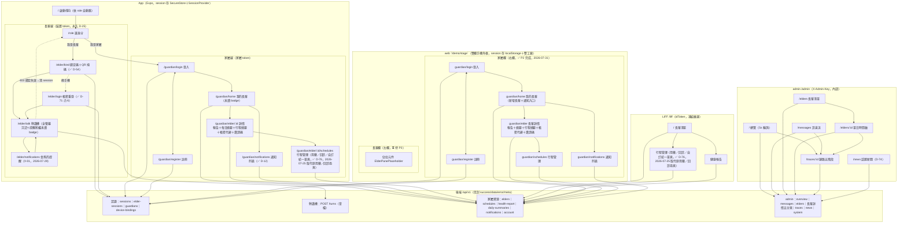

# 前端資訊架構規範 - 金孫 KinSun

> **版本:** v1.18 | **更新:** 2026-07-31 | **狀態:** ✅ 定稿（**P2 全分支審查修正**：§6 web 家屬端六畫面表三列改寫——「首頁」補**空狀態只在真的沒有長輩時才顯示**（載入中／載入失敗各有各的話；後端抖一下時誤報空狀態會讓家屬建出刪不掉的重複長輩，後端無 `DELETE /elders`）與登出入口；「長輩詳情」補**重新產生長輩綁定碼**（`DELETE /device-bindings`，綁定碼在家屬端唯一的重取路徑——碼不在 `GET /elders` 的回應裡，而 P3 有三句錯誤訊息叫長輩「請家人重新產生一組」）＋代辦帳密成功與失敗兩種樣式；「行程管理」補標題帶長輩稱呼、載入失敗不停在「載入中…」、編輯提示改中性樣式；框內導覽段補 `elderName` 隨路由帶入，並新增「登入狀態守衛」一段；**Task 7 審查修正**：§3／§6／§7／頁面總計四處更正 2026-07-25 D-76 統一排程後遺留 6 天的漂移——App「用藥管理」「回診管理」兩頁已合併為單一「行程管理」`schedules.tsx`，App 頁數更正為 12 頁（非 13 頁）；**同一漂移在 LIFF 端一併修正**：§3 圖 `LM`／`LA`（「用藥 CRUD」「回診 CRUD」）合併為單一 `LS` 節點，頁面總計與 §7 路由表的 LIFF 頁數由 4→**3**（`frontend/src/pages/MedicationsPage.tsx`／`AppointmentsPage.tsx` 已隨同一 commit `2d5612b` 刪除，由 `SchedulesPage.tsx` 取代）；§6 web 家屬端六畫面表「行程管理」對照路由更正為 `guardian/elder/:id/schedules`；「首頁」列複製失敗措辭更正為與 `InviteCard.tsx` 實作一致（失敗時按鈕維持原字樣、不另外提示）；**網頁版前端 P2 家屬端完成**（2026-07-31）：§3 全景圖新增 `web/` 家屬欄六畫面框內導覽子圖；§6 新增 web 家屬端六畫面規格（註冊／登入／首頁／長輩詳情／行程管理／通知列表）；§7 路由表附註更新（家屬框內畫面已補齊、長輩端仍待 P3）；**§7 路由表補兩則附註**（P1 全分支審查 I1／I2／I4）：`/demo/stage` 的伺服器端回退、以及舞台與運營狀態 hook 為何掛在路由之上；**網頁版前端 P1 地基**（任務 12，spec 2026-07-30-web-demo-design）：§1／§7 補 `web/` 的兩條路由（`/demo`、`/demo/stage`）；App 13 頁＋admin 7 頁；**新增 /elder/notifications 長輩提醒頁＋對講機鈴鐺未讀 badge**（X-01：提醒落庫後長輩讀不到，D-12 施工紀錄的已知缺口收斂）；對講機改走 WS 長連線＋雙手勢＋D-74 話題新聞頁）
> **MECE 邊界**：本檔只談使用者／內容視角；技術選型見 [12_前端架構規範](12_前端架構規範.md)。

---

## 1. 目的與範圍

三端（App／LIFF／admin）的頁面、旅程、導航與 URL 的單一真實來源；`web/`（2026-07-30 新增，App／LIFF 凍結後唯一演進的前端）的路由另見 §7。家屬框內六畫面已於 P2（2026-07-31）落地並補入本文件（§3／§6）；長輩框內畫面待 P3 落地後併入。

## 2. 設計原則

**核心價值主張：**「長輩按一顆鍵就能說話，家屬打開就看得到狀況。」

| 原則 | 落實 |
| :--- | :--- |
| 簡化 | 長輩端只有一顆說話鍵（按住說話或短按切換皆可）；設定全部由家屬代辦（D-06 ⏸ 擱置；✅ D-71：帳號也由家屬代辦、長輩機只登入一次即永久記住——零學習成本原則不變） |
| 認知負荷 | 每頁一個主要目標；長輩端錯誤一律講人話（「金孫沒聽清楚，再說一次好嗎？」），不用彈窗 |
| 一致性 | 用語字典三端共用（⏳ D-46，終值會議）；同動作同位置 |
| 架構模式 | App＝角色分流後各自層級化；admin＝中心輻射（總覽→鑽取） |
| 漸進揭露 | 長輩端零設定；家屬進階功能（邀請共同家屬）在詳情頁內 |

## 3. 資訊架構總覽

（2026-07-10 階段 F 重畫：依實際頁面樹補齊 App 第 10 頁與 403 回退邊，並納入 LIFF／admin 兩端與後端 API 接點——本圖為三端全景的單一真實來源。）

**頁面總計**：App **12 頁**＋LIFF **3 頁**（清單／行程管理／健康報告——2026-07-25 D-76 統一排程後，原「用藥」「回診」兩頁合併為「行程管理」單頁，`frontend/src/pages/MedicationsPage.tsx`／`AppointmentsPage.tsx` 已刪除，commit `2d5612b`）＋admin **7 頁**（總覽／訊息流／長輩／長輩詳情／鏈路詳情／話題新聞／系統——2026-07-25 D-74 增話題新聞頁）＋`web/` 家屬欄 **6 頁**（註冊／登入／首頁／長輩詳情／行程管理／通知列表，✅ P2 完成，2026-07-31；長輩欄 4 頁待 P3，目前仍是佔位元件）。（2026-07-10 群 7 深潛更正：原記 9 頁，遺漏 `/guardian/notifications`；§3 全景圖於階段 F 重畫時補入。2026-07-12 內測基礎建設 D-73：新增「系統」排程頁；長輩詳情由單頁時間軸改**五分頁**——時間軸／提醒設定／記憶與摘要／帳號與綁定／危急通知。2026-07-12 App 用藥回診編輯：詳情頁下增「用藥管理」「回診管理」兩子頁，App 10→12 頁。2026-07-25 D-76 統一排程：上述兩子頁合併為單一「行程管理」頁（`schedules.tsx` 取代 `medications.tsx`／`appointments.tsx`，commit `2d5612b`），App 12→**11** 頁。2026-07-29 X-01：新增 `/elder/notifications` 長輩提醒頁，App 11→**12** 頁。**2026-07-31 更正**：本行與 §3／§6／§7 三處先前未同步 2026-07-25 的合併，仍寫著已刪除的「用藥管理」「回診管理」兩頁、算成 13 頁，此次一併修正為正確的 12 頁。）

## 4. 核心使用者旅程

### 旅程 A：長輩開口說話（產品核心）

`家屬產綁定碼` → `/elder/bind 掃 QR 或輸入` → `/elder/talk` 按住說→放開送出（或按一下開始、說完再按一下送出）→自動播回覆。心理狀態：不想學操作——所以**綁定後永不再需要任何操作**；換手機／登出後由家人陪同走 `/elder/login` 帳密重登一次（帳密由家屬代辦，✅ D-71 己-6）。

### 旅程 B：家屬掌握狀況

`/guardian/login` → `/guardian/home 長輩列表` → `/guardian/elder/:id`（健康報告＋用藥＋回診＋邀請碼）。to-be：home 加未讀警報 badge、詳情頁掛「新事件」提示（D-12 App 內通知落點）；✅ D-09 已定：家屬可見＝警報＋提醒＋**每日摘要**（詳情頁增摘要區塊或子頁，己-3），逐字對話不開放。

### 旅程 C：維運排查（admin）

`總覽（異常統計）` → `訊息流（找到問題輪，取 trace_id）` → `鏈路詳情（五階段定位卡點）`；或 `長輩清單` → `單日時間軸` → `鏈路詳情`。導航深度 3 層，符合上限。

## 5. 導航結構

- **App**：單 Stack（無 Tabs）；長輩線進 `/elder/talk` 後不再有導航（全螢幕沉浸）；家屬 home `headerBackVisible:false` 為家屬線根。內測模式（D-73）另有「切換身分」元件（`RoleSwitcher`）掛 `/elder/talk` 頂部與 `/guardian/home` 頁尾——非獨立頁面，僅伺服器 `INTERNAL_TESTING_ENABLED` 下發時顯示。
- **LIFF**：頂部「← 返回長輩清單」樹狀返回。
- **admin**：NavLink 五項（總覽／訊息流／長輩／新聞／系統——D-73 增系統頁、D-74 增新聞頁）＋鑽取深頁靠列內連結。

## 6. 頁面規格（關鍵頁）

### /elder/talk 對講機（長輩端唯一主頁）

| 項目 | 內容 |
| :--- | :--- |
| 職責 | 說話→自動播回覆；顯示金孫狀態（idle/listening/thinking/speaking 表情） |
| 主要 CTA | 圓形麥克風鍵（104dp、只放 `MicIcon` 向量圖示、無文字；2026-07-18 由整條大按鈕改成，讓出垂直空間給回覆）；支援**兩種說話手勢**（2026-07-25）：①按住說話（達 `delayLongPress` 500ms 門檻，放開送出）②短按切換（按一下開始聆聽、說完再按一下送出，聆聽中顯示「說完再按一下」提示）。手勢由純邏輯狀態機 `lib/talkGesture.ts` 判定（含單元測試）——不可用 avatar state 判斷手勢：短按時 pressOut 比重繪先到會讀到過期值，曾造成「聆聽中殘留＋二次按壓 `prepareToRecordAsync` 洗掉音檔→識別失敗」bug；停止前先 await 開錄 promise 消除競態 |
| 回覆顯示 | 金孫回覆置於**可捲動**區（ScrollView，2026-07-18）：短回覆置中、長回覆或大系統字級可上滑看完整，字級維持大字不縮——修「回覆區固定高度＋不捲動＋字級放大」三者相加導致的截斷（各機字級不同、截斷程度不一） |
| 資料需求 | `WS /api/v1/ws/talk` 長連線（2026-07-28 起，連線沒開退回 `POST /turns`）；送出時附位置——錄音一開始即發動定位（不 await、不阻擋錄音），送出時才等它；取不到就不帶，對話照常。⚠️ **位置的鍵名兩條路徑一致為 `location`**（WS 走 JSON 訊框 `{location, latitude, longitude}`、POST 走同名 query），本地型別 `ElderPlace` 的欄位名是 `place`，送出前必須改名——直接 `JSON.stringify(place)` 送出，後端讀不到、位置一列都不會寫進庫（2026-07-28 故障：金孫從此每次問地點都反問「您人在哪裡」，兩邊單元測試各自斷言自己那一版契約所以全綠） |
| 權限 | 麥克風與定位皆於**進畫面時**主動請求（2026-07-18）——iOS 系統權限對話框會中斷進行中的錄音工作階段，故不可拖到按住說話當下才問 |
| 音訊工作階段 | 錄音前重新 `setAudioModeAsync({allowsRecording})`（iOS 上一輪 TTS 播放會把工作階段留在播放類別，不重設 record() 收不到聲音）；起始改純觸覺（移除起始提示音——播放與錄音搶同一工作階段會截斷錄音），結束提示音移到 `recorder.stop()` 之後才播（2026-07-18 診斷 iOS 錄音全數 ≤0.72 秒近無聲） |
| 錯誤狀態 | 一律 replyText 人話；403 綁定失效→清 session＋引導重綁 |
| 內測 | `internalTesting` 為真時，頂部顯示麥克風／定位授權狀態列（正式環境不顯示） |
| to-be | 虛擬形象替換 AvatarPlaceholder 內部（D-08 預留）；錄音觸覺＋音效回饋已落地（✅ D-48 丁-2） |

### /elder/notifications 金孫的提醒（X-01，2026-07-29）

| 項目 | 內容 |
| :--- | :--- |
| 職責 | 長輩端的用藥／回診提醒與主動關懷列表，最近先；開啟即以最新一筆更新已讀水位 |
| 入口 | `/elder/talk` 頂部鈴鐺（56dp，比 48dp 最小可觸控目標再放大——長輩手指粗、又常戴老花）；未讀時右上角紅色 badge，超過 9 顯示「9+」 |
| 資料需求 | `GET /api/v1/elder-notifications`（長輩 token；本人 App 綁定 `external_id`，limit 50、新到舊） |
| 已讀機制 | 水位存 SecureStore，**依角色分鍵**（`kinsun_elder_notifications_seen_at`）——內測「切換身分」讓同一台裝置會有兩種角色，共用一支鍵會讓長輩看完提醒後家屬的未讀數也被清掉。家屬沿用原鍵名，避免既有裝置升版後未讀數整批復活 |
| 版面 | 不與家屬版共用元件：長輩版字級 21／行距 32、返回鍵 56dp——共用會讓兩邊排版約束互相拉扯 |
| 用詞 | 不用「通知」二字（長輩不熟這個詞）：標題「金孫的提醒」、返回鍵「回去講話」、空狀態「現在沒有要提醒您的事。時間到了金孫會跟您說。」 |
| 為什麼要有 | 提醒送出＝`AppOutboundChannel` 落一筆 `app_notifications`，先前只有家屬讀得到且只查家屬自己的 `external_id`，寫給長輩的那一列誰都讀不到（D-12 施工紀錄的已知缺口） |
| to-be | 真推播（D-08 階段 5）到位後本頁仍是推不到（App 未開、token 失效、換機）時的補拉路徑，不被取代 |

### /guardian/home 我的長輩

| 項目 | 內容 |
| :--- | :--- |
| 職責 | 長輩列表＋新增長輩（產綁定碼） |
| 主要 CTA | 新增長輩 |
| to-be | 無——綁定碼複製鈕＋QR 顯示（✅ D-54 丁-3）與未讀警報 badge（✅ D-12 甲-6）皆已落地 |
| 空狀態 | 「還沒有長輩——新增第一位」引導 |

### /guardian/elder/:id 長輩詳情

| 項目 | 內容 |
| :--- | :--- |
| 職責 | 健康報告（近 30 天危急＋提醒）＋**每日摘要**（✅ D-09 己-3 已落地）＋用藥／回診（清單＋管理子頁入口，✅ 2026-07-12 App 版編輯落地）＋家屬邀請碼＋**長輩帳密代辦**（✅ D-71 己-6） |
| 資料需求 | `GET /health-report`、`GET /daily-summaries`、用藥／回診清單查詢、`POST /guardian-invites`、`PUT /account`；`useFocusEffect` 返回重載（管理子頁編輯後即反映） |
| to-be | 詳情頁「新事件」badge（D-12 通知頁已有，詳情頁未做） |

### /guardian/elder/:id/schedules 行程管理（✅ D-76 統一排程，2026-07-25 起）

> ⚠️ **2026-07-31 更正**：本節先前寫的是「/medications 用藥管理 ＆ /appointments 回診管理」兩個獨立畫面，但這兩支路由（`app/src/app/guardian/elder/[elderId]/medications.tsx`／`appointments.tsx`）與後端對應端點已在 D-76 統一排程時（2026-07-25，commit `2d5612b`「行程頁取代用藥與回診兩個畫面」）一併刪除，App 現況只有單一 `schedules.tsx`。此漂移存在了 6 天未同步，本次隨 P2 施工一併修正（連動 §3 全景圖 HM／HA 兩節點合併、§7 路由表、頁面總計）。

| 項目 | 內容 |
| :--- | :--- |
| 職責 | 用藥／回診／自訂三種提醒的新增／編輯／刪除（同頁清單＋表單，行為比照 LIFF／`web/`）；刪除掛系統確認框 |
| 入口 | 詳情頁「管理行程」按鈕 |
| 資料需求 | `/api/v1/elders/:id/schedules` 的 GET／POST／PUT／DELETE（家屬 token；`medications`／`appointments` 兩支舊端點已隨舊表 DROP 一併退役，不可再用） |
| 輸入 | 提醒類型（用藥／回診／其他）決定「時間」欄位問法：用藥選時段多選 chips（早上／中午／晚上／睡前，或直接填時刻）；回診填日期（可省略時刻，系統日期選擇器）；其他填重複方式（例：每天 17:00、每週三 15:00） |
| 錯誤狀態 | 前端擋空值與看不懂的時間格式（送出鈕停用／就地提示）；後端 400 以信封繁中訊息顯示 |
| 空狀態 | 「還沒有任何提醒，從下方新增第一筆。」 |

### /guardian/notifications 通知列表（✅ D-12 已落地；2026-07-10 補入 IA）

| 項目 | 內容 |
| :--- | :--- |
| 職責 | 家屬端 App 內通知列表——危急警報／提醒／主動關懷皆落於此；開啟即以最新一筆更新已讀水位 |
| 入口 | `/guardian/home` 的未讀 badge |
| 資料需求 | `GET /api/v1/notifications`（家屬 token；聚合本人全部 App 綁定，limit 50、新到舊） |
| 已讀機制 | 水位存 App 端 SecureStore，**後端不做已讀狀態** |
| 空狀態 | 「目前沒有新通知」 |

### web/ 家屬端六畫面（`/demo/stage` 右欄，✅ P2 完成，2026-07-31）

與 App 家屬端一對一對應（見 spec `2026-07-30-web-demo-design.md` §5.4），但**不進瀏覽器網址列**——框內切換是 `nav/useScreenStack` 的元件狀態（`push`／`back`／`reset`），兩欄各自一份堆疊、互不干擾。

| 畫面 | 對應 App 路由 | 職責 | 資料需求 | 備註 |
| :--- | :--- | :--- | :--- | :--- |
| 註冊 | `guardian/register` | Email＋密碼＋姓名建立帳號並自動登入 | `POST /api/v1/guardians` | 密碼未滿 8 碼前端先擋不打後端；Email 已註冊顯示可操作訊息並引導登入 |
| 登入 | `guardian/login` | Email＋密碼登入 | `POST /api/v1/sessions` | 帳密錯誤僅顯示訊息、不清除既有 session、不跳轉 |
| 首頁 | `guardian/home` | 長輩列表＋新增長輩（產生綁定碼＋QR＋複製）＋通知入口＋登出 | `GET/POST /api/v1/elders`、`DELETE /api/v1/sessions` | ⚠️ **空狀態只在真的沒有長輩時才顯示**：載入中顯示「載入中…」、載入失敗顯示「載入失敗，請稍後再試。」——後端抖一下時對已有長輩的家屬說「還沒有長輩檔案，先在上面建立一位吧」，他照做就建出一筆**刪不掉**的重複長輩（後端無 `DELETE /elders`）。列表的載入失敗畫在清單位置、不畫在「新增長輩」表單內（黏在表單下方會被讀成「建立失敗」）；不謊稱已複製（失敗時按鈕維持原字樣，不另外提示——`InviteCard.tsx` 刻意不跳錯誤對話框，碼本身仍顯示在畫面上可自行手抄） |
| 長輩詳情 | `guardian/elder/:id` | 健康報告（危急事件分級＋原話）＋每日摘要＋行程摘要＋代辦長輩帳密＋**重新產生長輩綁定碼**＋家屬邀請碼 | `GET /health-report`、`/daily-summaries`、`/schedules`；`POST /guardian-invites`；`PUT /account`；`DELETE /device-bindings` | 三支資料各自獨立降級（`Promise.allSettled`），一支失敗不拖累其餘兩支；代辦帳密的成功與失敗走兩種樣式（成功 `NoticeText`／失敗紅字 `ErrorText`），改動號碼或密碼時清掉上一次的結果；**「重新產生長輩綁定碼」是綁定碼在家屬端唯一的重取路徑**（碼不在 `GET /elders` 的回應裡，首頁那份只活在建立當下的暫態 state），成功後重用 `InviteCard` 顯示新碼＋QR＋複製。⚠️ 此操作會撤銷長輩已綁定的裝置與全部 token（LINE 綁定不動），後果寫在按鈕**上方**、按下去之前就看得到，並點明它與下方「產生家屬邀請碼」的差別 |
| 行程管理 | `guardian/elder/:id/schedules` | 用藥／回診／自訂 × 一次／每日／每週提醒的新增、修改、刪除 | `POST/PUT/DELETE /api/v1/elders/:id/schedules` | 標題帶長輩稱呼（「王阿嬤的行程管理」）——家屬管兩位以上長輩時，光「行程管理」四個字沒告訴他正在編誰的；時間格式看不懂就地擋下不送出；刪除需二次確認；回診固定產生前一天＋當天兩個鬧鐘；清單載入失敗顯示錯誤、不停在「載入中…」；按「編輯」後的「請重新填一次提醒時間」是**操作指示不是錯誤**，走中性樣式（`role="status"`） |
| 通知列表 | `guardian/notifications` | 警報／提醒／關懷通知，最近先；開啟即把已讀水位推到最新一則 | `GET /api/v1/notifications` | 已讀水位存 `localStorage`，**依角色分鍵**（`kinsun_web_seen_at_guardian`，與長輩端 `kinsun_web_seen_at_elder` 分開）；清單為空時不歸零水位（歸零會讓舊通知整批復活成未讀） |

框內導覽：登入／註冊互轉；登入或註冊成功 `reset` 到首頁（清空堆疊，返回鍵不出現）；首頁 `push` 長輩詳情／通知列表；長輩詳情 `push` 行程管理（`elderId` 與 `elderName` 一起帶，行程頁標題要用）；`stack.depth > 1` 才顯示返回鍵。`GuardianRoute` 為六名成員的聯集型別，`GuardianApp` 的 `switch` 窮盡涵蓋全部六種、`default` 分支為 `never` 型別檢查（新增路由忘記接畫面時編譯期即報錯，不必等執行到那一格才白畫面）。

登入狀態守衛：`session` 變成 `null`（登出，或任何一支端點回 401 被 `makeSignOutOnAuthError` 清掉）時一律 `reset` 回登入畫面——留在原畫面的話，上面會停著最後一次成功載入的資料，家屬會據此以為長輩一切正常。登入頁與註冊頁的 401 **不走**這條（那裡的 401 是「帳號或密碼不對」，要顯示給人看，不是把還沒進來的人踢出去）；其餘後端錯誤一律照實顯示後端訊息（已是繁中人話，D-24），只有真正連不上才說「連線失敗」。

### /elder/bind 綁定（✅ D-54 QR 掃碼已落地）

| 項目 | 內容 |
| :--- | :--- |
| 職責 | 掃 QR（`expo-camera` CameraView）或手動輸入綁定碼→換裝置 token→直達對講機 |
| 錯誤狀態 | 邀請碼過期／已用／次數上限一律人話；提供「用帳密登入」次要入口（→ `/elder/login`） |

（LIFF 3 頁與 admin 7 頁規格從略——職責單一且已在 §3 圖示；admin 導航深度 3 已驗證。）

## 7. URL 結構與路由表

命名：小寫、資源語意；App 為原生路由（expo-router 檔案路由），URL 概念僅 web 端適用。

| 路由 | 端 | 認證 | 角色 |
| :--- | :--- | :--- | :--- |
| `/`、`/role` | App | 否 | 任意 |
| `/elder/bind` | App | 否（憑綁定碼） | 長輩 |
| `/elder/login` | App | 否（憑帳密，✅ D-71） | 長輩 |
| `/elder/talk` | App | 裝置 token | 長輩 |
| `/elder/notifications` | App | 裝置 token | 長輩（✅ X-01，2026-07-29：金孫的提醒） |
| `/guardian/login`、`/register` | App | 否 | 家屬 |
| `/guardian/home`、`/guardian/elder/:id` | App | 家屬 token | 家屬 |
| `/guardian/elder/:id/schedules` | App | 家屬 token | 家屬（✅ D-76 行程管理單頁，2026-07-25 取代原「用藥管理」「回診管理」兩頁；2026-07-31 更正本行） |
| `/guardian/notifications` | App | 家屬 token | 家屬（✅ D-12；2026-07-10 補入，原表遺漏） |
| `/liff/*`（3 頁） | web | LIFF idToken | 家屬（凍結，App 定稿後跟進 D-53） |
| `/admin/*`（7 頁） | web | X-Admin-Key | 內部 |
| `/demo` | web（`web/`） | 否（公開展示） | 任意（開場運營狀態頁；P1 地基，2026-07-30） |
| `/demo/stage` | web（`web/`） | 否（雙欄各自登入） | 任意（雙欄舞台；直接開啟不播撕裂動畫、按重整不 404） |

> ⚠️ `/demo/stage` 這條網址在磁碟上不存在——`navigate(..., {replace: true})` 讓網址真的變成它，所以按重整、或把網址複製給別人，都會直接向伺服器要這條路徑。回退由後端 `_SpaStaticFiles` 提供（`src/kinsun/app.py`，`/liff`／`/admin` 同享），只對「最後一段沒有副檔名」的路徑回 `index.html`。
>
> ⚠️ 舞台元件掛在 `<Routes>` **外面**（`web/src/App.tsx`）：放進去的話 `navigate("/stage")` 會把開場那棵子樹（含撕裂動畫期間先掛好的舞台）整個卸載重掛，「動畫期間就已經在載」完全不成立，而且是靜默的。運營狀態的 hook 同理住在路由之上——撕裂動畫會卸載 `GatePage`，狀態留在裡面的話撕開瞬間會閃回「正在確認服務狀態…」。
>
> `web/` 只有這兩條瀏覽器路由——手機外框**內部**的長輩／家屬畫面切換是元件狀態、不進網址列（兩欄同時存在，搶同一條網址只會互相覆蓋）。P1 地基階段框內畫面皆為佔位元件（`ElderPanePlaceholder`／`GuardianPanePlaceholder`，`web/src/stage/StagePage.tsx`）；**家屬欄六畫面已於 P2（2026-07-31）落地**（`GuardianApp` 取代 `GuardianPanePlaceholder`，規格見 §6「web/ 家屬端六畫面」）；長輩欄 4 畫面（對應 App 既有頁面，清單見 spec `2026-07-30-web-demo-design.md` §5.4）待 P3（長輩端與對講機）落地後補上本節。

## 8. 跨頁資料模型

| 來源 → 目標 | 載體 | 內容 | 理由 |
| :--- | :--- | :--- | :--- |
| 登入／綁定 → 各頁 | SecureStore `kinsun_session`＋`SessionProvider` Context（✅ D-45 已落地；文檔原稱 AuthProvider，實體名為 `SessionProvider`） | role＋token＋display_name（對應後端資源鍵 `name`） | 敏感、跨頁不變 |
| home → 詳情 | 路由參數 `:elderId` | elder_id | 可回溯 |
| 綁定碼 | 畫面顯示＋複製＋QR（✅ D-54 已落地） | 一次性代碼 | 不落 URL（機密） |
| 通知已讀水位 | SecureStore `kinsun_notifications_seen_at` | epoch 秒 | 後端不做已讀狀態 |

> **契約**：三端 JSON 一律 snake_case 直讀不轉換（`shared/types.ts`）；信封 `{success,data,error,meta}` 與後端逐欄一致。`POST /elders` payload 已三端統一 `{name}`（✅ 庚-29，F-9 結案）。

## 9. IA 檢查清單

- [x] 每頁單一職責＋一個主 CTA
- [x] 導航深度 ≤3（App 單 Stack；admin 鑽取 3 層已驗證）
- [x] 空狀態有下一步引導（home／notifications 已做）
- [x] 家屬可見範圍頁面調整——✅ D-09（每日摘要）己-3 已落地於詳情頁
- [x] 錯誤狀態人話化（長輩端；`elder/talk` 403→清 session 導回 `/role` 重綁已實證）
- [x] 頁面清單與程式一致（2026-07-10 群 7 深潛：App 實為 **10 頁**，補入 `/guardian/notifications`；2026-07-12 增用藥／回診管理兩子頁為 **12 頁**）
- [x] web 端錯誤用語統一——字串常數三端集中（✅ 庚-31）＋admin tier 改 `adminTierLabel`（✅ 庚-27）；字典終值仍 ⏳（會-9 擱置，F-7）

## 變更紀錄

| 版本 | 日期 | 變更 |
| :--- | :--- | :--- |
| v1.18 | 2026-07-31 | **P2 全分支審查修正**（1 Critical＋4 Important＋5 Minor）：§6 web 家屬端六畫面表三列改寫——「首頁」補「空狀態只在真的沒有長輩時才顯示」（Critical：`listElders` 失敗時 `elders` 停在 `[]`，畫面同時說「載入失敗」與「還沒有長輩檔案，先在上面建立一位吧」，家屬照做就建出一筆刪不掉的重複長輩；另載入失敗原本畫在「新增長輩」表單內、會被讀成「建立失敗」）與登出入口；「長輩詳情」補**重新產生長輩綁定碼**（`DELETE /elders/{elder_id}/device-bindings`，後端早已存在但三端都沒有呼叫端；這是綁定碼在家屬端唯一的重取路徑，先前建立長輩後點進詳情頁再返回碼就永久遺失，而 P3 的 `invite_used`／`invite_expired`／`too_many_attempts` 三句都叫長輩「請家人重新產生一組」）＋代辦帳密成功與失敗兩種樣式（原本共用同一個灰色小字，409 `phone_taken` 會被讀成設定成功）；「行程管理」補標題帶長輩稱呼、清單載入失敗不停在「載入中…」、「請重新填一次提醒時間」由紅字警示改中性樣式；框內導覽段補 `elderName` 隨 `schedules` 路由帶入，並新增「登入狀態守衛」一段（401 與登出一律退回登入畫面；登入／註冊頁的 401 例外） |
| v1.17 | 2026-07-31 | **Task 7 審查修正**：更正 §3 全景圖（App：`HM`／`HA` 兩節點合併為單一 `HS` 節點；LIFF：`LM`／`LA`（用藥 CRUD／回診 CRUD）同理合併為單一 `LS` 節點；REST 節點文字移除已退役的 `medications｜appointments`）、§6「/guardian/elder/:id/medications 用藥管理 ＆ /appointments 回診管理」整節改寫為「/guardian/elder/:id/schedules 行程管理」、§7 路由表對應列（含 LIFF「4 頁」→「3 頁」）、頁面總計（App 13→**12** 頁、LIFF 4→**3** 頁）——五處皆源於 2026-07-25 D-76 統一排程（commit `2d5612b`「行程頁取代用藥與回診兩個畫面」，App 與 LIFF 同一個 commit 一起改）後遺留 6 天未同步的漂移；§6 web 家屬端六畫面表「行程管理」列的「對應 App 路由」更正為 `guardian/elder/:id/schedules`（非泛稱「管理入口」）；「首頁」列複製失敗措辭更正為與 `InviteCard.tsx` 實作一致 |
| v1.16 | 2026-07-31 | **網頁版前端 P2 家屬端完成**：§3 全景圖新增 `WebEnd` 子圖（家屬欄六畫面框內導覽＋長輩欄佔位）；§6 新增「web/ 家屬端六畫面」規格表（註冊／登入／首頁／長輩詳情／行程管理／通知列表，含資料需求與已讀水位分鍵設計）；§7 附註更新（家屬框內畫面不再是佔位、長輩端仍待 P3）；§1 範圍敘述同步；頁面總計補 `web/` 家屬欄 6 頁 |
| v1.0 | 2026-07-08 | 初版：三端 IA＋三旅程＋關鍵頁規格 |
| v1.1 | 2026-07-09 | 會議決議回填：D-09 家屬可見加每日摘要、D-06 擱置；標註 D-71 長輩帳密對長輩線的影響 |
| v1.2 | 2026-07-09 | D-71 細節定案：家屬代辦帳密＋長輩登入一次永久記住＋邀請碼/QR 保留配對 |
| v1.3 | 2026-07-10 | 群 7 深潛回填：頁面總計更正為 App 10 頁；§6 補 `/guardian/notifications`、`/elder/bind` 規格與詳情頁己-3／己-6 落地；§7 路由表補第 10 頁；§8 跨頁資料模型補 SessionProvider 現況＋已讀水位＋契約註；§9 檢查清單更新 |
| v1.4 | 2026-07-10 | **階段 F 收斂**：§3 資訊架構總覽圖重畫——三端全景（App 10 頁含 403 回退邊＋LIFF 4 頁＋admin 5 頁）＋後端 `/api/v1` 四類接點，取代原本只畫 App 的簡圖 |
| v1.5 | 2026-07-12 | 內測基礎建設（D-73，PR #45）：admin 更正為 6 頁（新增系統排程頁；長輩詳情改五分頁）；§5 導航補 admin 第四項 NavLink 與 App 內測 RoleSwitcher（非頁面）；§3 圖 ADM 節點同步 |
| v1.6 | 2026-07-12 | App 用藥回診編輯落地（spec：superpowers/specs/2026-07-12-app用藥回診編輯-design.md）：App 10→**12 頁**（詳情頁下增用藥管理／回診管理兩子頁）；§3 圖補 HM／HA 節點；§6 詳情頁職責更新（唯讀→管理入口＋focus 重載）並新增兩子頁規格；§7 路由表補一列 |
| v1.7 | 2026-07-17 | 對齊現況：對講機規格補位置附帶（不阻擋錄音、取不到就不帶）；D-48／D-54／D-12 已落地項自 to-be 移除；F-9／F-10 結案回填（庚-29／庚-27） |
| v1.8 | 2026-07-18 | 對講機修 iOS 錄音（診斷：iOS 錄音全數 ≤0.72 秒近無聲）——麥克風／定位改進畫面即請求（免對話框中斷錄音）、錄音前重設音訊工作階段、起始提示音改純觸覺、結束提示音移到停止後；補內測權限狀態列 |
| v1.9 | 2026-07-18 | 對講機版面：整條「按住說話」大鍵改 104dp 圓形麥克風鍵（`MicIcon` 向量圖、無文字）；回覆改可捲動（ScrollView），修各機字級不同導致的回覆截斷 |
| v1.10 | 2026-07-25 | 對講機手勢改雙模式：按住說話（≥500ms 放開送出）＋短按切換（按一下開始、再按一下送出）；修「短按殘留聆聽中、二次按壓洗掉音檔致識別失敗」競態——手勢抽成純邏輯狀態機 `lib/talkGesture.ts`（9 個單元測試），停止前 await 開錄 promise |
| v1.11 | 2026-07-25 | admin 6→7 頁（D-74 話題新聞頁 /news：近 N 天爬取清單、標題連原文、範圍選擇）；§3 圖 ADM 節點＋§5 NavLink 五項＋§7 路由表同步（與同日雙手勢 v1.10 撞號，合併時重排） |
| v1.12 | 2026-07-28 | 對講機資料需求對齊 WS 長連線現況（辛-19 改接時未同步）；並載明位置鍵名兩路徑一律 `location`——辛-20 修的正是 App 端把本地型別欄位名 `place` 直接送上線路，導致位置整晚沒寫進庫、金孫每次問地點都反問「您人在哪裡」 |
| v1.15 | 2026-07-31 | §7 路由表補兩則附註（P1 全分支審查 I1／I2／I4）：①`/demo/stage` 在磁碟上不存在，按重整會直接向伺服器要這條路徑——回退由 `_SpaStaticFiles` 提供（`/liff`／`/admin` 同享）；②舞台元件與運營狀態 hook 掛在 `<Routes>` 之上，否則 `navigate("/stage")` 會把動畫期間先掛好的舞台整棵卸載重掛（「動畫期間就已經在載」靜默失效），撕裂動畫也會把 `GatePage` 的狀態洗掉、畫面閃回「正在確認服務狀態…」 |
| v1.14 | 2026-07-31 | 網頁版前端 P1 地基（任務 12，spec 2026-07-30-web-demo-design）：§1 補三端→四端說明；§7 路由表新增 `/demo`、`/demo/stage` 兩列＋一則附註（框內畫面為元件狀態不進網址列；P1 僅完成佔位元件，長輩／家屬實際畫面待 P2／P3） |
