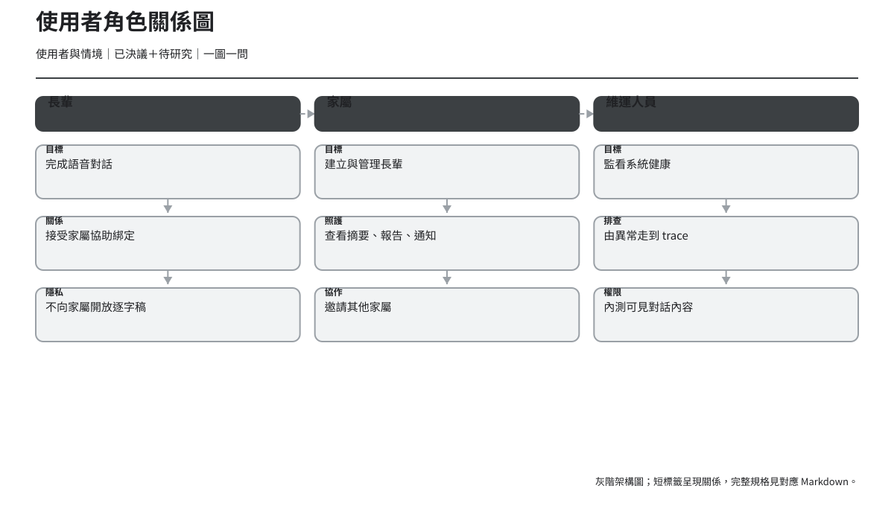
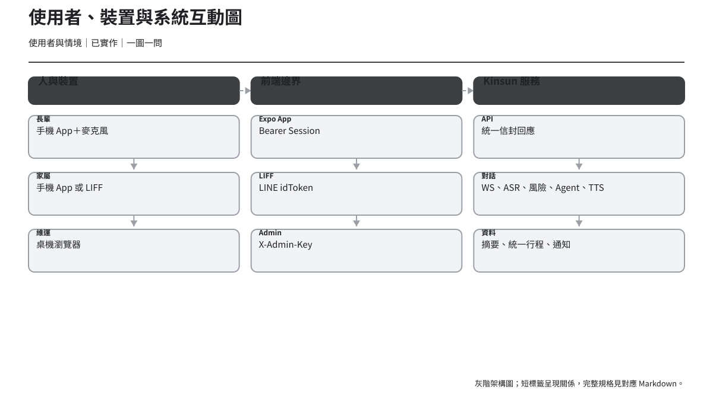
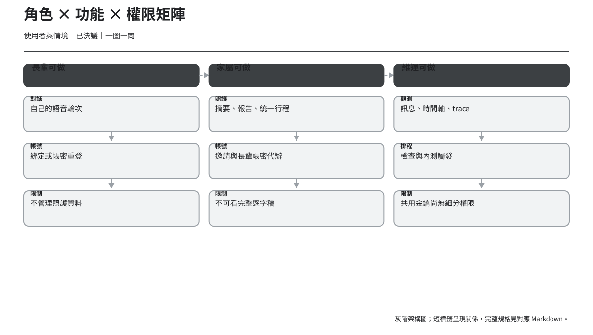

# 使用者角色與情境

> 版本：v1.2｜日期：2026-07-30｜狀態：第一階段評審稿；已同步統一行程與長輩提醒
> 重要：以下是依產品範圍建立的 **Proto-persona**，不是訪談、田野研究或量化研究驗證過的正式 Persona。

## 1. 使用者關係

## 2. Proto-persona A：長輩

| 面向 | 內容 | 證據 |
| --- | --- | --- |
| 核心目標 | 用最少步驟和金孫說話；清楚知道系統有沒有在聽、思考與回答。 | `已決議＋推論` |
| 主要情境 | 家屬先準備裝置；長輩掃 QR／輸入碼；之後可按住放開或短按兩次完成說話；換機時以帳密重登。 | `已實作` |
| 可能痛點 | 不熟悉權限設定、看不懂技術訊息、按住手勢不穩、短按後不知道還要再按一次、等待時不知道是否故障。 | `待研究` |
| 主要任務 | 綁定、帳密重登、允許麥克風、完成一次語音對話、從 403 回復。 | `已實作` |
| 數位能力假設 | 不預設熟悉智慧型手機；流程必須可由家屬協助，但核心對話應能自行完成。 | `推論＋待研究` |
| 無障礙需求 | 大字、48pt 以上操作區、104dp 麥克風、清楚焦點順序、動態狀態公告、非色彩單一提示。 | `已決議＋待研究` |
| 資訊權限 | 只操作自己的 Session 與對話；不管理家屬或照護資料。 | `已實作` |
| 成功定義 | 不需理解 Session、Token、ASR 等詞彙，即能完成說話並收到可聽、可讀回覆。 | `推論` |

### 代表情境

1. **第一次使用**：家屬在旁提供 QR Code，長輩需要知道相機用途，以及掃描成功後的下一步。
2. **每天聊天**：打開 App 後直接到對話，選擇按住說話後放開，或短按開始、再按一次送出；等待期間有多模態回饋。
3. **權限拒絕**：不是只顯示「permission denied」，而是提供「開啟設定」與可請家屬協助的步驟。
4. **換手機／綁定失效**：清楚區分「用既有帳密重登」與「取得新綁定碼」。

### 不能替長輩做的假設

- 不能假設能閱讀長段落、英文或技術錯誤碼。
- 不能假設知道長按、滑動、返回手勢或系統設定位置。
- 不能假設聽覺、視覺、手部穩定度與記憶能力一致。
- 不能假設願意或能開啟定位。
- 不能假設觸覺或音效一定可感知。
- 不能把「家屬可協助」當成跳過長輩可用性的理由。

## 3. Proto-persona B：家屬

| 面向 | 內容 | 證據 |
| --- | --- | --- |
| 核心目標 | 建立與管理長輩、協助綁定、掌握摘要與需留意事件、維護統一行程。 | `已實作＋已決議` |
| 主要情境 | 註冊／登入、新增長輩、分享綁定碼、查看詳情、處理通知、邀請其他家屬。 | `已實作` |
| 可能痛點 | 同時照護多人、時間壓力、無法判斷空資料是否真的沒事、通知嚴重度不清。 | `推論＋待研究` |
| 主要任務 | 新增長輩、行程 CRUD（吃藥／回診／其他）、看摘要與報告、設定長輩帳密、查看通知。 | `已實作` |
| 數位能力假設 | 熟悉一般表單與手機導覽，但不預設理解照護資料處理、綁定碼期限或風險等級。 | `推論＋待研究` |
| 無障礙需求 | 清楚 label、鍵盤不遮擋、錯誤摘要、非色彩嚴重度、文字縮放、刪除確認。 | `推論` |
| 資訊權限 | 可看所連結長輩的危急事件、提醒與每日摘要；不可看完整逐字對話。 | `已決議` |
| 成功定義 | 能迅速知道「哪位長輩、何時、發生什麼、下一步做什麼」，且不越過隱私邊界。 | `推論` |

### 代表情境

1. **建立第一位長輩**：先理解代辦同意，再取得綁定 QR／代碼並協助長輩。
2. **日常照護**：由首頁進入長輩詳情，分區閱讀摘要、健康報告與全部行程。
3. **收到需留意事件**：通知必須用文字說清楚嚴重程度、時間、長輩與建議下一步。
4. **家庭協作**：產生家屬邀請碼前，清楚說明受邀者可見範圍。

### 不能替家屬做的假設

- 不能假設所有家屬都具醫療背景或知道風險等級。
- 不能假設手機永遠只有一位照護者使用。
- 不能把「無資料」寫成「健康正常」。
- 不能假設通知讀取狀態會跨裝置同步；現況只有本機 waterline。
- 不能因照護需求而開放未獲授權的逐字對話。
- 不能假設通知文案本身足以推導資料類別；需先有 API 契約。

## 4. Proto-persona C：內部維運人員

| 面向 | 內容 | 證據 |
| --- | --- | --- |
| 核心目標 | 監看系統健康、定位異常輪次、判斷第一個失敗階段與是否要人工處理。 | `已實作＋推論` |
| 主要情境 | 看總覽告警、查訊息流／長輩、進單日時間軸、打開 trace、看排程狀態。 | `已實作` |
| 可能痛點 | 大量訊息下定位慢、缺篩選、階段資料部分缺失、共用金鑰缺人員別追溯。 | `推論＋待研究` |
| 主要任務 | 異常排查、訊息回翻、trace 檢查、提醒／記憶／帳號／通知送達查詢、排程檢查。 | `已實作` |
| 數位能力假設 | 可理解 trace、狀態碼與延遲，但不假設知道每個服務內部細節。 | `推論＋待研究` |
| 無障礙需求 | 鍵盤操作、清楚表格標頭、tab 語意、焦點可見、錯誤不只靠紅色。 | `推論` |
| 資訊權限 | 現階段 Admin Key 可讀完整對話內容；屬內測調適用途且缺細分權限。 | `已決議＋已實作` |
| 成功定義 | 從異常指標到失敗 trace 的步驟少、每一層保留時間與識別碼脈絡。 | `推論` |

### 代表情境

1. **即時異常**：總覽出現告警，維運人員用時間與階段縮小範圍。
2. **個案排查**：從長輩詳情時間軸選一輪，檢查 Webhook、ASR、RAG、風險、LLM、TTS 與回覆。
3. **排程檢查**：查看上次執行時間與 RAG active release，必要時在內測環境手動執行。

### 不能替維運人員做的假設

- 不能假設每個人都應看到完整對話與錄音。
- 不能假設共用 Admin Key 能提供足夠稽核性。
- 不能假設「紅色」就足以指出失敗或嚴重度。
- 不能假設缺資料等於該階段成功。
- 不能把尚無介面的處理註記或策略管理寫成已存在。

## 5. 角色 × 功能 × 權限矩陣

| 功能／資料 | 長輩 | 家屬 | 維運人員 | 證據 |
| --- | --- | --- | --- | --- |
| 語音對話 | 自己，可建立 turn | 不直接操作 | 可於 Admin 觀測 | `已實作` |
| 裝置綁定 | 使用綁定碼 | 產生綁定碼 | 查看綁定資料 | `已實作` |
| 長輩帳密 | 登入 | 設定／重設 | 查看帳號狀態，不看密碼 | `已實作` |
| 長輩清單 | 不適用 | 只看已連結長輩 | 看全部長輩 | `已實作` |
| 統一行程 | 不直接管理；可用語音交代其他提醒 | CRUD 吃藥／回診／其他 | 唯讀觀測與送達 | `已實作` |
| 健康報告 | 不在目前長輩 UI | 可看 | 可看風險與提醒 | `已實作` |
| 每日摘要 | 不在目前長輩 UI | 可看 | 可看 | `已決議＋已實作` |
| 完整逐字對話 | 自己在當輪只看系統回覆 | **不可看** | 內測可看 | `已決議` |
| App 通知／提醒 | 可讀自己的「金孫的提醒」 | 可看 | 可看送達 | `已實作` |
| 排程與 RAG 狀態 | 不可 | 不可 | 可看；內測可觸發工作 | `已實作` |
| 策略管理 | 不可 | 不可 | 前端尚無對應頁面 | `已實作＋待決策` |

## 6. 待研究問題

| 角色 | 研究問題 | 建議方法 | 成功指標候選 |
| --- | --- | --- | --- |
| 長輩 | 雙手勢能否被自行發現、理解並完成？ | 5–6 位不同數位能力長輩的任務測試 | 首選手勢、無協助完成率、誤送／漏送次數 |
| 長輩 | 權限拒絕後能否自行或在口頭協助下回復？ | 情境式可用性測試 | 回復率、需要提示次數 |
| 長輩 | Listening／Thinking／Speaking 的文字、音效、觸覺組合是否清楚？ | 實機狀態辨識測試 | 各狀態辨識正確率 |
| 家屬 | 首頁資訊是否能支援多人照護的快速判讀？ | 卡片排序與資訊層級測試 | 找到指定長輩／事件時間 |
| 家屬 | 每日摘要與危急事件如何避免被誤解為醫療診斷？ | 文案理解訪談 | 嚴重度與下一步理解正確率 |
| 維運 | 從告警到失敗 trace 的真實路徑與常用篩選為何？ | 情境訪談＋操作紀錄 | 定位時間、往返頁數 |

所有研究結果應回寫證據等級；在研究完成前，不能加入虛構引言或將上述假設稱為「使用者需求已驗證」。
