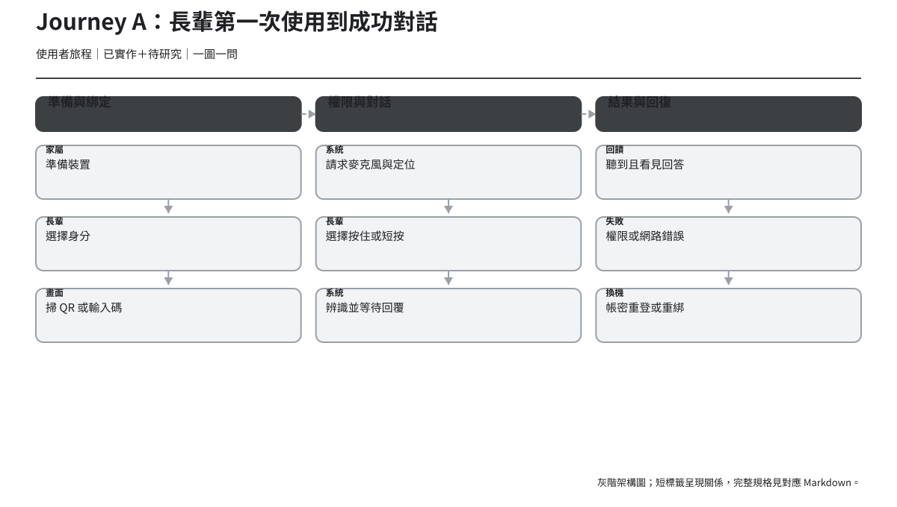
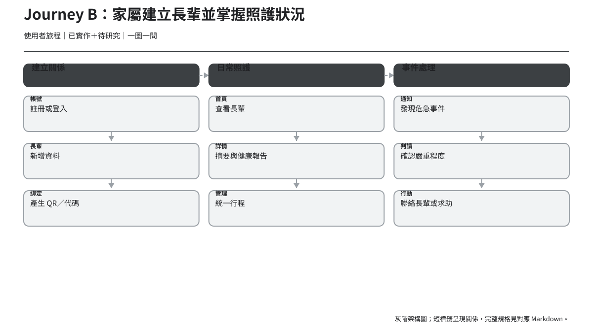
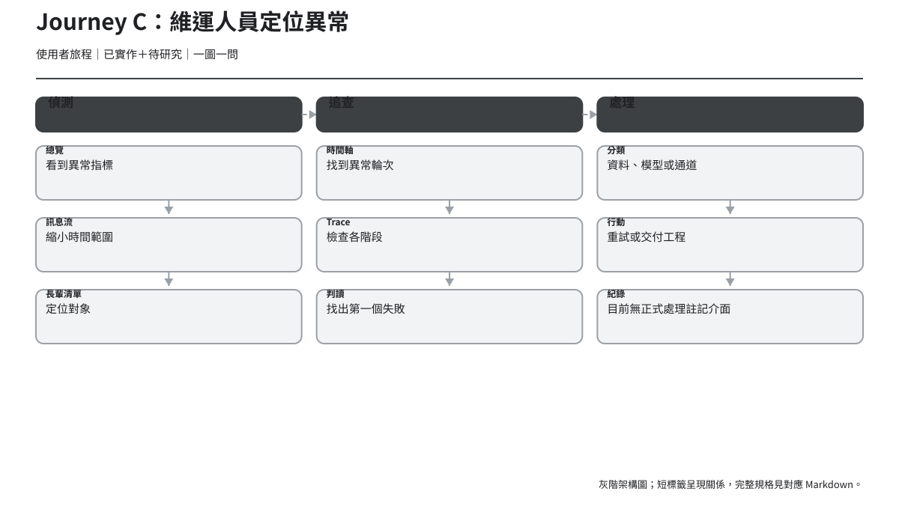

# 使用者旅程地圖

> 版本：v1.2｜日期：2026-07-30｜狀態：第一階段評審稿；已同步 WS 等待與統一行程
> Journey Map 描述一段跨接觸點經驗；不是單頁操作流程。想法與情緒均為待研究假設，不使用虛構引言。

## Journey A：長輩第一次使用到成功對話

### 行動與接觸點

| 階段 | 使用者目標 | 行動 | 接觸點 | 畫面 | 證據 |
| --- | --- | --- | --- | --- | --- |
| 1. 家屬準備裝置 | 知道接下來要做什麼 | 接過家屬準備好的手機 | 家屬口頭協助、App | 家屬首頁綁定碼、角色頁 | `推論＋待研究` |
| 2. 選擇身分 | 進入適合自己的流程 | 點「我是長輩」 | Expo App | `/role` | `已實作` |
| 3. 綁定 | 把手機連到自己的資料 | 掃 QR 或輸入代碼 | 相機、鍵盤、API | `/elder/bind` | `已實作` |
| 4. 權限 | 讓系統聽見說話 | 回應麥克風與定位請求 | OS 權限對話框 | `/elder/talk` 首次狀態 | `已實作` |
| 5. 開始說話 | 清楚開始與停止 | 按住說話後放開，或短按開始、再按一次送出 | 104dp 按鈕、文字、觸覺、音效 | Listening | `已實作` |
| 6. 等待 | 知道系統仍在工作 | 看／聽等待回饋；工具輪可能先聽到安撫語音 | App、WS、後端 | Thinking（ack 播完仍維持） | `已實作` |
| 7. 收到回答 | 聽懂並可讀取內容 | 聽語音、閱讀文字 | 喇叭、文字區 | Speaking／Idle | `已實作` |
| 8. 錯誤或換機 | 恢復對話能力 | 重試、開權限、帳密重登或重綁 | OS 設定、家屬協助 | 錯誤狀態、`/elder/login` | `已實作＋提案` |

### 經驗、風險與機會

| 階段 | 想法假設 | 情緒假設 | 痛點 | 風險 | 機會點 | 後台支援 | 可衡量指標 |
| --- | --- | --- | --- | --- | --- | --- | --- |
| 準備 | 這台手機已經準備好了嗎 | 依賴、期待 | 需家屬同步協助 | 不知道綁定碼來源 | 家屬頁提供清楚協助步驟 | 建立長輩、產生代碼 | 從建立到開始綁定時間 |
| 選身分 | 我應該按哪一個 | 猶豫 | 兩個角色概念仍需辨識 | 選錯路徑 | 大字＋一句目的說明 | Session 分流 | 首次選擇正確率 |
| 綁定 | 鏡頭要對哪裡 | 緊張 | 相機、碼期限與輸入 | 權限拒絕或代碼失效 | QR 與手動互為回復 | device-binding 驗證 | 綁定完成率、重試數 |
| 權限 | 為什麼要定位 | 警戒 | OS 對話框語言不可控 | 拒絕麥克風後卡住 | 先解釋用途、分開請求 | 權限只在裝置端 | 麥克風允許率、回復率 |
| 說話 | 現在有在聽嗎 | 專注 | 兩種手勢提示與停止方式不同 | 短按後誤以為已送出，或按住時過早放開 | 依手勢同步更新文字、動作、音效與觸覺 | audio upload | 無協助完成率、誤送／漏送率 |
| 等待 | 是不是壞掉了 | 不確定 | 延遲不可預測 | 重複按、離開 | 顯示進度語意與可取消界線 | ASR／Agent／TTS | 等待放棄率、P95 延遲 |
| 回答 | 我有沒有聽懂 | 放鬆或困惑 | 長文、音量、語速 | 只靠語音漏訊息 | 文字同步、可捲動、狀態公告 | TTS＋文字 reply | 回覆完成播放率 |
| 回復 | 要找誰幫忙 | 挫折 | 技術錯誤、403 導頁 | 永久卡在無法對話 | 一個原因＋一個主要下一步 | 錯誤信封、Session 清理 | 錯誤回復率、求助率 |

> 情緒、想法與痛點為 `待研究`；行動與系統支援則依欄內證據標籤。

## Journey B：家屬建立長輩並掌握照護狀況

### 行動與接觸點

| 階段 | 使用者目標 | 行動 | 接觸點 | 畫面 | 證據 |
| --- | --- | --- | --- | --- | --- |
| 1. 註冊／登入 | 進入自己的照護空間 | 輸入帳號資料 | Expo App、API | `/guardian/login`、`register` | `已實作` |
| 2. 建立長輩 | 建立照護對象 | 輸入姓名並代辦同意 | App、同意文案 | `/guardian/home` | `已實作＋已決議` |
| 3. 產生綁定碼 | 連結長輩裝置 | 顯示 QR／複製代碼 | App、剪貼簿 | 首頁建立結果 | `已實作` |
| 4. 協助綁定 | 讓長輩完成手機設定 | 口頭協助掃描／輸入 | 兩支手機、相機 | 家屬首頁＋長輩 bind | `推論` |
| 5. 查看列表 | 快速找到照護對象 | 選擇長輩 | App | `/guardian/home` | `已實作` |
| 6. 閱讀狀況 | 理解近期健康與對話摘要 | 看報告與每日摘要 | App、報告 API | 長輩詳情 | `已實作＋已決議` |
| 7. 管理照護 | 維護提醒依據 | 在統一行程頁新增／編輯吃藥、回診或其他提醒 | 類型 radio、表單 | `/guardian/elder/:id/schedules` | `已實作` |
| 8. 收到通知 | 快速知道需留意事件 | 開啟通知 | 首頁 badge、通知頁 | `/guardian/notifications` | `已實作` |
| 9. 後續行動 | 判斷要聯絡或求助 | 聯絡長輩／其他家人 | App 外通話與照護流程 | 目前無直接 CTA | `待決策＋待研究` |

### 經驗、風險與機會

| 階段 | 想法假設 | 情緒假設 | 痛點 | 風險 | 機會點 | 後台支援 | 可衡量指標 |
| --- | --- | --- | --- | --- | --- | --- | --- |
| 認證 | 帳號是否安全 | 謹慎 | 錯誤訊息與密碼規則 | 反覆登入失敗 | 欄位內與摘要錯誤 | guardian sessions | 登入成功率、錯誤率 |
| 建立 | 我是否有權代辦 | 責任感 | 同意文案長且重要 | 未充分告知長輩 | 分段說明與確認 | consent v2 | 完成率、文案理解率 |
| 綁定碼 | 代碼多久有效 | 急迫 | 跨裝置操作 | 誤分享、截圖外流 | 顯示用途、期限與安全分享 | invite code | 代碼成功使用率 |
| 協助綁定 | 長輩是否跟得上 | 擔心 | 兩端狀態不同步 | 不知道卡在哪一步 | 家屬側協助步驟 | binding API | 綁定求助率 |
| 列表 | 哪位需要先看 | 專注 | 多人時排序線索不足 | 漏看新事件 | 新事件文字標籤 | elders、notifications | 找到指定事件時間 |
| 狀況 | 沒資料是否代表沒事 | 不確定 | 空、載入、失敗混淆 | 錯把無資料當正常 | 區塊級狀態＋資料時間 | reports、summaries | 理解正確率 |
| 管理 | 提醒資料有沒有存好 | 確認需求 | 三種類型時間格式不同 | 漏填或誤刪 | 清楚錯誤、成功公告 | schedule groups | 表單完成率、修正次數 |
| 通知 | 這有多嚴重 | 緊張 | 現有型別不支援分類 | 延誤或過度反應 | 誰／何時／何事／下一步 | app_notifications | 開啟時間、理解率 |
| 行動 | 接下來該做什麼 | 壓力 | App 與現實照護斷點 | 過度依賴系統 | 以安全文案提供選項 | 目前無 action model | 後續行動自陳成功率 |

## Journey C：維運人員定位異常

### 行動與接觸點

| 階段 | 使用者目標 | 行動 | 接觸點 | 畫面 | 證據 |
| --- | --- | --- | --- | --- | --- |
| 1. 進入總覽 | 確認系統整體狀態 | 輸入 Admin Key、看 KPI | 桌機瀏覽器 | `/admin/` | `已實作` |
| 2. 發現異常 | 找到異常時間與階段 | 看告警、錯誤數、P95 | polling API | 總覽 | `已實作` |
| 3. 縮小範圍 | 找到相關訊息或長輩 | 進訊息流或長輩清單 | 主導航 | `/messages`、`/elders` | `已實作` |
| 4. 看時間軸 | 找到異常輪次 | 選日期、檢查事件 | 長輩詳情 | 時間軸 tab | `已實作` |
| 5. 進 trace | 檢查處理鏈 | 點 trace id | Trace API | `/traces/:traceId` | `已實作` |
| 6. 找失敗階段 | 判斷根因所在 | 比對狀態、錯誤與延遲 | 多階段卡片 | Trace 詳情 | `已實作` |
| 7. 決定處理 | 重試、觀察或交給工程 | 離開系統協作 | 現有 UI 外 | 無正式處理註記頁 | `待決策` |

### 經驗、風險與機會

| 階段 | 想法假設 | 情緒假設 | 痛點 | 風險 | 機會點 | 後台支援 | 可衡量指標 |
| --- | --- | --- | --- | --- | --- | --- | --- |
| 進入 | 金鑰是否仍有效 | 中性 | 無清楚 label／登出 | 共用金鑰難稽核 | 可見 label、清除入口 | X-Admin-Key | 認證錯誤率 |
| 發現 | 哪個異常先處理 | 警覺 | 告警缺可鑽取連結 | 忽略高影響事件 | 告警保留時間、階段、數量 | overview | 告警到首次點擊時間 |
| 縮小 | 要從訊息還是長輩開始 | 分析 | 篩選與搜尋有限 | 走錯路徑耗時 | 提供相同時間／識別脈絡 | messages、elders | 往返頁數 |
| 時間軸 | 哪一輪是異常 | 專注 | 日期、輪次密度 | 點錯 trace | 突出失敗與 trace id | timeline | 找到目標輪次時間 |
| Trace | 資料是否完整 | 高度專注 | 多階段、部分缺資料 | 把缺資料當成功 | 依處理順序、首個失敗 | trace API | Trace 閱讀時間 |
| 判斷 | 根因在哪一層 | 確定或困惑 | 顏色、狀態詞不一致 | 錯誤分派 | 文字狀態＋原始識別碼 | ASR/RAG/LLM/TTS logs | 首次判斷正確率 |
| 處理 | 如何留下交接 | 行動導向 | 無註記、owner、resolution | 重複調查 | 後續可研究 incident handoff | 現況無 | 重複事件處理時間 |

## 跨旅程共同機會

1. 把「尚未載入、真的沒有資料、載入失敗」做成三種清楚且可存取的狀態。`推論`
2. 每個錯誤只給一個主要回復 CTA，次要路徑漸進揭露。`推論`
3. 跨端保留同一個領域識別與時間脈絡，但不向不具權限的角色暴露資料。`已決議＋推論`
4. 第三階段第一輪先測不依賴待決策契約的長輩雙手勢、狀態辨識與連線錯誤回復；權限、403、家屬通知與 Admin trace 另依跨職能拍板分輪驗證。
