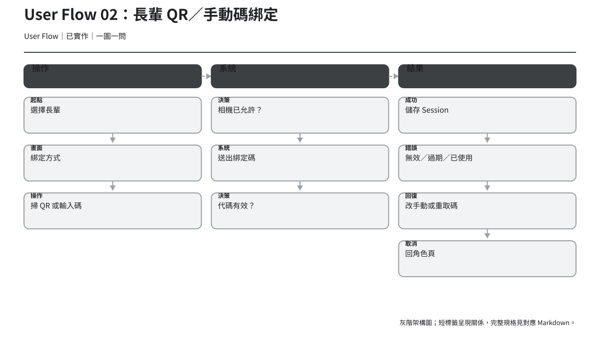
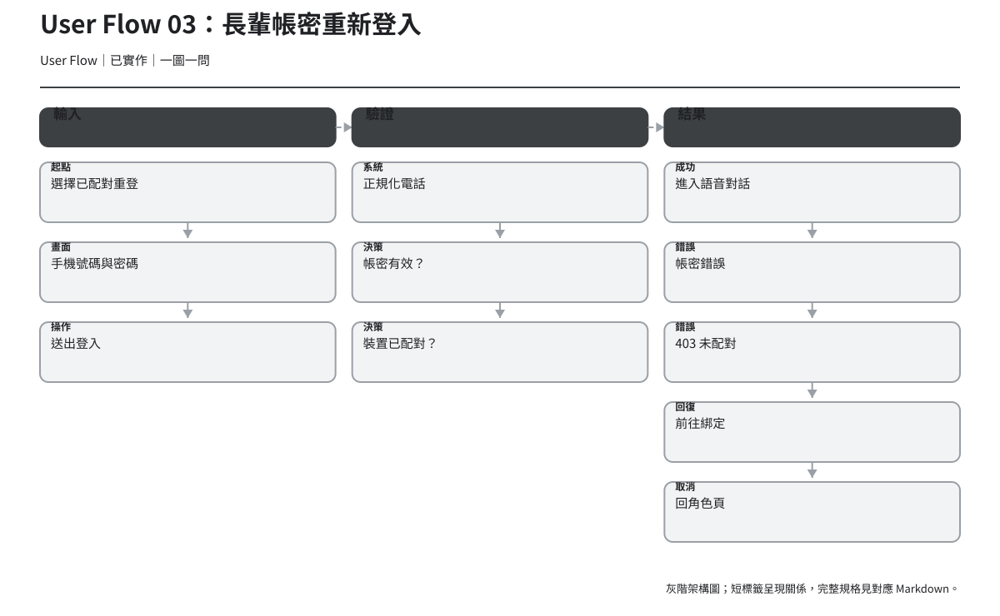
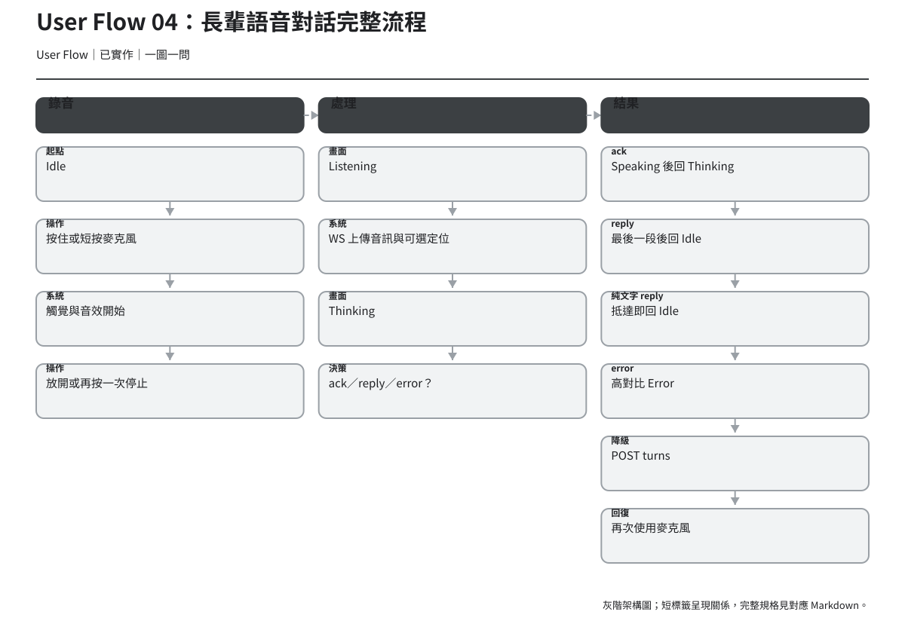
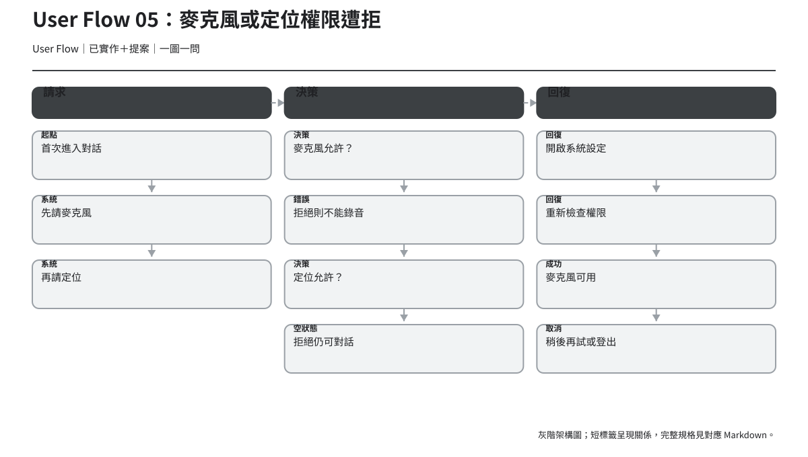
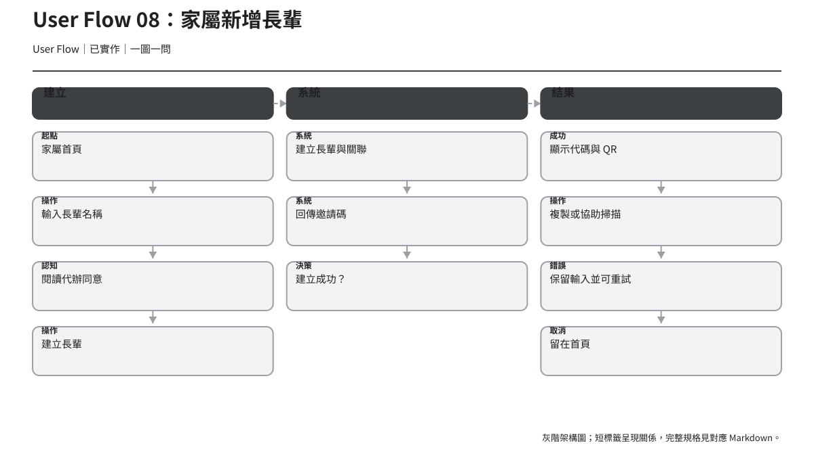
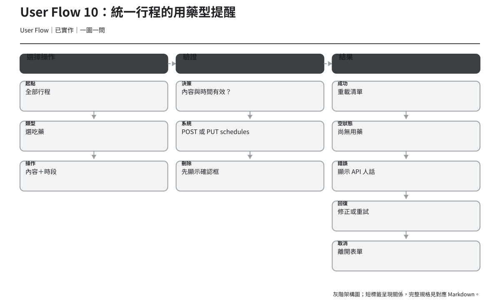
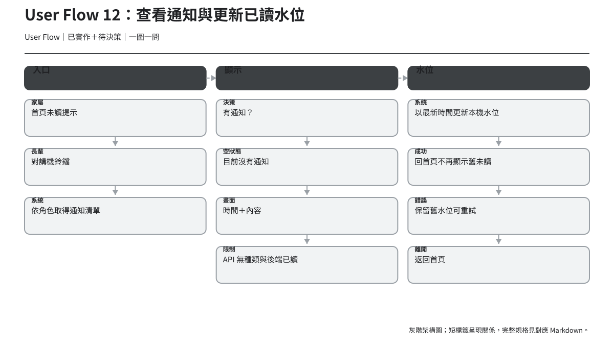
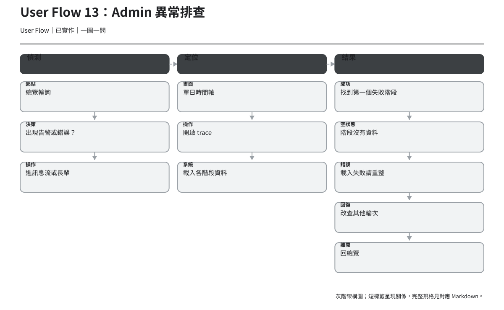
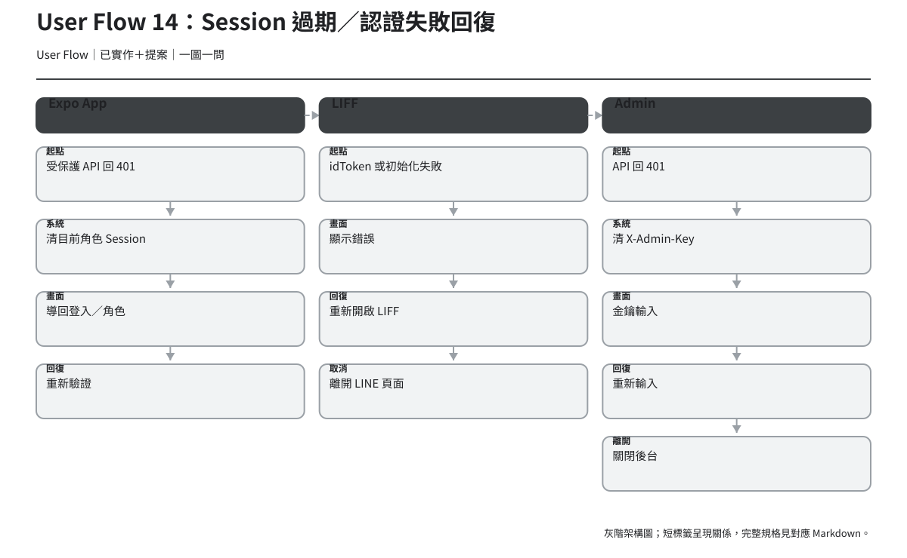

# User Flow

> 版本：v1.3｜日期：2026-07-30｜狀態：第一階段評審稿；已同步 WS 狀態、純文字降級、統一行程與長輩提醒
> User Flow 描述跨畫面與系統決策；每張圖均包含起點、操作、畫面、系統動作、決策、成功、空／錯誤、回復與離開路徑。

## 圖例

| 節點標籤 | 意義 |
| --- | --- |
| 起點／操作／畫面 | 使用者開始、採取行動或看見的 UI。 |
| 系統／決策 | 前端、API 或認證進行的動作與分支。 |
| 成功／空狀態／錯誤 | 結果狀態，不將「空」誤當「成功」。 |
| 回復／取消／離開 | 可行下一步與安全退出。 |

## 01. App 啟動與角色分流

- 相關頁面：`/`、`/role`、`/elder/talk`、`/guardian/home`。
- 系統依 `loadActiveSession()` 判斷 active role；載入期間不得先導頁。`已實作`
- 空狀態是「沒有 Session」，回復為角色選擇；取消為關閉 App。

## 02. 長輩 QR／手動碼綁定

- 相關頁面：`/role`、`/elder/bind`、`/elder/talk`。
- API client：`bindElderDevice(code)`。
- 錯誤至少區分無相機權限、格式錯誤、無效、過期、已使用與嘗試過多。`已實作`
- 回復：QR 與手動輸入互換；代碼過期時請家屬重產；取消回角色頁。

## 03. 長輩帳密重新登入

- 相關頁面：`/elder/login`、`/elder/bind`、`/elder/talk`。
- API client：`loginElder(phone, password)`。
- 401 是帳密錯誤；403 `not_paired` 必須引導先綁定。`已實作`
- 帳密不是首次建立關係的替代流程。`已決議`

## 04. 長輩語音對話完整流程

- 相關頁面：`/elder/talk`。
- API client：優先 `createTalkSocket` 傳位置與音訊；連線未開時退回 `postTurn`。
- 操作：可按住麥克風並在放開時送出，或短按一次開始、再按一次送出；系統執行上傳、ASR、風險、Agent、TTS 與回覆。工具輪可先下行 ack 安撫語音；ack 播完維持 Thinking，正式 reply 最後一段播完才回 Idle，error 訊框顯示 Error；TTS 降級成無音檔的純文字 reply 時，訊框抵達即回 Idle，不等待播放事件。`已實作`
- 空狀態：沒有可辨識語音或沒有可播放內容時，需用人話提示再說一次。`提案`
- 錯誤：權限、錄音、網路、API、403；回復依原因分流，不使用單一「發生錯誤」。`提案`

## 05. 麥克風或定位權限遭拒

- 麥克風是核心任務必要條件；定位拒絕不能阻擋對話。`已實作`
- 現況進入頁面後依序請求兩項權限；線框提案改為先解釋目的，再分步請求。`已實作＋提案`
- 麥克風回復：開啟系統設定 → 回 App → 重新檢查；取消則保留可求助資訊。
- 定位回復：可繼續，不以紅色或錯誤語氣製造阻塞感。

## 06. 403 綁定失效與重新綁定

- 起點：語音 turn 回 403。
- 現況：設定 replyText 後執行 `signOut()`；導頁可能讓原因消失。`已實作＋推論`
- To-be：先保存「綁定失效」回復原因，再提供帳密重登或新碼重綁。`提案`
- 成功：有效 Elder Session 後回 `/elder/talk`；取消：請家屬稍後協助，不陷入循環。

## 07. 家屬註冊與登入

- 相關頁面：`/guardian/register`、`/guardian/login`、`/guardian/home`。
- API client：`registerGuardian`、`loginGuardian`。
- 表單錯誤應保留輸入、把焦點移到錯誤摘要，並讓欄位 label 程式化關聯。`提案`
- 成功儲存 Guardian Session；取消回角色頁。

## 08. 家屬新增長輩

- 相關頁面：`/guardian/home`。
- API client：`createElder(name, token)`；回傳 `CreatedElder` 與邀請碼。
- 送出前需理解代辦同意；成功後顯示 QR／代碼與協助長輩步驟。`已實作＋已決議`
- 現況建立、長輩列表、通知與綁定碼都在同頁；線框以漸進揭露降低同時負荷。`提案`

## 09. 查看每日摘要與健康報告

- 相關頁面：`/guardian/home`、`/guardian/elder/:id`。
- API client：`getHealthReport`、`listDailySummaries`、`listSchedules`。
- 隱私：只顯示事件、提醒與每日摘要，不顯示完整逐字對話。`已決議`
- 空狀態要寫「尚無資料」與資料時間；不能寫成醫療保證。
- 回復提案：各區塊獨立重試，保留其他已載入內容。

## 10. 統一行程：新增、編輯、刪除用藥型提醒

- 相關頁面：App 與 LIFF 的 `/elders/:id/schedules`；同一頁以類型切換。
- API client：`createSchedule`、`updateSchedule`、`deleteSchedule`。
- 驗證：內容非空，至少一個預設時段或合法 `HH:MM`；不能只靠 disabled CTA。
- 刪除：系統確認框；需說明將停止相關提醒。`提案`
- 成功：重載清單並公告；錯誤：保留表單值並可重試。

## 11. 統一行程：新增、編輯、刪除回診型提醒

- 相關頁面：App 與 LIFF 的 `/elders/:id/schedules`；同一頁以類型切換。
- API client：`createSchedule`、`updateSchedule`、`deleteSchedule`。
- 驗證：內容非空，日期使用 `YYYY-MM-DD`，時間可省但填寫時須為 `HH:MM`；錯誤應連到欄位。
- 刪除確認需包含日期與名稱，避免刪錯相似項目。`提案`

## 12. 查看通知與更新已讀水位

- 相關頁面：`/guardian/home`、`/guardian/notifications`、`/elder/talk`、`/elder/notifications`。
- API client：家屬 `listNotifications`、長輩 `listElderNotifications`；兩角色使用分開的本機 epoch waterline。
- 現況沒有 notification id、kind、severity 或後端 read state。`已實作`
- 因此「危急／提醒／單筆已讀」僅是線框概念；要落地必須先拍板 API 契約。`待決策`
- 讀取失敗不得更新 waterline，避免通知被誤標成已讀。`推論`

## 13. Admin 異常排查

- 相關頁面：總覽、訊息流、長輩清單、長輩時間軸、Trace 詳情。
- API client：`getOverview`、`listMessages`、`listElders`、`getTimeline`、`getTrace`。
- 空狀態：某階段沒有資料時標示「未記錄／不適用」，不能顯示成成功。
- 錯誤：保留已取得階段，提示重整；回復可改查相鄰輪次。
- 離開 trace 返回來源頁時應保留日期／篩選脈絡。`提案`

## 14. Session 過期／認證失敗回復

| 端 | 觸發 | 系統現況 | To-be 回復訊息 |
| --- | --- | --- | --- |
| Expo App | 受保護 API 401 | `useSignOutOnAuthError` 清目前 Session | 登入已過期，請重新登入；保留角色脈絡 |
| Expo Elder | turn 403 | 清 Elder Session | 這台手機的綁定已失效；帳密重登或重新綁定 |
| LIFF | 初始化／idToken 失敗 | 顯示初始化失敗 | 重新開啟此 LINE 頁面；仍失敗時稍後再試 |
| Admin | API 401 | 清 localStorage key 並回 KeyForm | 金鑰已失效，請重新輸入 |

## Flow 層級決策摘要

1. 認證錯誤與業務錯誤分開；401、403、validation、network 不使用同一訊息。`提案`
2. 每個錯誤都有可執行的下一步與安全離開路徑。`提案`
3. 部分資料成功時保留已成功內容，不以整頁錯誤覆蓋。`提案`
4. 所有家屬 Flow 維持逐字對話不可見。`已決議`
