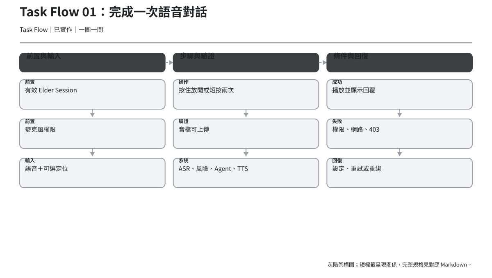
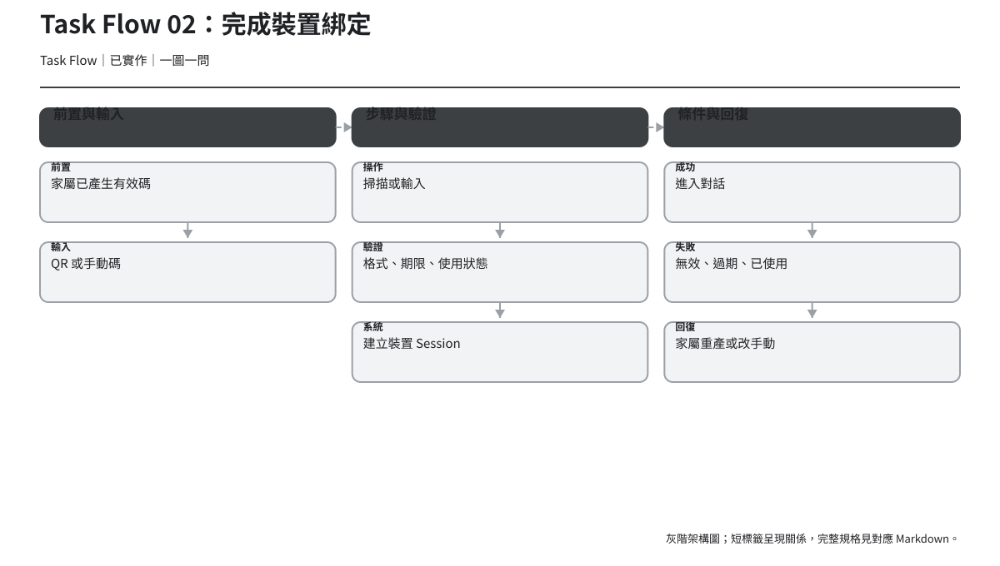
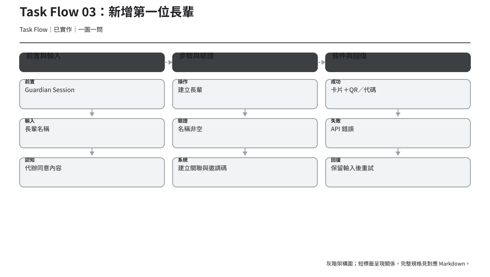
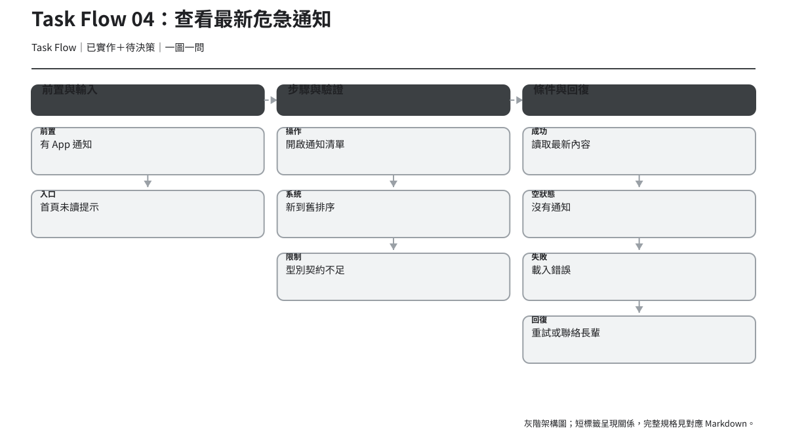
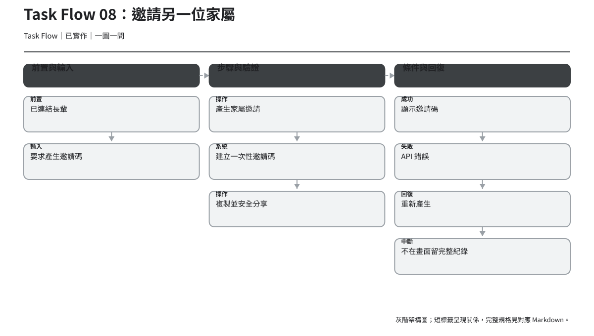
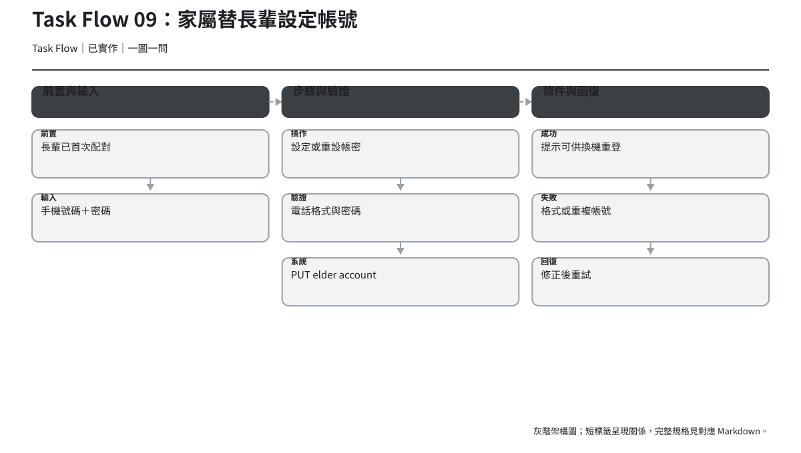
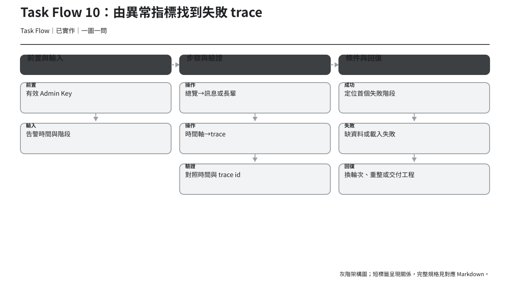

# Task Flow

> 版本：v1.2｜日期：2026-07-30｜狀態：第一階段評審稿；已同步統一行程 API
> Task Flow 聚焦單一任務的必要操作、驗證與完成條件；不包含 Journey Map 的情緒假設。

## 01. 完成一次語音對話

| 欄位 | 規格 |
| --- | --- |
| 前置條件 | 有效 Elder Session；麥克風權限允許；裝置可錄音。 |
| 輸入 | 使用者語音；定位座標為可選。 |
| 操作步驟 | 進入 Idle → 選擇「按住、說話、放開」或「短按開始、說完再按一次」→ 等待 → 聽／讀回覆。 |
| 系統驗證 | 權限、錄音物件、音訊上傳、API 認證；後端依序處理 ASR、風險、Agent、TTS。 |
| 成功條件 | 顯示文字回覆、可播放語音，狀態回到可再次說話。 |
| 失敗條件 | 權限拒絕、錄音失敗、網路／API 失敗、403 綁定失效。 |
| 中斷與回復 | 麥克風：開設定；網路：重試或重錄；403：帳密重登或重綁；離開不應誤送錄音。 |
| 相關頁面 | `/elder/talk`。 |
| 相關 API | `postTurn` → turns。 |

## 02. 完成裝置綁定

| 欄位 | 規格 |
| --- | --- |
| 前置條件 | 家屬已建立長輩並取得仍有效的綁定 QR／代碼。 |
| 輸入 | 掃描結果或手動代碼。 |
| 操作步驟 | 選長輩 → 選 QR／手動 → 權限或輸入 → 送出 → 看成功回饋。 |
| 系統驗證 | 相機權限；代碼格式、有效期限、是否使用、嘗試次數。 |
| 成功條件 | 建立 Elder Session，明確顯示成功後進入對話。 |
| 失敗條件 | 相機拒絕、代碼無效／過期／已使用、網路錯誤。 |
| 中斷與回復 | QR 與手動互換；過期請家屬重產；保留手動輸入；取消回角色頁。 |
| 相關頁面 | `/role`、`/elder/bind`、`/elder/talk`。 |
| 相關 API | `bindElderDevice` → device-bindings。 |

## 03. 新增第一位長輩

| 欄位 | 規格 |
| --- | --- |
| 前置條件 | 有效 Guardian Session；已向長輩說明資料用途。 |
| 輸入 | 長輩姓名；代辦同意確認。 |
| 操作步驟 | 空首頁 → 輸入姓名 → 閱讀同意 → 建立 → 顯示 QR／代碼。 |
| 系統驗證 | 姓名非空；Guardian 可認證；後端建立長輩與關聯。 |
| 成功條件 | 長輩卡片出現，綁定資料可供另一台手機使用。 |
| 失敗條件 | 欄位空白、認證失效、API／網路錯誤。 |
| 中斷與回復 | 保留姓名；401 回登入；其他錯誤顯示重試；可取消留在首頁。 |
| 相關頁面 | `/guardian/home`。 |
| 相關 API | `createElder` → elders。 |

## 04. 查看最新危急通知

| 欄位 | 規格 |
| --- | --- |
| 前置條件 | 有效 Guardian Session；後端已建立 App notification。 |
| 輸入 | 首頁未讀提示或使用者主動開通知。 |
| 操作步驟 | 開首頁 → 看未讀 → 開通知 → 讀第一則 → 判斷後續行動。 |
| 系統驗證 | 取得清單成功後才更新本機已讀水位；依時間新到舊。 |
| 成功條件 | 知道長輩、時間、事件內容與安全下一步。 |
| 失敗條件 | 載入失敗、資料契約無法辨識類型、通知為空。 |
| 中斷與回復 | 失敗不更新水位；可重試或從長輩詳情查報告；緊急時離開 App 聯絡／求助。 |
| 相關頁面 | `/guardian/home`、`/guardian/notifications`。 |
| 相關 API | `listNotifications`；本機 `notificationsSeen`。 |

> 「危急」視覺分類目前受限於 `AppNotification` 只有 `content` 與 `created_at`，落地前為 `待決策`。

## 05. 新增一筆用藥

| 欄位 | 規格 |
| --- | --- |
| 前置條件 | 有效 Guardian Session，且可及該 `elder_id`。 |
| 輸入 | 藥品名稱、至少一個服用時段。 |
| 操作步驟 | 進管理頁 → 新增 → 填藥名 → 選時段 → 儲存。 |
| 系統驗證 | 名稱非空、`slots` 非空且值在允許集合。 |
| 成功條件 | 清單顯示新資料，表單清空並公告完成。 |
| 失敗條件 | 欄位錯誤、後端 400、401、網路錯誤。 |
| 中斷與回復 | 錯誤保留值；401 回登入；取消關閉表單且不寫入。 |
| 相關頁面 | App／LIFF `/elders/:id/schedules`（吃藥類型）。 |
| 相關 API | `createSchedule`。 |

## 06. 編輯一筆用藥

| 欄位 | 規格 |
| --- | --- |
| 前置條件 | 目標用藥存在且使用者可及。 |
| 輸入 | 修改後名稱與時段。 |
| 操作步驟 | 選項目 → 編輯 → 調整 → 儲存。 |
| 系統驗證 | 同新增；使用正確 `group_id`。 |
| 成功條件 | 項目顯示新值，離開編輯狀態並公告完成。 |
| 失敗條件 | 404／權限／validation／網路錯誤。 |
| 中斷與回復 | 錯誤保留編輯值；取消還原清單原值；不存在則重新整理清單。 |
| 相關頁面 | App／LIFF 統一行程管理。 |
| 相關 API | `updateSchedule`。 |

## 07. 新增一筆回診

| 欄位 | 規格 |
| --- | --- |
| 前置條件 | 有效 Guardian Session，且可及該長輩。 |
| 輸入 | 回診說明、日期、時間。 |
| 操作步驟 | 進管理頁 → 新增 → 輸入說明 → 選日期時間 → 儲存。 |
| 系統驗證 | 說明非空、日期時間格式有效且不得在過去。 |
| 成功條件 | 清單依時間顯示新項目並公告完成。 |
| 失敗條件 | 過去時間、400、401、網路錯誤。 |
| 中斷與回復 | 聚焦日期錯誤；保留輸入；重新選時間；取消不寫入。 |
| 相關頁面 | App／LIFF `/elders/:id/schedules`（回診類型）。 |
| 相關 API | `createSchedule`。 |

## 08. 邀請另一位家屬

| 欄位 | 規格 |
| --- | --- |
| 前置條件 | 使用者已連結該長輩。 |
| 輸入 | 產生邀請的明確操作。 |
| 操作步驟 | 長輩詳情 → 邀請家屬 → 閱讀可見範圍 → 產生 → 複製／分享。 |
| 系統驗證 | Guardian 認證與長輩可及範圍。 |
| 成功條件 | 顯示可辨識的一次性邀請碼與安全分享提醒。 |
| 失敗條件 | 認證失效、無權限、API／剪貼簿錯誤。 |
| 中斷與回復 | API 可重試；複製失敗仍可手動讀取；離開後不在歷史清單長期暴露。 |
| 相關頁面 | `/guardian/elder/:id`。 |
| 相關 API | `createGuardianInvite`。 |

## 09. 家屬替長輩設定帳號

| 欄位 | 規格 |
| --- | --- |
| 前置條件 | 長輩已完成首次配對；家屬可及該長輩。 |
| 輸入 | 手機號碼、新密碼。 |
| 操作步驟 | 詳情 → 帳密代辦 → 輸入 → 理解重設影響 → 儲存。 |
| 系統驗證 | 電話正規化為 8–15 位數字且全域唯一；密碼符合後端規則。 |
| 成功條件 | 提示帳密已設定，可供換機／登出後重登；不回顯密碼。 |
| 失敗條件 | 未配對、號碼衝突、validation、認證或網路錯誤。 |
| 中斷與回復 | 保留電話、不保留不必要的密碼；修正後重試；取消不變更舊帳密。 |
| 相關頁面 | `/guardian/elder/:id`、後續 `/elder/login`。 |
| 相關 API | `setElderAccount`、`loginElder`。 |

## 10. Admin 從異常指標找到失敗 trace

| 欄位 | 規格 |
| --- | --- |
| 前置條件 | 有效 Admin Key；overview 可載入。 |
| 輸入 | 告警的時間範圍、階段、數量或相關長輩。 |
| 操作步驟 | 總覽 → 訊息流／長輩 → 日期時間軸 → trace → 逐階段判讀。 |
| 系統驗證 | 保留 trace id、elder id、時間；確認階段資料屬於同一 trace。 |
| 成功條件 | 找到第一個失敗或明顯異常的階段，取得足以交付工程的識別與錯誤。 |
| 失敗條件 | 輪詢斷線、資料空缺、trace 404、階段資料未記錄。 |
| 中斷與回復 | 保留既有資料；重整；查相鄰輪次；回來源頁保留日期脈絡。 |
| 相關頁面 | Overview、Messages、Elders、Elder detail、Trace detail。 |
| 相關 API | `getOverview`、`listMessages`、`listElders`、`getTimeline`、`getTrace`。 |

## Task Flow 共通驗收

- 主要 CTA 唯一且名稱描述結果，不使用模糊「確定」。
- loading 時防止重複送出，但保留 accessible name 與 busy state。
- 錯誤後保留安全可保留的輸入；密碼與敏感一次性碼例外。
- 刪除必須確認，內容含目標名稱與後果。
- 空狀態提供直接下一步；不能把無資料解讀為健康正常。
- 認證錯誤回復到正確角色，不洩漏資源是否存在。
