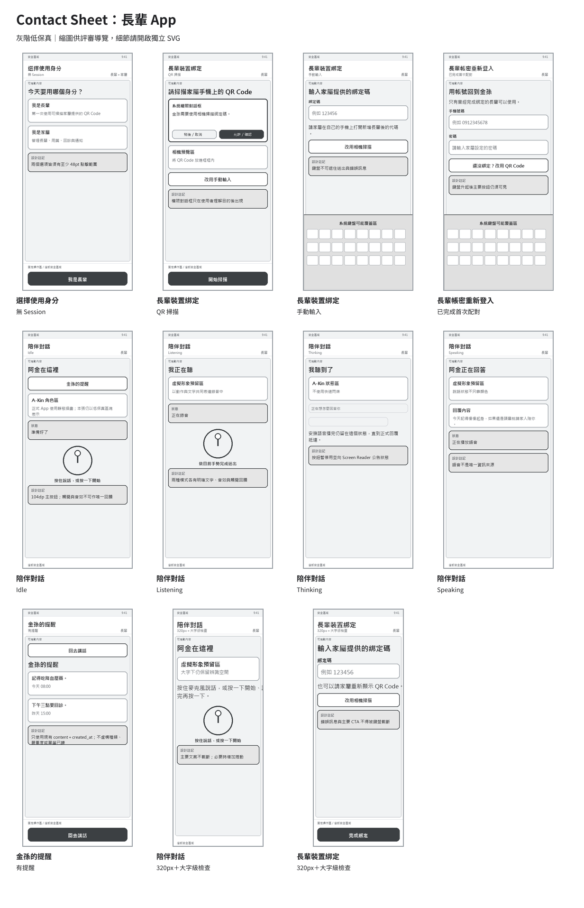
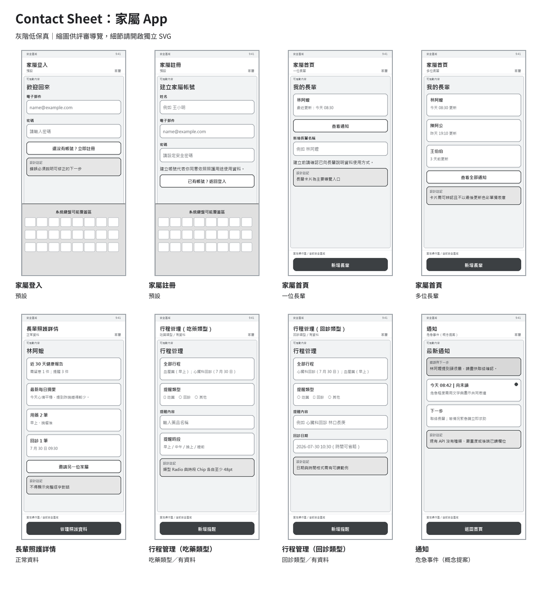
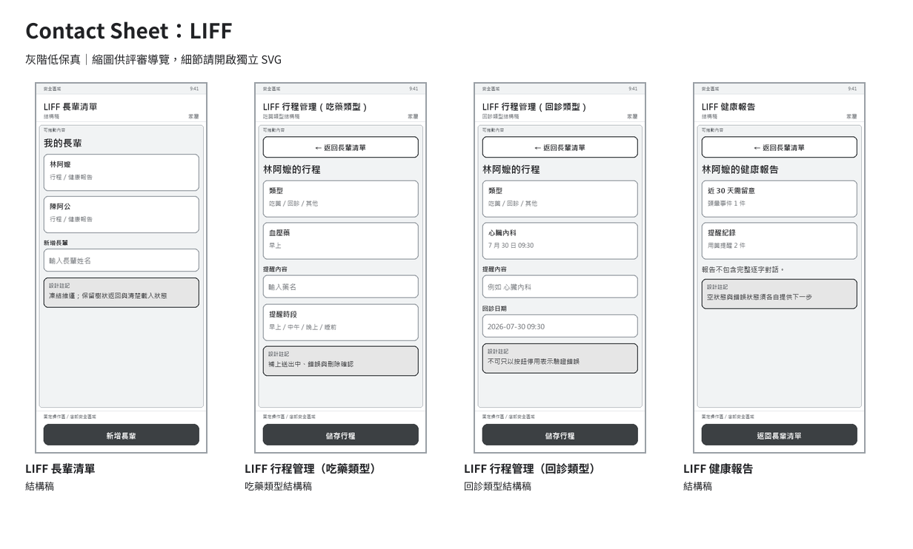
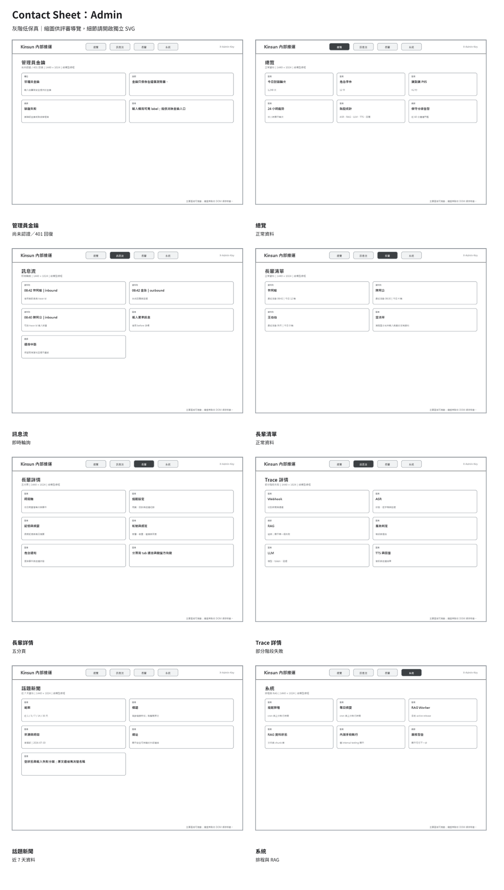
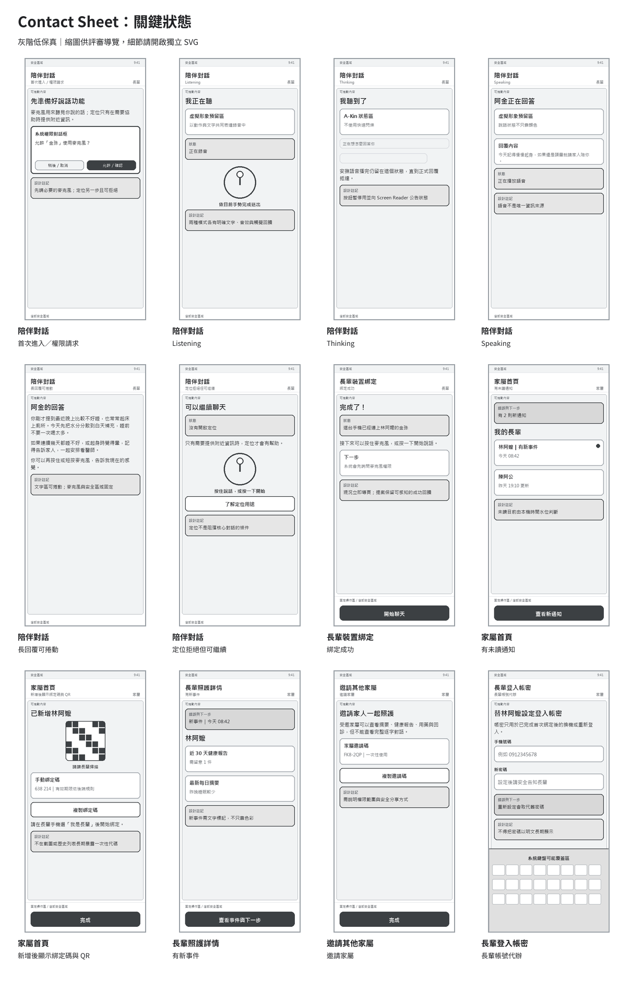
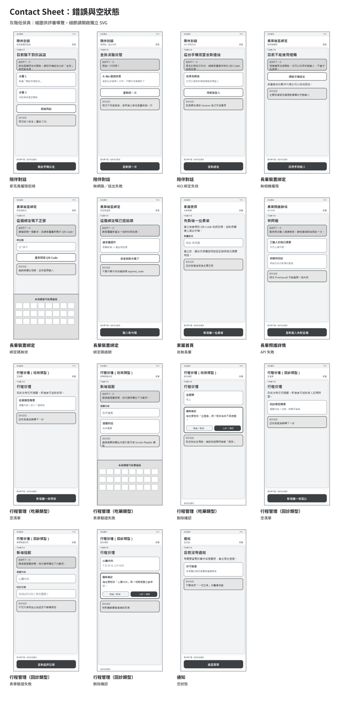

# 低保真線框圖規格

> 版本：v1.2｜日期：2026-07-30｜狀態：第二階段評審稿；已同步 D-76、X-01、admin 新聞與 WS 五態
> 所有線框均為灰階、低保真、非品牌視覺；暖磚橘、Logo、虛擬角色、插畫、陰影與最終字體不在本階段決定。

## 1. 產出與尺寸

| 類型 | 尺寸 | 用途 |
| --- | --- | --- |
| Expo App | 390 × 844 | 12 頁與主要狀態。 |
| LIFF | 390 × 844 | 3 頁結構型線框；行程頁另畫用藥／回診類型變體。 |
| Admin | 1440 × 1024 | 7 頁結構型線框；另含認證殼層。 |
| 長輩關鍵檢查 | 320 × 844＋大字 | `/elder/talk`、`/elder/bind`。 |

每張線框都具有：

- `wireframes/source/<id>.svg`：可編輯來源。
- `wireframes/export/<id>.svg`：評審用可縮放匯出。
- `wireframes/export/<id>.png`：預覽與 Contact Sheet 來源。
- `wireframes/source/wireframe-spec.json`：所有文案、狀態與內容區塊的 canonical 規格。

共同標示：

- 上下安全區域。
- 可捲動內容邊界。
- 固定主要操作區。
- 表單鍵盤可能覆蓋區。
- OS 權限對話框發生時機。
- 主要 CTA 與次要回復路徑。

## 2. Contact Sheet 預覽

### 長輩 App



### 家屬 App



### LIFF



### Admin



### 關鍵狀態



### 錯誤與空狀態



## 3. Expo App 12 頁

| 路由 | 基準線框 | 狀態 | 主要檢查 |
| --- | --- | --- | --- |
| `/` | [啟動與 Session 判斷](wireframes/export/app-launch-session.svg) | loading／自動導向 | 不閃現空白或錯誤角色 |
| `/role` | [角色選擇](wireframes/export/app-role-selection.svg) | 無 Session | 兩角色用途清楚、48pt |
| `/elder/bind` | [QR 綁定](wireframes/export/app-elder-bind-qr.svg) | QR 基準 | 權限先解釋、手動替代 |
| `/elder/login` | [長輩帳密登入](wireframes/export/app-elder-login.svg) | 預設表單 | 已配對限制、鍵盤 |
| `/elder/talk` | [對話 Idle](wireframes/export/app-elder-talk-idle.svg) | Idle | 104dp 麥克風、單一核心任務 |
| `/elder/notifications` | [金孫的提醒](wireframes/export/app-elder-notifications.svg) | 有提醒 | 56dp 返回、長輩字級、只有內容與時間 |
| `/guardian/login` | [家屬登入](wireframes/export/app-guardian-login.svg) | 預設表單 | label、錯誤、鍵盤 |
| `/guardian/register` | [家屬註冊](wireframes/export/app-guardian-register.svg) | 預設表單 | 同意、錯誤、鍵盤 |
| `/guardian/home` | [一位長輩](wireframes/export/app-guardian-home-one.svg) | 一位長輩 | 長輩卡為主、建立次之 |
| `/guardian/elder/:id` | [正常資料](wireframes/export/app-guardian-elder-detail-normal.svg) | 正常資料 | 報告、摘要、管理漸進揭露 |
| `/guardian/elder/:id/schedules` | [用藥型](wireframes/export/app-guardian-medications-data.svg)／[回診型](wireframes/export/app-guardian-appointments-data.svg) | 同頁類型變體 | 三類 radio、清單與表單、時間格式 |
| `/guardian/notifications` | [危急事件概念](wireframes/export/app-guardian-notifications-critical.svg) | 危急事件 | `待決策` 資料契約；不只靠色彩 |

## 4. LIFF 3 頁

| 路由 | 線框 | 主要檢查 |
| --- | --- | --- |
| `/liff/` | [長輩清單](wireframes/export/liff-elders.svg) | 載入／空狀態、表單 label、功能入口。 |
| `/liff/elders/:id/schedules` | [用藥型](wireframes/export/liff-medications.svg)／[回診型](wireframes/export/liff-appointments.svg) | 同一路由類型變體；樹狀返回、busy、validation、刪除確認。 |
| `/liff/elders/:id/health-report` | [健康報告](wireframes/export/liff-health-report.svg) | 嚴重度文字、空／錯誤分開、隱私邊界。 |

LIFF 是凍結維運產品面；線框只建立結構與可用性基線，不主張同步最終品牌。`已決議`

## 5. Admin 7 頁＋認證殼層

| 路由／狀態 | 線框 | 主要檢查 |
| --- | --- | --- |
| 無金鑰／401 | [金鑰輸入](wireframes/export/admin-key-entry.svg) | label、錯誤、清除／重輸入。 |
| `/admin/` | [總覽](wireframes/export/admin-overview.svg) | 告警、KPI、趨勢、階段統計。 |
| `/admin/messages` | [訊息流](wireframes/export/admin-messages.svg) | polling、回翻、trace id、斷線。 |
| `/admin/elders` | [長輩清單](wireframes/export/admin-elders.svg) | 初載與空清單分開。 |
| `/admin/elders/:id` | [長輩詳情](wireframes/export/admin-elder-detail.svg) | 五分頁、tab 語意、各區狀態。 |
| `/admin/traces/:traceId` | [Trace 詳情](wireframes/export/admin-trace-detail.svg) | 處理順序、首個失敗、缺資料。 |
| `/admin/news` | [話題新聞](wireframes/export/admin-news.svg) | 天數範圍、來源、發布時間與原文連結。 |
| `/admin/system` | [系統](wireframes/export/admin-system.svg) | 排程、RAG、內測操作影響。 |

## 6. `/elder/talk` 狀態

| 狀態 | 線框 | 互動規格 |
| --- | --- | --- |
| 首次進入／權限請求 | [permission request](wireframes/export/app-elder-talk-permission-request.svg) | 先說明用途；麥克風與定位分開。 |
| Idle | [idle](wireframes/export/app-elder-talk-idle.svg) | 同時說明「按住放開」與「短按開始、再按一次」兩種方式。 |
| Listening | [listening](wireframes/export/app-elder-talk-listening.svg) | 依目前手勢顯示「放開送出」或「說完再按一下」，並保留文字＋動作＋音效／觸覺。 |
| Thinking | [thinking](wireframes/export/app-elder-talk-thinking.svg) | 禁止重複操作；公告系統處理中；ack 安撫語音播完仍維持此態。 |
| Speaking | [speaking](wireframes/export/app-elder-talk-speaking.svg) | 文字與語音同步；狀態不只靠色彩。 |
| 長回覆 | [long reply](wireframes/export/app-elder-talk-long-reply.svg) | 回覆區捲動、麥克風與安全區固定。 |
| 麥克風拒絕 | [mic denied](wireframes/export/app-elder-talk-mic-denied.svg) | 開設定為主要 CTA，稍後／求助為次要。 |
| 定位拒絕 | [location denied](wireframes/export/app-elder-talk-location-denied.svg) | 明說仍可聊天。 |
| 無網路／送出失敗 | [network error](wireframes/export/app-elder-talk-network-error.svg) | 重試／重錄；是否暫存錄音為 `待決策`。 |
| 403 綁定失效 | [403](wireframes/export/app-elder-talk-error-403.svg) | 原因持續可見，分帳密重登／重新綁定。 |
| 內測狀態列 | [internal testing](wireframes/export/app-elder-talk-internal-testing.svg) | 僅 internal testing；不侵占主要狀態。 |
| 320px＋大字 | [large type](wireframes/export/app-elder-talk-large-type-320.svg) | 核心文案不截斷、必要時可捲動。 |

## 7. `/elder/bind` 狀態

| 狀態 | 線框 | 互動規格 |
| --- | --- | --- |
| QR 掃描 | [QR](wireframes/export/app-elder-bind-qr.svg) | 權限目的、掃描框、手動替代。 |
| 手動輸入 | [manual](wireframes/export/app-elder-bind-manual.svg) | 數字輸入、鍵盤避讓、保留值。 |
| 無相機權限 | [camera denied](wireframes/export/app-elder-bind-camera-denied.svg) | 手動輸入優先於卡住。 |
| 無效碼 | [invalid](wireframes/export/app-elder-bind-invalid.svg) | 保留輸入並指出如何修正。 |
| 過期碼 | [expired](wireframes/export/app-elder-bind-expired.svg) | 請家屬重產，不顯示技術碼。 |
| 成功 | [success](wireframes/export/app-elder-bind-success.svg) | 可感知成功；現況立即導頁。 |
| 320px＋大字 | [large type](wireframes/export/app-elder-bind-large-type-320.svg) | 錯誤與 CTA 不被鍵盤截斷。 |

## 8. 家屬首頁狀態

| 狀態 | 線框 | 互動規格 |
| --- | --- | --- |
| Loading | [loading](wireframes/export/app-guardian-home-loading.svg) | 不先閃現空狀態。 |
| 尚無長輩 | [empty](wireframes/export/app-guardian-home-empty.svg) | 直接銜接新增第一位長輩。 |
| 一位長輩 | [one](wireframes/export/app-guardian-home-one.svg) | 卡片是主入口。 |
| 多位長輩 | [multiple](wireframes/export/app-guardian-home-multiple.svg) | 清楚名稱與最後更新；不只靠色彩。 |
| 未讀通知 | [unread](wireframes/export/app-guardian-home-unread.svg) | 文字數量＋新事件標記。 |
| 建立後 QR／代碼 | [binding code](wireframes/export/app-guardian-home-binding-code.svg) | 一次性資料、複製回饋、協助步驟。 |

## 9. 家屬長輩詳情狀態

| 狀態 | 線框 | 互動規格 |
| --- | --- | --- |
| Loading | [loading](wireframes/export/app-guardian-elder-detail-loading.svg) | 區塊可獨立載入。 |
| 正常資料 | [normal](wireframes/export/app-guardian-elder-detail-normal.svg) | 資訊分區，不顯示逐字稿。 |
| 沒有摘要 | [no summary](wireframes/export/app-guardian-elder-detail-no-summary.svg) | 說明產生條件，非錯誤。 |
| 沒有用藥／回診 | [empty care](wireframes/export/app-guardian-elder-detail-empty-care.svg) | 各自直接新增。 |
| 有新事件 | [new event](wireframes/export/app-guardian-elder-detail-new-event.svg) | 嚴重度與下一步；資料契約 `待決策`。 |
| API 失敗 | [API error](wireframes/export/app-guardian-elder-detail-api-error.svg) | 保留成功區塊、局部重試。 |
| 邀請家屬 | [invite](wireframes/export/app-guardian-elder-detail-invite.svg) | 明示可見範圍與安全分享。 |
| 帳號代辦 | [account](wireframes/export/app-guardian-elder-detail-account.svg) | 先決條件、重設影響、密碼不回顯。 |

## 10. 統一行程管理狀態

以下兩組都是 `/guardian/elder/:id/schedules` 的類型變體，不是兩個路由。

### 用藥型

| 狀態 | 線框 |
| --- | --- |
| 空清單 | [empty](wireframes/export/app-guardian-medications-empty.svg) |
| 有資料 | [data](wireframes/export/app-guardian-medications-data.svg) |
| 新增 | [create](wireframes/export/app-guardian-medications-create.svg) |
| 編輯 | [edit](wireframes/export/app-guardian-medications-edit.svg) |
| 驗證失敗 | [validation](wireframes/export/app-guardian-medications-validation.svg) |
| 刪除確認 | [delete](wireframes/export/app-guardian-medications-delete.svg) |
| API 錯誤 | [error](wireframes/export/app-guardian-medications-error.svg) |

### 回診型

| 狀態 | 線框 |
| --- | --- |
| 空清單 | [empty](wireframes/export/app-guardian-appointments-empty.svg) |
| 有資料 | [data](wireframes/export/app-guardian-appointments-data.svg) |
| 新增 | [create](wireframes/export/app-guardian-appointments-create.svg) |
| 編輯 | [edit](wireframes/export/app-guardian-appointments-edit.svg) |
| 驗證失敗 | [validation](wireframes/export/app-guardian-appointments-validation.svg) |
| 刪除確認 | [delete](wireframes/export/app-guardian-appointments-delete.svg) |
| API 錯誤 | [error](wireframes/export/app-guardian-appointments-error.svg) |

兩組變體共同規格：同頁以 radio 選擇吃藥／回診／其他；表單值在非敏感錯誤後保留、錯誤摘要可公告、Chip／輸入控制達 48pt、刪除說明影響、成功可被 Screen Reader 感知。

## 11. 通知狀態

長輩版基準：[金孫的提醒](wireframes/export/app-elder-notifications.svg)。它只使用現有 `content`＋`created_at`，不虛構 kind／severity／單筆已讀；家屬版概念狀態如下。

| 狀態 | 線框 | 可信度 |
| --- | --- | --- |
| Loading | [loading](wireframes/export/app-guardian-notifications-loading.svg) | `已實作＋提案` |
| 空狀態 | [empty](wireframes/export/app-guardian-notifications-empty.svg) | `已實作＋提案` |
| 危急事件 | [critical](wireframes/export/app-guardian-notifications-critical.svg) | `待決策` kind／severity |
| 提醒事件 | [reminder](wireframes/export/app-guardian-notifications-reminder.svg) | `待決策` kind |
| 已讀／未讀 | [read state](wireframes/export/app-guardian-notifications-read-state.svg) | 本機 waterline `已實作`；單筆狀態 `待決策` |

## 12. 線框決策與非決策

### 本階段可確認

- 每頁一個主要目標與清楚的主要 CTA。
- 長輩核心操作區至少 48pt，語音主按鈕 104dp。
- 所有核心任務都有 loading、empty、error、permission 或 recovery 變體。
- 家屬詳情只出現報告、提醒與每日摘要，不出現完整逐字對話。
- Admin 依實際七路由與五分頁畫結構。

### 本階段不決定

- Primary／Secondary 品牌色、品牌漸層、Logo、App Icon。
- 虛擬角色、插畫、動態表情與最終語音動畫。
- 最終陰影、圓角、字體與行銷文案。
- 通知 kind／severity／read state、錄音重試暫存、Admin 細分權限。

## 13. 產生與驗證

```powershell
uv run --locked python docs/uiux/tools/generate_assets.py
```

腳本會從兩份 JSON 規格重建圖表、線框、Contact Sheet 與 `asset-manifest.json`，並檢查：

- SVG XML 可解析且有 `viewBox`。
- 沒有外部圖片 URL 或 CDN。
- PNG 不是全白。
- 沒有 Lorem Ipsum。
- manifest 欄位與路徑完整。
- Markdown 圖片連結指向存在的檔案。
