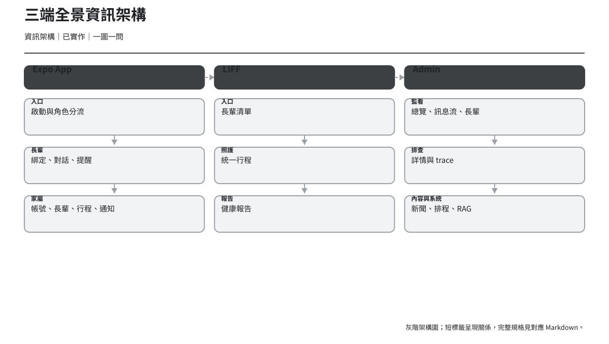
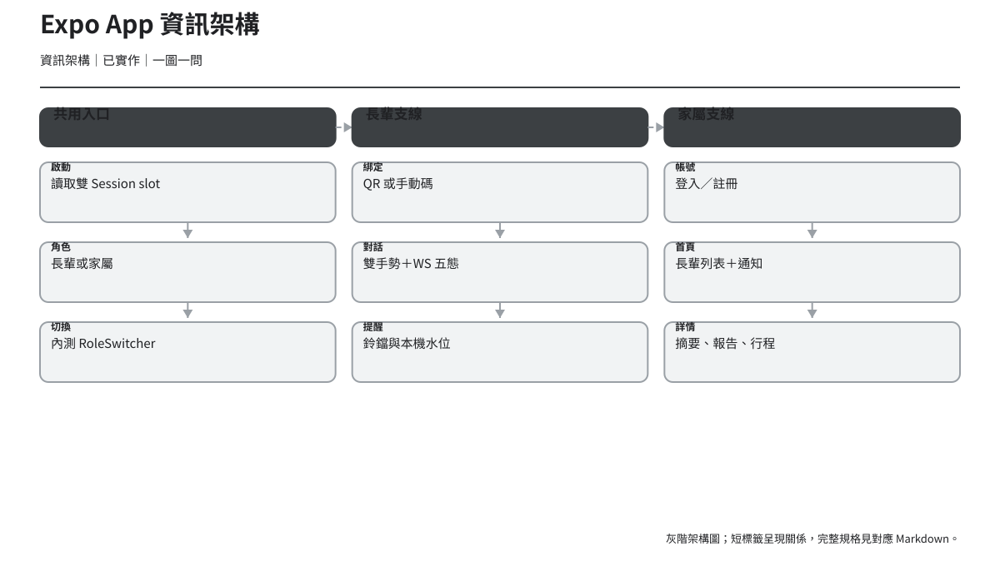
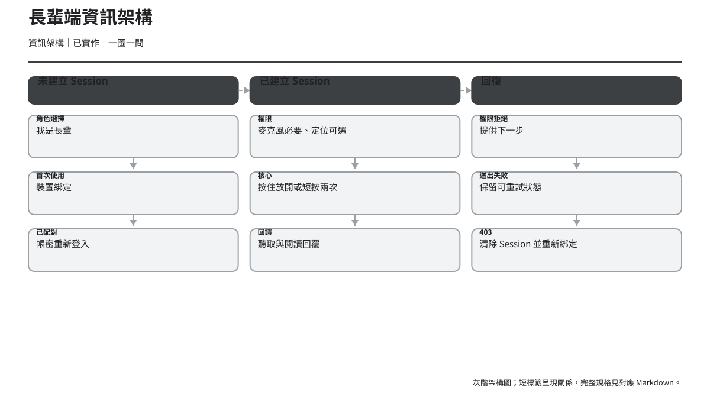
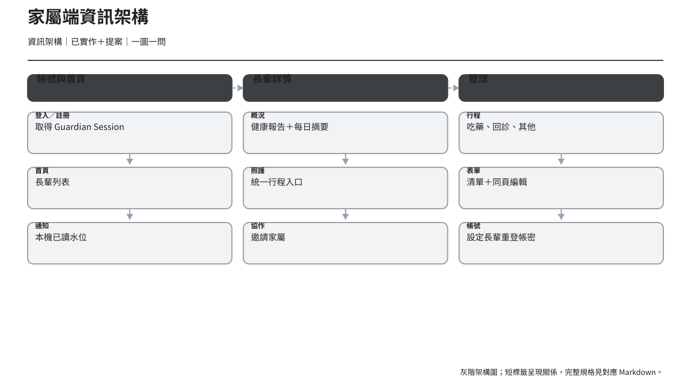
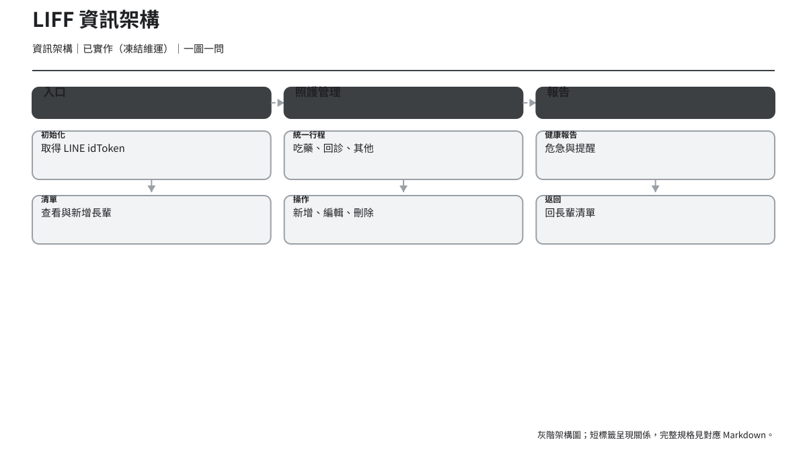
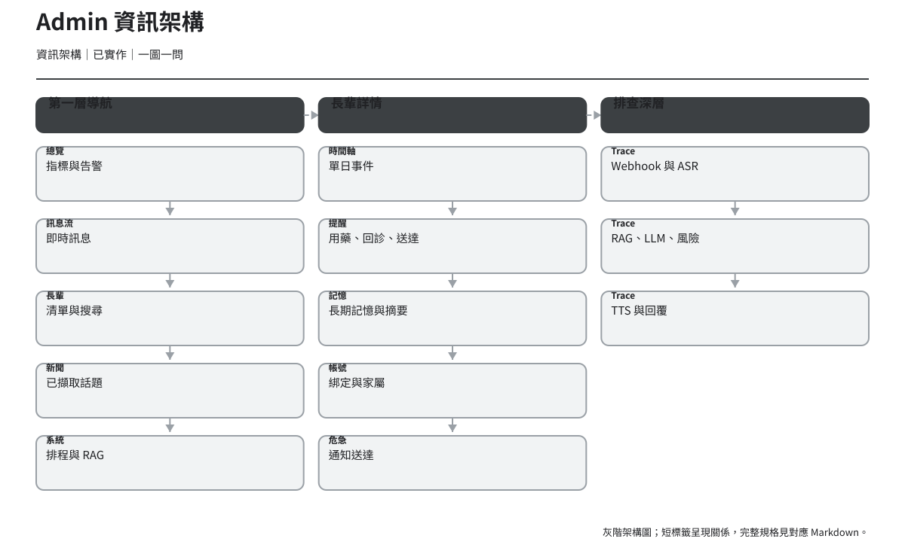
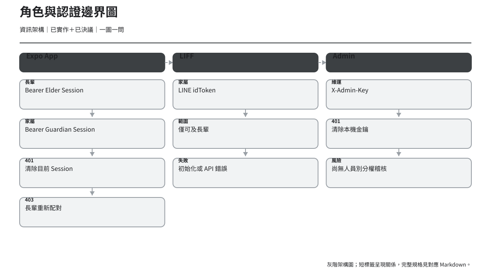
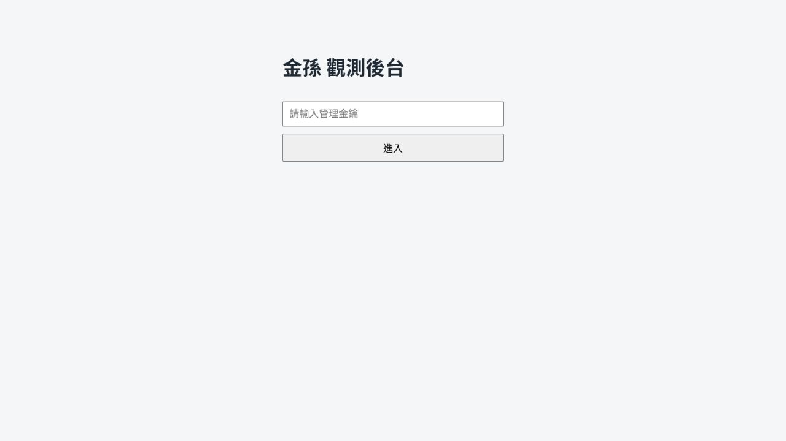
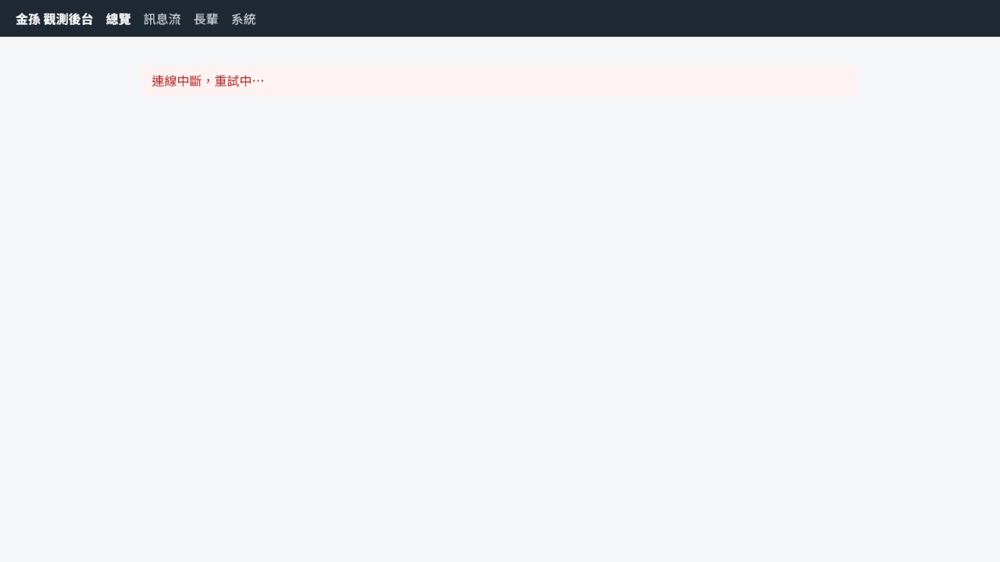
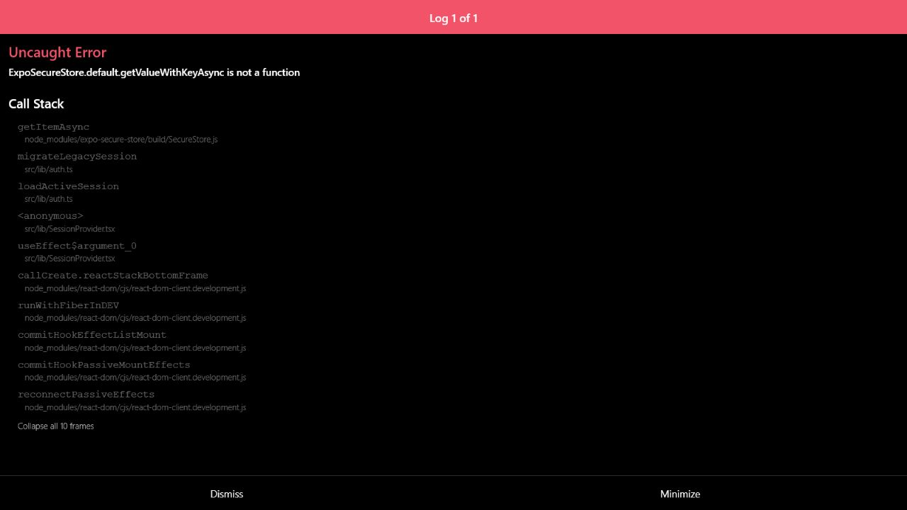

# Kinsun UI／UX 第一、第二階段交付物

> 版本：v1.4｜日期：2026-07-30｜狀態：第一、第二階段完成；已同步 12／3／7 現況與正式對講機，第三階段待真人場次
> 目的：把三端 as-is 程式事實、已決議產品邊界與 Phase 1／2 UX 提案整理成可追溯、可重建、可供下一階段使用的交付物。

## 1. 建議閱讀順序

1. [Repo UX Audit](00-repo-ux-audit.md)：先理解現況、證據與差異。
2. [使用者角色與情境](01-users-and-scenarios.md)：確認 Proto-persona 與權限。
3. [資訊架構](02-information-architecture.md)：確認三端頁面與認證邊界。
4. [使用者旅程](03-user-journey-maps.md)：看跨接觸點體驗。
5. [User Flow](04-user-flows.md) 與 [Task Flow](05-task-flows.md)：評審系統分支與任務細節。
6. [頁面清單](06-page-inventory.md)：核對 App／LIFF／Admin 的 12／3／7 頁與內容模型。
7. [低保真線框圖](07-wireframe-specification.md)：評審頁面骨架與非 Happy Path。
8. [Component Inventory](08-component-inventory.md)、[Design Token Foundation](09-design-token-foundation.md)、[無障礙與適老化](10-accessibility-review.md)：供下一階段規格化。
9. [跨職能評審 Pre-read](11-cross-functional-review.md)：拍板 P0 通知資料契約與 403 回復，再凍結對應 Prototype。

## 2. 交付物清單

| 交付物 | 檔案／目錄 | 內容 |
| --- | --- | --- |
| Repo UX Audit | `00-repo-ux-audit.md` | 三端技術、路由、認證、API、元件、Token、狀態、差異與執行證據。 |
| Proto-persona | `01-users-and-scenarios.md` | 長輩、家屬、維運角色、情境、權限與待研究。 |
| IA | `02-information-architecture.md` | 8 張資訊架構圖與路由／API／認證邊界。 |
| Journey Map | `03-user-journey-maps.md` | 3 張跨接觸點旅程。 |
| User Flow | `04-user-flows.md` | 14 張含回復路徑的流程。 |
| Task Flow | `05-task-flows.md` | 10 張核心任務細流。 |
| Page Inventory | `06-page-inventory.md` | App 12、LIFF 3、Admin 7 頁。 |
| Wireframe | `07-wireframe-specification.md` | 70 張獨立 SVG／PNG（含同一路由的類型／狀態變體）、6 張 Contact Sheet。 |
| Component Inventory | `08-component-inventory.md` | As-is 元件與 foundation／atom／molecule／organism 提案。 |
| Token Foundation | `09-design-token-foundation.md` | As-is 值、結構 Token、暫不決定項目。 |
| Accessibility | `10-accessibility-review.md` | P0／P1／P2、適老化與測試矩陣。 |
| 跨職能評審 | `11-cross-functional-review.md` | 通知契約與 403 回復的方案比較、建議、驗收條件與拍板欄。 |
| 圖表來源 | `diagrams/source/` | JSON canonical spec、每圖 `.mmd` 與 `.svg`。 |
| 圖表匯出 | `diagrams/export/` | 38 張 SVG 與 38 張 PNG。 |
| 線框來源 | `wireframes/source/` | JSON canonical spec 與每畫面 SVG。 |
| 線框匯出 | `wireframes/export/` | 70 張 SVG 與 70 張 PNG。 |
| Contact Sheet | `contact-sheets/` | 6 組 SVG 與 PNG。 |
| 資產索引 | [asset-manifest.json](asset-manifest.json) | 114 筆圖表、線框與 Contact Sheet metadata。 |
| 產生工具 | `tools/generate_assets.py` | 不連外、可重建輸出並驗證路徑／圖檔。 |
| 陪伴對話 Prototype | `prototype/` | 第三階段獨立 Prototype，涵蓋雙手勢對話狀態、錯誤回復與裝置預覽。 |
| 可用性測試計畫 | [prototype/usability-test-plan.md](prototype/usability-test-plan.md) | 長輩雙手勢、狀態辨識與錯誤回復的研究腳本。 |
| 可用性觀察表 | [prototype/usability-observation-sheet.md](prototype/usability-observation-sheet.md) | 不含個資的單場次紀錄模板。 |
| 研究主持包 | [prototype/research/README.md](prototype/research/README.md) | 公開固定狀態連結、主持指南、資料字典與證據門檻。 |
| 研究彙整工具 | `prototype/tools/summarize_usability_results.py` | 驗證去識別 CSV 並產生不含自動洞察的跨場次描述性摘要。 |

## 3. As-is、To-be 與證據

- **As-is**：目前程式碼、路由、型別、建置或執行畫面能直接驗證的事實。
- **To-be**：本次線框與結構規格提出的下一步，不代表已排入工程或已拍板。
- **已決議**：正式決策文件已拍板的產品意圖，例如家屬可看每日摘要但不可看逐字對話。
- **待研究**：需真實長輩、家屬或維運人員驗證；Proto-persona 不能當訪談結論。
- **待決策**：通知資料契約、錄音失敗暫存、Admin 權限等跨團隊議題。

## 4. 圖表預覽

### 使用者與權限（3）


### 資訊架構（8）
















### Journey Map（3）


### User Flow（14）


### Task Flow（10）


## 5. 線框圖群組預覽

### 長輩 App


### 家屬 App


### LIFF


### Admin


### 關鍵狀態


### 錯誤與空狀態


獨立畫面與全部狀態索引見 [低保真線框圖規格](07-wireframe-specification.md) 與 [asset-manifest.json](asset-manifest.json)。

## 6. Repo 執行證據








這些截圖只代表本次稽核環境：Admin／LIFF 缺有效後端／LIFF 設定，Expo Web 被 SecureStore runtime error 阻擋。它們不是產品品質的完整實機結論。

## 7. 已知限制

1. Proto-persona、情緒與想法尚未經真實使用者研究。
2. App 是 native 主線；Android Expo Go 54 已在 393×852 邏輯尺寸驗證正式 `/elder/talk`，紀錄見 `app/design-qa.md`。Windows 無法提供 iOS Simulator；Expo Web 的歷史 SecureStore error 不可外推為 native 結論。
3. LIFF 沒有有效 LIFF ID／LINE 環境，僅驗證到初始化錯誤狀態與 production build。
4. Admin 沒有連線中的後端，只驗證金鑰與斷線狀態；production build 成功。
5. 通知沒有 kind、severity、id 或後端 read state；相關線框標為 `待決策`，評審方案見 [跨職能評審 Pre-read](11-cross-functional-review.md)。
6. 低保真線框中的虛擬形象仍是灰階占位，只表示 layout seam；正式 `/elder/talk` 已實作 A-Kin 靜態插畫，兩者需分開解讀。
7. SVG／PNG 使用本機系統中文字型；repo 不加入字型檔。

## 8. 真實使用者研究缺口

- 長輩能否自行發現並完成「按住放開」或「短按兩次」，以及兩種方式的錯誤型態。
- 權限拒絕後自行回復或在口頭協助下回復的成功率。
- Listening／Thinking／Speaking 多模態回饋的辨識正確率。
- 家屬如何判讀每日摘要、需留意事件與通知嚴重程度。
- 多位長輩情境下首頁排序與資訊密度。
- 維運人員真實告警到 trace 的排查路徑、常用篩選與交接方式。

## 9. 重建資產

在 repo root 執行：

```powershell
uv run --locked python docs/uiux/tools/generate_assets.py
```

規格與輸出皆使用相對 repo 路徑，不連外、不使用 CDN、不包入字型檔。腳本結束前會檢查 XML、`viewBox`、外部 URL、Lorem、PNG 空白、manifest 與 Markdown 圖片路徑。

## 10. 下一階段建議

第三階段採分流執行：先測不依賴待決策契約的陪伴對話雙手勢、狀態與一般連線錯誤；權限、403、家屬通知與 Admin trace 仍需依 [跨職能評審 Pre-read](11-cross-functional-review.md) 的拍板分輪進行：

1. 以既有可點擊 Prototype 完成 5–6 場目標長輩質性測試。
2. 依去識別化跨場次證據修訂 IA、文案與元件狀態合約。
3. 以已核准並落地的 A-Kin 對講機作研究基準，決定哪些視覺語彙可延伸到提醒與其他長輩流程。
4. 品牌層的 Logo、App Icon、完整插畫系統與跨端色彩仍另案決策，不由單一頁面反推。
5. 依研究結果補其餘頁面高保真 UI、元件視覺規格與跨端對比測試。

目前已建立第三階段陪伴對話 Prototype、固定狀態測試連結、主持指南、去識別資料格式與自動彙整工具；尚未執行真實使用者測試，也尚未產生研究結論。UX-D01 通知資料契約與 UX-D02 403 回復仍待跨職能拍板。
