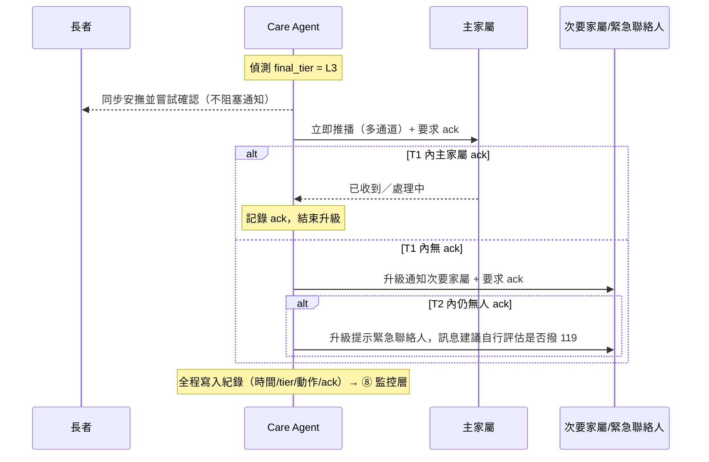

# 危急偵測與誤報處理設計

> 對應架構圖 [長輩看護系統架構-分層版.drawio](長輩看護系統架構-分層版.drawio)：④ Care Agent「⑤偵測緊急」、① 家屬緊急通知系統、⑧ 可靠性／監控層。
> 本文定義「什麼算危急」、如何避免誤報（警報疲勞）與漏報（出人命），以及人工確認與升級機制。

## 1. 設計目標與核心矛盾

危急偵測有兩種錯誤，且代價不對稱卻都致命：

* **漏報（False Negative）**：真危急沒被通知 → 可能出人命。
* **誤報（False Positive）**：一直假警報 → 家屬最終會忽略通知（「狼來了」／警報疲勞）→ 等於間接造成漏報。

因此不能只調一個門檻，而是用 **三道防線** 同時對付兩者：

1. **分級**：不同嚴重度走不同通道與急迫度，避免小事也驚動家屬。
2. **人工確認（兩層）**：長者端二次確認 + 家屬端回執，過濾誤報、確保有人接手。
3. **回饋校正**：家屬標記真／假警報，回頭調整門檻與詞表，長期壓低誤報率。

原則：**寧可錯報、不可漏報，但用「分級 + 確認」讓錯報不打擾到家屬。**

---

## 2. 危急分級（Severity Tiers）

| 等級 | 名稱 | 定義 | 範例 | 預設動作 |
|------|------|------|------|----------|
| **L0** | 一般 | 正常對話、無風險訊號 | 閒聊、問天氣 | 正常回應、記錄 |
| **L1** | 關注 | 情緒或健康的弱訊號，非立即風險 | 「最近都睡不好」「好孤單」情緒低落 | Agent 溫和關懷、加強後續追蹤、納入**家屬週／日報**；不即時通知 |
| **L2** | 警示 | 明確但非立即生命危險 | 持續疼痛、疑似漏吃藥、輕微跌倒但能對話、數日沒睡 | **長者端二次確認** → 確認屬實才以**非緊急通道**通知家屬（需 ack） |
| **L3** | 緊急 | 立即生命危險 | 明確求救「救命」、跌倒爬不起來、胸痛／呼吸困難、意識不清、自我傷害意念 | **立即多通道通知 + 升級機制**，不等二次確認（仍同步安撫長者） |

> tier 的最終值 = 各偵測訊號判定的**最高級別**（取上限，傾向安全）。

---

## 3. 偵測訊號來源（Multi-signal）

採多訊號，任一強訊號即可觸發（冗餘設計對抗漏報）：

| 代號 | 訊號 | 特性 | 說明 |
|------|------|------|------|
| **A. 關鍵詞／規則** | 絕對危急詞、症狀詞 | 高精準、低召回 | 命中「絕對危急詞」直上 L3；症狀詞至少 L2。詞表見 §10 待定。 |
| **B. 語意意圖分類（LLM）** | Care Agent ⑤ 對整段語意分級 | 高召回、需控誤報 | LLM 輸出結構化 `{tier, confidence, reason}`，不只輸出自由文字。 |
| **C. 行為訊號** | 長時間無互動、回應不連貫 | 補關鍵詞抓不到的狀況 | 主動關懷／提醒發出後，長者在設定時間內**完全無回應** → 升級「失聯關注」。 |
| **D. 生理訊號（未來）** | 穿戴／感測器 | 目前無 | 架構預留；接入後可大幅降低漏報。 |

> ⚠️ 安全：B 由 LLM 產出，**後端需用規則複核**（例如 A 的絕對危急詞可 override LLM 的低估），避免 prompt injection 或模型誤判直接決定報警與否。

---

## 4. 判定規則（Decision Logic）

```
# 輸入：本輪文字、行為狀態、LLM 分級結果(tier_llm, confidence)
# 輸出：final_tier 與後續動作

if 命中「絕對危急詞」清單:            # 規則 override，最高優先
    final_tier = L3
elif 行為訊號 = 失聯(無回應逾時):
    final_tier = L3                  # 走「失聯關注」升級
else:
    final_tier = max(tier_keyword, tier_llm)
    # 信心不足時降一級走「確認」而非「直接報警」
    if final_tier == L3 and confidence < 高門檻:
        final_tier = L2              # 降級為二次確認，避免高信心才報的漏報？見下
    if final_tier == L2 and confidence < 中門檻:
        final_tier = L1              # 僅記錄＋觀察

# 動作對應
L0/L1 → 記錄／關懷／報表彙整（不打擾家屬）
L2    → 長者端二次確認 →（屬實）非緊急通道通知家屬
L3    → 立即多通道通知 + 升級機制
```

> 取捨說明：上面把「L3 但低信心」降為 L2（先確認）是為了**壓誤報**；但「絕對危急詞」與「失聯」兩條規則**不受信心門檻影響**直接 L3，確保最危險的情況**不會因為信心不足被降級**——這就是兼顧漏報與誤報的平衡點。門檻數值見 §10，需團隊以實測校正。

---

## 5. 對抗誤報（防警報疲勞）

1. **分級回應**：只有 **L3 才會「立即」打擾家屬**；L1／L2 都先經緩衝或確認。
2. **長者端二次確認（人工確認 #1）**：L2 時 Agent 主動回問——
   *「阿公，您現在還好嗎？需不需要我幫您通知家人？」*
   * 長者答「不用／沒事」→ 降級為記錄、列入觀察。
   * 長者答「要」或**無回應** → 升級通知家屬。
3. **去重與冷卻（Debounce / Dedupe）**：同一事件 X 分鐘內不重複通知；同類型每日通知有上限。
4. **家屬回饋標記（人工確認 #2）**：每則通知附「✅真警報／❌假警報」按鈕，回饋進系統。
5. **門檻自我校正**：以家屬回饋統計各類觸發的誤報率，定期調整門檻與詞表（接 ⑧ 監控層）。

---

## 6. 對抗漏報（寧可錯報）

1. **L3 寧可錯報**：絕對危急詞、明確求救 → **直接報警**，事後再由家屬標記真假。
2. **無回應 fallback**：主動關懷／提醒發出後，長者在設定時間內無任何回應 → 升級「失聯關注」→ 通知家屬確認。
3. **多訊號冗餘**：任一強訊號即可觸發，**不要求多訊號同時成立**。
4. **Fail-safe 傾向通知**：系統異常／無法判定時，**傾向升級確認，不可默默丟棄**訊號。

---

## 7. 人工確認與升級機制（Escalation）

兩層人工確認：**長者端二次確認**（誤報守門）＋**家屬端確認回執與升級**（確保有人接手）。



* **多通道**：L3 不只 LINE 推播；LINE 失敗或無 ack 時補簡訊／電話（呼應先前對「單一通道太脆弱」的修正）。
* **升級順序**：主家屬 → 次要家屬 → 緊急聯絡人，等待時間 T1／T2 見 §10。
* **L2 升級**：較緩，僅通知家屬並要求 ack，無 ack 重送，不一定升級到緊急聯絡人。

---

## 8. 記錄與可觀測性（接 ⑧ 監控層）

每次觸發都需落地一筆事件，供稽核與調參：

| 欄位 | 說明 |
|------|------|
| `時間` | 觸發時間 |
| `tier` | 最終判定等級 |
| `signals` | 命中的訊號（關鍵詞／LLM／行為） |
| `confidence` | LLM 信心分數 |
| `reason` | 判定理由（給家屬看也給工程除錯） |
| `actions` | 採取的動作與通道 |
| `ack` | 家屬回執（誰／何時） |
| `label` | 家屬標記真／假警報（回饋用） |

監控指標：**誤報率、漏報（事後補登）、ack 平均時間、升級次數、各 tier 觸發量**。

---

## 9. 安全與免責邊界

* 呼應架構「**不做醫療診斷·免責**」：系統只做**通知與提醒**，不下診斷；L3 訊息以「建議家屬自行評估是否撥 119」呈現，不替代專業判斷。
* 分級結果做**後端規則複核**，不全信 LLM 自由輸出，降低 prompt injection 與模型幻覺直接影響報警的風險。

---

## 10. 待團隊確認的參數（Assumptions / TODO）

以下為需團隊以實測與照護專業定稿的數值與清單，目前先標記為待定，**不臆測**：

* [ ] **絕對危急詞清單**（直上 L3）與症狀詞清單（至少 L2）。
* [ ] **信心門檻**：L3 高門檻、L2 中門檻的具體數值（建議用標註資料調校）。
* [ ] **失聯逾時**：主動關懷／提醒後多久無回應算「失聯」。
* [ ] **升級等待時間** T1 / T2，以及緊急聯絡人是否預設建議撥 119。
* [ ] **各 tier 通知通道**（L2 走哪、L3 走哪幾條）。
* [ ] **去重冷卻**：同事件間隔 X 分鐘、同類型每日上限。
