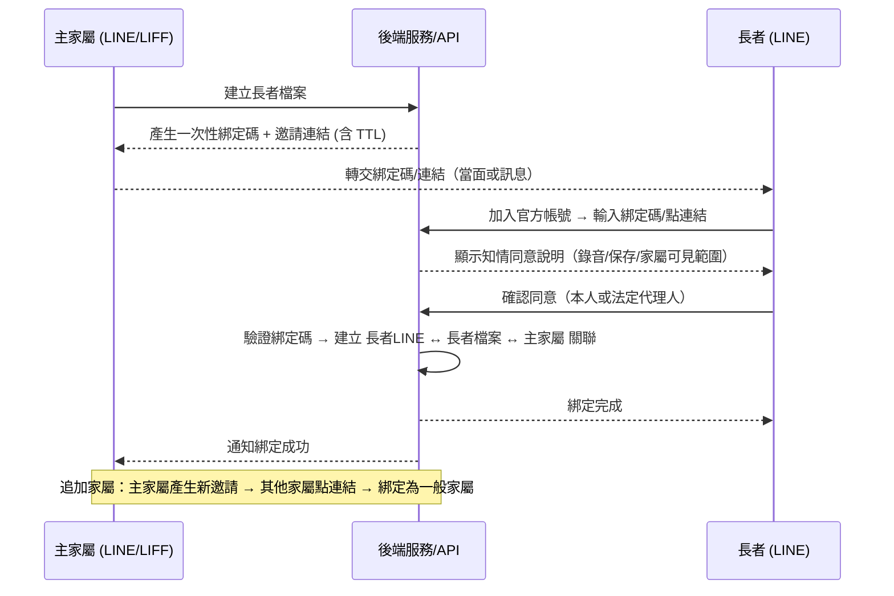

# 帳號綁定與知情同意設計

> 對應架構圖 [長輩看護系統架構-分層版.drawio](長輩看護系統架構-分層版.drawio)：① 家屬端（LINE）、② 後端服務／API、⑦ 記憶／資料層與資料治理層。
> 本文定義「家屬 LINE 帳號」與「長者」如何安全建立關聯、支援多家屬、並在過程中取得**知情同意**。

## 1. 目標

* 安全地把**家屬的 LINE 帳號**與**長者**綁定，作為建檔、設定提醒、查報告、收緊急通知的前提。
* 支援**一位長者對應多位家屬**（多個子女）。
* 綁定過程同時完成**知情同意**（錄音、保存對話、家屬可見範圍）。
* 處理長者可能**無法自行操作或無同意能力**（認知退化）的情境。

---

## 2. 角色與關係模型

| 角色 | 說明 | 權限概要 |
|------|------|----------|
| **長者**（care receiver） | 被照顧者，使用語音對話 | 對話、二次確認、撤回同意 |
| **主家屬**（primary guardian） | 建立長者檔案者，通常為一位 | 最高權限：管理檔案、管理其他家屬、設定用藥提醒 |
| **一般家屬**（guardian） | 受邀加入的其他家人，可多位 | 依設定查看報告、接收通知 |
| **緊急聯絡人** | 升級通知對象（可為家屬或外部） | 接 [危急偵測與誤報處理設計](危急偵測與誤報處理設計.md) §7 的升級順序 |

關係：**長者 1 ── N 家屬**。
（註：一位家屬未來也可能照顧多位長者，故底層為多對多；**MVP 建議先做 1 長者 ── N 家屬**，見 §10。）

---

## 3. 綁定流程（邀請碼 / LIFF 邀請連結）

### 代理綁定（長者無法自行操作）

* 提供「**代理綁定**」路徑：由主家屬到場協助操作，或由**法定代理人**代為同意。
* 系統需記錄**同意人身分**（本人 / 法定代理人）與關係，作為合規佐證。

---

## 4. 知情同意（Consent）重點

* **同意範圍**：錄音、對話內容保存、健康資訊處理、家屬可查看的範圍（是否含對話原文）。
* **認知退化情境**：若長者無同意能力 → 需**法定代理人**同意，並記錄代理人身分（呼應個資法與照護倫理）。
* **可撤回**：長者或代理人可隨時撤回同意 → 觸發**停止服務與資料刪除流程**（呼應治理層「去識別化／刪除權」）。
* **版本化**：同意條款有版本號；條款更新時需重新取得同意。

---

## 5. 權限分級（Authorization）

| 動作 | 主家屬 | 一般家屬 |
|------|:------:|:--------:|
| 建立／刪除長者檔案 | ✅ | ❌ |
| 管理家屬成員（邀請／移除） | ✅ | ❌ |
| 設定用藥／回診提醒 | ✅ | 可選配 |
| 查看健康報告 | ✅ | ✅（可設定） |
| 查看**對話原文** | ✅ | ⚠️ 預設限制（保護長者隱私） |
| 接收緊急通知 | ✅ | ✅／依升級順序 |

> 設計取捨：對話原文涉及長者隱私，預設**只有主家屬可看**，一般家屬看彙整報告即可；可由主家屬逐項開放。

---

## 6. 資料模型（Sketch）

| 資料表 | 主要欄位 | 說明 |
|--------|----------|------|
| `elder` | `elder_id`, `line_user_id`, `name`, … | 長者檔案 |
| `guardian` | `guardian_id`, `line_user_id`, `name` | 家屬 |
| `elder_guardian` | `elder_id`, `guardian_id`, `role`, `escalation_order`, `permissions` | 長者—家屬關聯與權限 |
| `consent` | `consent_id`, `elder_id`, `consent_by`(本人/代理人), `version`, `granted_at`, `revoked_at` | 同意紀錄 |
| `invite` | `invite_code`, `elder_id`, `role`, `expires_at`, `used_at`, `attempts` | 邀請／綁定碼 |

> 這些表納入 ⑦ 資料層與**資料治理層**（加密、存取控制、稽核、刪除權）。

---

## 7. 安全考量

* **綁定碼**：一次性 + TTL + **嘗試次數上限**（防暴力猜測）。
* **邀請連結**：使用不可猜測的隨機 token。
* **換手機／LINE userId 變更**：提供重新綁定與舊關聯失效流程。
* **解除綁定**：家屬移除或長者撤回 → 失效關聯並觸發資料處理流程。
* 所有綁定／同意／權限操作寫入**稽核紀錄**（治理層）。

---

## 8. 對架構圖的影響

| 層 | 需新增 |
|----|--------|
| ① 家屬端 | 「邀請／綁定」入口（產生與分享邀請） |
| ① 長者端 | 「輸入綁定碼／點連結 → 同意」流程 |
| ② 後端 | 綁定 / 同意 / 權限相關 API |
| ⑦ 資料層 | `elder_guardian`、`consent`、`invite` 表，納入治理層 |

---

## 9. 待團隊確認的參數（Assumptions / TODO）

* [ ] MVP 是否支援**多家屬**，或先單一主家屬。
* [ ] 代理同意的**法律處理**（法定代理人認定、佐證）。
* [ ] 綁定碼 **TTL** 與重試上限數值。
* [ ] 一般家屬可否看對話原文的**預設值**。
* [ ] 緊急聯絡人是否與家屬分離管理。
